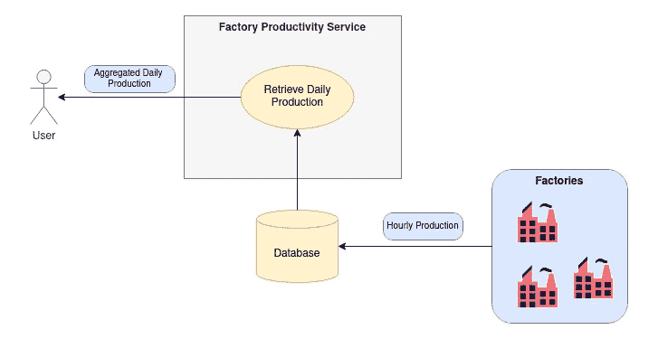
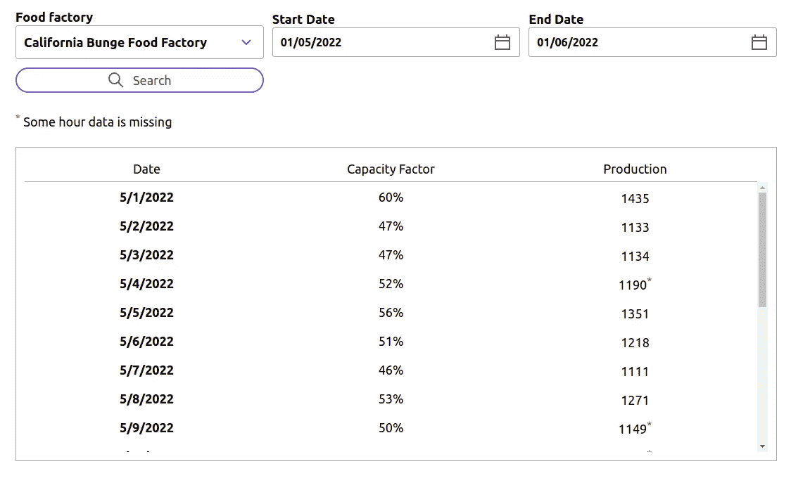
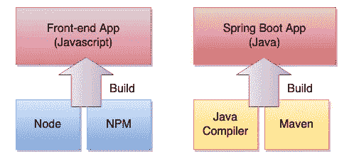
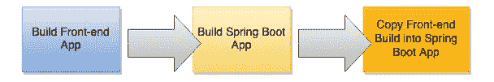
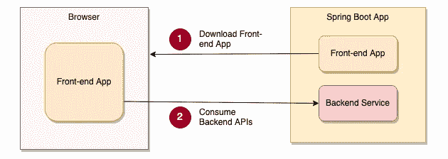
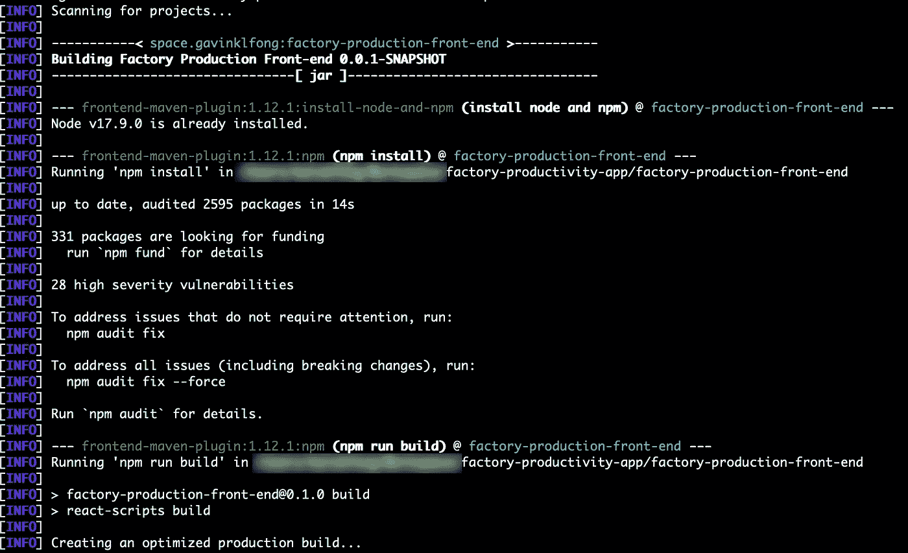
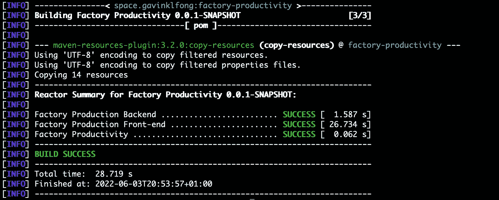

# 如何自动化 React JS 前端和 Spring Boot 应用程序的构建过程

> 原文：<https://blog.devgenius.io/how-to-automate-build-processes-of-react-js-front-end-and-spring-boot-application-b8c9630831b1?source=collection_archive---------2----------------------->

## 连接两个不同软件构建过程的强大工具


罗伯特·阿纳奇在 [Unsplash](https://unsplash.com/?utm_source=unsplash&utm_medium=referral&utm_content=creditCopyText) 上的照片

传统上，门户网站的屏幕 UI 依赖于服务器端呈现技术。即基于 JSP 等模板动态生成 HTML 页面，并结合数据。对于基于 Java 技术的应用程序，可以使用 Maven 构建包括前端和后端逻辑在内的整个应用程序。近年来，由于基于 React / Angular 等框架的复杂前端技术的出现，前端应用程序已经成为一个独立的组件。前端应用程序不再使用 Java 技术实现，这意味着我们不能使用 Maven 管理软件构建。

对于一定规模的应用程序，前端和后端由单独的团队开发，源代码驻留在单独的存储库中，有自己的管道。不幸的是，对于小规模的应用程序来说，拥有独立的存储库和构建管道可能是多余的。有可能将基于 Javascript 的前端应用程序和 Java 后端服务捆绑到一个 Maven 项目中吗？在本文中，我将介绍一个 Maven 插件，它可以用一个 Maven 命令自动构建 React JS 前端和 Spring Boot 应用程序。

我将基于一个示例应用程序来说明这个想法，这个应用程序是**工厂生产力应用程序**，它允许用户监控食品工厂的日常生产力。

后端服务是建立在使用 Spring Boot 与数据库检索工厂的日常生产力。



这个应用程序提供了一个基于 React Redux 的简单前端，它显示了一个选定的食品工厂的每日生产率数字。



## GitHub 知识库

请随意从这个 [GitHub 库](https://github.com/gavinklfong/factory-productivity-app)获取整个应用程序的源代码。按照自述文件中的步骤，在本地计算机上构建并运行它。

# 构建过程

由于使用了不同的技术，React 前端和 Spring Boot 应用程序是使用不同的工具构建的:

*   **React 前端**—NPM 节点 JS
*   **Spring Boot 应用** — Java，Maven



整个构建过程包括 3 个手动步骤来构建应用程序和复制文件。



React 前端和 Spring Boot 应用的源代码分别驻留在文件夹`**factory-production-front-en**d`和`**factory-production-service**`中。

## **React 前端 App**

要构建 React 应用程序，我们首先需要安装 Node JS 和 NPM。然后，运行此命令来构建应用程序。

```
> cd factory-production-front-end
> npm install
> npm run build
```

构建过程完成后，优化后的 javascript 文件将生成到 **build** 文件夹中。

## **Spring Boot 后台 App**

要构建 Spring Boot App，必需的 Java 版本和 Maven 是先决条件。运行这个命令来构建后端应用程序。

```
> cd factory-production-service
> mvn compile
```

构建过程将编译后的资源和 JAR 文件生成到目标文件夹中

## **将前端捆绑到 Spring Boot**

将前端捆绑到 Spring Boot 后端意味着 Spring Boot 应用程序充当托管前端应用程序的 web 服务器。这可以通过将文件从前端构建复制到 Spring Boot 构建来完成。

```
> copy factory-production-front-end/build/*.* factory-production-service/target/classes/static/
```

当 Spring Boot 应用启动并运行时，浏览器可以在访问 Spring Boot 服务时下载前端应用。一旦前端应用程序加载到浏览器上，它将通过使用后端服务在浏览器上呈现屏幕并显示数据。



# 使用 Maven 插件构建前端应用程序

目的是用一个 Maven 命令自动完成前端和后端的构建过程。虽然 maven 主要用于 Java 应用构建，但是[前端 Maven 插件](https://github.com/eirslett/frontend-maven-plugin)的使用使得基于 Node JS 和 NPM 构建 Javascript 应用成为可能。

将前端项目放入 Maven 项目的子模块`**factory-production-front-end**` 。因此，Maven 项目分别由前端和后端服务模块组成:

```
[factory-productivity-app]
  + -- [factory-production-front-end]
        **+ -- pom.xml** + -- [factory-production-service]
```

下面的 Maven 定义显示了 pom.xml 的构建插件序列，它运行以下 3 个步骤:

1.  安装版本 17.9.0 的节点和 npm
2.  运行 npm 安装以获取所有依赖项
3.  运行 npm 运行构建以生成前端优化构建

参考[这个](https://github.com/gavinklfong/factory-productivity-app/blob/main/factory-production-front-end/pom.xml)获得完整的 pom.xml 文件。

现在，在`**factory-production-front-end**`下运行这个 maven 命令

```
> mvn compile
```

如果 node & npm 不存在，插件会安装它们，然后构建前端应用程序。插件的优势不仅在于允许使用 Maven 进行前端构建，还在于确保应用程序是基于指定的节点版本构建的。



# 自动复制文件

接下来，另一个 maven 插件 **maven-resources-plugin** 自动将前端构建的文件复制到 Spring Boot **目标/类/静态**文件夹中。

在 Maven 父项目的 pom.xml 中指定以下插件定义

```
[factory-productivity-app]
  **+ — pom.xml** + — [factory-production-front-end]
  + — [factory-production-service]
```

参考[这个](https://github.com/gavinklfong/factory-productivity-app/blob/main/pom.xml)获得完整的 pom.xml 文件

最后，父 Maven 项目上的这个 Maven 命令自动构建前端和后端应用程序

```
> mvn compile
```

Maven 运行 Spring Boot 后端模块的构建过程，然后是前端模块。最后，它运行根级别的构建过程，将生成的文件从前端复制到 Spring Boot/目标/类/静态文件夹。



# 最后的想法

前端和后端服务构建过程的自动化节省了大量的人工工作。用于前端构建的 maven 插件是一个方便的工具，全栈开发人员可以使用单一工具构建软件，而无需在 NPM 和 Maven 之间切换。当涉及到小规模应用程序、原型或快速 MVP 概念的开发时，这种方法绝对是一个好的选择。