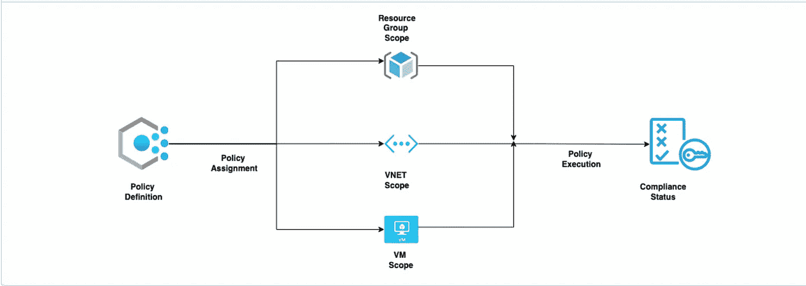
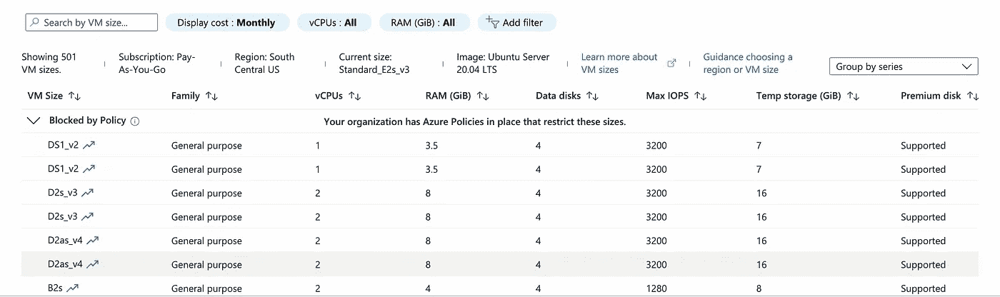
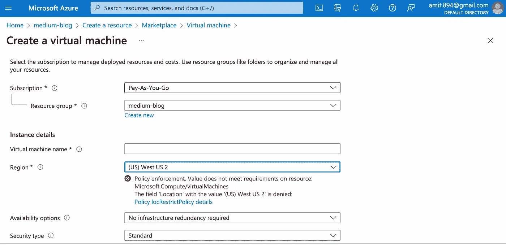
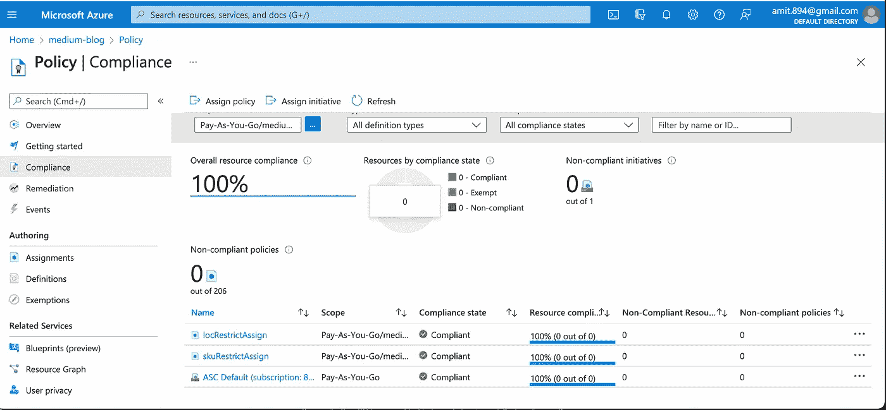

# 如何在 Azure 上自动化云治理？

> 原文：<https://blog.devgenius.io/how-to-automate-cloud-governance-on-azure-f392bd971f2f?source=collection_archive---------9----------------------->

本博客是系列文章的一部分，我们从零起点开始为初学者讨论 **DevOps** 概念。本文来自*中级*系列，因为它涉及了解**A**[**zure Policy**](https://docs.microsoft.com/en-us/azure/governance/policy/overview)**服务的工作，以确保客户 Azure 账户中创建的资源的合规性。**

**云系列的一些早期博客如下。**

**[**AWS 欺诈检测**](/building-a-simple-fraud-detector-on-aws-7d01f0259fa8)[**安全-自动化**](/aws-config-iam-compliance-85220763bee5)[**定制码头桥网**](/custom-docker-bridge-networks-how-to-run-containers-b8d40c51bab2)**

# **什么是 Azure 保单？**

**Azure Policy 是一项全面管理的 Azure 服务，为客户提供了一个即插即用的模型，以便为在 [*订阅*](https://www.javatpoint.com/what-is-microsoft-azure-subscription) *、* [*管理组*](https://docs.microsoft.com/en-us/azure/governance/azure-management) 或*T42*资源组* 范围内创建的资源创建可重用的合规性策略。该服务支持已有**内置策略**和**自定义策略**，可根据用户定义的范围和嵌套条件进行扩展。该服务对其所有用户都有一个 [*免费定价模型*](https://azure.microsoft.com/en-us/pricing/details/azure-policy/?WT.mc_id=thomasmaurer-blog-thmaure) ，使得安全模块处于所有自动化框架的最前沿。***

## ***保单定义和分配***

***一个完整的 Azure 策略的生命周期有两个关键步骤——在帐户中触发自动合规之前的**定义**和**分配**。这种关系是一对多的，即一个定义可以被重新分配 N 次。一个**策略定义**是一组实施效果[审核/拒绝/附加/修改](https://docs.microsoft.com/en-us/azure/governance/policy/concepts/effects)的条件。通过**策略分配**步骤来为要发生的策略效果分配资源范围。***

# ***Azure 策略自动化概述***

******

*****Azure 策略生命周期*****

## ***内置策略示例***

*****SKU 限制** -
该政策旨在限制开发者创建与虚拟机可用的任何 SKU 选项无关的资源。这种实施有助于降低更高 SKU 的云成本，并通过最大限度地减少虚拟机配置的变化来优化运营支持。***

******

*****虚拟机 SKU 受到 Azure 策略的限制*****

## ***自定义策略示例***

*****位置限制** -
云部署模型中的资源位置对于解决邻近性和性能需求非常关键。因此，建议将所有资源保存在靠近实际客户的有限区域内。该策略有助于在资源组中创建的所有资源上实施相同的策略。***

******

*****位置策略执行。*****

# ***Azure 策略平台自动化***

## ***安装 Terraform***

***使用给定博客中的步骤—[https://blog . dev genius . io/public-cloud-first-static-website-7d 6 f 7 c 6 f 794](/public-cloud-first-static-website-7d6f7c6f794)***

## ***固有政策***

***对于内置策略，定义已经可用，只需要将分配资源添加到**main . TF .***policy _ definition _ id*可以从 Azure portal 的策略中获得。***

## ***自定义策略***

***对于自定义策略，这两个定义以及分配资源组件都需要添加到**main . TF .***policy _ definition _ id*用作分配变量，并在运行时进行配置。***

## ***运行模块***

```
***Initialising Modules** terraform init**Planning Modules** terraform plan**Applying Modules** terraform apply*
```

# ***政策的验证***

***登录到 **Azure 门户**，通过单击所选资源/资源组上的 Azure 策略左导航选项来验证以下内容。***

******

*****政策合规状态*****

# ***额外资源***

***[](https://github.com/amit894/azure-policy-terraform) [## GitHub-Amit 894/azure-Policy-terraform:用于 Azure 策略的 terra form

### 此时您不能执行该操作。您已使用另一个标签页或窗口登录。您已在另一个选项卡中注销，或者…

github.com](https://github.com/amit894/azure-policy-terraform) 

*如需反馈，请留言至****Amit[dot]894[at]Gmail[dot]com****或联系 https://about.me/amit_raj**的任意链接。****