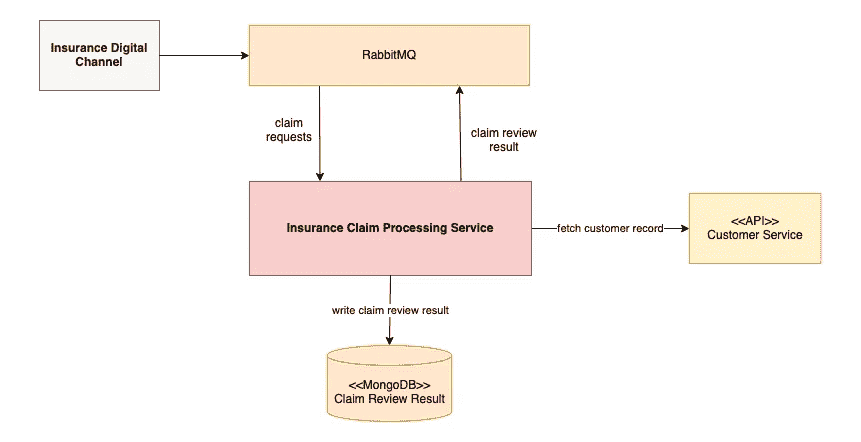
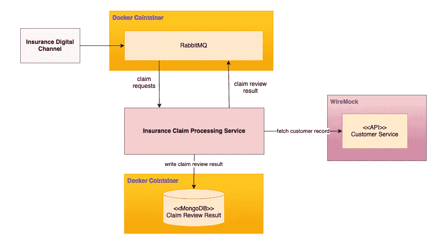
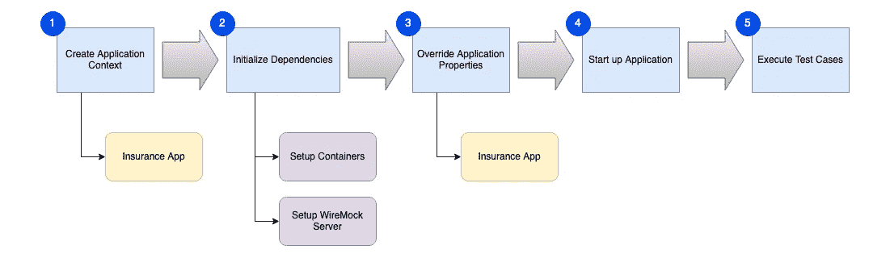
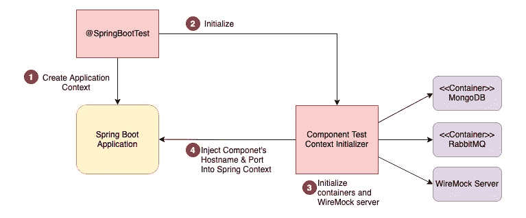
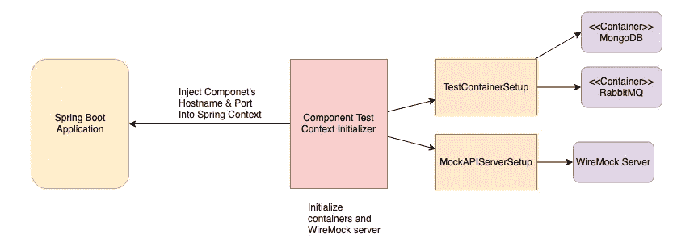

# 如何使用 JUnit + Docker + WireMock 自动化端到端组件测试

> 原文：<https://blog.devgenius.io/how-to-automate-end-to-end-component-tests-using-junit-docker-wiremock-8e831fb04585?source=collection_archive---------1----------------------->

## 一体化自动化测试—自动环境供应+组件测试执行


Oleksandr Kurchev 在 [Unsplash](https://unsplash.com?utm_source=medium&utm_medium=referral) 上拍摄的照片

现代系统通常依赖于一堆软件，如数据库、消息代理和外部服务 API。开发人员需要在他们的机器上安装这些软件，以便启动并运行系统进行开发和测试。然而，开发的安装和环境设置是一项繁琐的工作。在开发之前，需要在环境设置上花费精力。由于对其他软件组件的依赖，测试不能完全自动化。

在本文中，我将向您展示如何使用 Docker 和 Wiremock 在环境设置中运行组件/集成测试。然后，您将看到如何自动化从环境供应到测试执行的整个测试过程。

假设您的任务是为保险索赔处理系统构建新的特性。首先，您需要建立一个本地开发环境，系统可以在这个环境中启动和运行，以便您可以检查和测试系统行为。此外，本地开发环境允许您对应用程序进行调试和故障排除。

该系统依赖于 RabbitMQ、MongoDB 和一个外部客户 API 服务。下图说明了启动和运行系统所需的组件。



示例应用程序组件

也许，作为环境准备的一部分，您可以在本地机器上安装这些组件。是的，许多人在开始应用程序开发之前就花时间在软件安装和配置上。但是，安装的软件越多，准备时间越长，效率也不高。此外，如果软件组件出了问题，比如配置错误，这也是一个令人头疼的问题。

## 使用 Docker 容器进行本地开发

强烈建议在 docker 容器上运行所需的软件组件。由于 docker 技术的可移植性，像数据库这样的软件是一次性的，不需要安装或升级。这是因为您可以简单地在基于特定 docker 映像的容器中创建一个数据库实例。需要运行特定版本的数据库？很简单，只需在另一个映射到不同端口的容器中启动 docker 镜像。

大多数软件组件都可以作为 docker 映像获得，包括公共 docker 映像库中的 RabbitMQ 和 MongoDB。因此，使用一次性 docker 图像要方便得多。

关于对外部 API 服务的依赖性，使用诸如 WireMock 和 Mock Server 之类的 API 模拟工具允许在没有外部 API 服务的情况下进行测试。下图演示了使用 docker 和 WireMock 设置本地测试环境:



带有 Docker 和 WireMock 的组件

# 使用 Docker 容器运行 RabbitMQ 和 MongoDB

Docker 允许我们在 yaml 文件定义中定义一个叫做 docker compose 的软件栈。下面的 docker compose 定义(docker-compose.yml)显示了保险索赔处理服务的 RabbitMQ 和 MongoDB 的软件栈。

在终端控制台中，将目录切换到 docker-compose.yml 的位置，然后运行此命令以打开软件堆栈

```
docker compose up
```

现在，您应该能够使用默认凭证 guest/guest 访问 RabbitMQ 管理控制台 [http://localhost:15672](http://localhost:15672) 。

# 使用 WireMock 为客户服务 API 创建存根

在没有外部 API 服务的情况下进行测试时，WireMock 是一个了不起的工具。它为模拟 API 的创建提供了一种灵活的方式。测试场景模拟了 3 个具有不同风险属性值的客户记录，如下所示:

该命令将 WireMock 作为独立进程启动，并公开端口 9999

```
Java -jar wiremock.jar — port 9999
```

访问 [WireMock 官方网站](http://wiremock.org/docs/running-standalone/)，该网站提供 WireMock jar 文件下载链接。

模拟 API 只是将请求映射到预定义的响应数据。下面的示例 JSON 文件为 3 个不同的客户记录设置了模拟响应。例如，当 WireMock 收到对 Url 的 GET 请求时，它会返回具有高风险属性的客户记录

```
GET /customers/C94C6168–6AED-46F9–9BA8-AA17793D41F9
```

将 customer JSON 文件放到启动 WireMock 服务的当前目录下的 **mappings** 文件夹中。它将根据 JSON 文件自动创建模拟 API 响应。

# 针对本地环境的 Spring Boot 配置

在您的本地机器上运行 docker 容器和 WireMock，使用下面的配置将 Spring Boot 服务连接到组件。您可以看到配置将客户 API 服务、Rabbitmq 和 MongoDB 的地址指定为 localhost。

这是名为“local-test”的配置文件的新配置，配置文件是 application-local-test.yml，它基于 Spring boot 配置文件的命名约定— application-{profile name}。yml

# 测试用例设置

一切都准备好了。测试用例的设置非常简单。目标是在您的本地机器上启动连接到 Rabbitmq、MongoDB 和模拟客户服务 API 的应用程序。使用注释`@SpringBootTest` 和`@ActiveProfiles`运行测试用例，使用指定的配置文件“local-test”运行整个应用程序上下文

如果您有兴趣了解更多关于如何构建自动化测试用例的信息，请参考这篇文章。

[](/java-spring-the-best-practice-of-modern-software-quality-assurance-e5aa66466627) [## Java Spring——现代软件质量保证的最佳实践

### 确保软件质量的全面指南

blog.devgenius.io](/java-spring-the-best-practice-of-modern-software-quality-assurance-e5aa66466627) 

# 自动化 Docker 容器和模拟 API 的创建

到目前为止，测试执行依赖于手工过程来创建 docker compose 和 API 模拟服务器的软件栈。这意味着测试不是完全自动化的，因此测试不能在 CI/CD 管道中运行，在那里过程执行应该是无人操作的。

为了使过程自动化，程序代码应该有一个可编程的接口或命令行来运行这些步骤。不用担心，docker 容器可以使用 **testcointainers** 库来创建，该库为容器上的操作提供 Java 方法调用，而模拟 API 可以通过 WireMock 提供的方法调用来动态创建。与@SpringBootTest 支持的定制初始化逻辑一起，高层组件图说明了测试用例初始化过程。

Docker 容器和 WireMock API 是在 Spring Boot 应用程序启动的早期创建和初始化的。容器现在是在测试开始时创建并在测试执行结束时丢弃的一次性资源。



自动化流程

创建整个应用程序上下文，然后启动一个定制的初始化器来创建容器和 WireMock 服务器。一旦 RabbitMQ、MongoDB 和 WireMock 服务器启动并运行，服务的主机名和端口将被注入到 Spring Boot 应用程序上下文中，这样应用程序将连接到组件。由于 docker 容器和 WireMock 服务器可以启动并绑定到一个可用的端口，因此初始化过程是完全自动化的，不会与机器上现有的服务发生冲突。



自动化测试组件

## Maven 依赖性

您需要在 maven pom.xml 中添加测试容器库和 wiremock 的依赖关系。

```
***<*dependency*>
  <*groupId*>***org.testcontainers***</*groupId*>
  <*artifactId*>***junit-jupiter***</*artifactId*>
  <*scope*>***test***</*scope*>
</*dependency*>******<*dependency*>
  <*groupId*>***org.testcontainers***</*groupId
  *<*artifactId*>***mongodb***</*artifactId*>
  <*scope*>***test***</*scope*>
</*dependency*>******<*dependency*>
  <*groupId*>***org.testcontainers***</*groupId
  *<*artifactId*>***rabbitmq***</*artifactId*>
  <*scope*>***test***</*scope*>
</*dependency*>******<*dependency*>
  <*groupId*>***com.github.tomakehurst***</*groupId*>
  <*artifactId*>***wiremock-jre8***</*artifactId*>
  <*scope*>***test***</*scope*>
</*dependency*>***
```

## 组件测试基类

整个自动化逻辑被集中到一个抽象类中，这不仅简化了环境组件供应，而且使自动化逻辑可重用。任何需要设置整个应用程序堆栈的测试类都可以从抽象类扩展，然后基类在测试用例执行之前自动启动应用程序。

## 组件测试上下文初始化器

正如你在上面的`@SpringBootTest` 中看到的，它指的是 ComponentTestContextInitializer，它由初始化的主逻辑流组成。它将作业委托给 TestContainerSetup 和 MockAPIServerSetup，分别用于 Docker 容器和 WireMock 的初始化。一旦环境组件准备就绪，该初始化器将连接性配置注入到应用程序系统属性中，使得应用程序能够连接到新创建的 docker 容器和模拟 API 服务器。



组件测试上下文初始化器

## 码头集装箱自动化

由于 testcontainers 库，测试代码可以与 Docker 容器无缝集成。下面的示例代码演示了如何为 MongoDB 创建和启动一个容器。简单易懂。对于对容器的访问，`getReplicaSetUrl()` 方法调用返回带有端口的 url，该端口是映射到 27017 的可用端口。

```
MongoDBContainer mongoDBContainer = 
                    new MongoDBContainer("mongo")
                    .withExposedPorts(27017);mongoDBContainer.start()String mongoDBUrl = mongoDBContainer.getReplicaSetUrl();
// return mongoDBUrl: mongodb://localhost:55009/test
```

为了更好地管理容器初始化，我们有一个名为 **TestContainersSetup** 的实用程序类，负责创建容器。然后，应用程序上下文初始化器可以调用它的方法`initTestContainers()` 来启动 RabbitMQ 和 MongoDB 并检索连接信息。

拥有这个实用程序类的好处是它简化了容器组件的管理。它可以灵活地处理容器中的变化，比如图像名称或版本的更新，甚至添加新的组件，比如 MySQL，而不会影响整个测试实现。

## 模拟 API 服务器设置

类似地，我们有一个用于模拟 API 服务器配置和模拟响应设置的实用程序类。

## 样本测试类

最后，通过更新测试类，使其从基类扩展，从而实现自动化。

从这个 [GitHub 库](https://github.com/gavinklfong/spring-junit-test-container-demo)中获取示例实现，并运行这个命令来运行示例测试，您将看到完全自动化的软件栈创建和测试执行在运行。

```
mvn -Dtest=ClaimProcessingAutoEnvTest clean test
```

# 最后的想法

在现代软件开发过程中，大多数测试活动都被认为是自动化的。不仅测试用例的执行，而且环境的设置都应该完全自动化，这样测试就可以在 CI/CD 管道中运行。自动化的实现并不困难，使用 Docker 容器、WireMock 和 JUnit 就可以完成这项工作。通过引用 [GitHub 仓库](https://github.com/gavinklfong/spring-junit-test-container-demo)中的样本代码，它给你灵感并加速你的自动化测试实现。

在实现自动化测试的基础上，使用 Cucumber 特性文件添加测试大大增强了测试场景的可读性。本文将通过示例代码向您介绍如何使用 Cucumber 构建自动化测试。

[](https://medium.com/devtechtoday/how-to-build-a-fully-automated-integration-test-using-cucumber-testcontainers-bba8493495cb) [## 如何使用 Cucumber + Testcontainers 构建一个完全自动化的集成测试

### 让我们为一个消息驱动的系统建立一个自动化集成测试

medium.com](https://medium.com/devtechtoday/how-to-build-a-fully-automated-integration-test-using-cucumber-testcontainers-bba8493495cb)