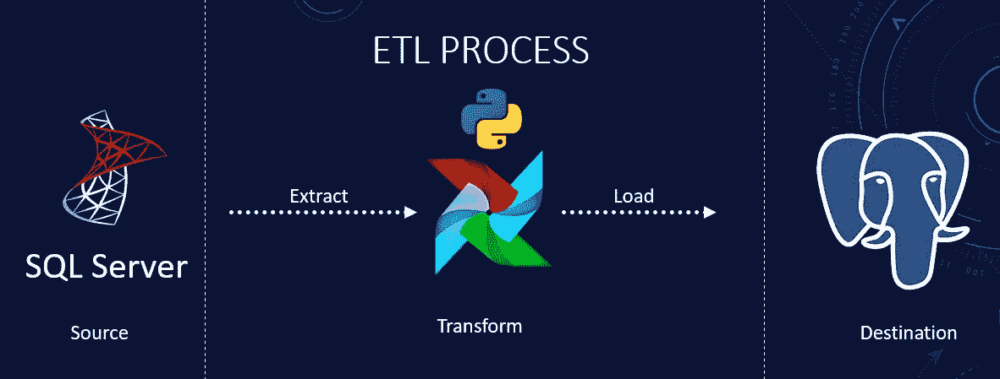
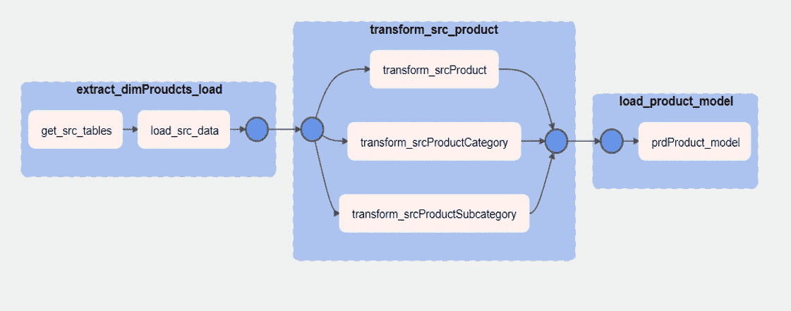
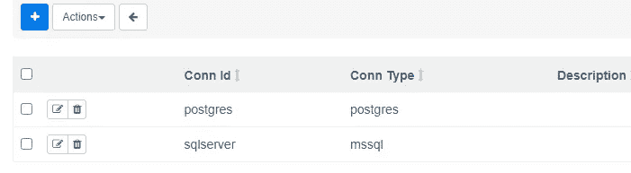

# 如何用气流自动化 ETL 管道

> 原文：<https://blog.devgenius.io/how-to-automate-etl-pipelines-with-airflow-62484ee5ef4c?source=collection_archive---------1----------------------->

**使用 Airflow、Python、Pandas、SQL Server 和 PostgreSQL**

ETL 过程概述

我们已经介绍了提取、加载和转换(ETL)过程——现在是时候自动化它了！让我们增强基于 Python 的数据管道，为您提供提取、加载和转换过程的完整概述。上一篇文章的链接是[这里](/how-to-build-an-etl-pipeline-with-python-1b78407c3875)。

完整的代码可在 [GitHub](https://github.com/hnawaz007/pythondataanalysis/blob/main/ETL%20Pipeline/product_etl_dag.py) 上获得。视频教程可以在 YouTube 上找到。

**阿帕奇气流简介**

我们将使用 Apache Airflow 来自动化我们的 ETL 管道。Apache Airflow 是一个著名的开源工作流管理系统，它为数据工程师提供了一个直观的平台，用于设计、调度、跟踪和维护他们复杂的数据管道。

Airflow 使用有向无环图(又名 Dag)来表示工作流。这使您能够管理数据管道，并可视化任务的依赖关系、进度、日志、代码和状态。

气流使您能够:

*   通过数据存储和数据仓库设置数据管道
*   按计划运行工作流
*   以 Python 代码形式创建和管理脚本化数据管道

我们将使用 Airflow 2.0 中引入的 TaskFlow API，它允许我们在不同的任务之间共享数据，但是，数据交换仅限于小型 JSON 可序列化对象，如字典。如果不先序列化，我们就不能在任务间共享大型数据帧。

通过使用@task decorator，TaskFlow API 使得创建干净的 Dag 更加容易，而不需要额外的样板文件。Airflow 将我们的工作流组织成由任务组成的 Dag。

**那么，什么是 DAG 呢？**

一个 DAG(有向无环图)是气流的核心概念；它代表一组任务。它由依赖关系和关系组成，说明它们应该如何运行。Dag 被定义为一个 python 脚本，它将 DAG 的结构(任务及其依赖项)表示为代码。

完整产品 DAG

Airflow scheduler 根据我们指定的任何依赖关系在一组工作节点上执行任务。例如，我们希望首先执行提取和加载任务，一旦它们完成，我们就希望执行转换任务。

要在源和目标数据库上运行 Dag，我们需要建立连接。在 Airflow 用户界面(UI)中，我们可以定义一次连接，并在多个 Dag 中利用这些连接。Airflow 的 UI 使我们能够观察我们环境中运行的管道；监控进度；并在需要时解决问题。Airflow 的可视化 Dag 还提供数据沿袭，这有助于数据流的调试，并有助于审计和数据治理。

**建立带气流的 ETL 管道**

我们将重构我们的 Python ETL 管道脚本，使其与 Airflow 兼容。除了我们的常规编程库，我们还将导入那些特定于 Airflow 的库(DAG、task 和 TaskGroup)。

**设置**

我们在 Airflow 的管理控制台下定义了两个到源和目标数据库的连接。我们可以通过单击加号图标来添加新的连接。我们在代码中使用连接 ID 来引用它们。

向气流添加连接

**摘录**

我们使用任务装饰器来定义气流中的任务。我们用 Basehook 得到 Postgres 的连接细节。

我们获取想要从 SQL Server 的系统模式中提取数据的表。只需遍历表并查询它们。通过几行代码，我们查询了源代码并获得了作为 Pandas dataframe 的数据。我们将这些数据保存到 Postgres 表中。我们调用 to_sql 函数，并在表名前面加上前缀“src ”,表示这是一个源表。我们完成了提取过程。

**变换**

为了转换产品表，我们将从 postgres 到 dataframe 查询源表。我们将使用熊猫来实现转换。

首先，我们需要删除任何不必要的列。我们将把想要保留的列的列表输入到一个名为 revised 的新数据框架中。对于数值列中的空值，让我们用零替换它们，对于字符串列中的缺失值，让我们用“NA”代替。

我们将重命名列名包含英语的列。我们已经完成了所有的转换，所以让我们使用“to_sql()”函数将它保存到一个临时表中。

我们对产品子类别和产品类别表执行类似的操作。删除不需要的列并重命名一些列，然后将更新保存到带有“src”前缀的表中。

为了构建最终的产品模型，我们将查询所有三个表。数据类型不匹配，因此将该列转换为整数。

然后，我们将这三个数据帧合并成一个数据帧，并保存到一个带有“prd”前缀的表中。

**定义一个有向无环图**

我们声明一个 DAG 并定义一些属性。首先是调度间隔，我们将它设置为上午九点，使用一个 [Cron 表达式](https://docs.oracle.com/cd/E12058_01/doc/doc.1014/e12030/cron_expressions.htm)。然后，我们定义一个开始日期，即该计划应该开始的时间，并将 catchup 设置为 false。最后，我们为这个 DAG 设置一个标签。标签帮助您将多个 Dag 组合在一起，您可以使用它从 UI 中过滤 Dag。

在 Dag 下，我们定义任务组来调用我们的任务。我们把相关的任务归为一组。我们设置任务之间的依赖关系，并定义它们运行的顺序。我们将在 UI 中看到可视化表示。最后，我们定义任务组的顺序，以及气流执行它们的顺序。保存后，完成的 DAG 将出现在气流 UI 中。你必须让它生效。这就是我们如何用气流自动化我们的 ETL 管道。

**结论**

*   我们简要介绍了什么是气流，以及如何利用气流实现数据管道的自动化。
*   我们展示了如何创建任务和任务组，以及如何定义每个任务的运行顺序。
*   我们使用 Airflow、Python、Pandas 和 SQLAlchemy 实现了一个 ETL(提取、转换和加载)管道。
*   完整的代码可以在[这里](https://github.com/hnawaz007/pythondataanalysis/tree/main/ETL%20Pipeline)找到