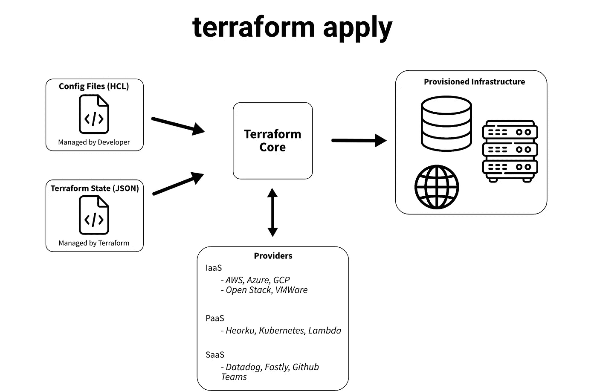
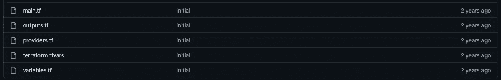
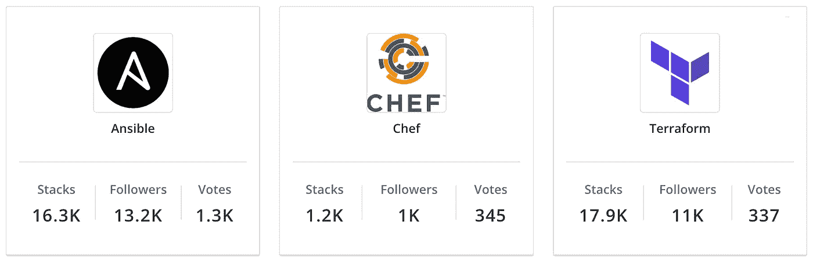
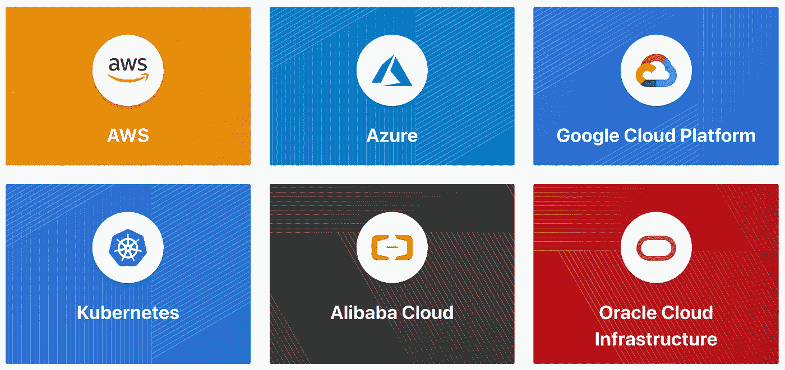

# 如何用代码自动化您的数据基础设施

> 原文：<https://blog.devgenius.io/how-to-automate-your-data-infrastructure-with-code-751b96355665?source=collection_archive---------5----------------------->

## 什么是 Terraform，为什么要使用它

你用过 AWS 控制台吗？如果是这样，你可能已经注意到管理服务是多么的乏味。一定有更好的方法…


在 [Unsplash](https://unsplash.com?utm_source=medium&utm_medium=referral) 上由 [C Dustin](https://unsplash.com/@dianamia?utm_source=medium&utm_medium=referral) 拍摄的照片

嗯，有。在 2000 年代中期主要云提供商推出后，需要以可扩展的方式管理庞大的数据基础架构。在本帖中，我们将介绍最流行的开源基础设施代码(IaC)工具，名为 [Terraform](https://www.terraform.io/) 。我们将从高级开始，然后进入一些设计和管理 Terraform 应用程序的实用技巧。

让我们开始吧。

# 技术 TLDR

Terraform 是一个开源的云无关框架，提供基础设施即代码(IaC)服务。它可以说是最受欢迎的 IaC 工具，支持大约 2500 个提供者，这些提供者只是您最喜欢的服务的 API 的逻辑抽象——一些快速的例子是 [AWS](https://registry.terraform.io/providers/hashicorp/aws/latest/docs) 和 [github](https://registry.terraform.io/providers/integrations/github/latest/docs) 。这个庞大的开源服务社区允许您使用 Terraform 的配置语言 [HCL](https://github.com/hashicorp/hcl) 以编程方式提供和管理几乎任何部署。

# 1 —但是，什么是 Terraform？

## 1.1 —基础设施即代码(IaC)

让我们从头开始。假设我们是公司的数据工程主管。我们的角色通常涉及管理权限、实施新的基础架构、扩展该基础架构等。

这些任务面临许多技术和组织挑战，其中包括…

*   **不同的资源有不同的接口。**为每个工具学习不同的图形用户界面和工作流程可能非常耗时。
*   **管理工作区需要复制。**如果您有一个生产、开发和试运行环境，您可能需要维护三个非常相似的工作空间。
*   **资源供应可以是重复的。**如果您必须创建 10 个 EC2 实例，您必须多次重复相同的步骤。

要是有一种工具能让您轻松管理所有基础架构就好了…

这就是基础设施即代码(IaC)的用武之地— 它让你使用基于文本的配置文件来管理你的基础设施。大多数 IaC 工具要么使用分层的键值存储，比如 JSON 或 YAML，要么使用定制语言，比如 HCL 或 Bicep。**因为我们不再使用图形用户界面，管理大型系统变得更加容易。**

三种云(AWS、Azure、GCP)都有各自的 IaC 工具，但它们往往是特定于云的。对于与云无关的工具，有一些流行的选项，其中两个是 Ansible 和 Terraform。

再来说说 Terraform。

## 1.2 —地形

正如《技术 TLDR》中提到的，Terraform 是一个与云无关的平台，允许您通过代码管理基础设施。它是 2014 年由 Hashicorp 创建的，几年后，它变得非常受欢迎。

Terraform 的成功很大程度上来自其庞大的供应商社区，如 AWS、github 和 docker。每个提供者都有**资源**，这些资源是提供者所拥有的特性的抽象。例如，`[aws_s3_bucket](https://registry.terraform.io/providers/hashicorp/aws/latest/docs/resources/s3_bucket)`是 AWS 提供者中的资源。

在 [Terraform 的注册表](https://registry.terraform.io/)中总共有大约 2500 个提供者，因为所有提供者都需要使用 Terraform 的格式，所以连接不相关的服务非常容易。此外，提供商代码是开源的，但大多数组织监督和管理他们的 Terraform 代码以确保稳定性。

如果你想开始，你必须学习 Terraform 的配置语言，即 [Hashicorp 语言](https://github.com/hashicorp/hcl#why) (HCL)。它是人类可读的，并支持一些常见的编程方法，如循环和流控制，但不如典型的编程语言强大。

所以现在我们对 Terraform 有了一个高层次的了解，让我们再深入一点。

# Terraform 是如何工作的？

## 2.1 —数据流

Terraform 的目标是完成所有繁重的工作，允许开发人员编写简单的代码来提供和管理基础设施。



图 1:`terraform apply`命令的数据流。图片作者。

图 1 显示了`terraform apply`如何呈现基础设施。首先，Terraform 核心接收由开发人员创建的**配置文件**，以及 Terraform 的 [**状态文件**](https://www.terraform.io/language/state) ，后者将现实世界的资源映射到您的配置。

从这两组文件中获取信息后，Terraform 的核心从提供者那里获取资源。如上所述，提供者是模块化的 API 抽象，允许您用几个参数管理资源。例如，如果你想创建一个 S3 桶，你可以写下面的代码…

```
resource "aws_s3_bucket" "b" {
  bucket = "my_bucket_name"
}
```

最后，在制定了需要供应哪些外部服务的计划后，Terraform 的核心实现了 API 调用(通过提供者模块)来呈现我们的基础设施。

很酷，对吧？

如果你正在寻找更多(包括一个伟大的视频演练)，检查我们的[哈希公司介绍](https://www.terraform.io/intro)。

## 2.2 —通用设计模式

您可能已经注意到，配置资源非常简单。这种灵活性给了你很多控制，但这是一把双刃剑；如果你没有为你的配置文件使用好的设计模式，你的代码将很难管理。

一个例子是所有的 Terraform 配置文件都使用`.tf`扩展名。**无论它们在你的目录中位于何处，都将被串接成一个文件并进行编译。**所以，这里有一些设计模式，有利于代码的干燥和可读。



图 2:terra form 根目录结构的例子。图片作者— [src](https://github.com/morethancertified/mtc-terraform/tree/main/04-AWS-K8s/05-VPC-SUBNETS-cidrsubnet) 。

首先，**给定目录中的每个** `**.tf**` **文件都应该有单一的用途……**

*   `main.tf`使用其他文件的代码创建资源、数据源和自定义模块。
*   `outputs.tf`指定应可通过 CLI 和其他 terraform 配置访问的信息。
*   `providers.tf`列出您的配置引用的提供商。
*   `variables.tf`描述您的配置**中使用的变量，但不指定值**。注意，这在概念上类似于 C++中的头文件。
*   `terraform.tfvars`给变量分配硬编码值。

对于大多数生产应用程序，建议在根目录中包含这些文件，但是每个用例是不同的——有时您需要更多，有时您需要更少。

二、**利用** [**模块**](https://www.terraform.io/language/modules/develop) **可以减少代码冗余**。一个模块仅仅是多个资源的容器，这些资源被一起使用。一个好的模块应该通过在你的架构中描述一个新的概念来提高抽象层次，通常是通过结合提供者的资源。

要定义一个新模块，只需创建一个包含一些`.tf`配置文件的新目录。然后，要引用这个模块，你只需在应用程序的任何地方使用`module`语法。

模块化架构从逻辑上分离进程，允许我们通过循环提供资源，指定默认参数，等等。

现在我们已经对一个好的地形架构有了一些高层次的理解，在我们的第三部分，让我们浏览一些更高级的概念…

*   Terraform 不太支持存储敏感信息(因为这很难)。关于保护 API 密钥/令牌/密码的更多信息，请查看这个博客。
*   Terraform 的状态文件的读写隔离是一个挑战。 [Terraform cloud](https://www.terraform.io/cloud-docs) 托管您的状态文件，对其进行加密，并确保并发写入不成问题。有一些定制的替代方法，但是 Terraform cloud 似乎是保护状态文件的最简单的方法。
*   如果您在模块中重用文件名，例如您的配置包含一个`**main.tf**`和`my_module/**main.tf**`，那么在文件的顶部添加一个注释来指示它属于哪个目录— [示例](https://github.com/derekm1215/mtc-terraform/blob/master/04-AWS-K8s/36-EC2-K3s-Part-3-Kubeconfig-rm-when-destroy/database/outputs.tf)。
*   对于拥有复杂基础设施的大型团队，最佳实践是使用[工作空间](https://www.terraform.io/language/state/workspaces)隔离 Terraform 配置的不同部分。

最后，如果你正在寻找真实世界的例子，看看来自 [terraform udemy 课程](https://www.udemy.com/course/terraform-certified/)的[代码报告](https://github.com/derekm1215/mtc-terraform/tree/master/03-modular-deployments/02-Module-Variables)。每个文件夹对应一节课，因此您可以查看应用程序的进度。此外，这里有一套非常好的[资源](https://www.terraform-best-practices.com/)，适合希望了解 Terraform 核心组件的初学者。Terraform 也有一个活跃的社区，所以如果你用谷歌搜索某样东西，你一定会找到资源。

# 3 —我应该使用 Terraform 吗？

## 3.1 —竞争

有大量的 IaC 工具，但是它们各自提供的功能与 Terraform 略有不同。根据 [Hashicorp 文档](https://www.terraform.io/intro/vs)，Terraform 专注于数据中心和相关服务的**高级抽象，同时允许您在单个系统上使用配置管理工具。因此，Terraform 不一定与其他工具相互排斥。**

竞争对手主要有四类…

1.  **大云模板**，如 ARM (Azure)、CloudFormation (AWS)。
2.  **第三方 IaC 框架**，如 Ansible、Chef 和 Puppet。
3.  **SDK**，比如 Boto3，FOG。
4.  **定制部署**。

在进行一些深入的比较之前，我们可以将排名最末的两个类别排除在可行的竞争对手之外…

诸如 Boto3 和 FOG 之类的 SDK 倾向于专用于给定的服务，并给予开发人员更多的权力。如上所述，Terraform 是服务 API 之上的高级抽象，它允许您用少量代码连接不同的服务。将 Terraform 与 SDK 进行比较就像将苹果与橙子进行比较一样——它们只是不同而已。

好了，去掉 SDK，让我们继续定制开发。

定制部署通常利用 SDK 甚至更低级别的库和 API。每个实现都是不同的，但是你经常需要重新创建很多 Terraform 的功能。由于每个自定义实现都不同，所以很难进行比较。

解决了这些问题之后，让我们来看看 Terraform 与大云模板和第三方 IaC 框架相比如何。

## 3.2 —地形对比分析

**3.2.1 —编程语言支持**

> Terraform 的 HCL 是目前最强大的配置语言之一，但是你必须学习它。

Terraform 使用 [HCL](https://github.com/hashicorp/hcl) ，这是一种强大的声明性语言。这是分层键值格式(JSON，YAML)和 python 这样的成熟编程语言之间的一个很好的中间地带。如果你熟悉一般的编程概念，你可以在一个小时内学会核心概念。

每一种云都使用不同的语言——Azure Resource Manager 使用 [Bicep](https://docs.microsoft.com/en-us/azure/azure-resource-manager/bicep/overview?tabs=bicep) ，AWS CloudForamtion 使用 [JSON 和 YAML](https://docs.aws.amazon.com/AWSCloudFormation/latest/UserGuide/gettingstarted.templatebasics.html) ，Google Cloud Deployment Manager 使用 [YAML](https://cloud.google.com/deployment-manager/docs/manage-cloud-resources-deployment) 。JSON 和 YAML 当然不如 HCL 强大，但是 Bicep 和 HCL[非常相似](https://docs.microsoft.com/en-us/azure/developer/terraform/comparing-terraform-and-bicep?tabs=comparing-bicep-terraform-usability-features)。**从配置语言的角度来看，Azure 和 Terraform 具有相似的功能，而 AWS 和 GCP 则没有那么强大。**

大多数第三方工具都有自己的定制语言。深入研究每一种第三方定制语言超出了本文的范围，然而**所有的语言都有与 HCL** 相似或更少的功能。Ansible 是一个明显的例外，因为它使用了 YAML。

**3.2.2 —社区规模和活动**

> Terraform 和 Ansible 拥有最大最活跃的开源社区。然而，这三种云都有强大的文档和 bug 支持。

在这里，我们使用开发人员*社区规模和活动*作为文档质量和修复缺陷速度的代理。在这方面，开源工具和专有工具之间通常有明显的区别，所以我们将依次研究每一种工具。

从开源项目开始，Terraform 拥有最大的社区之一。很难获得关于大小和活动的精确读数，但是在图 3 中，我们可以根据 stackshare.io 看到一些比较…



图 3: [stackshare](https://stackshare.io/stackups/terraform-vs-azure-resource-manager-vs-aws-cloudformation#pros) 第三方 IaC 工具对比。图片作者。

Terraform 和 Ansible 看起来不相上下，像 chef 和 puppet 这样的工具受欢迎程度要低一个数量级。

如果我们看一下他们的 github 库，Ansible 比 Terraform 多 50%的 stars 和 150%的 forks。所有其他被探索的第三方工具的活跃度要低得多，这使得 **Terraform 和 Ansible 成为最受欢迎的第三方工具**。

转到大云，因为他们的工具都不是开源的，所以我们不能真正看社区，但是三个都有相对好的文档和教程。值得注意的是，Google Cloud Deployment Manager 的 Terraform YouTube 教程要少得多，这可能表明社区活动较少。但除此之外，我们没有关于云的高质量数据，所以我们不会猜测。

**3.2.3 —平台支撑**

> Terraform 在平台集成的多样性和深度方面是明显的赢家。然而，如果你只在一个云上工作，这个云的工具可能比 Terraform 更好。



图 terraform 支持的示例提供者。图片作者。

Terraform 最大的竞争优势是支持许多不同的服务。Hashicorp 很早就意识到创建一个单一的统一格式来管理不同的系统是非常必要的。此外，由于易于集成促进了消费，许多公司免费维护他们的提供商代码。关于支持的平台和工具列表，请查看 [Terraform 的注册表](https://registry.terraform.io/browse/providers?_gl=1*huo7j2*_ga*OTEwMzc0OTcyLjE2NjA4NDUwNTY.*_ga_P7S46ZYEKW*MTY2MjU3OTEzOC4xMy4wLjE2NjI1NzkxMzguMC4wLjA.)。

**所有被调查的第三方服务的服务支持都少得多。Terraform 可能有所欠缺的一个领域是单一的云。三大云对非原生服务没有很大的支持，但是**如果你在原生地做所有的事情，你可能会使用云的工具得到更好的支持。****

# 4 —摘要

现在你知道了！希望你对 Terraform 有更多的了解，以及它为什么如此受欢迎。

简单概括一下，Terraform 是一个提供基础设施 API 逻辑抽象的工具。通过使用 Terraform 的配置语言 HCL 管理整个基础设施，您可以轻松连接和管理不同的服务。

Terraform 在三个关键领域大放异彩…

1.  Terraform 的 HCL 比其他大多数配置语言强大得多。
2.  Terraform 拥有强大而多样的供应商。
3.  Terraform 从大公司那里获得支持，以维护他们自己的提供商代码，这提高了代码的可靠性。

*感谢阅读！我会再写 10 篇文章，把学术研究带到 DS 行业。查看我的评论，链接到这篇文章的主要来源和一些有用的资源。*