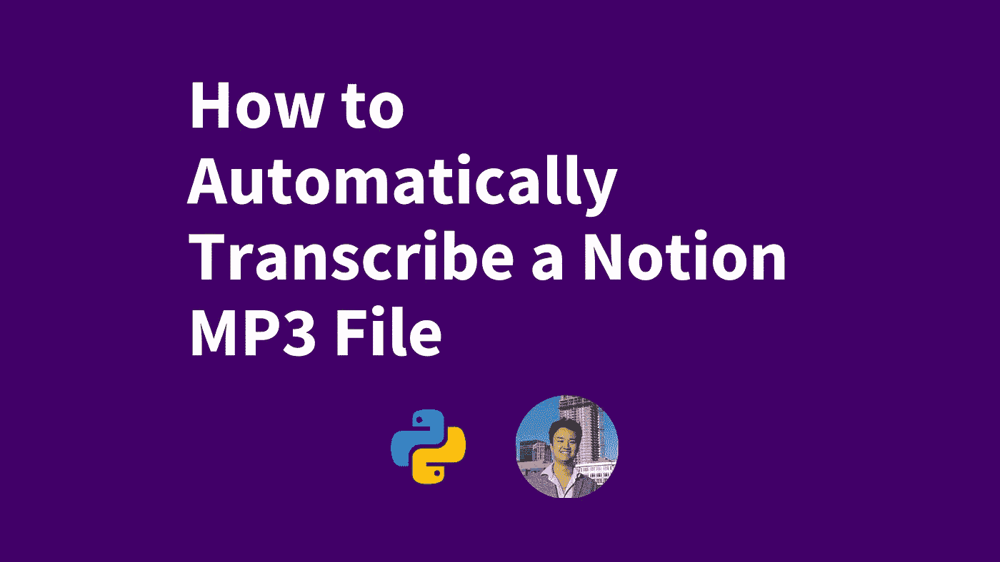
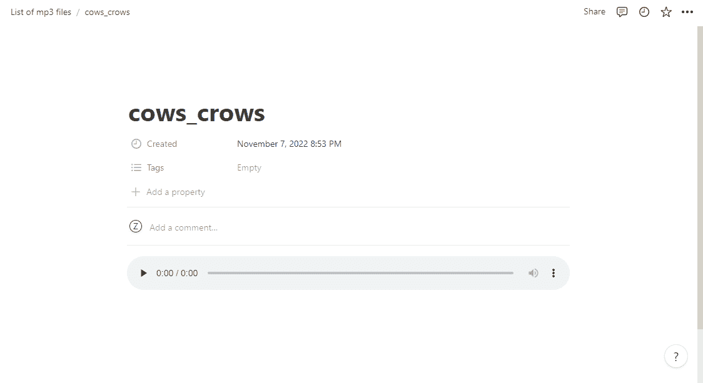
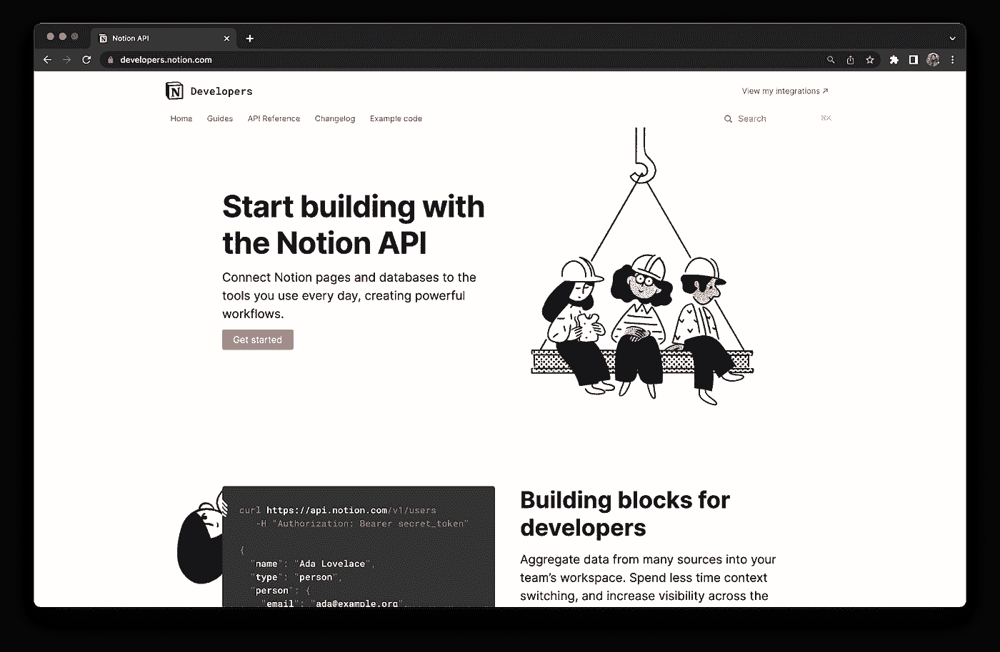
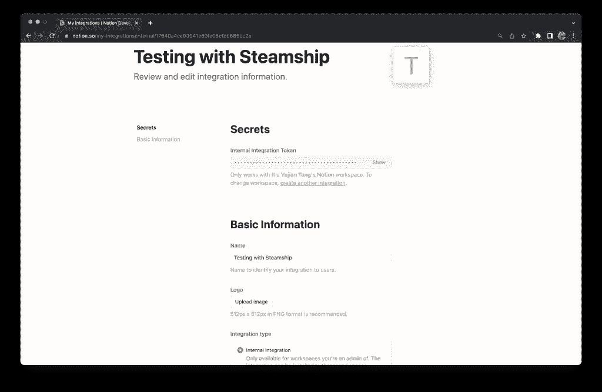
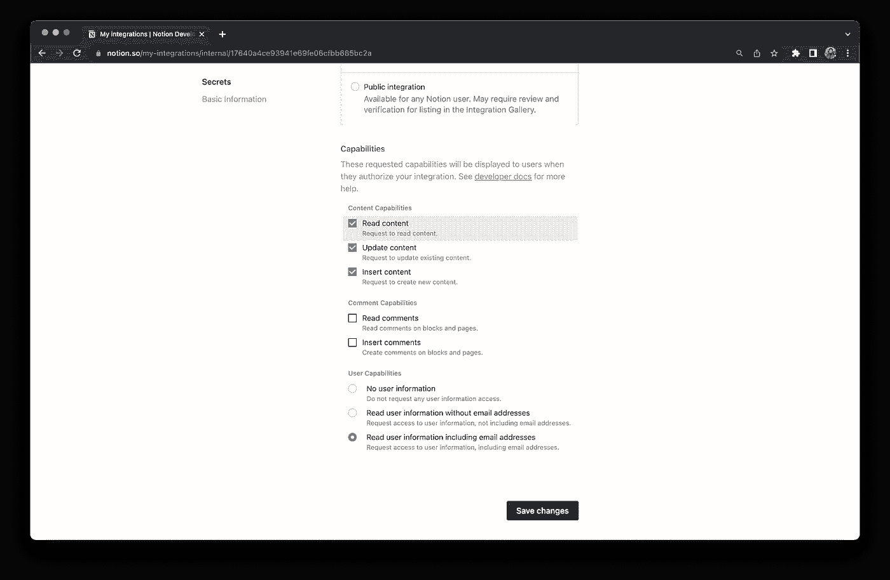
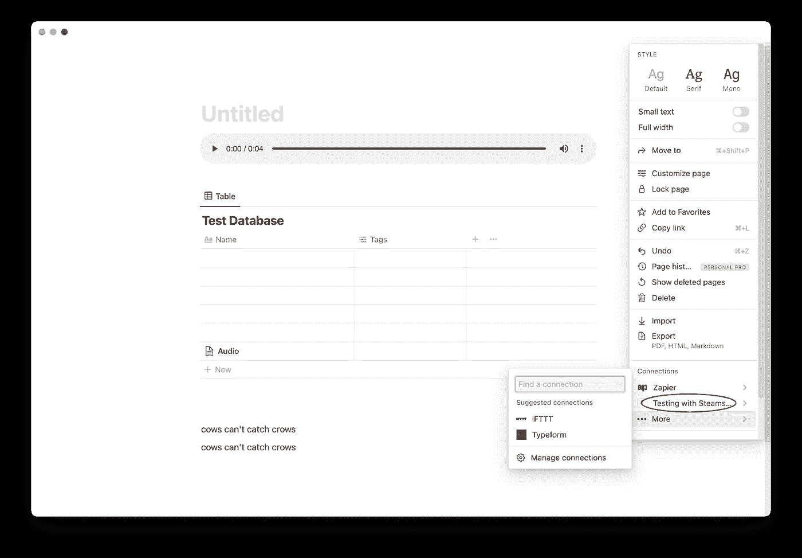
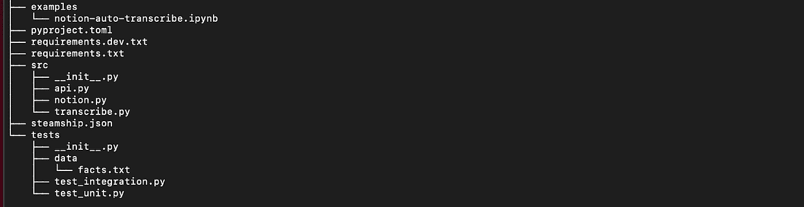
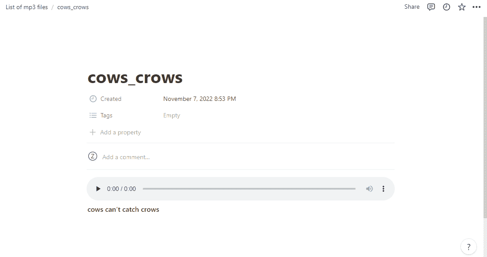

# 如何自动转录一个想法 MP3 文件

> 原文：<https://blog.devgenius.io/how-to-automatically-transcribe-a-notion-mp3-file-37d32cb23701?source=collection_archive---------16----------------------->

## 自然语言处理

## 使用您自己的云 NLP 来转录一个概念文件



时间超级宝贵。如果我们可以每天从重复的任务中节省几分钟或几个小时，我们就可以把节省下来的时间花在我们喜欢的活动上。作为程序员，我们可以自动化一些重复的任务，回到我们想要的生活。

让我们来看看如何创建一个应用程序来实现这一点。让我们用 Python 创建一个应用程序，将流行的生产力工具[概念](https://www.notion.so/)与新兴的自然语言处理(NLP)包管理器[轮船](https://www.steamship.com/)连接起来。我们的应用程序将把一个 mp3 文件放入 opinion，通过 Steamship audio-markdown 包运行它，并将 markdown 返回到与初始 mp3 文件相同的页面。点击这里查看 GitHub 。

在本帖中，我们将介绍:

*   Notin 简介
*   如何以编程方式使用概念
*   激活您的概念 API
*   使用概念 API 检索音频数据
*   将转录的文本返回到概念
*   介绍 Steamship，为我们管理云基础设施的 NLP 包
*   创建一个轮船包来转录一个概念块中的 MP3 文件
*   转录我们的音频文件
*   公开 API 端点
*   如何在 idea 中自动转录 MP3 文件的总结

# 什么是观念

概念是一个项目管理软件平台，旨在帮助组织管理他们的效率和生产力。您可以配置页面来保存您需要的任何信息。每页可以有任意多的“块”,以有组织的方式存储数据。

一个块可以是一个表格、一段文本、一幅图像，或者是任何一种 content 接受的内容类型。在我们的例子中，我们创建了一个保存 mp3 文件的块。然后，我们将我们的概念块连接到 Steamship audio-markdown 包来转录音频。

# 概念相关函数

我们要做的第一组函数与概念有关。`notion.py`文件包含检索和返回放在我们的概念工作空间中的 mp3 文件数据的代码。在下面的照片中，你可以看到我们的工作空间和我们保存的 mp3 文件。mp3 文件的名称是`*cows_crows.mp3*`。这个档案里有我说“牛抓不到乌鸦”的录音。



## 激活您的概念 API

要开始使用概念 API，请访问他们的[开发者门户](https://developers.notion.com/)并开始使用 API。从那里，只需创建您的 API 集成并复制您的 API 密钥。保存您的概念 API 键，因为我们稍后将使用它来连接概念和 Steamship。



如下所示调整您的 API 设置——它应该能够读取和更新内容。



在使用页面上的 API 之前，您需要转到您的概念页面的右上角，并单击这三个点。下拉菜单应该如下图所示。单击“更多”按钮，添加您之前创建的概念集成。在这种情况下，我把我的称为“用轮船测试”。



一旦您设置了应用程序集成并复制了 API 密钥，它就可以包含在头文件代码中。该头还声明了当前版本的概念，以及期望和接受的内容类型都将是 json 格式。

## 使用概念 API 检索音频数据

我们通过导入必要的库来启动 Python 脚本:`Dict`、`requests`和`json`。我们使用`Dict`指定传入字典的键和值对的预期类型，`requests`发送 URL 请求，`json`解析 JSON 响应。

接下来，我们编写一个名为*的函数来导入概念的基本头信息。为了正确的应用程序连接，我们需要使用为我们的开发人员应用程序提供的 API 关键概念。这个函数接受一个参数，我们的 API 键，并返回一个字典，必要的头。*

接下来，我们创建一个函数来检索存放 mp3 文件的路径。根据概念开发者 API [文档](https://developers.notion.com/)，我们可以使用他们提供的端点直接连接到我们的工作空间。我们使用前面导入的请求库向概念端点发送一个 HTTP GET 请求，以 json 格式返回我们的数据。

`notion_get`函数有两个参数，一个块的路径和我们的 API 键。我们在函数中做的第一件事是生成 URL，我们可以通过概念 API 从该 URL 获取我们的块。接下来，我们发送一个请求，并传递我们之前创建的带有 API 密钥的头，以进行身份验证。在返回响应之前，我们将其转换为 JSON 格式。在这个例子中，为了清晰和调试，我们还打印出了响应文本和 JSON 格式的响应文本。

```
from typing import Dict
import requests
import json

def notion_headers(api_key: str) -> dict:
    return {
        'authorization': f"Bearer {<YOUR API KEY HERE>}",
        'Content-Type': 'application/json',
        'Notion-Version': '2022-06-28',
        "accept": "application/json",
    }

def notion_get(path: str, api_key: str):
    url = f"https://api.notion.com/v1/{path}"
    response = requests.get(url, headers=notion_headers(api_key))
    print(response.text)
    res_json = json.loads(response.text)
    print(res_json)
    return res_json
```

前两个函数将在我们的 API 脚本的开头执行，检索用于转录的初始 mp3 文件数据。下面两个函数将在我们的应用程序结束时执行，以将音频降价返回到概念。由于[模块化编程](https://pythonalgos.com/python-single-responsibility-principle/)的好处，我们将它们写在同一个 Python 脚本文件中。现在让我们来看看将 markdown 文件返回到 Notion 的函数。

## 将转录的文本返回到概念

我们编写一个名为*的函数，将 mp3 音频块的路径、JSON 格式的内容和 API 键作为参数。它调用头部信息和 HTTP 请求补丁方法，将我们的 JSON 数据连接到概念 API 端点。[概念 API 文档](https://developers.notion.com/reference/patch-page)概述了如何正确定义它们的块对象类型。 *add_markdown()* 函数将概念页面的 ID、markdown 转录和 API 键作为参数。该函数模拟了他们的文档，并定义了音频降价文本数据的特定段落块对象内容。这个补丁请求将向我们的概念工作区添加一个新块，其中包括我们的音频降价。*

```
def notion_patch(path: str, content: Dict, api_key: str):
    url = f"https://api.notion.com/v1/{path}"
    response = requests.patch(url, json=content, headers=notion_headers(api_key))
    res_json = response.json()
    return res_json

def add_markdown(page_id: str, markdown: str, api_key: str):
    add_text_block = {
        "children":
            [{
                "object": "block",
                "type": "paragraph",
                "paragraph": {
                    "rich_text": [{
                        "type": "text",
                        "text": {
                            "content": markdown,
                        }
                    }]
                }
            }]
    }
    return notion_patch(f"blocks/{page_id}/children", add_text_block, api_key)
```

# 什么是轮船

Steamship 是一款尖端的自然语言处理软件，旨在让您快速轻松地将语言 AI 添加到您的软件中。Steamship 包像标准 Python 模块一样导入到您的代码中，但是它们运行在云中自己的自动管理的堆栈上。因为它们在云中运行在为自然语言处理而设计的自动管理堆栈上，所以您可以根据需要快速扩展许多单独的实例，而无需管理繁重的基础架构。

我们的应用程序将这两个应用程序无缝地融合在一起，让我们远离重复的任务，回到我们的生活中。为了开始使用 Steamship，我们安装了 [Steamship CLI](https://docs.steamship.com/configuration/cli.html) 和 [Python 库](https://docs.steamship.com/configuration/clients.html)。

# 创建一个轮船包来转录一个概念块中的 MP3 文件

一旦我们安装了 Steamship CLI 和 Python 库，我们就可以开始创建一种自动化的方式来转录 Steamship 的音频文件。第一步是[创建一个轮船包](https://docs.steamship.com/packages/developing/index.html)。一旦我们创建了一个包，我们将会看到一个如下所示的文件夹结构。

我们对默认包所做的主要改变在`/src`文件夹中。我们的`/src`文件夹包含四个重要文件: *init.py* 、 *api.py* 、*signature . py、*和一个*transcripte . py*文件。虽然我们可以将所有函数存储在一个文件中，但最好的做法是创建模块化代码，并将所有函数拆分到适当命名的文件中。下图显示了我们的`examples`、`src`和`tests`文件夹的样子。



我们使用`__init__.py`文件将一个目录标记为 Python 包。每个包含作为 Python 包的所需导入代码的目录都必须包含一个`__init__.py`。一个`__init__.py`文件可以是空的，在我们的例子中就是这样。对于我们的应用程序，这个文件必须是空的。我们没有任何特定的用例要求我们在该文件中包含代码。一个空的`__init__.py`文件通常是默认的。

# 转录我们的音频文件

音频减价包是轮船公司目前提供的四个捆绑包之一。他们提供了很棒的[文档](https://docs.steamship.com/)和最新的 [Github](https://github.com/steamship-packages/audio-markdown/) ，在那里他们编写了我们可以直接放入应用程序的代码。和以前一样，我们总是从导入所需的模块开始。

我们通过定义名为*transcripte _ audio*的函数来完成 Python 脚本。这个函数有两个参数，音频文件的 URL 和一个 Steamship 对象。我们从使用 Steamship 来启动`audio-markdown`包的一个实例开始。然后我们`invoke`实例来转录我们的文件。

被调用的代码将在 Steamship NLP 指定的云基础设施上执行，并返回我们的音频降价。如果请求不成功，我们将收到一条状态消息，告诉我们原因。该代码还将重试次数限制为 100 次，以防止程序挂起。在我们的 while 循环中有 break 子句也很重要，这样它们就不会无限地运行并可能使我们的机器崩溃。

```
import time
from steamship import Steamship, TaskState

def transcribe_audio(audio_url: str, ship: Steamship):
    instance = ship.use("audio-markdown", "audio-markdown-crows")
    transcribe_task = instance.invoke("transcribe_url", url=audio_url)
    task_id = transcribe_task["task_id"]
    status = transcribe_task["status"]
    # Wait for completion
        retries = 0
        while retries <= 100 and status != TaskState.succeeded:
            response = instance.invoke("get_markdown", task_id=task_id)
            status = response["status"]
            if status == TaskState.failed:
                print(f"[FAILED] {response}['status_message']")
                break

            print(f"[Try {retries}] Transcription {status}.")
            if status == TaskState.succeeded:
                break
            time.sleep(2)
            retries += 1

        # Get Markdown
        markdown = response["markdown"]
        return markdown
```

# 公开我们的 API 端点

在我们的 *api.py* Python 文件中，代码将我们创建的子程序混合在一起。我们创建类来将上面创建的每个函数导入到它们各自的位置，最终返回我们的 markdown 文件。首先导入运行脚本所需的模块。我们还通过名字从其他 Python 脚本中导入函数。

```
from typing import Type
from steamship.invocable import Config, create_handler, post, PackageService

from notion import notion_get, add_markdown
from transcribe import transcribe_audio
```

我们定义了一个名为`*NotionAutoTranscribeConfig()*`的类，它存储了我们之前收到的用于概念 API 集成的安全 API 密钥。这是连接到我们的概念集成应用程序所需的配置功能。

接下来我们编写`NotionAutoTranscribe()`类。类对象合并了我们之前编写的 Python 脚本。我们的类对象从我们的配置类对象中调用所需的 API 键来访问概念集成。然后它执行我们编写的`*notion_get()*`函数来获取 mp3 文件块的路径。

在解析返回的信息以识别到 mp3 音频数据的路径指定的 url 之后，`*transcribe_audio()*`函数调用 Steamship 来转录给定的音频数据。转录后的文本“母牛抓不到乌鸦”，使用我们的`*add_markdown()*`函数打印到一个新的概念块对象。

```
class NotionAutoTranscribeConfig(Config):
    """Config object containing required parameters to initialize a NotionAutoTranscribe instance."""

    notion_key: str  # Required

class NotionAutoTranscribe(PackageService):
    """Example steamship Package."""

    config: NotionAutoTranscribeConfig

    def config_cls(self) -> Type[Config]:
        """Return the Configuration class."""
        return NotionAutoTranscribeConfig

    @post("transcribe")
    def transcribe(self, url: str = None) -> str:
        """Transcribe the audio in the first Notion block of the page at `url` and append to the page.

        This uses the API Key provided at configuration time to fetch the Notion Page, transcribe the
        attached audio file, and then post the transcription results back to Notion as Markdown Text.
        """

        # Parse the Block ID from the Notion URL
        block_id = url.split("#")[1]

        # Get the Notion page
        print(f"Getting notion block {block_id}")
        notion_page = notion_get(f"blocks/{block_id}", self.config.notion_key)

        # Get the Page ID and Audio URL from the Notion File JSON
        audio_url = notion_page['audio']['file']['url']
        page_id = notion_page['parent']['page_id']

        print(f"Audio url: {audio_url}")
        print(f"Page ID: {page_id}")

        # Transcribe the file into Markdown
        markdown = transcribe_audio(audio_url, self.client)

        print(f"Markdown: {markdown}")

        # Add it to Notion
        res_json = add_markdown(page_id, markdown, self.config.notion_key)

        print(f"Res JSON: {res_json}")

        return res_json

handler = create_handler(NotionAutoTranscribe)
```



# 摘要

在这篇文章中，我们自动转录了一个 mp3 文件。我们编写了我们的定制应用程序来连接项目管理工具、概念和 NLP 包管理器 Steamship。我们的应用程序找到我们放在项目工作区中的 mp3 音频文件，部署为处理我们的音频文件而设计的 Steamship 包，然后将完整的音频减价直接返回到我们的概念工作区。

# 进一步阅读

*   [Python 中的嵌套列表](https://pythonalgos.com/nested-lists-in-python/)
*   [用 Python 从零开始构建神经网络](https://pythonalgos.com/build-a-recurrent-neural-network-from-scratch-in-python-3/)
*   [Python 中的命名实体识别(NER)](https://pythonalgos.com/the-best-way-to-do-named-entity-recognition-ner/)

如果你喜欢这篇文章，请在 Twitter 上分享！为了无限制地访问媒体文章，今天就注册成为[媒体会员](https://www.medium.com/@ytang07/membership)！别忘了关注我，[唐](https://www.medium.com/@ytang07)，获取更多关于增长、技术等方面的文章！