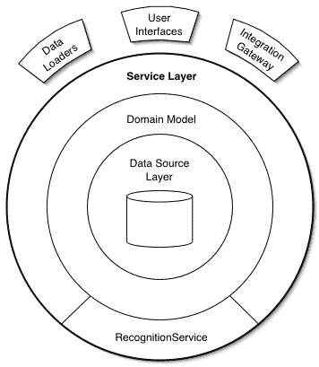

# 如何避免贫血的域名模型？

> 原文：<https://blog.devgenius.io/how-to-avoid-anemic-domain-model-59775c639678?source=collection_archive---------2----------------------->

## 如何处理业务逻辑，并避免贫血的领域模型。

肖恩·波洛克在 [Unsplash](https://unsplash.com?utm_source=medium&utm_medium=referral) 上的照片

您需要将业务逻辑放在代码中。逻辑写在哪里取决于你。如果你正在使用 OOP，那么你需要考虑一下。你必须坚持单一责任原则。

> …这些对象与真正的领域模型所具有的丰富的关系和结构相联系…在这些对象上几乎没有任何行为，这使得它们只不过是一些 getters 和 setters。— [马丁·福勒](https://www.martinfowler.com/bliki/AnemicDomainModel.html)

贫血的领域模型充满了关系。模型不持有行为，所以整个域充满了属性包。

## 什么是领域模型？

[域模型位置](https://martinfowler.com/eaaCatalog/serviceLayer.html)

在领域层之前是服务层。马丁在下面的句子中解释了它的作用。

> 服务层从连接客户端层的角度定义了应用程序的边界[考克伯恩]及其可用操作集。— [马丁·福勒](https://www.martinfowler.com/bliki/AnemicDomainModel.html)

这并不意味着“所有”业务逻辑都应该存在于服务层。模型也可以有行为。模型的 Getters 和 setters 可以增加额外的行为。

服务层应该很薄。只公开领域必需的方法。领域模型应该有业务规则。

> 一般来说，您在服务中发现的行为越多，您就越有可能剥夺领域模型的好处。如果你所有的逻辑都在服务上，那你就把自己洗劫一空了。— [马丁·福勒](https://www.martinfowler.com/bliki/AnemicDomainModel.html)

我从事 Java 编写的服务已经有很长时间了。我可以说我们在服务方面的确有很多逻辑。我未来的目标是让它尽可能薄。

## 软件进化

领域扩大。电子商务企业可能会开发不同的产品，或者为用户增加不同的促销活动。前面提到的都需要额外的业务逻辑。

测试服务于它的目的。我们确信在我们的店面添加新产品时不会有任何问题。

我们确定它是可维护的吗？如果一个企业增加了一个新的产品线，会发生什么？

我们需要创建我们的软件，使它尽可能隐藏。这就是服务层需要“瘦”的原因。领域层帮助我们隐藏所有的细节，留下一个交互的界面。

曝光太多会留下出错的空间。成员逻辑真的属于购物车服务吗？在考虑领域的情况下回答这些问题会带来新的更好的方法。

## 封装解决贫血领域模型

很难跟踪因为我们暴露太多而发生的错误。我们在购物车服务中做成员逻辑。我们允许创建没有必需属性的对象，即空构造函数。

假设你的控制器中有很多逻辑。在领域的上下文中，提取逻辑确实有所帮助。盲目提取，将逻辑移到“经理”类，不会。在进行任何更改之前，请告知您的域。看看“客户”的需求。

在您的领域模型中封装领域逻辑。类应该处理所有相关的逻辑，即过期时间逻辑。该类不应处理`Member`逻辑，即向成员添加优惠。

## 论理解领域

查看域，您可以开发域对象的类。[伊文斯](https://twitter.com/ericevans0)把它们分类了，这样我们就不用。

> 实体通常是大的东西，如客户、船舶、租赁协议。值通常是像日期、金钱、数据库查询这样的小事。服务通常是对外部资源的访问，如数据库连接、消息传递网关、存储库、产品工厂。— [埃里克·埃文斯](https://www.amazon.com/gp/product/0321125215?ie=UTF8&tag=martinfowlerc-20&linkCode=as2&camp=1789&creative=9325&creativeASIN=0321125215)

你不需要的是创建属性包。领域逻辑也可以存在于模型中。

考虑到所有不同的软件架构，这并不是在所有地方都很好。面向服务的架构根本没有这一层。

记住你在哪里使用它，它不是在哪里都适用。在企业应用程序中，主要是 J2EE，它是存在的。对于 MVC 架构，一般不会有这一层。这就是 ViewModel 发挥作用的地方。从一个开发者[这里](https://softwareengineering.stackexchange.com/questions/208059/do-mvc-web-frameworks-favor-anemic-domain-model-in-order-to-avoid-duplication)查一下这个疑问。

> 领域层(或模型层):负责表示业务的概念、关于业务情况的信息和业务规则。反映业务情况的状态在这里被控制和使用，即使存储它的技术细节被委托给基础设施。这一层是商业软件的核心。—埃里克·埃文斯

## 资源:

[吉米的会议发言](https://vimeo.com/43598193)

 [## jbo gard/演示

### 我做的报告。在 GitHub 上创建一个帐户，为 jbogard/presentations 的开发做出贡献。

github.com](https://github.com/jbogard/presentations/tree/master/WickedDomainModels)  [## bliki: EvansClassification

### 在他的优秀著作领域驱动设计中，Eric Evans 创建了不同种类的领域分类…

martinfowler.com](https://martinfowler.com/bliki/EvansClassification.html)  [## 第 9 章:服务层指南

### 有关本指南中涵盖的主题的更多详细信息，请参见本指南的目录。概述设计考虑因素…

docs.microsoft.com](https://docs.microsoft.com/en-us/previous-versions/msp-n-p/ee658090%28v=pandp.10%29?redirectedfrom=MSDN)  [## bliki: AnemicDomainModel

### 这是一种已经存在了很长时间的反模式，但似乎有了特别的突破…

www.martinfowler.com](https://www.martinfowler.com/bliki/AnemicDomainModel.html)  [## 服务层

### EAA 目录的 p |作者 Randy Stafford 定义了一个应用程序的边界和一个服务层，该服务层建立了一组…

martinfowler.com](https://martinfowler.com/eaaCatalog/serviceLayer.html)  [## “业务逻辑应该在服务中，而不是在模型中”有多准确？

### 今晚早些时候，我回答了 StackOverflow 上的一个问题。问题:编辑现有对象…

softwareengineering.stackexchange.com](https://softwareengineering.stackexchange.com/questions/218011/how-accurate-is-business-logic-should-be-in-a-service-not-in-a-model)  [## 将贫血的领域模型恢复到多层架构中

### 在过去的几天里，我学习了领域驱动设计，并试图将其应用到当前的项目中…

softwareengineering.stackexchange.com](https://softwareengineering.stackexchange.com/questions/168517/recovering-an-anemic-domain-model-into-a-multitier-architecture)  [## bliki: EvansClassification

### 在他的优秀著作领域驱动设计中，Eric Evans 创建了不同种类的领域分类…

martinfowler.com](https://martinfowler.com/bliki/EvansClassification.html)  [## 为了避免重复，MVC web 框架支持贫血的领域模型吗？

### 在你链接的马丁·福勒的文章中，他谈到了贫血的领域模型:乍一看，它看起来像真的一样…

softwareengineering.stackexchange.com](https://softwareengineering.stackexchange.com/questions/208059/do-mvc-web-frameworks-favor-anemic-domain-model-in-order-to-avoid-duplication)