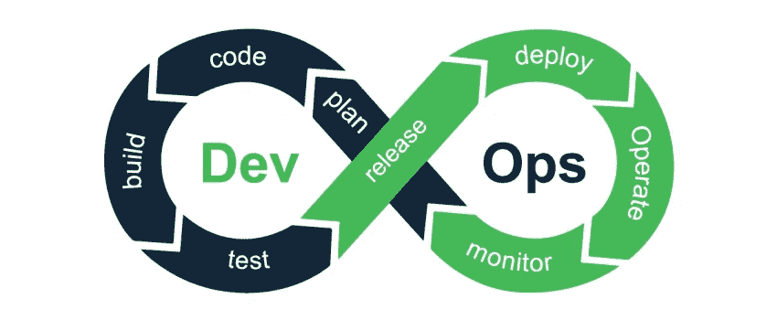
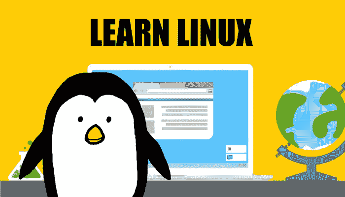
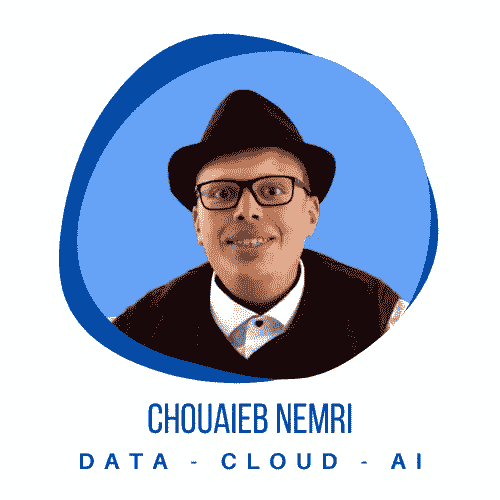

# 如何在 2022 年成为 DevOps 工程师

> 原文：<https://blog.devgenius.io/how-to-become-a-devops-engineer-in-2022-c772ad98f326?source=collection_archive---------0----------------------->

随着越来越多的公司寻求实施 DevOps 实践，对合格的 DevOps 工程师的需求也在飙升。因此，对 DevOps 工程师的需求很大，预计到 2022 年，他们将成为薪酬最高的 IT 专业人士之一。DevOps 工程师是软件开发过程的关键。他们负责实施自动化工具，这些工具允许 IT 团队管理和监控他们的整个应用程序生命周期。

由于他们在软件开发中的关键作用，DevOps 工程师必须对代码管理工具、系统架构、应用程序性能监控和持续集成/持续交付流程有透彻的理解。他们需要能够制定策略，帮助他们在企业环境中实现新功能和应用程序的持续部署。在整篇文章中，我将引导您通过参考资料获得您需要的正确的技术知识。

注意:我写这篇文章没有得到任何报酬。请考虑用此链接 *通过* [*成为中等会员来支持我和其他人的写作。*](https://medium.com/@c-nemri/membership)

# 了解 DevOps 的全部内容

DevOps 意味着开发和运营部门共同努力，以高速构建、发布和运行软件:

**开发:**创造新功能或服务的过程。开发人员使用最新的技术，如敏捷、Scrum 或看板来进行项目。这些技术有助于创建代码的小版本或增量，允许团队在将代码发布到生产环境之前测试它们。通常使用吉拉、GitHub 或 Trello 等工具来跟踪项目。开发团队可大可小，这取决于他们所从事的项目，但是如果他们想比竞争对手更快地推出他们的软件，他们都需要以敏捷的方式一起工作，这就是 DevOps 文化的全部！

**操作:**软件发布后支持其高质量和高性能运行所需的过程。这包括监控服务器的异常行为、在需要时部署更新、通过在需求增加时横向扩展基础架构来确保应用程序的高可用性等..

# 学习 Linux 和网络

如果你想成为一名 DevOps 工程师，你需要做的第一件事就是很好地理解计算机如何工作的基础。您必须了解 Linux 是如何工作的，以及 TCP/IP、UDP 和 HTTP 等网络协议是如何工作的。这些是构建模块，其中的所有内容都是建立在这些模块之上的。如果你没有这方面的知识，那么你将很难在事业上取得进步，因为你将不得不不断地向其他人寻求技术问题的帮助。

了解这些话题的最好方法是阅读网上关于它们的书籍和文章。你可以在网上找到很多资源，这些资源会深入地教你所有这些话题。一个好的起点是:

# 学习 Python

一旦你对基础有了很好的理解，就该开始学习一些编程语言了！如果你以前从未编写过代码，或者这是你第一次尝试学习编程，那么我建议你尝试将 Python 作为你的第一语言，因为它很容易上手，而且网上有很多资源可供初学者使用(我强烈推荐 freeCodeCamp)。同样，有很多书籍和课程可以深入教授 Python。这个 4 小时的视频是一个很好的起点:

# 学习 Git / GitHub

试用 Python 之后，是时候换一个工具了！这次我们要学习 Git / GitHub。DevOps 工程师了解 Git / GitHub 是必不可少的，因为它是业内使用最广泛的版本控制系统，DevOps 工程师预计会使用它。我建议您通过查看本指南开始学习 Git / GitHub:

# 学习 Docker

Docker 是现代 DevOps 工具箱中最重要的工具之一。它使开发人员能够快速创建代码并将其部署到比虚拟机更容易管理的隔离容器中。Docker 还使配置和扩展等任务的自动化成为可能，这减少了与应用程序部署相关的时间和成本。因为 Docker 易于安装，并且可以在大多数平台上运行，所以对于希望采用 DevOps 实践的组织来说，它是一个很好的选择。要了解 Docker 如何帮助您的组织更快发展，请查看此链接:

# 学习 Kubernetes

现在，你可能已经听说过 Kubernetes。这个开源的容器管理系统已经迅速成为 DevOps 世界的标准。它受欢迎的主要原因是它使部署和管理容器化的应用程序变得容易。但它也支持持续集成和持续部署(CI/CD)流程，允许开发人员轻松创建和测试新版本的应用程序。Kubernetes 对 DevOps 很重要的原因有很多。首先，它为开发人员节省了时间，因为它自动化了创建和部署容器的大部分过程。其次，它允许公司在需求增加时快速扩大规模。第三，它通过提供容器可以运行的安全应用程序环境来保证应用程序的安全。因此，Kubernetes 正在塑造 DevOps 的未来，并且已经成为希望在当今快节奏的世界中保持竞争力的公司的一个重要工具。要了解更多关于 Kubernetes 的信息，这里是一个很好的起点:

# 了解微服务

作为一名 DevOps 工程师，对微服务架构有很好的理解是很重要的。微服务是独立部署的小型独立服务，可以独立扩展。该视频将教您如何开始使用微服务并实际构建微服务应用:

# 了解基础设施代码— IaC — Terraform

Terraform 是一个工具，允许您将基础架构作为代码进行管理。IaC 是 DevOps 社区使用的一个术语，用来描述可以直接在代码中创建、更新和删除基础设施资源的思想。您不必手动配置和供应您的基础架构，您可以在代码中完成这一切。本视频将教您如何开始使用 IaC:

# 了解可观察性

可观察性是 DevOps 工程师工作的一个重要部分。您必须能够监控和记录基础设施的性能。广泛使用的可观测性工具包括:Promotheus、DataDog 和 OpenTelemetry。本指南将教您如何开始使用 OpenTelemetry:

# 了解配置管理

在虚拟机的 IaaS(基础设施即服务)方面，一旦启动了 ec2 实例，就应该使用配置管理工具对其配置和设置进行编码。这一领域中一些比较受欢迎的选项包括 Ansible、Chef、Puppet 和 SaltStack。对于大部分基础架构运行 Windows 的组织，您可能会发现 Powershell 期望状态配置(DSC)是这一领域的首选工具。这里是学习 Ansible 的一个好起点:

# 了解 CI/CD

对于这个角色，你需要对持续交付(CD)理论、概念和它们的实际应用有深刻的理解。你不仅需要 CD 工具和系统的经验，还需要对它们的内部运作有深入的了解，这样你就可以将不同的工具和系统集成在一起，从而创建一个功能完整、紧密结合的交付管道。提交、合并、构建、测试、打包和部署代码都在软件发布过程中发挥作用。

如果您正在为您的持续交付管道使用本机 AWS 服务，您需要熟悉 AWS CodeDeploy、AWS CodeBuild 和 AWS CodePipeline。您可能需要熟悉的其他 CD 工具和系统包括 GitHub、Jenkins、GitLab、Spinnaker、Travis 或其他。这里是学习 Jenkins 的一个好起点:

# 掌握公共云平台—以 AWS 为例

DevOps 工程师应该是托管其公司应用程序的云平台的服务、工具和实践方面的主题专家。AWS 是使用最广泛的公共云。你可以从那里开始。产品开发团队会带着关于各种服务的问题来找你，并就使用什么服务以及何时使用提出建议。因此，您应该全面了解各种各样的 AWS 服务，以及更适合特定情况的替代(非 AWS)解决方案。

凭借您在云计算方面的专业知识，您将设计和构建云原生系统，应对云系统的复杂性，并确保在利用各种云服务产品时遵循最佳实践。在设计和推荐解决方案时，您还将权衡使用 IaaS 服务与 PaaS 和其他托管服务的利弊。你可以参考我两个月前写的这篇文章，快速开始你的 AWS 之旅:

 [## 您的 2022 AWS 学习之路——最好的在线 100%免费资源

### 免费学习 AWS 架构。

aws .平原英语. io](https://aws.plainenglish.io/your-2022-aws-learning-path-the-best-online-100-free-resources-bd84da278b13) 

# 最后的话

如果您已经阅读了本指南，您可能想知道如何成为一名 DevOps 工程师。但是在你真正开始职业生涯之前，你还需要知道一件事。你看，成为 DevOps 工程师是一个很大的承诺，需要紧张的日常工作和大量的时间投入。这意味着你需要致力于软件发布和持续交付的过程，直到最后。这份工作不适合胆小的人。您很快就会知道，成为一名 DevOps 工程师并不容易。这肯定不会在一夜之间发生。但是如果你愿意投入时间，你会对未来等待你的回报感到惊讶。

# 关于我

[我们在 LinkedIn 上连线](https://www.linkedin.com/in/nemri)。我是 AWS(亚马逊网络服务)的机器学习和数据分析解决方案架构师。我对云、数据& AI 充满热情，我拥有🇺🇸佐治亚理工学院和 and inp 图卢兹教育学院的工程和硕士学位

我指导残疾人在科技领域谋得一份职业:请在此预订您的位置👉https://calendly.com/nemri/techies-w-disabilities

我在这里写数据、云和人工智能👉【https://c-nemri.medium.com/ 