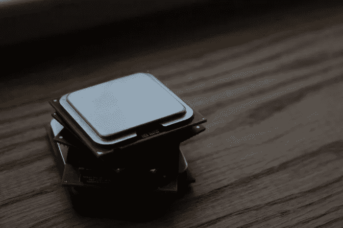
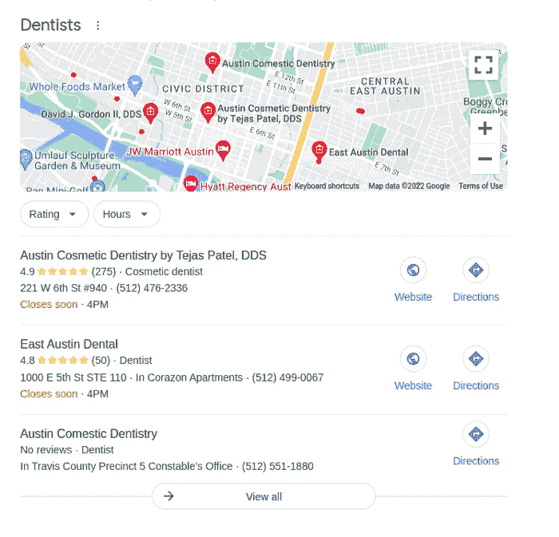
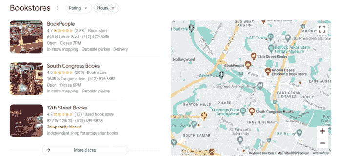
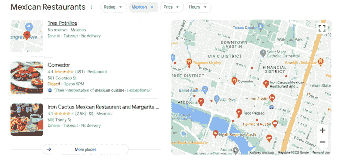
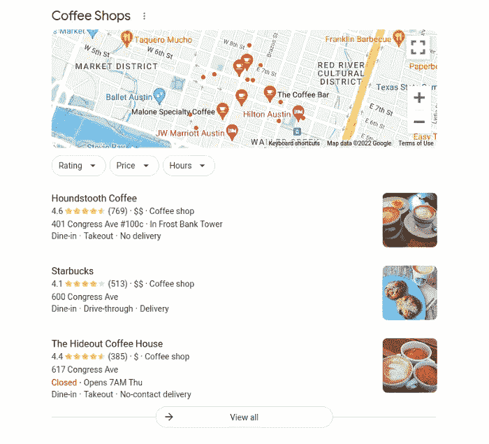
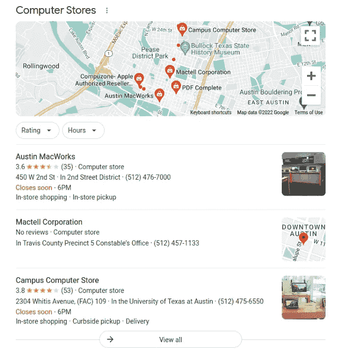

# 如何在 Rails 上测试 ML 实现

> 原文：<https://blog.devgenius.io/how-to-benchmark-ml-implementations-on-rails-51cff8213058?source=collection_archive---------9----------------------->



# 介绍

这是与人工智能实现相关的系列博文的一部分。如果你对故事的背景或情节感兴趣:

[#1)如何用人工智能刮出 Google 本地结果？](https://serpapi.com/blog/how-to-scrape-google-local-results-with-artificial-intelligence/)
[【2】Rails 上机器学习的真实世界示例](https://serpapi.com/blog/real-world-example-of-machine-learning-on-rails/)
[【3】AI 训练技巧和比较](https://serpapi.com/blog/better-training-tips-and-comparisons/)
[【4)Rails 上抓取中的机器学习](https://serpapi.com/blog/machine-learning-in-scraping-with-rails/)
[【5)在 Rails 上实现 ONNX 模型](https://serpapi.com/blog/implementing-onnx-models-to-rails/)
[【6)ML 混合解析器如何击败传统解析器](https://serpapi.com/blog/how-ml-hybrid-parser-beats-tradition/)
[【7)如何在 Rails 上对 ML 实现进行基准测试](https://serpapi.com/blog/ml-hybrid-benchmarks/)

本周，我们将展示如何对我们为 SerpApi 的 Google Local Pack Scraper API 在 Rails 上开发的 ML 实现进行基准测试。

# I —整体解析过程的低精度基准(100 次)

我们将使用在上周的博客文章中使用的相同查询来创建一个以毫秒为单位报告的基准。但是，这里要提到的一点是，100 次同样的过程所用的平均时间会有误差。我将对一个单一结果进行另一个测试，以测量更真实的数字。这个过程将反映它将如何影响进行搜索的用户的代码。不管误差范围如何，都应该反映具有奇怪行为的情况。

以下是 Rails 的基准代码:

```
traditional_benchmarks = []
ml_benchmarks = []100.times do
  traditional_benchmarks << Benchmark.ms { search.parse! false }
  ml_benchmarks << Benchmark.ms { search.parse! true }
endtraditional_average = traditional_benchmarks.sum / traditional_benchmarks.size
ml_average = ml_benchmarks.sum / ml_benchmarks.size
average_difference = ml_average - traditional_average if traditional_average < ml_average
  ratio_change = ml_average / traditional_average
  change = "slower"
else
  ratio_change = traditional_average / ml_average
  change = "faster"
endputs "Traditional Parser Benchmark Average: #{traditional_average} ms"
puts "ML Hybrid Parser Benchmark Average: #{ml_average} ms"
puts "Average Difference: #{average_difference} ms"
puts "ML Hybrid Parser is #{ratio_change} times #{change} than Traditional Parser"
```

# 牙科医生



```
"local_results": {
    "places": [
      {
        "position": 1,
        "title": "Austin Cosmetic Dentistry by Tejas Patel, DDS",
        "address": "221 W 6th St #940",
        "rating": 4.9,
        "reviews": 275,
        "hours": "Closes soon ⋅ 4PM",
        "phone": "(512) 476-2336",
        "lsig": "AB86z5V7-Co76bptvuPt00IjA1ut",
        "place_id_search": "https://serpapi.com/search.json?device=desktop&engine=google&gl=us&google_domain=google.com&hl=en&location=Austin%2C+Texas%2C+United+States&lsig=AB86z5V7-Co76bptvuPt00IjA1ut&ludocid=17726167689886688143&q=Dentist&tbm=lcl",
        "gps_coordinates": {
          "latitude": 30.26795,
          "longitude": -97.74515
        }
      },
      {
        "position": 2,
        "title": "East Austin Dental",
        "address": "1000 E 5th St STE 110 · In Corazon Apartments",
        "rating": 4.8,
        "hours": "Closes soon ⋅ 4PM",
        "phone": "(512) 499-0067",
        "lsig": "AB86z5WbLP6dZDWYnq91fO356Est",
        "place_id_search": "https://serpapi.com/search.json?device=desktop&engine=google&gl=us&google_domain=google.com&hl=en&location=Austin%2C+Texas%2C+United+States&lsig=AB86z5WbLP6dZDWYnq91fO356Est&ludocid=16796499427254916480&q=Dentist&tbm=lcl",
        "gps_coordinates": {
          "latitude": 30.264153,
          "longitude": -97.73239
        }
      },
      {
        "position": 3,
        "title": "Austin Comestic Dentistry",
        "phone": "(512) 551-1880",
        "lsig": "AB86z5Wcc9TbOpkoDmgKyi1TUoUY",
        "place_id_search": "https://serpapi.com/search.json?device=desktop&engine=google&gl=us&google_domain=google.com&hl=en&location=Austin%2C+Texas%2C+United+States&lsig=AB86z5Wcc9TbOpkoDmgKyi1TUoUY&ludocid=1429802282623203746&q=Dentist&tbm=lcl",
        "gps_coordinates": {
          "latitude": 30.272924,
          "longitude": -97.7444
        }
      }
    ]
  },
```

**-查询** : `Dentist`
**传统解析器基准平均** : `344.3701663099887 ms`
**ML 混合解析器基准平均** : `349.1813165999997 ms`
**平均差异** : `+4.811150290011028 ms`
ML 混合解析器比传统解析器更`1.0139708684453235 times slower`

# 书店



```
"local_results": {
    "places": [
      {
        "position": 1,
        "title": "BookPeople",
        "type": "Book store",
        "address": "603 N Lamar Blvd",
        "rating": 4.7,
        "delivery": "In-store shopping·Curbside pickup·Delivery",
        "hours": "Open ⋅ Closes 7PM",
        "phone": "(512) 472-5050",
        "lsig": "AB86z5VOIjaQM_OHJDDP78c75lF9",
        "place_id_search": "https://serpapi.com/search.json?device=desktop&engine=google&gl=us&google_domain=google.com&hl=en&location=Austin%2C+Texas%2C+United+States&lsig=AB86z5VOIjaQM_OHJDDP78c75lF9&ludocid=15954964542614962629&q=Bookstore&tbm=lcl",
        "gps_coordinates": {
          "latitude": 30.271843,
          "longitude": -97.752945
        }
      },
      {
        "position": 2,
        "title": "South Congress Books",
        "type": "Book store",
        "address": "1608 S Congress Ave",
        "rating": 4.5,
        "reviews": 203,
        "delivery": "In-store shopping·Curbside pickup",
        "hours": "Open ⋅ Closes 6PM",
        "phone": "(512) 916-8882",
        "lsig": "AB86z5WuflRhwRxW1_l4kcQe8HiA",
        "place_id_search": "https://serpapi.com/search.json?device=desktop&engine=google&gl=us&google_domain=google.com&hl=en&location=Austin%2C+Texas%2C+United+States&lsig=AB86z5WuflRhwRxW1_l4kcQe8HiA&ludocid=4735403951136453416&q=Bookstore&tbm=lcl",
        "gps_coordinates": {
          "latitude": 30.247662,
          "longitude": -97.750626
        }
      },
      {
        "position": 3,
        "title": "12th Street Books",
        "type": "Used book store",
        "address": "827 W 12th St",
        "rating": 4.3,
        "reviews": 13,
        "hours": "Temporarily closed",
        "phone": "(512) 499-8828",
        "lsig": "AB86z5WZ7ooDkCDty0PCVl-RnDqT",
        "place_id_search": "https://serpapi.com/search.json?device=desktop&engine=google&gl=us&google_domain=google.com&hl=en&location=Austin%2C+Texas%2C+United+States&lsig=AB86z5WZ7ooDkCDty0PCVl-RnDqT&ludocid=16276231750099540045&q=Bookstore&tbm=lcl",
        "gps_coordinates": {
          "latitude": 30.276222,
          "longitude": -97.74959
        }
      }
    ]
  },
```

**查询** : `Bookstore`
**传统解析器基准平均** : `282.3834452000028 ms`
**ML 混合解析器基准平均** : `276.60691514000746 ms`
**平均差** : `-5.776530059995366 ms`
ML 混合解析器比传统解析器更`1.0208835345171017 times faster`

# 墨西哥餐厅



```
"local_results": {
    "places": [
      {
        "position": 1,
        "title": "Tres Potrillos",
        "type": "Mexican",
        "delivery": "Dine-in·Takeout·No delivery",
        "lsig": "AB86z5UnM7a_iraiJwHbX4RTV74b",
        "place_id_search": "https://serpapi.com/search.json?device=desktop&engine=google&gl=us&google_domain=google.com&hl=en&location=Austin%2C+Texas%2C+United+States&lsig=AB86z5UnM7a_iraiJwHbX4RTV74b&ludocid=4949025990990656275&q=Mexican+Restaurant&tbm=lcl",
        "gps_coordinates": {
          "latitude": 30.267153,
          "longitude": -97.74306
        }
      },
      {
        "position": 2,
        "title": "Comedor",
        "type": "\"Their interpretation of mexican cuisine is exceptional.\"",
        "address": "501 Colorado St",
        "rating": 4.4,
        "reviews": 491,
        "hours": "Closed ⋅ Opens 5PM",
        "lsig": "AB86z5XVNkH5NYsRCN5t2FCdM89-",
        "place_id_search": "https://serpapi.com/search.json?device=desktop&engine=google&gl=us&google_domain=google.com&hl=en&location=Austin%2C+Texas%2C+United+States&lsig=AB86z5XVNkH5NYsRCN5t2FCdM89-&ludocid=6958240678106455106&q=Mexican+Restaurant&tbm=lcl",
        "gps_coordinates": {
          "latitude": 30.2676,
          "longitude": -97.74416
        }
      },
      {
        "position": 3,
        "title": "Iron Cactus Mexican Restaurant and Margarita Bar",
        "type": "Mexican",
        "price": "$$",
        "address": "606 Trinity St",
        "rating": 4.1,
        "delivery": "Dine-in·Takeout·No delivery",
        "lsig": "AB86z5X7Qq4vf--TBLEsXDYRUbVd",
        "place_id_search": "https://serpapi.com/search.json?device=desktop&engine=google&gl=us&google_domain=google.com&hl=en&location=Austin%2C+Texas%2C+United+States&lsig=AB86z5X7Qq4vf--TBLEsXDYRUbVd&ludocid=2855033105612448970&q=Mexican+Restaurant&tbm=lcl",
        "gps_coordinates": {
          "latitude": 30.2674,
          "longitude": -97.73945
        }
      }
    ]
  },
```

**查询** : `Mexican Restaurant`
**传统解析器基准平均** : `225.45420559999457 ms`
**ML 混合解析器基准平均** : `223.7522506300229 ms`
**平均差异** : `-1.7019549699716663 ms`
ML 混合解析器比传统解析器`1.007606426148472 times faster`

# 保险代理公司


```
"local_results": {
    "places": [
      {
        "position": 1,
        "title": "Amco Insurance Austin",
        "type": "Insurance agency",
        "address": "RdB, 12603 Market Street",
        "rating": 1,
        "reviews": 1,
        "phone": "(713) 450-4949",
        "lsig": "AB86z5XbiSodHxmtytu2NF12jBla",
        "place_id_search": "https://serpapi.com/search.json?device=desktop&engine=google&gl=us&google_domain=google.com&hl=en&location=Austin%2C+Texas%2C+United+States&lsig=AB86z5XbiSodHxmtytu2NF12jBla&ludocid=3762069798187571614&q=Insurance+Agency&tbm=lcl",
        "gps_coordinates": {
          "latitude": 30.267153,
          "longitude": -97.74306
        }
      },
      {
        "position": 2,
        "title": "Michaels Insurance Group",
        "type": "Insurance agency",
        "address": "501 Congress Ave Suite 150A",
        "hours": "Open ⋅ Closes 6PM",
        "phone": "(512) 593-1171",
        "lsig": "AB86z5UOT_Ai1eBIwgwkGAIAMAF8",
        "place_id_search": "https://serpapi.com/search.json?device=desktop&engine=google&gl=us&google_domain=google.com&hl=en&location=Austin%2C+Texas%2C+United+States&lsig=AB86z5UOT_Ai1eBIwgwkGAIAMAF8&ludocid=16496161963606301439&q=Insurance+Agency&tbm=lcl",
        "gps_coordinates": {
          "latitude": 30.267204,
          "longitude": -97.74261
        }
      },
      {
        "position": 3,
        "title": "Jones Derek",
        "type": "Insurance agency",
        "address": "401 Congress Ave # 1900 · In Frost Bank Tower",
        "phone": "(512) 469-3430",
        "years_in_business": "10+ years in business",
        "lsig": "AB86z5VtQJgNsgG5T_iWQdrzIjPr",
        "place_id_search": "https://serpapi.com/search.json?device=desktop&engine=google&gl=us&google_domain=google.com&hl=en&location=Austin%2C+Texas%2C+United+States&lsig=AB86z5VtQJgNsgG5T_iWQdrzIjPr&ludocid=1165792112025048434&q=Insurance+Agency&tbm=lcl",
        "gps_coordinates": {
          "latitude": 30.266655,
          "longitude": -97.74313
        }
      }
    ]
  },
```

**查询** : `Insurance Agency`
**传统解析器基准平均** : `243.73682075000943 ms`
**ML 混合解析器基准平均** : `242.52781047999179 ms`
**平均差** : `-1.209010270017643 ms`
ML 混合解析器比传统解析器要`1.0049850376648553 times faster`

# 咖啡



```
"local_results": {
    "places": [
      {
        "position": 1,
        "title": "Houndstooth Coffee",
        "type": "Coffee shop",
        "price": "$$",
        "address": "401 Congress Ave #100c · In Frost Bank Tower",
        "rating": 4.6,
        "delivery": "Dine-in·Takeout·No delivery",
        "lsig": "AB86z5Vdw6C2pJpM0xQ6JUx2KONU",
        "place_id_search": "https://serpapi.com/search.json?device=desktop&engine=google&gl=us&google_domain=google.com&hl=en&location=Austin%2C+Texas%2C+United+States&lsig=AB86z5Vdw6C2pJpM0xQ6JUx2KONU&ludocid=11265938073076301333&q=Coffee&tbm=lcl",
        "gps_coordinates": {
          "latitude": 30.2664,
          "longitude": -97.74278
        }
      },
      {
        "position": 2,
        "title": "Starbucks",
        "type": "Coffee shop",
        "price": "$$",
        "address": "600 Congress Ave",
        "rating": 4.1,
        "reviews": 513,
        "delivery": "Dine-in·Drive-through·Delivery",
        "lsig": "AB86z5XTJ_Io_anVBu2fU6Zaqu3b",
        "place_id_search": "https://serpapi.com/search.json?device=desktop&engine=google&gl=us&google_domain=google.com&hl=en&location=Austin%2C+Texas%2C+United+States&lsig=AB86z5XTJ_Io_anVBu2fU6Zaqu3b&ludocid=10605736027611436825&q=Coffee&tbm=lcl",
        "gps_coordinates": {
          "latitude": 30.26826,
          "longitude": -97.74296
        }
      },
      {
        "position": 3,
        "title": "The Hideout Coffee House",
        "type": "Coffee shop",
        "price": "$",
        "address": "617 Congress Ave",
        "rating": 4.4,
        "delivery": "Dine-in·Takeout·No-contact delivery",
        "hours": "Closed ⋅ Opens 7AM Thu",
        "lsig": "AB86z5WSxdnDKVF_iLXNN6Lg0UQ5",
        "place_id_search": "https://serpapi.com/search.json?device=desktop&engine=google&gl=us&google_domain=google.com&hl=en&location=Austin%2C+Texas%2C+United+States&lsig=AB86z5WSxdnDKVF_iLXNN6Lg0UQ5&ludocid=15498522356495312950&q=Coffee&tbm=lcl",
        "gps_coordinates": {
          "latitude": 30.268572,
          "longitude": -97.742165
        }
      }
    ]
  },
```

**查询** : `Coffee`
**传统解析器基准平均** : `381.3813184999935 ms`
**ML 混合解析器基准平均** : `374.56337533000345 ms`
**平均差异** : `-6.817943169990031 ms`
ML 混合解析器比传统解析器要`1.0182023754030494 times faster`

# II —整个解析过程的精确基准

上述基准测试显示了短期内实现的表现，并且没有显示出异常情况的迹象。然而，让我们对一个更精确的单一结果进行同样的测试。我们将运行这两个解析过程 60 秒，并比较运行次数:

```
require "benchmark/ips"Benchmark.ips do |x|
  x.config(:time => 60, :warmup => 2)
  x.report("Traditional Parser") { search.parse! false }
  x.report("ML Hybrid Parser") { search.parse! true }
  x.compare!
end
```

结果如下:



```
"local_results": {
    "places": [
      {
        "position": 1,
        "title": "Austin MacWorks",
        "type": "Computer store",
        "address": "450 W 2nd St · In 2nd Street District",
        "rating": 3.6,
        "reviews": 35,
        "delivery": "In-store shopping·In-store pickup",
        "hours": "Closes soon ⋅ 6PM",
        "phone": "(512) 476-7000",
        "lsig": "AB86z5UwIX4i7B78tBctQlVN-S5I",
        "place_id_search": "https://serpapi.com/search.json?device=desktop&engine=google&gl=us&google_domain=google.com&hl=en&location=Austin%2C+Texas%2C+United+States&lsig=AB86z5UwIX4i7B78tBctQlVN-S5I&ludocid=7461317996150463296&q=Computer+Store&tbm=lcl",
        "gps_coordinates": {
          "latitude": 30.265661,
          "longitude": -97.74838
        }
      },
      {
        "position": 2,
        "title": "Mactell Corporation",
        "type": "Computer store",
        "phone": "(512) 457-1133",
        "lsig": "AB86z5UVY5r6ZpGnUqP-wixtE-Nu",
        "place_id_search": "https://serpapi.com/search.json?device=desktop&engine=google&gl=us&google_domain=google.com&hl=en&location=Austin%2C+Texas%2C+United+States&lsig=AB86z5UVY5r6ZpGnUqP-wixtE-Nu&ludocid=1747786920379540476&q=Computer+Store&tbm=lcl",
        "gps_coordinates": {
          "latitude": 30.272924,
          "longitude": -97.7444
        }
      },
      {
        "position": 3,
        "title": "Campus Computer Store",
        "type": "Computer store",
        "address": "2304 Whitis Avenue, (FAC) 109 · In the University of Texas at Austin",
        "rating": 3.8,
        "reviews": 53,
        "delivery": "In-store shopping·Curbside pickup·Delivery",
        "hours": "Closes soon ⋅ 6PM",
        "phone": "(512) 475-6550",
        "lsig": "AB86z5XQ-nWlsJPMAzOoIwJ_Pjll",
        "place_id_search": "https://serpapi.com/search.json?device=desktop&engine=google&gl=us&google_domain=google.com&hl=en&location=Austin%2C+Texas%2C+United+States&lsig=AB86z5XQ-nWlsJPMAzOoIwJ_Pjll&ludocid=15624962612924024738&q=Computer+Store&tbm=lcl",
        "gps_coordinates": {
          "latitude": 30.286259,
          "longitude": -97.74032
        }
      }
    ]
  },Calculating -------------------------------------
  Traditional Parser      5.741  (± 0.0%) i/s -    343.000  in  60.020695s
    ML Hybrid Parser      4.807  (± 0.0%) i/s -    288.000  in  60.158318sComparison:
  Traditional Parser:        5.7 i/s
    ML Hybrid Parser:        4.8 i/s - 1.19x  (± 0.00) slower
```

# III —本地解析过程的基准

让我们也为本地解析过程定义一个本地基准。这是两种方法之间的直接比较。下面是对它的测试:

```
require "benchmark/ips"Benchmark.ips do |x|
  x.config(:time => 60, :warmup => 2)
  x.report("ML Hybrid Parser") { get_local_results_desktop_ml local_results_top }
  x.report("Traditional Parser") { get_local_results_desktop }
  x.compare!
end
```

输出:

```
Calculating -------------------------------------
  Traditional Parser     38.829  (± 2.6%) i/s -      2.328k in  60.015623s
    ML Hybrid Parser     23.121  (± 4.3%) i/s -      1.384k in  60.003592sComparison:
  Traditional Parser:       38.8 i/s
    ML Hybrid Parser:       23.1 i/s - 1.68x  (± 0.00) slower
```

# 四、结论

如果我们考虑到准确的结果，1.68 倍的本地变化速度和 1.19 倍的整个解析过程速度(搜索查询固有的，并且仅在具有本地部分的结果中)，就毫秒而言仍然是一个不错的转换。考虑到传统的解析器给出了太多的错误结果，这种实现在不导致加载时间意外延迟的情况下非常重要。我见过它在其他搜索中表现更好。在整个解析过程中，我能得到的最低精确结果是慢 1.07 倍。我遇到的最大情况就是这个结果，因此我分享它作为一个诚实表现的例子。在任何情况下，它对用户来说都是微不足道的。我要感谢读者的关注，感谢才华横溢的 SerpApi 人的支持。下周，我们将讨论 ML 的一般测试目的。