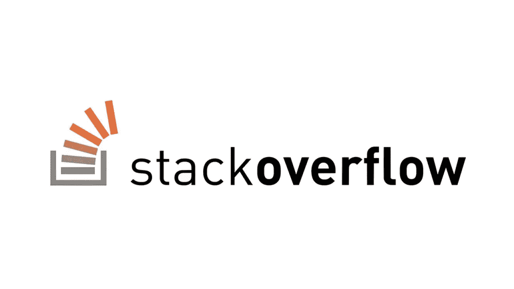
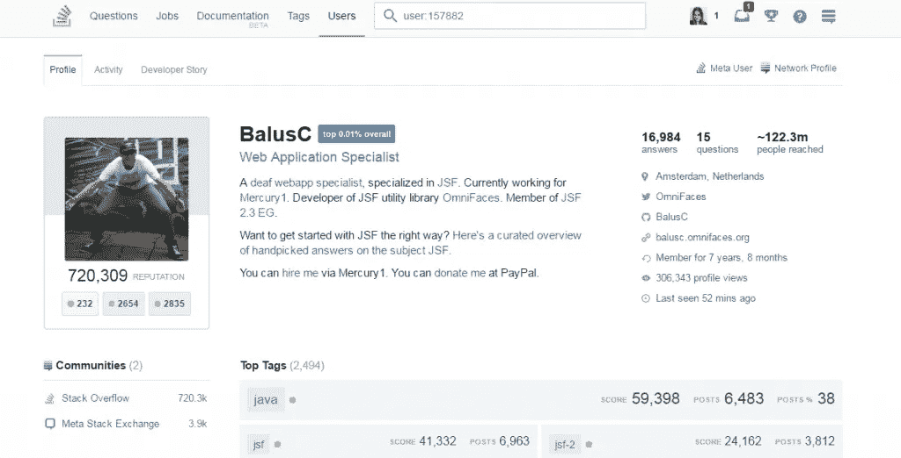

# 如何利用堆栈溢出提升你的职业生涯

> 原文：<https://blog.devgenius.io/how-to-boost-your-career-with-stack-overflow-807bc630d697?source=collection_archive---------45----------------------->

如果您曾经尝试过编程，那么您使用堆栈溢出的机会非常高。Stack Overflow 是几乎每个开发人员都在使用的网站，用来修复 bug 或找到他们无法修复的问题的解决方案。但是大多数使用堆栈溢出的人低估了 User-Stats 找到新工作的能力。你在网站上做的每一件有帮助的事情(给出问题的解决方案和帮助他人修复错误)都会得到重复积分。这些点看起来真的无关紧要，但如果你正在寻找一份新工作，它们可能是你得到这份工作的原因，而不是其他任何竞争对手。但是为什么呢？堆栈溢出的统计有助于公司了解你对你的主题了解多少。如果你有选择，如果你宁愿为 A 公司工作，除了公司告诉你的事情，你对它一无所知，或者你有一个 B 公司，你有很多证据表明这家公司很棒，有很多好的修改。你选择 B 公司的可能性很大，栈溢出和你也是一样。Stack Overflow 不是只告诉公司你过去做了什么，为什么你是这份工作的好候选人，而是可以为你说话。如果代理看到你有很多分，看到你的大部分回答都很优秀，就能帮你得到这份工作。

一个非常好的简介的例子

那么复读点系统是怎么运作的呢？

当
问题被投票通过:+10
答案被投票通过:+10
答案被标记为“已接受”:+15 (+2 给接受者)
建议的编辑被接受:+2(每个用户总计+1000)

因此，要获得分数，你只需要帮助他人或提出好的问题。而且不要因为自己不够优秀就觉得自己不行。如果你会编程，你就能帮助别人。有很多类似这样的问题:“我如何得到一个列表的最后一个元素”，“IndexOutOfBounds 是什么意思？”我很确定你知道答案。为了得到分数，只要尽可能回答好就行了。有时，打开编译器并键入 10 行代码会有所帮助。如果你想得到一份工作，想展示一些东西，我强烈推荐你每天花 30 到 60 分钟去上一次 Stack Overflow，试着找到你能回答的问题。即使你只知道一半答案，也要打出来。这对这些人很有帮助，你也能得到积分。这并不需要太多的工作，它可以帮助你学习更多的语言，并且你有机会增加获得你梦想的下一份工作的机会。