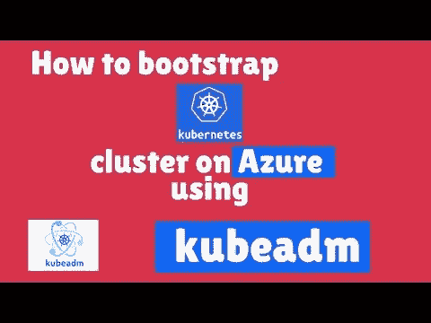

# 如何使用 Kubeadm 在 Azure 上引导多节点 Kubernetes 集群

> 原文：<https://blog.devgenius.io/how-to-bootstrap-multi-node-kubernetes-cluster-on-azure-using-kubeadm-211726acaf3a?source=collection_archive---------11----------------------->

# 背景

在之前的[帖子](https://www.handsonarchitect.com/2021/12/how-to-prepare-for-cka-certification.html)中，我分享了我准备和通过**认证 Kubernetes 管理员(CKA)** 的经历。目前，我正在准备**认证的 Kubernetes 应用开发者(CKAD)** 。为了准备这个认证，我需要一个可以练习的 Kubernetes 集群。我决定使用 Kubeadm 在 Microsoft Azure 上创建一个 3 节点 Kubernetes 集群。这篇文章是在 Azure 上用 1.22 版本创建 Kubernetes 集群的一步一步的过程。

# 使用 kubeadm 在 Azure 上引导 k8s 集群

在撰写本文时， [CKAD 认证](https://www.cncf.io/certification/ckad/)基于 Kubernetes 的 [1.22 版本。Kubernetes](https://github.com/cncf/curriculum/blob/master/CKAD_Curriculum_v1.22.pdf) 最新稳定[版本为 **1.23** 。因此，我需要一种方法来为集群提供 Kubernetes 的早期版本，而不是最新版本。这就是为什么我决定在微软 Azure 上提供 Ubuntu 虚拟机，并用 1.22 版本引导 Kubernetes 集群。](https://kubernetes.io/releases/)

以下是在 Azure 上设置全新集群所需的高级步骤:

*   调配 3 个 Ubuntu 虚拟机
*   在每个节点上设置 Docker、kubeadm、kubectl 和 Kubelet
*   在主节点上安装控制平面组件
*   设置 pod 网络
*   将工作节点加入集群

# 在 Azure 上配置 Ubuntu 虚拟机

有多种方式可以使用门户、Azure CLI、ARM 模板等在 Azure 上配置虚拟机。我更喜欢使用 Azure CLI 命令来配置虚拟机。多年来，我使用了一些 Powershell 脚本来提供 Azure 资源。在这种情况下，我创建了一个小的 Powershell 脚本，为 Azure 上的 3 个 Ubuntu 虚拟机提供公共 IP。你可以在 [Github 库](https://github.com/NileshGule/ckad-exam-prep)中找到[脚本](https://github.com/NileshGule/ckad-exam-prep/blob/main/cluster-setup/k8s-azure.ps1)。还有一个附带的 [markdown](https://github.com/NileshGule/ckad-exam-prep/blob/main/cluster-setup/cluster-setup.md) 文件，该文件介绍了设置集群的不同步骤。脚本是参数化的，在执行脚本时可以覆盖以下参数

*   订阅名称
*   资源组名称
*   资源组位置

# 在每个节点上设置 Docker、kubeadm、kubectl 和 Kubelet

一旦配置了虚拟机，我们就需要在每个节点上设置 Docker、Kubeadm、Kubectl 和 Kubelet。使用 VM 配置期间提供的 RSA 密钥，我通过 ssh 进入每个节点并设置这些先决条件。下面是一个如何登录到主节点的示例

**ssh -i ~/。ssh/id_rsa** [**【邮件保护】**](https://www.handsonarchitect.com/cdn-cgi/l/email-protection)

您可以替换 worker-1 和 worker-2 的主机名，以分别登录到这些虚拟机。

安装 Docker 并启用守护进程，这样，如果虚拟机重新启动，Docker 就会重新启动。

**sudo 安装 docker . io-y**sudo 系统 ctl 启用 docker

kubeadm、kubectl 和 kubelet 的当前版本是 1.23，但我们需要 1.22。我们在安装命令中指定版本，如下所示

**sudo apt install kube ADM = 1 . 22 . 0–00 kube CTL = 1 . 22 . 0–00 kube let = 1 . 22 . 0–00-y**

安装了这些先决条件之后，我们就可以安装 Kubernetes 集群了。

# 在主节点上安装控制平面组件

在使用 Kubeadm init 命令初始化控制平面组件之前，我们需要对 Docker 和 Kubelet 设置进行一些修改。这是为了将 systemd 设置为组驱动程序。这个设置必须与容器运行时和 kubelet 相匹配。更多详情请参考 [Kubernetes 文档](https://kubernetes.io/docs/setup/production-environment/tools/kubeadm/install-kubeadm/)。

我们覆盖 Docker 守护进程的配置，如下所示

**cat<<EOF | sudo tee/etc/docker/daemon . JSON**{****" exec-opts ":[" native . cgroupdriver = systemd "]，****" log-driver ":" JSON-file "，****" log-opts ":{****" max-size ":" 100m "****}，****

这需要在所有节点上完成。在主节点上，我们还覆盖了 Kubelet 的配置。你可以在 repo 中找到 [kubeadm config yaml 文件](https://github.com/NileshGule/ckad-exam-prep/blob/main/cluster-setup/kubeadm-config.yaml)。我们将该文件作为被覆盖的配置与 kubeadm init 命令一起使用，如下所示

**sudo kube ADM init—config kube ADM-config . YAML**

通过这些覆盖，我们应该已经配置了主节点。

# 设置 pod 网络

Kubernetes 默认没有内置 pod 网络。我们需要建立自己的基于容器网络接口(CNI)的 pod 网络，以便 pod 可以相互通信。在此步骤完成之前，CoreDNS 不会启动。我们将使用来自 Weaveworks 的 [weavenet](https://www.weave.works/oss/net/) 。

【"https://cloud.weave.works/k8s/net】ku bectl apply-f？k8s-version = $(kubectl version | base64 | tr-d ' \ n ')"

在应用上述清单文件后，确保主节点处于就绪状态。

# 将工作节点加入集群

在 worker 节点上安装 Docker、Kubeadm、Kubectl 和 Kubelet 的步骤完全相同。不同之处在于 Kubelet 配置覆盖。我们不需要在 worker 节点上这样做。然而，我们仍然需要覆盖 Docker 守护进程的配置。

最后一步是将工作节点加入集群。当控制平面在主节点上准备就绪时，join 命令将与复制 Kubeconfig 文件的步骤一起输出。在每个节点上运行 join 命令，并验证所有 3 个节点都显示为就绪状态。

请注意，在您的环境中，IP、令牌和 ca-cert 哈希的值会有所不同。

# Youtube 视频

Youtube 视频演示了上面提到的所有步骤，以及其他细节，如设置 bash 概要文件和用测试部署测试集群。观看视频，了解它的实际应用。

# 结论

Kubernetes 1.22 版本需要对 Docker 和 Kubelet 配置进行一些覆盖，以便使用 Kubeadm 进行引导。一旦准备好基于 Ubuntu 的虚拟机，这里演示的步骤可以在其他云提供商上使用，以建立类似的集群。希望这有助于您了解更多关于 Kubernetes 的信息。

直到下一次，激情编码，精益求精。

*原载于 2021 年 12 月 15 日*[*https://www.handsonarchitect.com*](https://www.handsonarchitect.com/2021/12/how-to-bootstrap-multi-node-kubernetes.html)*。*