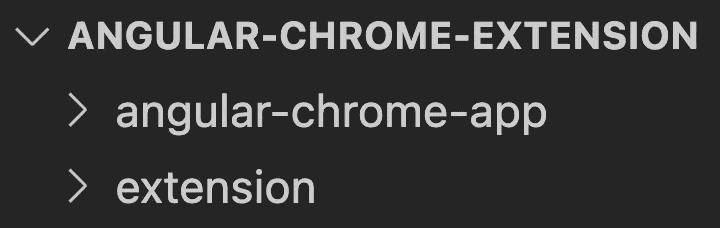
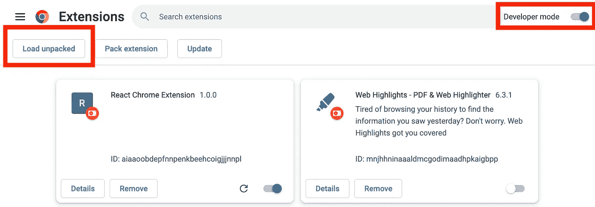
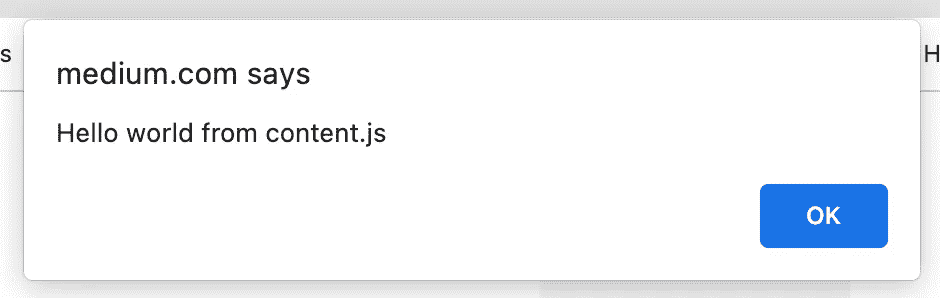
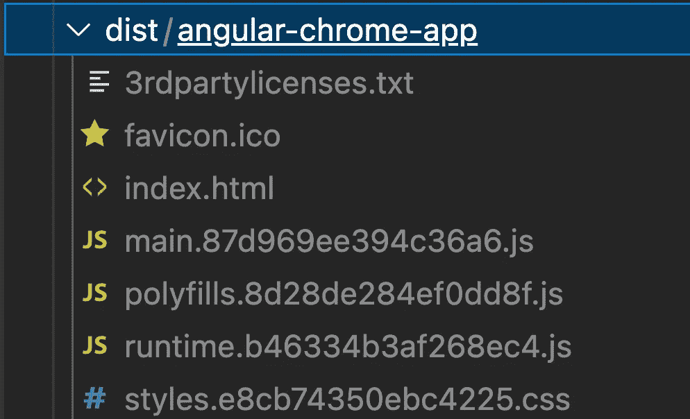
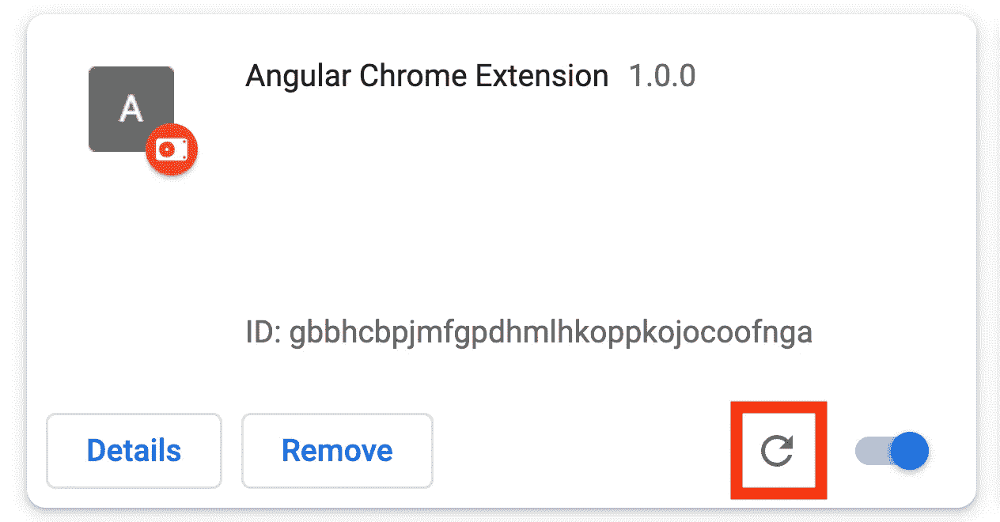
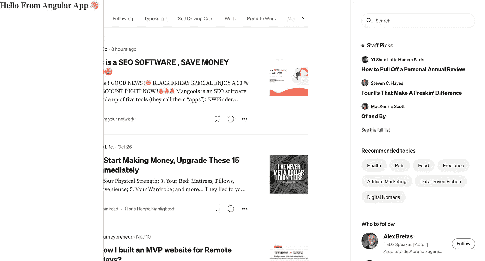

# 如何使用 Angular 构建 Chrome 扩展

> 原文：<https://blog.devgenius.io/how-to-build-a-chrome-extension-using-angular-d6b15578324e?source=collection_archive---------9----------------------->

## 了解如何创建 Chrome 扩展，以及如何使用 Angular 构建应用程序的前端部分。

背景照片由 [Markus Spiske](https://unsplash.com/@markusspiske?utm_source=unsplash&utm_medium=referral&utm_content=creditCopyText) 在 [Unsplash](https://unsplash.com/s/photos/shaking-hands?utm_source=unsplash&utm_medium=referral&utm_content=creditCopyText) 上拍摄

创建自己的 Chrome 扩展比许多人想象的要容易。而且很有意思。我们可以尽情发挥我们的创造力，随心所欲地修改每个网站。

在这篇文章中，我将向你展示如何设置一个 Chrome 扩展。之后，我们将建立一个 Angular 应用程序，并将其加载到任何网站上。

 [## 如何使用 React 构建 Chrome 扩展

### 了解如何创建一个通用的 Chrome 扩展，以及如何使用 React 构建应用程序的前端部分

web-highlights.com](https://web-highlights.com/blog/how-to-build-a-chrome-extension-using-react/) 

# 设置

在我们开始之前，让我们在我们的存储库中创建两个子文件夹: ***扩展*** 和***angular-chrome-app***。 ***扩展*** 文件夹会包含我们的 chrome 扩展文件，我们会在***Angular-chrome-app***目录下创建一个 Angular app。

结构应该是这样的:

存储库文件夹结构

# Chrome 扩展设置

让我们开始设置我们的 Chrome 扩展。首先，我们需要创建一个`manifest.json`文件。我们将在我们的 ***扩展名*** 子文件夹中创建该文件。

清单是我们的扩展的入口点，它定义了元数据，比如名称和版本，以及其他功能。

## 创建 manifest.json

让我们创建一个`manifest.json`并添加一些元数据:

manifest.json

前三个值`name`、`version`和`manifest_version`足以创建我们的第一个 chrome 扩展。

## 安装延伸部分

打开你的 Chrome 浏览器，导航到 **chrome://extensions** 。

点击**开发者模式**旁边的拨动开关启用开发者模式。点击**Load unpacked**按钮，选择包含本方`manifest.json`的本方回购 ***扩展名*** 目录。

加载未打包的 Chrome 扩展

恭喜你！你刚刚创建了一个 Chrome 扩展！

# 设置角度应用

现在，让我们在存储库的子文件夹中设置我们的 Angular 应用程序。

我们可以通过运行以下命令来实现:

`npx -p @angular/cli ng new angular-chrome-app`

或者只是(如果您安装了 Angular CLI):

`ng new angular-chrome-app`

现在，让我们删除`app.component.html`文件中所有不必要的东西。对于本文，让我们将一个简单的*“来自 Angular App 的你好”*标题放到我们的组件中:

因为我们想在 Chrome 扩展中包含 Angular 应用程序，所以我们需要配置 Angular 如何设置我们的应用程序。为此，我们需要更改`main.ts`文件:

要在任何网站上使用我们的应用程序，我们不能再假设通常由我们的`index.html`文件提供的`<app-root>`元素存在。这就是为什么我们将在呈现应用程序之前以编程方式创建自己的根元素。

我们检查 DOM 中是否存在现有的`<app-root>`元素。如果没有，我们将创建一个新的并将其附加到文档正文中。

最后，让我们在`styles.scss`文件中创建一些全局样式，将我们的应用程序放在屏幕的左侧:

# 将 Angular App 纳入 Chrome 扩展

一开始，我们已经安装了我们的扩展。尽管如此，目前它什么也不做，因为我们还没有给我们的`manifest.json`增加功能。

## 创建内容脚本

要在任何网页中包含我们的 Angular 应用程序，我们需要一种方法来读取 DOM 并对其进行更改。

为此，我们将创建一个内容脚本:

> ***内容脚本*** *生活在一个孤立的世界里，允许一个内容脚本对其 JavaScript 环境进行更改，而不会与页面或其他扩展的内容脚本发生冲突。——【developer.chrome.com[T21](https://developer.chrome.com/docs/extensions/mv2/content_scripts/)*

首先，让我们创建一个带有警告的`content.js`文件，以确保我们的扩展成功加载脚本。这个文件将作为我们的内容脚本。

`content.js`脚本是我们扩展的入口点。让我们调整我们的`manifest.json`来注入我们的脚本:

为了使用我们静态声明的`content.js`脚本，我们需要在`content_scripts`字段下注册它。该字段需要定义*必需的*属性`matches`，以指定将在哪些页面上注入内容脚本。为此，您可以设置几个[匹配模式](https://developer.chrome.com/docs/extensions/mv3/content_scripts/match_patterns)。我们将使用特殊的模式`<all_urls>`来匹配任何以允许的模式开头的 URL 例如`http`或`https`。

我们还定义了可选字段`js`。在这里，我们定义要注入到匹配页面中的脚本。

让我们通过点击`chrome://extensions`上扩展的刷新按钮来更新我们的扩展。我们现在可以导航到任何页面，如果操作正确，在页面加载时应该会出现一个警告。

史上最烂的 Chrome 扩展，对吧？让我们继续，包括 Angular。

## 创建角度内容脚本

让我们通过运行`yarn build`或`npm run build`来构建我们的 Angular 应用程序。

您应该看到 react-scripts 构建脚本在***/dist/angular-chrome-app***文件夹中生成了一些 Javascript 文件:

角度构建文件夹

从生成的`index.html`中，我们可以得出哪些文件是应用程序工作所必需的:

我们可以看到加载了三个 JavaScript 文件来使我们的 Angular 应用程序工作:

*   **运行时**。[哈希]。射流研究…
*   **多填充物**。[哈希]。射流研究…
*   **主**。[哈希]。射流研究…

我们现在想做的不是从`index.html`加载主文件，而是在我们的 Chrome 扩展中作为内容脚本加载。

## 将构建文件复制到扩展中

我们现在可以复制并粘贴上面提到的所有三个文件，并将它们包含在我们的`manifest.json`中。

但是，由于文件名中的哈希值在每次构建后都会发生变化，我们应该自动完成这项工作。请注意，我们可以在这里设置 Webpack，但让我们保持简单，只复制所有需要的文件，并在每次构建后调整它们的文件名。

为此，我们在`package.json`中创建了一个新的脚本来执行这三个命令

这将把所有需要的文件复制到我们的 ***/extension*** 文件夹中，并从文件名中删除散列。另外，请注意，我们包括了我们的全局样式。

以下是我们在***/angular-chrome-app***文件夹的`package.json`中更新的脚本:

在每次构建之后，我们将构建文件复制到我们的 ***/extension*** 文件夹中，现在我们可以通过将它们添加为内容脚本来包含它们，如下所示:

现在，我们可以继续并重新加载扩展以应用我们的更改。

当导航到任何网页时，我们应该看到我们的 Angular 应用程序出现在屏幕的左侧:

Chrome 扩展中加载的 Angular 应用程序

诚然，这仍然不是一个很酷的 Chrome 扩展。但现在我们已经成功地将 Angular 应用集成到 Chrome 扩展中，你可以用 Angular 构建任何你选择的应用，在任何网页上运行。

您可以在这个 [GitHub 资源库](https://github.com/MariusBongarts/angular-chrome-extension)中找到本文的代码。

# 最后的想法

创建自己的 Chrome 扩展比许多人想象的要容易得多。一旦正确设置了扩展，您就可以使用 Angular 开发任何您想要的东西。能够设计自己的 Chrome 扩展非常有趣，因为你可以尽情发挥你的创造力。

我希望你喜欢阅读这篇文章。我写的是关于辅助项目、Web 组件、Chrome 扩展、Typescript 和更多的主题。**关注** **me** 或 [**订阅**](https://medium.com/subscribe/@mariusbongarts) 通过电子邮件获取我的故事，不要错过我的下一篇文章。

我总是乐于回答问题，并乐于接受批评。欢迎随时留言或联系我！通过**[**LinkedIn**](https://www.linkedin.com/in/marius-bongarts-6b3638171/)**或 [**Twitter**](https://twitter.com/MariusBongarts) **与我联系。******

****还有，如果你还没有，可以看看我的 [**在线荧光笔 Chrome 扩展**](https://chrome.google.com/webstore/detail/web-highlights-pdf-web-hi/hldjnlbobkdkghfidgoecgmklcemanhm?hl=de) 。使用 [Web Highlights](https://web-highlights.com/) ，您可以在任何网页或 PDF 上高亮显示，创建标签并做笔记。看看吧！😊****

**** [## Web 亮点— PDF 和 Web 荧光笔

### 最佳网络荧光笔。就像你在书上做的那样，在任何网页或 PDF 上高亮显示，并做笔记。组织…

web-highlights.com](https://web-highlights.com/)**** 

****[**这里是无限制访问媒体**](https://medium.com/@mariusbongarts/membership) 上每一个内容的链接。如果你注册使用这个链接，我会赚一小笔钱，不需要你额外付费。****

**** [## 通过我的推荐链接加入 Medium-Marius bong arts

### 作为一个媒体会员，你的会员费的一部分会给你阅读的作家，你可以完全接触到每一个故事…

medium.com](https://medium.com/@mariusbongarts/membership)**** 

*****更多内容看* [***说白了就是***](https://plainenglish.io/) *。报名参加我们的* [***免费周报***](http://newsletter.plainenglish.io/) *。关注我们关于* [***推特***](https://twitter.com/inPlainEngHQ) ， [***领英***](https://www.linkedin.com/company/inplainenglish/) *，*[***YouTube***](https://www.youtube.com/channel/UCtipWUghju290NWcn8jhyAw)*，以及* [***不和***](https://discord.gg/GtDtUAvyhW) *。对增长黑客感兴趣？检查* [***电路***](https://circuit.ooo/) *。*****