# 如何用 Python 和 Dash 构建新冠肺炎仪表板并在 Heroku 上部署

> 原文：<https://blog.devgenius.io/how-to-build-a-covid-19-dashboard-in-python-and-dash-and-deploy-on-heroku-58ad0fec8cb4?source=collection_archive---------1----------------------->

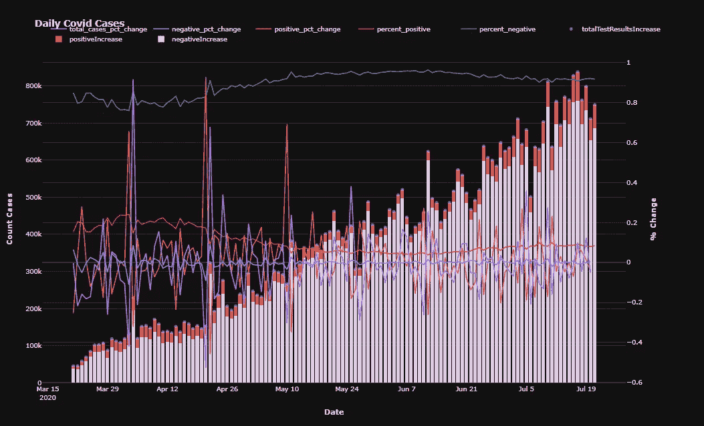

具有阳性/阴性百分比和每日百分比变化的每日 Covid 病例

# 仪表板 URL:

 [## 破折号

### 编辑描述

covid-heroku-us.herokuapp.com](http://covid-heroku-us.herokuapp.com/) 

我将以:无论如何，这都不是一个快速的应用程序开始。它不是建立在一些 wix 或按月付费的托管网站上，它完全是用 python 构建的，并通过 heroku — ***、免费的*** *进行部署。因此，如果它不能立即加载，请耐心等待，它会加载的！*

我将第一个承认——我并不以我的设计/艺术能力而闻名。我年轻的时候，喜欢画城堡，但也就画这么多了。此外，我画的也不是城堡，这一点并不明显；有人告诉我有一个看起来像谷仓。我提醒你，这是在手机时代之前。

本文将尝试描述我创建和“设计”美国新冠肺炎仪表板的方法，这种仪表板上的图表在其他地方可能找不到。作为一名数据工程师，以前也是一名数据科学家，我并不觉得高管层要求的典型图表很有趣。

# 仪表板的步骤

*   下载所需资料——jupyter、heroku cli、python 和库等。
*   找到数据源——我使用了“我们的数据世界”
*   导入库并连接到。csv 页面
*   制作图表
*   部署在 heroku——说起来容易做起来难，我知道

# 下载所需材料

我不会在这一节过多地讨论——如果您正在阅读本文，那么您可能有自己最喜欢的 IDE，您至少听说过“deploy”和“heroku”这两个词，因此可能也听说过“flask”和“dash ”,所以我不会浪费您太多时间。我们将使用 [**Python3**](https://www.python.org/) ， [**Plotly** 。 **js**](http://www.plotly.com) ， [**Dash**](https://plotly.com/dash/) ，[**Atom**](https://atom.io/)**， [**heroku**](https://id.heroku.com/login) 。要么接受，要么放弃！**

# **数据源**

**正如在仪表盘顶部的几个句子中提到的，来源来自这个链接:[https://covidtracking.com/api/v1/us/daily.csv](https://covidtracking.com/api/v1/us/daily.csv)把这个导入到你笔记本的数据框中，然后继续前进。**

*   **快速提示，我在运行这个程序时遇到了一个问题——我相信它与身份验证有关——但是之前在一个单元中运行过下面的代码，应该没问题了。**

```
#Server certificate verification by default has been
# introduced to Python recently (in 2.7.9).
# This protects against man-in-the-middle attacks,
# and it makes the client sure that the server is indeed who it 
# claims to be.
# if the first execution doesn't run, just run it again.import os, ssl
if (not os.environ.get('PYTHONHTTPSVERIFY', '') and
getattr(ssl, '_create_unverified_context', None)):
    ssl._create_default_https_context = ssl._create_unverified_context
```

# **导入这些库**

**不管`pip freeze > requirements.txt`怎么说，这个应用程序中没有使用太多的库。用于启动和运行笔记本电脑的主要库有:**

```
import dash  # (version 1.12.0) pip install dash
import dash_table
import dash_core_components as dcc
import dash_html_components as html
from dash.dependencies import Input, Output, Stateimport pandas as pd
import plotly
import numpy as np
# import seaborn as snsimport plotly.express as px
from plotly.subplots import make_subplots
import plotly.graph_objects as go
import matplotlib.pyplot as plt
import plotly.figure_factory as ffimport csv
from urllib.request import urlopen
import urllib.request
```

# **将数据拉入熊猫数据框架**

**运行上面的代码，然后运行下面的代码，你应该很好:**

```
url = "https://covidtracking.com/api/v1/us/daily.csv"df = pd.read_csv(url)
df.head()
```

# **制作图表——哎呀**

**这就是开始变得棘手的地方。这些图表都基于一个名为 plotly 的 python 库，这是我迄今为止发现的最好的数据可视化库，可能在地理位置方面不如其他库，但对于常规的旧数据可视化来说，这是很好的。它也是交互式的，并有动画选项。让我们一个接一个地检查一下——如果我不在此时此地记录它，我可能永远也不会记录它。永远不会。**

## **格式化数据**

**在制作图表之前，让我们先把所有的数据整理成正确的格式，然后把所有的栏目加进去。我已经完成了所有这些工作，所以只需运行以下代码:**

```
#make new date column
df['year'] = df.date.astype(str).str[:4]
df['month_day'] = df.date.astype(str).str[-4:]
df['day'] = df.date.astype(str).str[-2:]
df['month'] = df.month_day.astype(str).str[:2]
df['date_new'] = df['year'] + "-" + df['month'] + "-" + df['day']# df.head()df['date_new'] = df['date_new'].astype('datetime64')
df.dtypescases = df[['date_new', 'totalTestResultsIncrease', 'negativeIncrease', 'positiveIncrease', 'deathIncrease', 'hospitalizedIncrease']]
# cases.head(20).style.background_gradient(cmap='Pastel1')#create percent columns
cases['percent_positive'] = cases['positiveIncrease']/cases['totalTestResultsIncrease']
cases['percent_negative'] = cases['negativeIncrease']/cases['totalTestResultsIncrease']
cases['percent_death'] = cases['deathIncrease']/cases['totalTestResultsIncrease']
cases['percent_hospitalized'] = cases['hospitalizedIncrease']/cases['totalTestResultsIncrease']
# cases.head(20)#create percent change columns
cases['positive_pct_change'] = cases['percent_positive'].pct_change()
cases['negative_pct_change'] = cases['percent_negative'].pct_change()
cases['total_cases_pct_change'] = cases['totalTestResultsIncrease'].pct_change()
cases['death_pct_change'] = cases['percent_death'].pct_change()
cases['hospitalized_pct_change'] = cases['percent_hospitalized'].pct_change()
# cases#filter out old dates
cases = cases[cases['date_new'] > '2020-03-20']
# cases.head(20).style.background_gradient(cmap="Blues")#make variables for subplots
percent_positive = list(cases.percent_positive)
percent_negative = list(cases.percent_negative)
percent_death = list(cases.percent_death)
percent_hospitalized = list(cases.percent_hospitalized)negativeIncrease = list(cases.negativeIncrease)
positiveIncrease = list(cases.positiveIncrease)
deathIncrease = list(cases.deathIncrease)
hospitalizedIncrease = list(cases.hospitalizedIncrease)totalTestResultsIncrease = list(cases.totalTestResultsIncrease)
total_cases_pct_change = list(cases.total_cases_pct_change)
positive_pct_change = list(cases.positive_pct_change)
negative_pct_change = list(cases.negative_pct_change)
death_pct_change = list(cases.death_pct_change)
hospitalized_pct_change = list(cases.hospitalized_pct_change)
date = list(cases.date_new)#melt daily percent change columns into one dataframe
positive_pct_melt = pd.melt(cases, id_vars=['date_new'],value_vars=['positive_pct_change'])
negative_pct_melt = pd.melt(cases, id_vars=['date_new'],value_vars=['negative_pct_change'])
death_pct_melt = pd.melt(cases, id_vars=['date_new'],value_vars=['death_pct_change'])
hospitalized_pct_melt = pd.melt(cases, id_vars=['date_new'],value_vars=['hospitalized_pct_change'])
total_cases_pct_melt = pd.melt(cases, id_vars=['date_new'],value_vars=['total_cases_pct_change'])# print(positive_pct_melt.head())
# print(negative_pct_melt.head())
# print(death_pct_melt.head())
# print(hospitalized_pct_melt.head())
# print(total_cases_pct_melt.head())cases_melted1 = positive_pct_melt.append(negative_pct_melt,ignore_index=True)
cases_melted2 = cases_melted1.append(death_pct_melt,ignore_index=True)
cases_melted3 = cases_melted2.append(hospitalized_pct_melt,ignore_index=True)
cases_melted = cases_melted3.append(total_cases_pct_melt,ignore_index=True)
cases_melted.head()
cases_melted.variable.value_counts()
```

## **图 0**

**这是我们将要使用的原始数据表。别担心，我会从这本书衍生出更多的 dfs)**

```
html.Div([
        html.H2("Dataframe"),
        dash_table.DataTable(
            id='table',
            columns=[{"name": i, "id": i, "deletable": True, "selectable": True} for i in df.columns],
            data=df.to_dict('records'),
            style_cell = {
                    'font-family': 'sans-serif',
                    'font-size': '14px',
                    'text-align': 'center'
                },
            editable=True,
            filter_action="native",
            sort_action="native",
            sort_mode="multi",
            column_selectable="single",
            row_selectable="multi",
            row_deletable=True,
            selected_columns=[],
            selected_rows=[],
            page_action="native",
            page_current= 0,
            page_size= 10,
            style_table={'overflowX': 'scroll'}
            )
        ],style={'padding-left': '2%', 'padding-right': '2%'})
```

**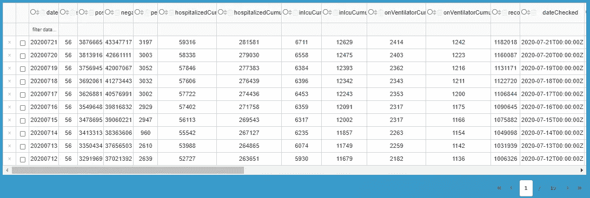**

## **图 1**

**下面的图表是一个悲伤的小图表，我从它开始，显示了美国每天累计的 covid 测试。我可能最终会将它从仪表板上删除，但它现在还在这里。是的，创建这些图表真的不需要太多代码。**

***请记住，我去掉了所有这些图中的`fig.show()`行，因为我不希望它们在部署时运行，所以如果您只是在笔记本中运行，请取消这些行的注释。**

```
fig0 = px.bar(df
             ,x="date_new"
             ,y="totalTestResults"
             ,hover_data=['totalTestResults']
             ,title="<b>Total Covid Tests (Cummulative)</b>")# Add figure title
fig0.update_layout(
    template='plotly_dark'
)
# fig0.show()
```

**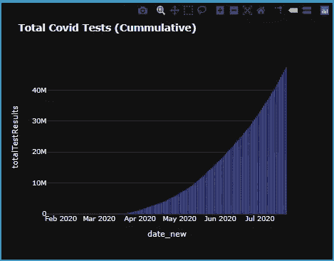**

**看看这张悲伤的小图表。我故意把它留得很小**

## **图 2**

**这里也没什么值得大书特书的，但是更有趣一点。此图表显示每日总检测数和总阳性检测数，以及阳性和阴性百分比。咩。代码如下:**

```
percent_positive = list(cases.percent_positive)
percent_negative = list(cases.percent_negative)
date = list(cases.date_new)cases_melt = pd.melt(cases, id_vars=['date_new'], value_vars=['negativeIncrease'
                                                              ,'positiveIncrease'
                                                              ,'totalTestResultsIncrease'
                                                             ]
                    )# Create fig2ure with secondary y-axis
fig1 = make_subplots(specs=[[{"secondary_y": True}]])fig1 = px.line(cases_melt, x='date_new', y='value', color='variable')# Add traces
fig1.add_trace(
    go.Scatter(x=date, y=percent_negative, name="percent_negative"),
    secondary_y=False,
)fig1.add_trace(
    go.Scatter(x=date, y=percent_positive, name="percent_positive"),
    secondary_y=False,
)# Add fig2ure title
fig1.update_layout(
    title_text="<b>Daily Covid Cases with Percent Changes</b>"
    ,template='plotly_dark'
    ,showlegend=False
)#update legend
# fig1.update_layout(
    # legend=dict(
    #     yanchor="top",
    #     y=0.99,
    #     xanchor="left",
    #     x=0.01
    #     )
    # )# Set x-axis title
fig1.update_xaxes(title_text="<b>Date</b>")# Set y-axes titles
fig1.update_yaxes(title_text="<b>Count</b>", secondary_y=False)
# fig1.show()
```

**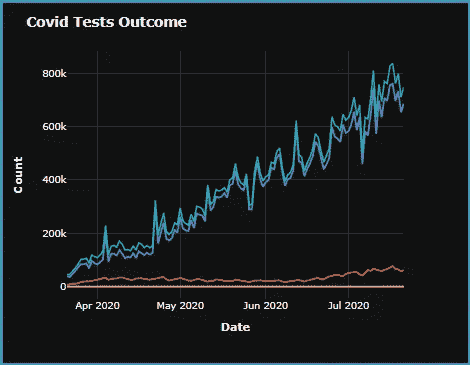**

**留下一个小的。**

## **图 3**

**现在我们在谈话。图 3 相当厚——图表中有很多东西。以至于我甚至在仪表盘上添加了代码。我将尝试解释:图 3 显示:**

*   **累积每日测试**
*   **每日阳性总数**
*   **每日正负百分比**
*   **每日正百分比变化**
*   **每日负百分比变化**
*   **每日总测试百分比变化**

```
#make variables for subplots
percent_positive = list(cases.percent_positive)
percent_negative = list(cases.percent_negative)
negativeIncrease = list(cases.negativeIncrease)
positiveIncrease = list(cases.positiveIncrease)
totalTestResultsIncrease = list(cases.totalTestResultsIncrease)
total_cases_pct_change = list(cases.total_cases_pct_change)
positive_pct_change = list(cases.positive_pct_change)
date = list(cases.date_new)# Create fig16ure with secondary y-axis
fig16 = make_subplots(specs=[[{"secondary_y": True}]])# Add traces
fig16.add_trace(
    go.Bar(x=date
           ,y=negativeIncrease
           ,name="negativeIncrease"
           ,marker_color=px.colors.qualitative.Pastel1[3]),
    secondary_y=False,
)
fig16.add_trace(
    go.Bar(x=date, y=positiveIncrease, name="positiveIncrease"),
    secondary_y=False,
)
fig16.add_trace(
    go.Scatter(x=date
               ,y=totalTestResultsIncrease
               ,opacity=.7
               ,name="totalTestResultsIncrease"
               ,mode="markers"
               ,marker_color=px.colors.qualitative.Plotly[3]),
    secondary_y=False,
)
fig16.add_trace(
    go.Scatter(x=date
               ,y=percent_negative
               ,name="percent_negative"
               ,marker_color=px.colors.qualitative.Plotly[2]),
    secondary_y=True,
)
fig16.add_trace(
    go.Scatter(x=date
               ,y=percent_positive
               ,name="percent_positive"
               ,marker_color=px.colors.qualitative.D3[3]),
    secondary_y=True,
)
fig16.add_trace(
    go.Scatter(x=date
               ,y=positive_pct_change
               ,name="positive_pct_change"
               ,marker_color=px.colors.qualitative.T10[2]),
    secondary_y=True,
)
fig16.add_trace(
    go.Scatter(x=date
               ,y=negative_pct_change
               ,name="negative_pct_change"
               ,marker_color=px.colors.qualitative.Plotly[5]),
    secondary_y=True,
)
fig16.add_trace(
    go.Scatter(x=date
               ,y=total_cases_pct_change
               ,name="total_cases_pct_change"
               ,marker_color=px.colors.qualitative.Plotly[3]),
    secondary_y=True,
)# Add fig16ure title
fig16.update_layout(
    title_text="<b>Daily Covid Cases</b>"
    ,height=800
    # ,width=1200
)# Set x-axis title
fig16.update_xaxes(title_text="<b>Date</b>")# Set y-axes titles
fig16.update_yaxes(title_text="<b>Count Cases</b>", secondary_y=False)
fig16.update_yaxes(title_text="<b>% Change</b>", secondary_y=True)# Change the bar mode
fig16.update_layout(barmode='stack')# Customize aspect
fig16.update_traces(marker_line_width=.01)#update legend
fig16.update_layout(
    template='plotly_dark'
    ,legend=dict(
    orientation="h",
    yanchor="bottom",
    y=1.02,
    xanchor="right",
    x=1
))
# fig16.show()
```

**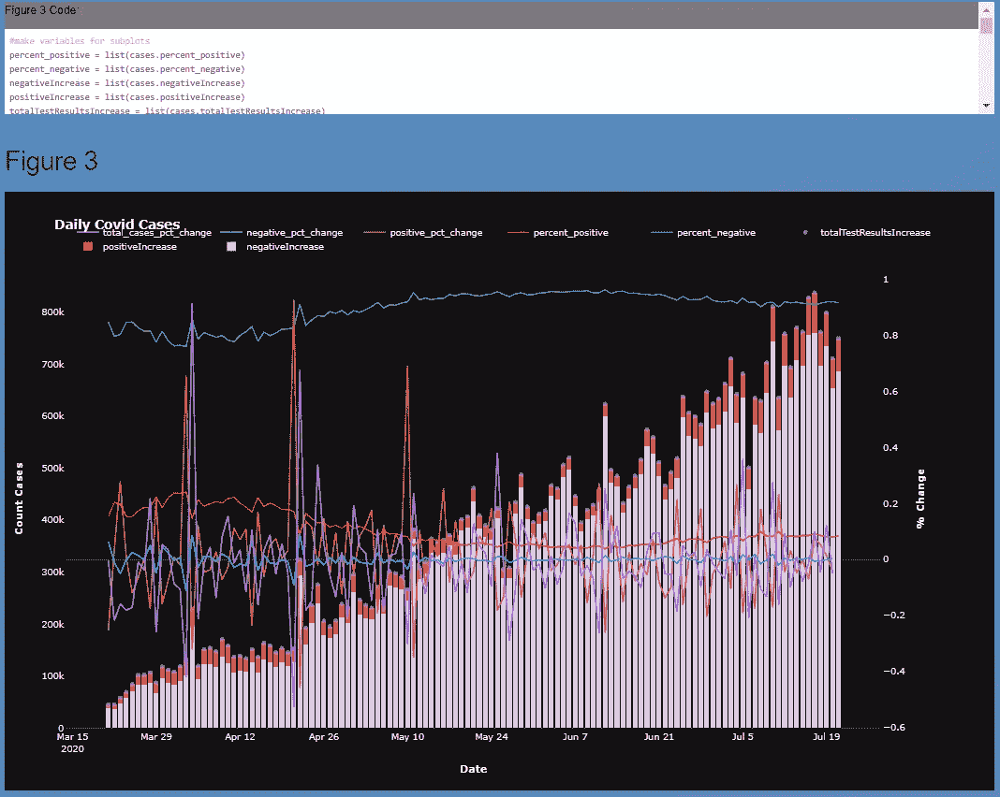**

## **图 4**

**不要介意代码中的图形名称。你想怎么称呼他们都行。我只是发现用数字方案给它们命名更容易，这与`html.Div`的数字位置无关。**

**图 4 显示了每天阳性和阴性病例的百分比。图 3 中的红线和绿线。**

```
fig2 = make_subplots(specs=[[{"secondary_y": True}]])fig2.add_trace(
    go.Scatter(x=date
               ,y=percent_negative
               ,name="percent_negative"
               ,marker_color=px.colors.qualitative.Plotly[2]),
    secondary_y=True,
)
fig2.add_trace(
    go.Scatter(x=date
               ,y=percent_positive
               ,name="percent_positive"
               ,marker_color=px.colors.qualitative.D3[3]),
    secondary_y=True,
)# Add figure title
fig2.update_layout(
    title_text="<b>Daily Pos/Neg Percent of Covid Tests</b>"
)# Set x-axis title
fig2.update_xaxes(title_text="<b>Date</b>")# Set y-axes titles
fig2.update_yaxes(title_text="<b>Percent</b>", secondary_y=True)# Change the bar mode
fig2.update_layout(barmode='stack')# Customize aspect
fig2.update_traces(marker_line_width=.01)#update legend
fig2.update_layout(
    template='plotly_dark'
    ,legend=dict(
    orientation="h",
    yanchor="bottom",
    y=1.02,
    xanchor="right",
    x=1
))
# fig2.show()
```

**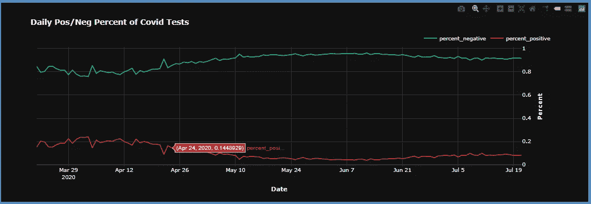**

**很公平——我们继续吧**

## **图 5**

**图 5 显示了图 3 的另一部分——每日总测试(紫色),每日总阳性和每日总阴性测试。**

```
fig3 = make_subplots(specs=[[{"secondary_y": True}]])fig3.add_trace(
    go.Bar(x=date
           ,y=negativeIncrease
           ,name="negativeIncrease"
           ,marker_color=px.colors.qualitative.Pastel1[3]),
    secondary_y=False,
)
fig3.add_trace(
    go.Bar(x=date
           ,y=positiveIncrease
           ,name="positiveIncrease"),
    secondary_y=False,
)
fig3.add_trace(
    go.Scatter(x=date
               ,y=totalTestResultsIncrease
               ,opacity=.7
               ,name="totalTestResultsIncrease"
               ,mode="markers"
               ,marker_color=px.colors.qualitative.Plotly[3]),
    secondary_y=False,
)# Add fig3ure title
fig3.update_layout(
    title_text="<b>Daily Pos/Neg and Total Tests</b>"
)# Set x-axis title
fig3.update_xaxes(title_text="<b>Date</b>")# Set y-axes titles
fig3.update_yaxes(title_text="<b>Count Cases</b>", secondary_y=False)# Change the bar mode
fig3.update_layout(barmode='stack')# Customize aspect
fig3.update_traces(marker_line_width=.01)#update legend
fig3.update_layout(
    template='plotly_dark'
    ,legend=dict(
    orientation="h",
    yanchor="bottom",
    y=1.02,
    xanchor="right",
    x=1
))
# fig3.show()
```

**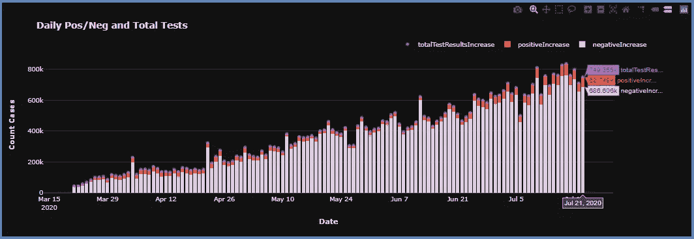**

**点击图表顶部的双线图标，显示所有悬停信息！**

## **图 6**

**图 6 显示了每日总测试、每日总阳性和每日总阴性测试的每日百分比变化。**

```
fig4 = make_subplots(specs=[[{"secondary_y": True}]])fig4.add_trace(
    go.Scatter(x=date
               ,y=positive_pct_change
               ,name="positive_pct_change"
               ,mode="lines+markers"
               ,marker_color=px.colors.qualitative.T10[2]),
    secondary_y=False,
)
fig4.add_trace(
    go.Scatter(x=date
               ,y=negative_pct_change
               ,name="negative_pct_change"
               ,mode="markers"
               ,marker_color=px.colors.qualitative.Plotly[5]),
    secondary_y=True,
)
fig4.add_trace(
    go.Scatter(x=date
               ,y=total_cases_pct_change
               ,name="total_cases_pct_change"
               ,mode="lines+markers"
               ,marker_color=px.colors.qualitative.Plotly[3]),
    secondary_y=False,
)# Add fig4ure title
fig4.update_layout(
    title_text="<b>Daily Percent Changes of Covid Positive Tests and Total Tests</b>"
)# Set x-axis title
fig4.update_xaxes(title_text="<b>Date</b>")# Set y-axes titles
fig4.update_yaxes(title_text="<b>Percent Change</b>", secondary_y=False)# Change the bar mode
fig4.update_layout(barmode='stack')# Customize aspect
fig4.update_traces(marker_line_width=.01)#update legend
fig4.update_layout(
    template='plotly_dark'
    ,legend=dict(
    orientation="h",
    yanchor="bottom",
    y=1.02,
    xanchor="right",
    x=1
))
# fig4.show()
```

**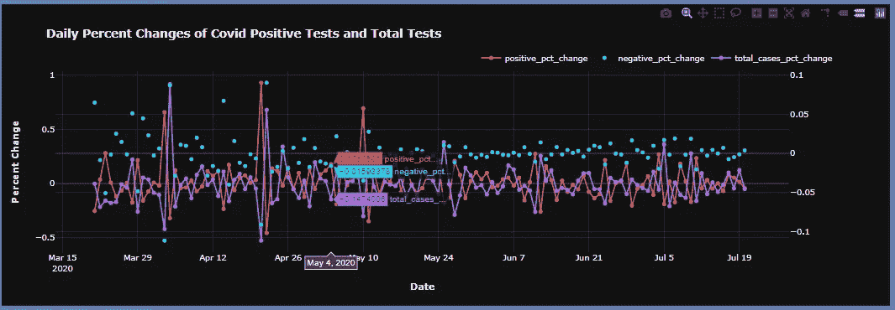**

**赢的模式=“线条+标记”或模式=“标记”或模式=“线条”**

## **图 7**

**图 7 显示了总每日测试、总阳性和阴性每日测试的对数面积图。**

```
fig5 = make_subplots(specs=[[{"secondary_y": True}]])fill_colors = ['none', 'tozeroy', 'tozerox', 'tonexty', 'tonextx', 'toself', 'tonext']#negative
fig5.add_trace(
    go.Scatter(x=date
           ,y=negativeIncrease
           ,name="negativeIncrease"
           ,line=dict(width=0.5, color='rgb(111, 231, 219)')
           ,stackgroup='one'
            ),
    secondary_y=False,
)
#positive
fig5.add_trace(
    go.Scatter(x=date
           ,y=positiveIncrease
           ,fill=fill_colors[1]
           ,mode="markers+lines"
           ,name="positiveIncrease"),
    secondary_y=False,
)
#total
fig5.add_trace(
    go.Scatter(x=date
               ,y=totalTestResultsIncrease
               ,opacity=.7
               ,name="totalTestResultsIncrease"
               ,line=dict(width=0.5, color='rgb(131, 90, 241)')
               ,stackgroup='one'),
    secondary_y=False,
)# Add fig5ure title
fig5.update_layout(
    title_text="<b>Daily Pos/Neg and Total Tests</b>"
)# Set x-axis title
fig5.update_xaxes(title_text="<b>Date</b>")# Set y-axes titles
fig5.update_yaxes(title_text="<b>Count Cases</b>", secondary_y=False)# Change the bar mode
fig5.update_layout(barmode='stack')# Customize aspect
fig5.update_traces(marker_line_width=.01)#update legend
fig5.update_layout(
    template='plotly_dark'
    ,legend=dict(
    orientation="h",
    yanchor="bottom",
    y=1.02,
    xanchor="right",
    x=1
))
# fig5.show()
```

**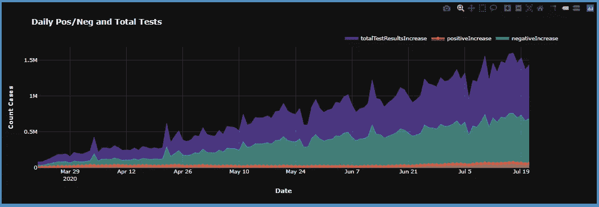**

**我喜欢面积图。这里的不透明度= 0.7**

## **图 8**

**我构建了图 8 来显示每日百分比变化的峰值。使用相同的列:每日阳性百分比变化、每日阴性百分比变化和每日总测试百分比变化。**

**这里要说的是，开始时有很大的波动，但在 5 月中旬以后，情况开始平稳下来，每天都是如此。**

```
fig6 = make_subplots(specs=[[{"secondary_y": True}]])fig6.add_trace(
    go.Scatter(x=date
               ,y=positive_pct_change
               ,name="positive_pct_change"
               ,marker_color=px.colors.qualitative.T10[2]
               ,yaxis="y1")
#     secondary_y=False,
)
fig6.add_trace(
    go.Scatter(x=date
               ,y=negative_pct_change
               ,name="negative_pct_change"
               ,marker_color=px.colors.qualitative.T10[4]
               ,yaxis="y2")
#     secondary_y=False,
)
fig6.add_trace(
    go.Scatter(x=date
               ,y=total_cases_pct_change
               ,name="total_cases_pct_change"
               ,marker_color=px.colors.qualitative.Plotly[3]
               ,yaxis="y3")
#     secondary_y=False,
)# Create axis objects
fig6.update_layout(
#     xaxis=date,
    yaxis1=dict(
        title="positive_pct_change",
        titlefont=dict(
            color="#663399"
        ),
        tickfont=dict(
            color="#663399"
        )
    ),
    yaxis2=dict(
        title="negative_pct_change",
        titlefont=dict(
            color="#006600"
        ),
        tickfont=dict(
            color="#006600"
        ),
        anchor="free",
        overlaying="y",
        side="right",
        position=1
    ),
    yaxis3=dict(
        title="total_cases_pct_change",
        titlefont=dict(
            color="#d62728"
        ),
        tickfont=dict(
            color="#d62728"
        ),
        anchor="x",
        overlaying="y",
        side="right"
    )
)# Add fig6ure title
fig6.update_layout(
    title_text="<b>Daily Percent Changes of Covid Pos/Neg Tests and Total Tests</b>"
)# Set x-axis title
fig6.update_xaxes(title_text="<b>Date</b>")# Set y-axes titles
fig6.update_yaxes(title_text="<b>Percent Change</b>", secondary_y=False)# Change the bar mode
fig6.update_layout(barmode='stack')# Customize aspect
fig6.update_traces(marker_line_width=.01)#update legend
fig6.update_layout(legend=dict(
    orientation="h",
    yanchor="bottom",
    y=1.02,
    xanchor="right",
    x=1
))fig6.update_layout(
    # width=1200
    template='plotly_dark'
)
# fig6.show()
```

**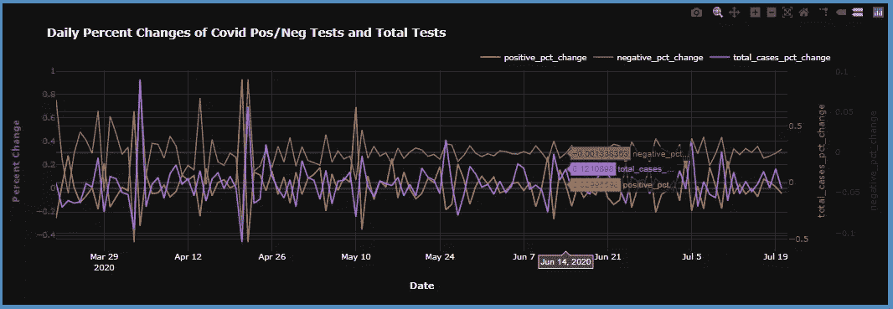**

**在我看来，这比每天的总病例数更有趣；也是三轴的胜利；我应该换颜色的…啊，好吧。**

## **图 9**

**图 9 是我加入死亡率和住院率的地方。与上图相同，死亡和住院结果的每日百分比变化。**

```
#second figure
fig7 = make_subplots(specs=[[{"secondary_y": True}]])fig7.add_trace(
    go.Scatter(x=date
               ,y=death_pct_change
               ,name="death_pct_change"
               ,marker_color=px.colors.qualitative.T10[0]),
    secondary_y=False,
)
fig7.add_trace(
    go.Scatter(x=date
               ,y=hospitalized_pct_change
               ,name="hospitalized_pct_change"
               ,marker_color=px.colors.qualitative.T10[6]),
    secondary_y=False,
)# Add figure title
fig7.update_layout(
    title_text="<b>Daily Percent Changes of Covid Death/Hospitalized</b>"
)# Set x-axis title
fig7.update_xaxes(title_text="<b>Date</b>")# Set y-axes titles
fig7.update_yaxes(title_text="<b>Percent Change</b>", secondary_y=False)
# fig7.update_yaxes(title_text="<b>% Change</b>", secondary_y=True)# Change the bar mode
fig7.update_layout(barmode='stack')# Customize aspect
fig7.update_traces(
#                   marker_color='rgb(158,202,225)'
#                   , marker_line_color='rgb(8,48,107)',
                  marker_line_width=.1)
#                   ,opacity=0.6)#update legend
fig7.update_layout(legend=dict(
    orientation="h",
    yanchor="bottom",
    y=1.02,
    xanchor="right",
    x=1,
))fig7.update_layout(
    # width=1200
    template='plotly_dark'
)
# fig7.show()
```

**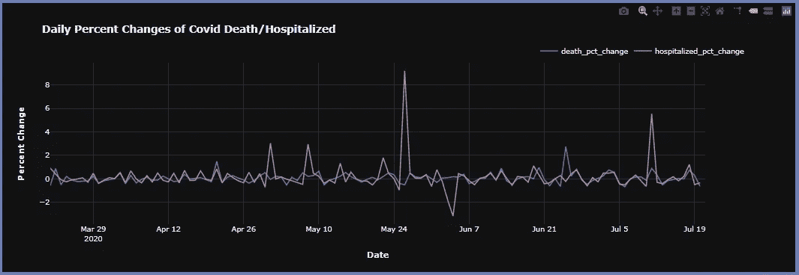**

## **图 10**

**图 10 有点忙，但是如果您想看到我刚才提到的最后几幅图中的所有行，那么您的愿望得到了满足。只是看起来我没有包括死亡。死亡率的变化如此之小，无论如何你都看不到这条线。除非我把它偏移，放在第二个 y 轴上。但这可能会让你感到害怕和困惑。所以。**

```
fig8 = px.scatter(cases
                 ,x="date_new"
                 ,y="positive_pct_change"
                 ,trendline="lowess"
                 ,color_continuous_scale=px.colors.sequential.Inferno
                )
fig8.update_layout(
    height=800
    ,template='plotly_dark')fig8.add_trace(
    go.Scatter(x=date
               ,y=negative_pct_change
               ,name="negative_pct_change"
               ,mode="lines+markers"
               ,marker_color=px.colors.qualitative.T10[1]
              )
#     secondary_y=False,
),
fig8.add_trace(
    go.Scatter(x=date
               ,y=death_pct_change
               ,name="death_pct_change"
               ,mode="lines+markers"
               ,marker_color=px.colors.qualitative.T10[2]
              )
#     secondary_y=False,
),
fig8.add_trace(
    go.Scatter(x=date
               ,y=hospitalized_pct_change
               ,name="hospitalized_pct_change"
               ,mode="lines+markers"
               ,marker_color=px.colors.qualitative.T10[3]
              )
#     secondary_y=False,
),
fig8.add_trace(
    go.Scatter(x=date
               ,y=total_cases_pct_change
               ,name="total_cases_pct_change"
               ,mode="lines+markers"
               ,marker_color=px.colors.qualitative.T10[4]
              )
#     secondary_y=False,
)
# fig8.show()
```

**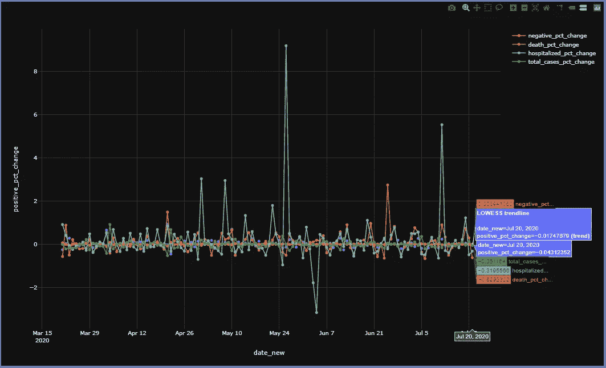**

**这么忙**

## **图 11–15**

**图 11 只是每个指标分布的热图。你可能会认为有一种方法可以让它看起来更小，确实有，但是做起来并不像你想象的那么容易——至少在情节上是这样。这些图表使用了`plotly.express`，它需要一些关于支线剧情的更新。但是他们知道这件事。有票的，放心吧。他们是好人。超级活跃在所有的社区论坛。太棒了。如果你们谁看到了，就大声喊出来！**

```
fig9 = px.scatter(cases, x="date_new", y="positive_pct_change", trendline="lowess"
                  , title="positive_pct_change"
#                   , color_continuous_scale="icefire"
                  , color="positive_pct_change", color_continuous_scale=px.colors.sequential.Inferno
                  , marginal_y="histogram", marginal_x="violin")
fig9.update_layout(
    height=400
    ,template='plotly_dark')
# fig9.show()fig10 = px.scatter(cases, x="date_new", y="negative_pct_change", color="negative_pct_change"
                  , trendline="lowess", title="negative_pct_change"
                  , color_continuous_scale=px.colors.sequential.Inferno
                  , marginal_y="histogram", marginal_x="violin")
fig10.update_layout(
    height=400
    ,template='plotly_dark')
# fig10.show()fig11 = px.scatter(cases, x="date_new", y="death_pct_change", color="death_pct_change"
                  , trendline="lowess", title="death_pct_change"
                  , color_continuous_scale=px.colors.sequential.Inferno
                  , marginal_y="histogram", marginal_x="violin")
fig11.update_layout(
    height=400
    ,template='plotly_dark')
# fig11.show()fig12 = px.scatter(cases, x="date_new", y="hospitalized_pct_change", color="hospitalized_pct_change"
                  , trendline="lowess", title="hospitalized_pct_change"
                  , color_continuous_scale=px.colors.sequential.Inferno
                  , marginal_y="histogram", marginal_x="violin")
fig12.update_layout(
    height=400
    ,template='plotly_dark')
# fig12.show()fig13 = px.scatter(cases, x="date_new", y="total_cases_pct_change", color="total_cases_pct_change"
                  , trendline="lowess", title="total_cases_pct_change"
                  , color_continuous_scale=px.colors.sequential.Inferno
                  , marginal_y="histogram", marginal_x="violin")
fig13.update_layout(
    height=400
    ,template='plotly_dark')
# fig13.show()
```

**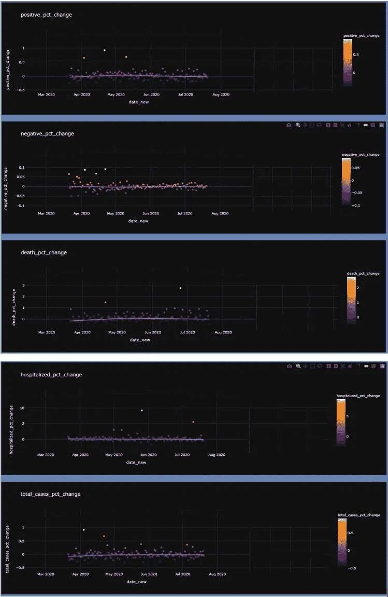**

## **图 16**

**下面是我将上面的图表放入子情节格式的尝试(使用上面的相同代码，然后运行它):**

```
#add traces
trace1 = fig9['data'][0]
trace2 = fig10['data'][0]
trace3 = fig11['data'][0]
trace4 = fig12['data'][0]
trace5 = fig13['data'][0]fig14 = make_subplots(rows=3
                    ,cols=2
                    ,shared_xaxes=False
                    ,row_heights=[9., 9., 9.]
                    ,column_widths=[.1, .1]
                    ,shared_yaxes=False
                    ,vertical_spacing=0.10
                    ,subplot_titles=['<b>positive_pct_change</b>'
                                     ,'<b>negative_pct_change</b>'
                                     ,'<b>death_pct_change</b>'
                                     ,'<b>hospitalized_pct_change</b>'
                                     ,'<b>total_cases_pct_change</b>'
                                    ]
                    ,x_title="<b>date</b>"
                    ,y_title="<b>percent_change</b>"
                   )fig14.add_trace(trace1, row=1, col=1)
fig14.add_trace(trace2, row=1, col=2)
fig14.add_trace(trace3, row=2, col=1)
fig14.add_trace(trace4, row=2, col=2)
fig14.add_trace(trace5, row=3, col=1)fig14['layout'].update(height=800
# , width=1200
        , title='<b>Covid Test Outcome Trends</b>'
        , template='plotly_dark')
# fig14.show()
```

**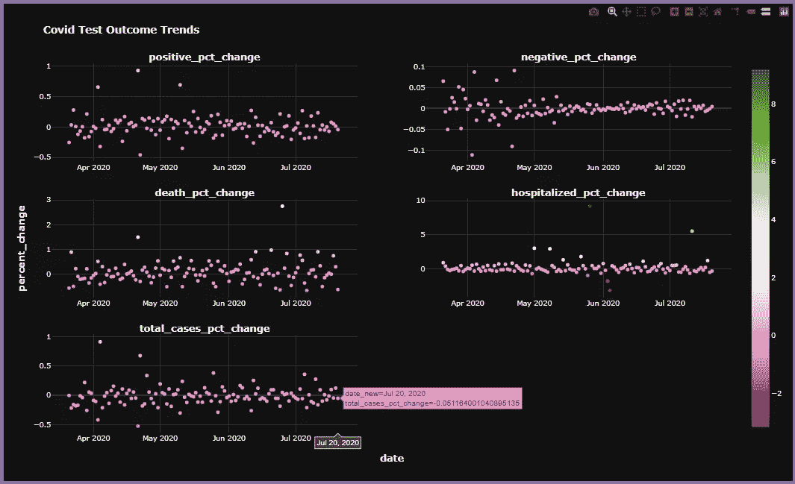**

**不错吧**

## **图 17**

**最后一次尝试用`facet-col`和`marginal-y`条把它变成易读的格式！**

```
cases_melted.variable.value_counts()
values_list = list(cases_melted.value)fig15 = px.scatter(cases_melted, x="date_new", y="value"
                 , color="variable", facet_col="variable"
                 , trendline="lowess", trendline_color_override="white"
                 , color_continuous_scale=px.colors.sequential.Inferno
                 , marginal_y="bar", marginal_x="box"
                 , labels = ['test','test','test','test','test'])fig15['layout'].update(height=800
# , width=1200
        , title='<b>Covid Test Outcome Trends</b>'
        , template='plotly_dark')
fig15.for_each_annotation(lambda a: a.update(text=a.text.split("=")[-1]))
# fig15.show()
```

**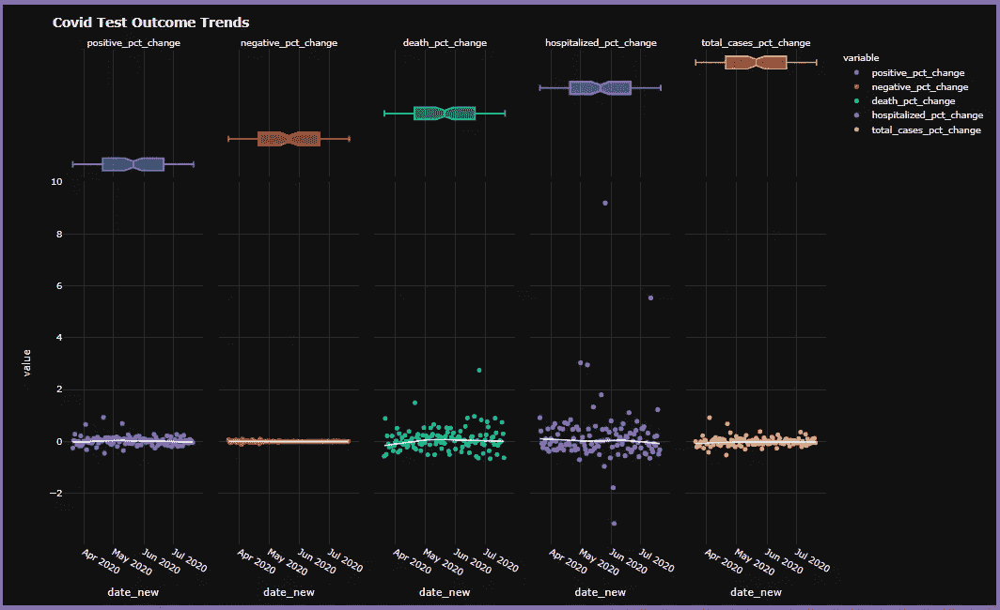**

**边缘-x 和 y 棒是病态的。**

## **格式化**

**在我们得到下几个数字之前，我们需要做一些额外的格式化。**

****步骤:****

*   **首先我们需要制作一个`day_of_week`列(这很棘手，但代码不多；可能 20 行)**
*   **接下来，我创建了一些 x 和 y 最小变量**
*   **接下来，我在`sum()`和`mean()`周围创建了一些变量，按照每个指标(积极、消极、总测试等)对星期几进行分组。)**
*   **最后，我们将这些变量放在单独的列表中，然后每天一个列表(这样我们可以对条形图进行排序**

```
#create a day of week column
s = pd.date_range(min(df.date_new),max(df.date_new), freq='D').to_series()
s = s.dt.dayofweek.tolist()
df['day_of_week'] = sdef day_of_week(df):
    if df['day_of_week'] == 0:
        return "Tuesday"
    elif df['day_of_week'] == 1:
        return "Monday"
    elif df['day_of_week'] == 2:
        return "Sunday"
    elif df['day_of_week'] == 3:
        return "Saturday"
    elif df['day_of_week'] == 4:
        return "Friday"
    elif df['day_of_week'] == 5:
        return "Thursday"
    elif df['day_of_week'] == 6:
        return "Wednesday"
    else:
        return ""df['dayofweek'] = df.apply(day_of_week, axis=1)
# df.head(30)#create min and max variables
y_min = min(df.totalTestResultsIncrease)
y_max = max(df.totalTestResultsIncrease)
# x_min = min(df.index)
# x_max = max(df.index)
x_min = min(df.month)
x_max = max(df.month)
x_range = [x_min,x_max]
y_range = [y_min,y_max]# print('y_min:',y_min)
# print('y_max:',y_max)
# print('x_min:',x_min)
# print('x_max:',x_max)
# print('x_range:',x_range)
# print('y_range:',y_range)#create total pos/neg/total variables by day
total_pos_increase_grp_day = df.groupby(['dayofweek'])['positiveIncrease'].sum()
avg_total_pos_increase_grp_day = df.groupby(['dayofweek'])['positiveIncrease'].mean()total_neg_increase_grp_day = df.groupby(['dayofweek'])['negativeIncrease'].sum()
avg_total_neg_increase_grp_day = df.groupby(['dayofweek'])['negativeIncrease'].mean()total_increase_grp_day = df.groupby(['dayofweek'])['totalTestResultsIncrease'].sum()
avg_total_increase_grp_day = df.groupby(['dayofweek'])['totalTestResultsIncrease'].mean()avg_total_per_week = avg_total_increase_grp_day/7
avg_pos_per_week = avg_total_pos_increase_grp_day/7
avg_neg_per_week = avg_total_neg_increase_grp_day/7# print('total_pos_increase_grp_day:',total_pos_increase_grp_day)
# print("")
# print('total_neg_increase_grp_day:',total_neg_increase_grp_day)
# print("")
# print('total_increase_grp_day:',total_increase_grp_day)
# print("")
# print("")
# print('avg_total_pos_increase_grp_day:',avg_total_pos_increase_grp_day)
# print("")
# print('avg_total_neg_increase_grp_day:',avg_total_neg_increase_grp_day)
# print("")
# print('avg_total_increase_grp_day:',avg_total_increase_grp_day)
# print("")
# print("")
# print('avg_pos_per_week:',avg_pos_per_week)
# print("")
# print('avg_neg_per_week:',avg_neg_per_week)
# print("")
# print('avg_total_per_week:',avg_total_per_week)#put totals in a list for labeling later on
total_totals = list(total_increase_grp_day)
pos_totals = list(total_pos_increase_grp_day)
neg_totals = list(total_neg_increase_grp_day)# print('total_totals:', total_totals)
# print('pos_totals:', pos_totals)
# print('neg_totals:', neg_totals)#make day list
x_labels = ['Monday','Tuesday','Wednesday','Thursday', 'Friday', 'Saturday', 'Sunday']
# print('x_labels:', x_labels)
```

## **图 18**

**运行上面的代码后，我们可以运行下面的代码，它显示了一周中每天的阳性测试:**

```
#plots by day
fig17 = px.bar(df
             ,x='dayofweek'
             ,y='positiveIncrease'
             ,text='positiveIncrease'
             ,color='dayofweek'
             ,height=500
             ,hover_data=['negativeIncrease', 'positiveIncrease', 'totalTestResultsIncrease']
             ,hover_name="positiveIncrease")
fig1.update_traces(texttemplate='%{text:.2s}'
                  ,textposition='top center')
fig1.update_layout(uniformtext_minsize=8
                 ,uniformtext_mode='hide'
                 ,title_text="<b>Covid Tests Outcome</b>"
                 ,template='plotly_dark'
                 ,xaxis={'categoryorder':'array', 'categoryarray':['Monday','Tuesday','Wednesday','Thursday', 'Friday', 'Saturday', 'Sunday']})# Set x-axis title
fig17.update_xaxes(title_text="<b>Date</b>")fig17.add_shape( # add a horizontal "target" line
    type="line", line_color="salmon", line_width=3, opacity=1, line_dash="dot",
    x0=0, x1=1, xref="paper", y0=avg_total_increase_grp_day, y1=avg_total_increase_grp_day, yref="y"
)fig17.add_annotation( # add a text callout with arrow
    text="Woah...!", x="Friday", y=300, arrowhead=1, showarrow=True
)total_labels = [{"x": x, "y": pos_totals*1.3, "text": str(pos_totals), "showarrow": False} for x, pos_totals in zip(x_labels, pos_totals)]fig17.update_layout(uniformtext_minsize=8
                 ,uniformtext_mode='hide'
                 # ,width=1200
                 ,title_text="<b>Total Covid Tests Grouped by Day</b>"
                 ,template='plotly_dark'
                 ,xaxis={'categoryorder':'array', 'categoryarray':['Monday','Tuesday','Wednesday','Thursday', 'Friday', 'Saturday', 'Sunday']}
                 ,annotations=total_labels)
# fig17.show()
```

**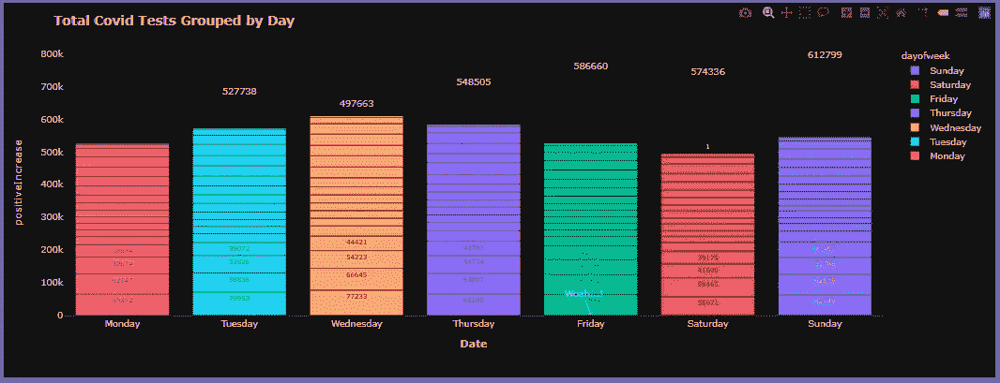**

**你不会看到 Woah。好了，现在你知道了，我正在测试它，但我放弃了，显然忘了删除它。**

## **图 19**

**与上面的图表相同，但针对每周的每一天的负面案例。**

```
fig18 = px.bar(df
             ,x='dayofweek'
             ,y='negativeIncrease'
             ,text='negativeIncrease'
             ,color='dayofweek'
             ,height=500
             ,hover_data=['negativeIncrease', 'positiveIncrease', 'totalTestResultsIncrease']
             ,hover_name="negativeIncrease")
fig18.update_traces(texttemplate='%{text:.2s}'
                  ,textposition='outside')
fig18.update_layout(uniformtext_minsize=8
                 ,uniformtext_mode='hide'
                 ,template='plotly_dark'
                 ,title_text="<b>Neagtive Covid Tests Grouped by Day</b>"
                 ,xaxis={'categoryorder':'array', 'categoryarray':['Monday','Tuesday','Wednesday','Thursday', 'Friday', 'Saturday', 'Sunday']})# Set x-axis title
fig18.update_xaxes(title_text="<b>Date</b>")fig18.add_shape( # add a horizontal "target" line
    type="line", line_color="salmon", line_width=3, opacity=1, line_dash="dot",
    x0=0, x1=1, xref="paper", y0=avg_total_increase_grp_day, y1=avg_total_increase_grp_day, yref="y"
)fig18.add_annotation( # add a text callout with arrow
    text="Woah...!", x="Friday", y=300, arrowhead=1, showarrow=True
)total_labels = [{"x": x, "y": neg_totals*1.25, "text": str(neg_totals), "showarrow": False} for x, neg_totals in zip(x_labels, neg_totals)]fig18.update_layout(uniformtext_minsize=8
                 ,uniformtext_mode='hide'
                 # ,width=1200
                 ,title_text="<b>Total Covid Tests Grouped by Day</b>"
                 ,template='plotly_dark'
                 ,xaxis={'categoryorder':'array', 'categoryarray':['Monday','Tuesday','Wednesday','Thursday', 'Friday', 'Saturday', 'Sunday']}
                 ,annotations=total_labels)
# fig18.show()
```

**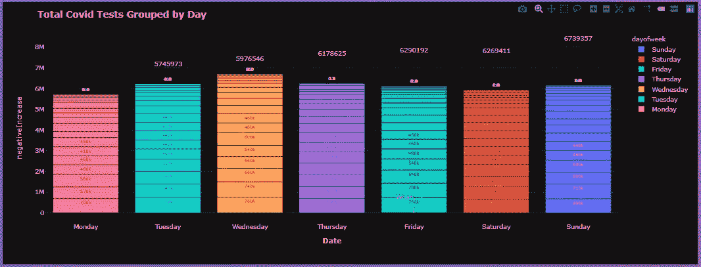**

**但我仍然不知道他为什么要把这些数字随意地放到条形图上方。我应该弄清楚**

## **图 20**

**与上述图表相同，但用于每日总测试。**

**比如，人们往往会在周三(T4)接受测试。也就是数据被插入的时候。谁知道呢。**

```
fig19 = px.bar(df
             ,x='dayofweek'
             ,y='totalTestResultsIncrease'
             ,text='totalTestResultsIncrease'
             ,color='dayofweek'
             ,height=500
             ,hover_data=['negativeIncrease', 'positiveIncrease', 'totalTestResultsIncrease']
             ,hover_name="totalTestResultsIncrease")
fig19.update_traces(texttemplate='%{text:.2s}'
                  ,textposition='outside')# Set x-axis title
fig19.update_xaxes(title_text="<b>Date</b>")fig19.add_shape( # add a horizontal "target" line
    type="line", line_color="salmon", line_width=3, opacity=1, line_dash="dot",
    x0=0, x1=1, xref="paper", y0=avg_total_increase_grp_day, y1=avg_total_increase_grp_day, yref="y"
)fig19.add_annotation( # add a text callout with arrow
    text="Woah...!", x="Friday", y=300, arrowhead=1, showarrow=True
)total_labels = [{"x": x, "y": total_totals*.95, "text": str(total_totals), "showarrow": True} for x, total_totals in zip(x_labels, total_totals)]fig19.update_layout(uniformtext_minsize=8
                 ,uniformtext_mode='hide'
                 ,title_text="<b>Total Covid Tests Grouped by Day</b>"
                 ,template='plotly_dark'
                 # ,width=1200
                 ,xaxis={'categoryorder':'array', 'categoryarray':['Monday','Tuesday','Wednesday','Thursday', 'Friday', 'Saturday', 'Sunday']}
                 ,annotations=total_labels)
# fig19.show()
```

**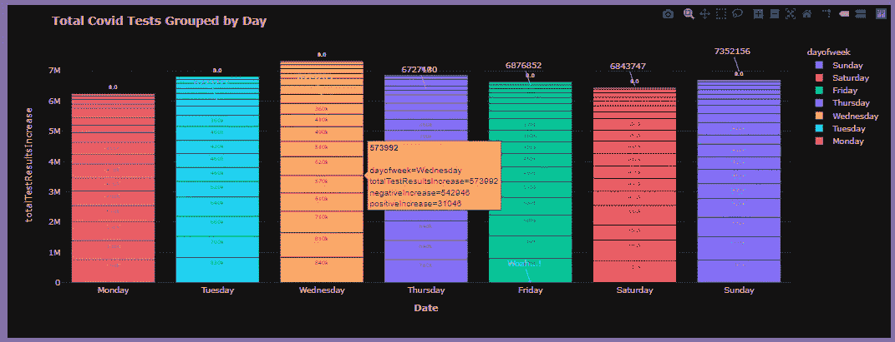**

## **图 21**

**与上面的图表相同，但针对的是每周的每一天的死亡人数。我花了很长时间来仔细考虑将这些放在一个图像中，并告诉大家自己更改每个代码段中的几个变量。我想我今天表现不错。**

```
#deaths
fig20 = px.bar(df
             ,x='dayofweek'
             ,y='deathIncrease'
             ,text='deathIncrease'
             ,color='dayofweek'
             ,height=500
             ,hover_data=['negativeIncrease', 'positiveIncrease', 'totalTestResultsIncrease','deathIncrease']
             ,hover_name="deathIncrease")
fig20.update_traces(texttemplate='%{text:.2s}'
                  ,textposition='outside')
fig20.update_layout(uniformtext_minsize=8
                 ,uniformtext_mode='hide'
                 # ,width=1200
                 ,title_text="<b>Death Covid Tests Grouped by Day</b>"
                 ,template='plotly_dark'
                 ,xaxis={'categoryorder':'array', 'categoryarray':['Monday','Tuesday','Wednesday','Thursday', 'Friday', 'Saturday', 'Sunday']})# Set x-axis title
fig20.update_xaxes(title_text="<b>Date</b>")fig20.add_shape( # add a horizontal "target" line
    type="line", line_color="salmon", line_width=3, opacity=1, line_dash="dot",
    x0=0, x1=1, xref="paper", y0=avg_total_increase_grp_day, y1=avg_total_increase_grp_day, yref="y"
)fig20.update_layout(uniformtext_minsize=8
                 ,uniformtext_mode='hide'
                 # ,width=1200
                 ,title_text="<b>Total Covid Deaths Grouped by Day</b>"
                 ,template='plotly_dark'
                 ,xaxis={'categoryorder':'array', 'categoryarray':['Monday','Tuesday','Wednesday','Thursday', 'Friday', 'Saturday', 'Sunday']})
#                  ,annotations=total_labels)
# fig20.show()
```

**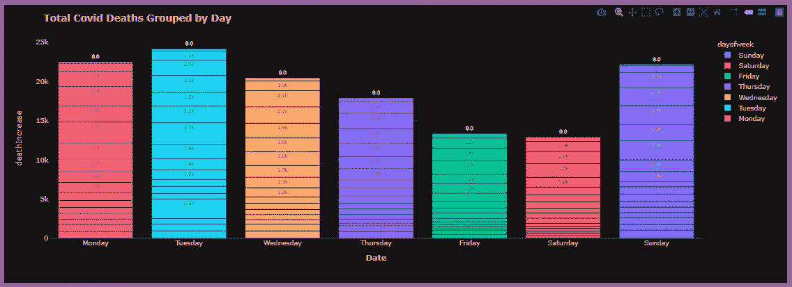**

## **图 22**

**与上述图表相同，但住院天数为周数。**

```
fig21 = px.bar(df
             ,x='dayofweek'
             ,y='hospitalizedIncrease'
             ,text='hospitalizedIncrease'
             ,color='dayofweek'
             ,height=500
             ,hover_data=['negativeIncrease', 'positiveIncrease', 'totalTestResultsIncrease','deathIncrease','hospitalizedIncrease']
             ,hover_name="hospitalizedIncrease")
fig21.update_traces(texttemplate='%{text:.2s}'
                  ,textposition='outside')
fig21.update_layout(uniformtext_minsize=8
                 ,uniformtext_mode='hide'
                 ,title_text="<b>Hospitalized Covid Tests Grouped by Day</b>"
                 ,template='plotly_dark'
                 # ,width=1200
                 ,xaxis={'categoryorder':'array', 'categoryarray':['Monday','Tuesday','Wednesday','Thursday', 'Friday', 'Saturday', 'Sunday']})# Set x-axis title
fig21.update_xaxes(title_text="<b>Date</b>")fig21.add_shape( # add a horizontal "target" line
    type="line", line_color="salmon", line_width=3, opacity=1, line_dash="dot",
    x0=0, x1=1, xref="paper", y0=avg_total_increase_grp_day, y1=avg_total_increase_grp_day, yref="y"
)fig21.update_layout(uniformtext_minsize=8
                 ,uniformtext_mode='hide'
                 ,title_text="<b>Total Hospitalized Covid Deaths Grouped by Day</b>"
                 ,template='plotly_dark'
                 ,xaxis={'categoryorder':'array', 'categoryarray':['Monday','Tuesday','Wednesday','Thursday', 'Friday', 'Saturday', 'Sunday']})
# fig21.show()
```

**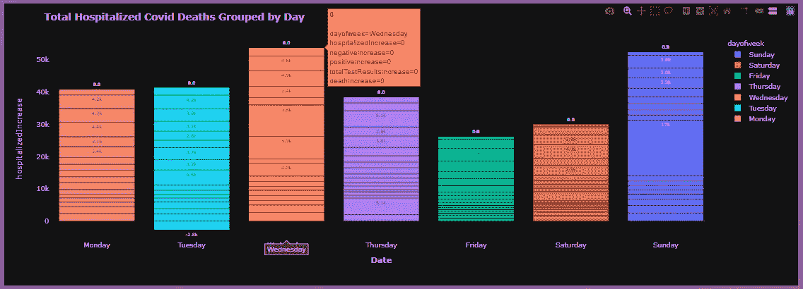**

**现在一切终于尘埃落定，让我们继续前进吧。**

## **图 23**

**让我们来看看我们是否能把最后 5 张图表合二为一。要做到这一点，我们需要创建一种映射数据框架，以便将这些指标堆叠/融合到一个名为`variable`的列中，然后我们可以执行`facet-col`操作，将所有指标放在一个图表中。太棒了。感谢`pd.melt()`**

**换句话说，此图表显示一周中的哪一天各项指标(pos、neg、死亡、住院和每日总病例数)都出现峰值。**

```
#map day of week column to cases_melted dataframe
mapping = df[['date_new', 'dayofweek']]
# mapping
cases_melted = pd.merge(cases_melted, mapping, how='left', on=['date_new', 'date_new'])
# print(cases_melted)
# print(df.dayofweek)fig22 = px.scatter(cases_melted, x="date_new", y="value"
                 , color="variable", facet_row="variable", facet_col="dayofweek"
                 , trendline="lowess", trendline_color_override="white"
                 , color_continuous_scale=px.colors.sequential.Inferno
                 , marginal_y="bar", marginal_x="box")fig22['layout'].update(height=1000
                # , width=1200
                , title='<b>Covid Test Outcome Trends</b>'
                , template='plotly_dark')
fig22.for_each_annotation(lambda a: a.update(text=a.text.split("=")[-1]))
# fig22.show()
```

**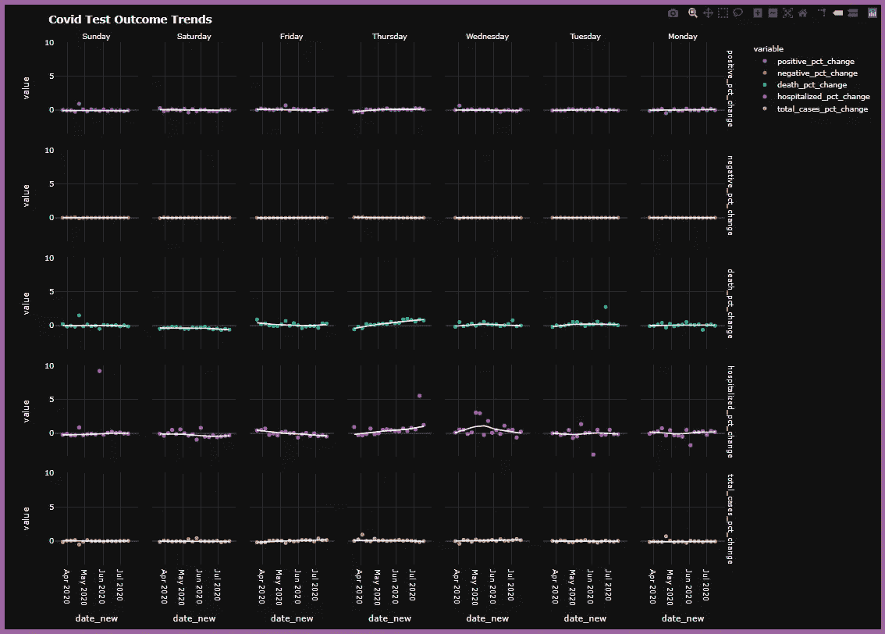**

**我要那个。**

## **图 24**

**与上面的图表相同，但带有条形图。**

**要点:周三和周四的住院率波动很大**

```
fig23 = px.bar(cases_melted, x="date_new", y="value"
                 , color="variable", facet_row="variable", facet_col="dayofweek"
                 , color_continuous_scale=px.colors.sequential.Inferno)fig23['layout'].update(height=1000
                # , width=1200
                , title='<b>Covid Test Outcome Trends</b>'
                , template='plotly_dark')
fig23.for_each_annotation(lambda a: a.update(text=a.text.split("=")[-1]))
# fig23.show()
```

**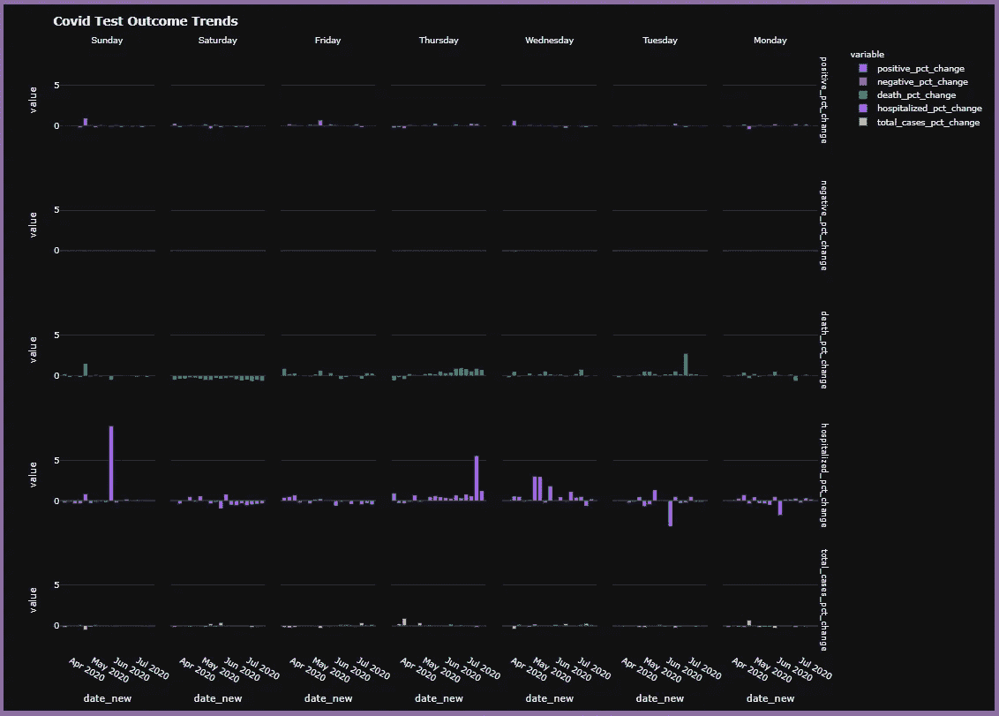**

## **图 25**

**图 25 显示了所有每日百分比变化的总和。有点奇怪，但分析让你质疑一切。**

***在这段代码的开头，我在合并之后删除了一些列。**

```
# cases_melted = cases_melted.drop(['dayofweek_x', 'dayofweek_y'], axis=1)
# cases_melted.style.background_gradient(cmap='Blues')cases_melted['rank_value'] = cases_melted['value'].rank(method="max")
# print(cases_melted.head(30).sort_values(by='rank_value'))
# print(cases_melted.tail(30).sort_values(by='rank_value'))#sum percent changes by day
#sundays have the highest positive percent changes
#tuesdays have the highest negative percent changes
cases_day = cases_melted[['dayofweek','value']]
cases_day = cases_day.groupby('dayofweek').sum().reset_index()
# cases_day.head(10).style.background_gradient(cmap='inferno')fig24 = px.bar(cases_day, x="dayofweek", y="value"
                 , color="dayofweek"
                 , text="value"
                 , color_continuous_scale=px.colors.sequential.Inferno
                 , template="plotly_dark")fig24['layout'].update(height=800
                     # , width=1200
                     , title='<b>Sum of Covid Test Daily Perent Changes per Day Of Week</b>'
                     , template='plotly_dark'
                     , yaxis_title="Sum of % Change"
                     , xaxis_title="Day of Week"
                     , legend_title="Day of Week"
                     , xaxis={'categoryorder':'array', 'categoryarray':['Monday','Tuesday','Wednesday','Thursday', 'Friday', 'Saturday', 'Sunday']}
                    )
# fig24.show()
```

**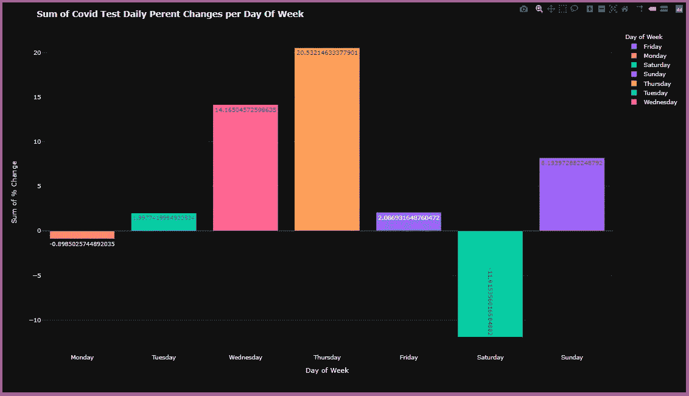**

## **图 26**

**图 26 显示了每个指标的每日百分比变化总和。很高兴在一个图表中看到每个指标的峰值。**

```
fig25 = px.bar(cases_melted, x="date_new", y="value"
                 , color="variable"
                 , color_continuous_scale=px.colors.sequential.Inferno)fig25['layout'].update(height=500
                     # , width=1200
                     , title='<b>Sum of Covid Test Daily Percent Changes by Outcome</b>'
                     , yaxis_title="Sum of Daily % Changes"
                     , xaxis_title="Date"
                     , legend_title="Sum of Daily % Changes"
                     , template='plotly_dark')
fig25.for_each_annotation(lambda a: a.update(text=a.text.split("=")[-1]))
# fig25.show()
```

**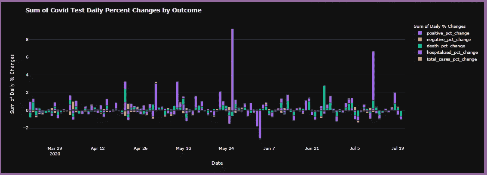**

**为获胜而堆叠的酒吧**

## **图 27**

**与图 26 类似，图 27 显示了每天百分比变化的总和。简单的方式来看看哪些天穗更频繁。**

****带走**:周六通常有百分比变化的负数和。**

```
fig26 = px.bar(cases_melted, x="date_new", y="value"
                 , color="dayofweek"
                 , color_continuous_scale=px.colors.sequential.Inferno)fig26['layout'].update(height=500
                     # , width=1200
                     , title='<b>Sum of Covid Test Daily Percent Changes by Outcome</b>'
                     , yaxis_title="Sum of Daily % Changes"
                     , xaxis_title="Date"
                     , legend_title="Day of Week"
                     , template='plotly_dark')
fig26.for_each_annotation(lambda a: a.update(text=a.text.split("=")[-1]))
# fig26.show()
```

**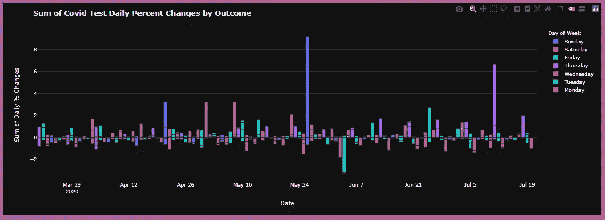**

## **图 28**

**图 28 只是将每天分组在一起。数据与图表 27 相同，但为了便于查看，对日期进行了分组。**

****外卖:周日涨幅最大；周二的跌幅最大；周六大部分时间都是负百分比变化(我猜人们还是想狂欢——我们只有在重要的时候才会生病；));周四、周三以及周二的一些时候，人们会觉得不舒服(我的意思是，无论如何，谁想在周中工作)。****

```
fig27 = px.bar(cases_melted, x="date_new", y="value"
                 , color="dayofweek", facet_col="dayofweek"
                 , color_continuous_scale=px.colors.sequential.Inferno)
#                  , facet_col_wrap=3)
#                  , size=cases_melted.index)fig27['layout'].update(height=500
                     # , width=1200
                     , title='<b>Covid Test Outcome Trends Grouped by Day Of Week</b>'
                     , template='plotly_dark'
                     , yaxis_title="Sum of Daily % Changes"
                     , xaxis_title="Day of Week"
                     , legend_title="Sum of Daily % Changes")
fig27.for_each_annotation(lambda a: a.update(text=a.text.split("=")[-1]))
# fig27.show()
```

**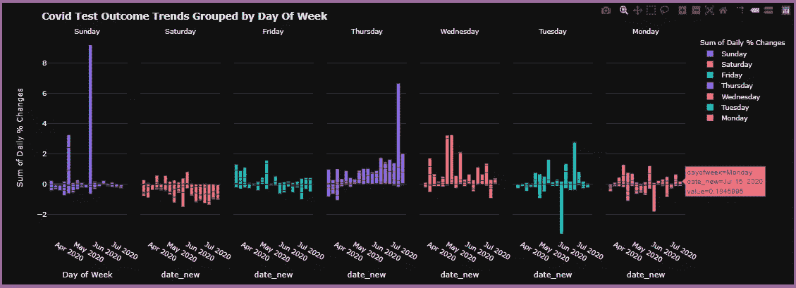**

****图 29****

**图 29 显示了按天分组的每日变化百分比热图。这是你喜欢哪张图表的偏好问题。数据与图 28 相同。**

```
fig28 = px.bar(cases_melted, x="dayofweek", y="value"
                 , color="value"
                 , color_continuous_scale=px.colors.sequential.Inferno)
#                  , facet_col_wrap=3)
#                  , size=cases_melted.index)fig28['layout'].update(height=500
                     # , width=1200
                     , title='<b>Covid Test Outcome Trends Grouped by Day Of Week</b>'
                     , template='plotly_dark'
                     , yaxis_title="Sum of Daily % Changes"
                     , xaxis_title="Day of Week"
                     , legend_title="Sum of Daily % Changes")
fig28.for_each_annotation(lambda a: a.update(text=a.text.split("=")[-1]))
# fig28.show()
```

**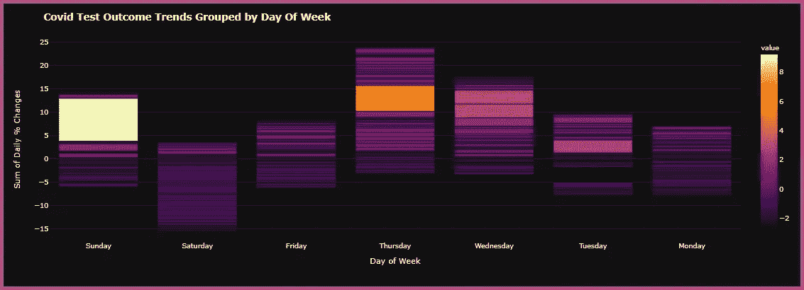**

## **图 30**

**图 30 显示了每种指标分组的星期几(彩色)；使得很容易看出哪些天具有最大的增长指标。**

```
fig29 = px.bar(cases_melted, x="variable", y="value"
                 , color="dayofweek"
                 , color_continuous_scale=px.colors.sequential.Inferno)
#                  , facet_col_wrap=3)
#                  , size=cases_melted.index)fig29['layout'].update(height=500
                     # , width=1200
                     , title='<b>Covid Test Outcome Trends Grouped by Day Of Week</b>'
                     , template='plotly_dark'
                     , yaxis_title="Sum of Daily % Changes"
                     , xaxis_title="Outcome"
                     , legend_title="Sum of Daily % Changes")
fig29.for_each_annotation(lambda a: a.update(text=a.text.split("=")[-1]))
# fig29.show()
```

**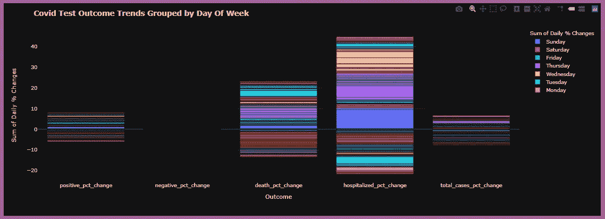**

## **再次格式化数据**

**对于接下来的几个图表，我们需要向 is 数据堆栈添加几个东西:**

*   **[指标]列已舍入**
*   **一个圆形的列数据框架(它更整洁)**
*   **5 天移动平均线柱**
*   **5 天[指标]移动平均斜率列**
*   **所有这 15 列的列表**

```
#create rounded columns and df
cases['total_rounded'] = cases.totalTestResultsIncrease.round(-4)
cases['percent_positive_rounded'] = cases.percent_positive.round(2)
cases['percent_negative_rounded'] = cases.percent_negative.round(2)
cases['percent_death_rounded'] = cases.percent_death.round(2)
cases['percent_hospitalized_rounded'] = cases.percent_hospitalized.round(2)cases_rounded = cases[['date_new','total_rounded','percent_positive_rounded'
                      ,'percent_negative_rounded','percent_death_rounded'
                      ,'percent_hospitalized_rounded']]#add 5 day moving average columns
cases_rounded['percent_pos_5d_avg'] = cases_rounded.rolling(window=5)['percent_positive_rounded'].mean()
cases_rounded['total_rounded_5d_avg'] = cases_rounded.rolling(window=5)['total_rounded'].mean()
cases_rounded['percent_neg_5d_avg'] = cases_rounded.rolling(window=5)['percent_negative_rounded'].mean()
cases_rounded['percent_death_5d_avg'] = cases_rounded.rolling(window=5)['percent_death_rounded'].mean()
cases_rounded['percent_hospitalized_5d_avg'] = cases_rounded.rolling(window=5)['percent_hospitalized_rounded'].mean()#create slope cols
cases_rounded['percent_pos_5d_avg_slope'] = cases_rounded.percent_pos_5d_avg.diff().fillna(0)
cases_rounded['total_rounded_5d_avg_slope'] = cases_rounded.total_rounded_5d_avg.diff().fillna(0)
cases_rounded['percent_neg_5d_avg_slope'] = cases_rounded.percent_neg_5d_avg.diff().fillna(0)
cases_rounded['percent_death_5d_avg_slope'] = cases_rounded.percent_death_5d_avg.diff().fillna(0)
cases_rounded['percent_hospitalized_5d_avg_slope'] = cases_rounded.percent_hospitalized_5d_avg.diff().fillna(0)#convert lists
#rounded lists
total_rounded = list(cases_rounded.total_rounded)
percent_positive_rounded = list(cases_rounded.percent_positive_rounded)
percent_negative_rounded = list(cases_rounded.percent_negative_rounded)
percent_death_rounded = list(cases_rounded.percent_death_rounded)
percent_hospitalized_rounded = list(cases_rounded.percent_hospitalized_rounded)#5d avg lists
percent_pos_5d_avg = list(cases_rounded.percent_pos_5d_avg)
total_rounded_5d_avg = list(cases_rounded.total_rounded_5d_avg)
percent_neg_5d_avg = list(cases_rounded.percent_neg_5d_avg)
percent_death_5d_avg = list(cases_rounded.percent_death_5d_avg)
percent_hospitalized_5d_avg = list(cases_rounded.percent_hospitalized_5d_avg)#slope lists
percent_pos_5d_avg_slope = list(cases_rounded.percent_pos_5d_avg_slope)
total_rounded_5d_avg_slope = list(cases_rounded.total_rounded_5d_avg_slope)
percent_neg_5d_avg_slope = list(cases_rounded.percent_neg_5d_avg_slope)
percent_death_5d_avg_slope = list(cases_rounded.percent_death_5d_avg_slope)
percent_hospitalized_5d_avg_slope = list(cases_rounded.percent_hospitalized_5d_avg_slope)
```

## **图 31**

**图 31 显示了以下内容:**

*   **百分比正变化的 5 天运行平均值**
*   **5 天运行平均测试总数**
*   **舍入的测试总数**
*   **正舍入百分比**
*   **正 5 天平均斜率百分比**

**接下来的四个图表的目标是显示每日总[指标]百分比的相关性。第一个图表显示每天的正百分比斜率类似于总累积每日测试斜率。因此，你进行的测试越多，返回的阳性病例就越多。**

**要点:到 5 月底/6 月初，正百分比斜率几乎完全符合总累积每日测试斜率。这里有些不对劲…因为基本上，如果你在这一点上测试一半，你会有一半的阳性病例。接下来，我们需要研究死亡与阳性病例之间的关系。**

```
# Create fig30ure with secondary y-axis
fig30 = make_subplots(specs=[[{"secondary_y": True}]])# Add traces
fig30.add_trace(
    go.Scatter(x=date
           ,y=total_rounded
           ,name="total_rounded"
           ,mode="lines+markers"
#            ,opacity=.5
           ,marker_color=px.colors.qualitative.Plotly[3]),
    secondary_y=False,
)
fig30.add_trace(
    go.Scatter(x=date
           , y=percent_positive_rounded
#            , opacity=.5
           , mode="lines+markers"
           , marker_color=px.colors.qualitative.Plotly[5]
           , name="percent_positive_rounded"),
    secondary_y=True,
)#moving averages
fig30.add_trace(
    go.Scatter(x=date
           , y=total_rounded_5d_avg
           , opacity=.6
           , mode="lines"
           , marker_color=px.colors.qualitative.Plotly[1]
           , name="total_rounded_5d_avg"),
    secondary_y=False,
)
fig30.add_trace(
    go.Scatter(x=date
           , y=percent_pos_5d_avg
           , opacity=.6
           , mode="lines"
           , marker_color=px.colors.qualitative.Plotly[1]
           , name="percent_pos_5d_avg"),
    secondary_y=True,
)#slopes
fig30.add_trace(
    go.Scatter(x=date
           , y=total_rounded_5d_avg_slope
           , opacity=.7
           , mode="lines"
           , marker_color=px.colors.qualitative.Plotly[3]
           , name="total_rounded_5d_avg_slope"),
    secondary_y=False,
)
fig30.add_trace(
    go.Scatter(x=date
           , y=percent_pos_5d_avg_slope
           , opacity=.7
           , mode="lines"
           , marker_color=px.colors.qualitative.Plotly[5]
           , name="percent_pos_5d_avg_slope"),
    secondary_y=True,
)# Add fig30ure title
fig30.update_layout(
    title_text="<b>Total Daily Cases vs. Daily Percent Positive (Rounded) with 5 Day Moving Average and Slope</b>"
    ,height=800
)# Set x-axis title
fig30.update_xaxes(title_text="<b>Date</b>")# Set y-axes titles
fig30.update_yaxes(title_text="<b>Count Cases</b>", secondary_y=False)
fig30.update_yaxes(title_text="<b>% Positive Cases</b>", secondary_y=True)# Change the bar mode
fig30.update_layout(barmode='stack')# Customize aspect
fig30.update_traces(
#                   marker_color='rgb(158,202,225)'
#                   , marker_line_color='rgb(8,48,107)',
                  marker_line_width=.01)
#                   ,opacity=0.6)#update legend
fig30.update_layout(
    template='plotly_dark'
    ,legend=dict(
    orientation="h",
    yanchor="bottom",
    y=1.01,
    xanchor="right",
    x=1
))
# fig30.show()
```

**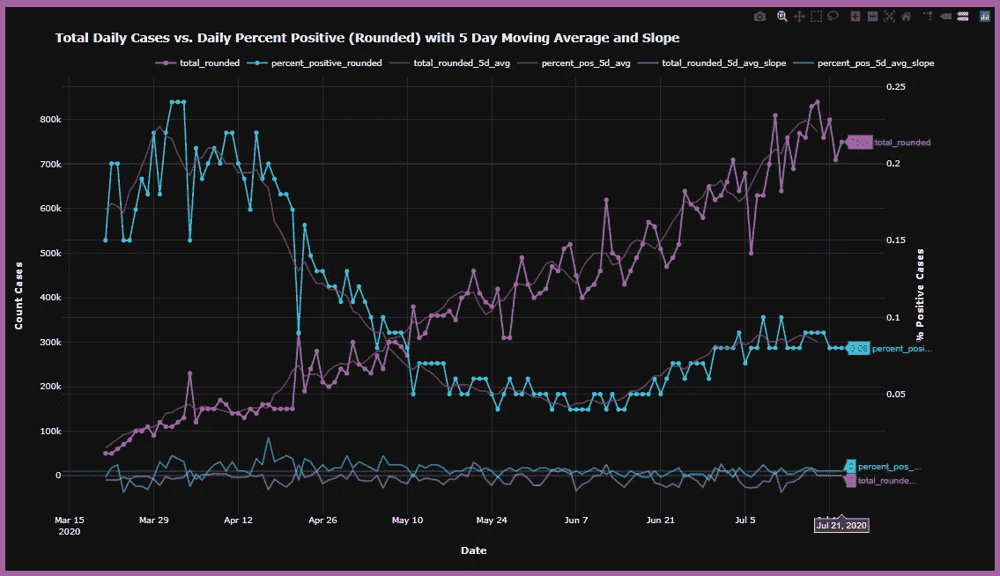**

## **图 32**

**图 32 显示了以下内容:**

*   **百分比负变化的 5 天运行平均值**
*   **5 天运行平均测试总数**
*   **舍入的测试总数**
*   **负百分比四舍五入**
*   **负 5 天平均斜率百分比**

```
# Create fig30ure with secondary y-axis
fig31 = make_subplots(specs=[[{"secondary_y": True}]])# Add traces
fig31.add_trace(
    go.Scatter(x=date
           ,y=total_rounded
           ,name="total_rounded"
           ,mode="lines+markers"
#            ,opacity=.5
           ,marker_color=px.colors.qualitative.Plotly[3]),
    secondary_y=False,
)
fig31.add_trace(
    go.Scatter(x=date
           , y=percent_negative_rounded
#            , opacity=.5
           , mode="lines+markers"
           , marker_color=px.colors.qualitative.Plotly[2]
           , name="percent_negative_rounded"),
    secondary_y=True,
)#moving averages
fig31.add_trace(
    go.Scatter(x=date
           , y=total_rounded_5d_avg
           , opacity=.6
           , mode="lines"
           , marker_color=px.colors.qualitative.Plotly[1]
           , name="total_rounded_5d_avg"),
    secondary_y=False,
)
fig31.add_trace(
    go.Scatter(x=date
           , y=percent_neg_5d_avg
           , opacity=.6
           , mode="lines"
           , marker_color=px.colors.qualitative.Plotly[1]
           , name="percent_neg_5d_avg"),
    secondary_y=True,
)#slopes
fig31.add_trace(
    go.Scatter(x=date
           , y=total_rounded_5d_avg_slope
           , opacity=.7
           , mode="lines"
           , marker_color=px.colors.qualitative.Plotly[3]
           , name="total_rounded_5d_avg_slope"),
    secondary_y=False,
)
fig31.add_trace(
    go.Scatter(x=date
           , y=percent_neg_5d_avg_slope
           , opacity=.7
           , mode="lines"
           , marker_color=px.colors.qualitative.Plotly[2]
           , name="percent_neg_5d_avg_slope"),
    secondary_y=True,
)# Add fig30ure title
fig31.update_layout(
    title_text="<b>Total Daily Cases vs. Daily Percent Negative (Rounded) with 5 Day Moving Average and Slope</b>"
    ,height=800
)# Set x-axis title
fig31.update_xaxes(title_text="<b>Date</b>")# Set y-axes titles
fig31.update_yaxes(title_text="<b>Count Cases</b>", secondary_y=False)
fig31.update_yaxes(title_text="<b>% Negative Cases</b>", secondary_y=True)# Change the bar mode
fig31.update_layout(barmode='stack')# Customize aspect
fig31.update_traces(
#                   marker_color='rgb(158,202,225)'
#                   , marker_line_color='rgb(8,48,107)',
                  marker_line_width=.01)
#                   ,opacity=0.6)#update legend
fig31.update_layout(
    template='plotly_dark'
    ,legend=dict(
    orientation="h",
    yanchor="bottom",
    y=1.01,
    xanchor="right",
    x=1
))
# fig31.show()
```

**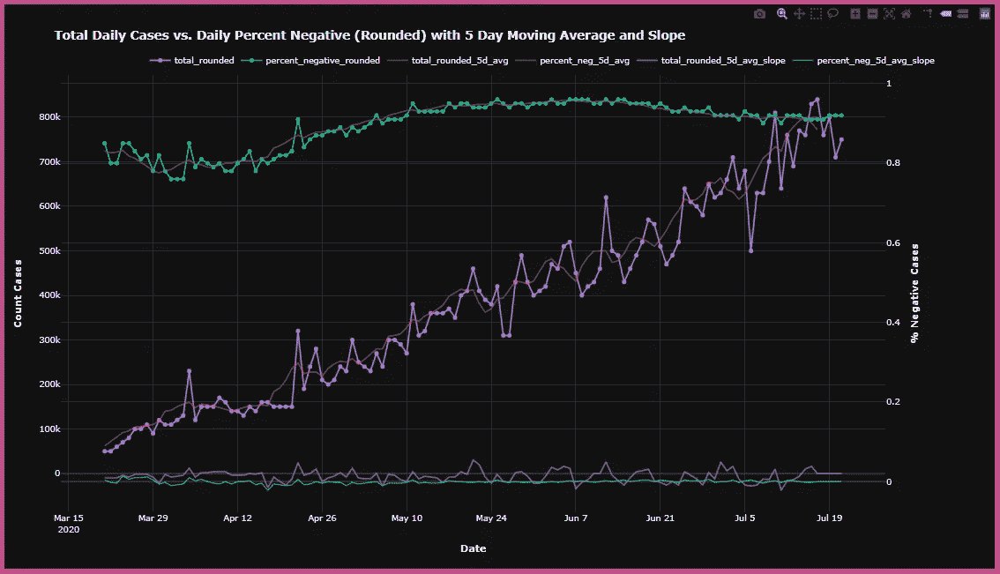**

## **图 33**

**图 33 显示了以下内容:**

*   **死亡百分比变化的 5 天运行平均值**
*   **5 天运行平均测试总数**
*   **舍入的测试总数**
*   **死亡百分比四舍五入**
*   **死亡率 5 天平均斜率**

```
# Create fig30ure with secondary y-axis
fig32 = make_subplots(specs=[[{"secondary_y": True}]])# Add traces
fig32.add_trace(
    go.Scatter(x=date
           ,y=total_rounded
           ,name="total_rounded"
           ,mode="lines+markers"
#            ,opacity=.5
           ,marker_color=px.colors.qualitative.Plotly[3]),
    secondary_y=False,
)
fig32.add_trace(
    go.Scatter(x=date
           , y=percent_death_rounded
#            , opacity=.5
           , mode="lines+markers"
           , marker_color=px.colors.qualitative.Plotly[6]
           , name="percent_death_rounded"),
    secondary_y=True,
)#moving averages
fig32.add_trace(
    go.Scatter(x=date
           , y=total_rounded_5d_avg
           , opacity=.6
           , mode="lines"
           , marker_color=px.colors.qualitative.Plotly[1]
           , name="total_rounded_5d_avg"),
    secondary_y=False,
)
fig32.add_trace(
    go.Scatter(x=date
           , y=percent_death_5d_avg
           , opacity=.6
           , mode="lines"
           , marker_color=px.colors.qualitative.Plotly[1]
           , name="percent_death_5d_avg"),
    secondary_y=True,
)#slopes
fig32.add_trace(
    go.Scatter(x=date
           , y=total_rounded_5d_avg_slope
           , opacity=.7
           , mode="lines"
           , marker_color=px.colors.qualitative.Plotly[3]
           , name="total_rounded_5d_avg_slope"),
    secondary_y=False,
)
fig32.add_trace(
    go.Scatter(x=date
           , y=percent_death_5d_avg_slope
           , opacity=.7
           , mode="lines"
           , marker_color=px.colors.qualitative.Plotly[6]
           , name="percent_death_5d_avg_slope"),
    secondary_y=True,
)# Add fig30ure title
fig32.update_layout(
    title_text="<b>Total Daily Cases vs. Daily Percent Death (Rounded) with 5 Day Moving Average and Slope</b>"
    ,height=800
)# Set x-axis title
fig32.update_xaxes(title_text="<b>Date</b>")# Set y-axes titles
fig32.update_yaxes(title_text="<b>Count Cases</b>", secondary_y=False)
fig32.update_yaxes(title_text="<b>% Death Cases</b>", secondary_y=True)# Change the bar mode
fig32.update_layout(barmode='stack')# Customize aspect
fig32.update_traces(
#                   marker_color='rgb(158,202,225)'
#                   , marker_line_color='rgb(8,48,107)',
                  marker_line_width=.01)
#                   ,opacity=0.6)#update legend
fig32.update_layout(
    template='plotly_dark'
    ,legend=dict(
    orientation="h",
    yanchor="bottom",
    y=1.01,
    xanchor="right",
    x=1
))
# fig32.show()
```

**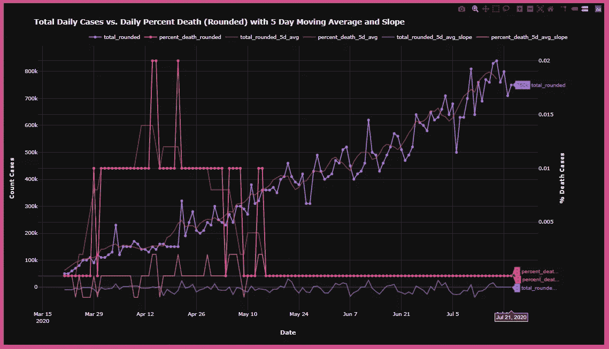**

## **图 34**

**图 34 显示了以下内容:**

*   **住院变化百分比的 5 天连续平均值**
*   **5 天运行平均测试总数**
*   **舍入的测试总数**
*   **住院四舍五入百分比**
*   **住院 5 天平均斜率百分比**

```
# Create fig30ure with secondary y-axis
fig33 = make_subplots(specs=[[{"secondary_y": True}]])# Add traces
fig33.add_trace(
    go.Scatter(x=date
           ,y=total_rounded
           ,name="total_rounded"
           ,mode="lines+markers"
#            ,opacity=.5
           ,marker_color=px.colors.qualitative.Plotly[3]),
    secondary_y=False,
)
fig33.add_trace(
    go.Scatter(x=date
           , y=percent_hospitalized_rounded
#            , opacity=.5
           , mode="lines+markers"
           , marker_color=px.colors.qualitative.Plotly[4]
           , name="percent_hospitalized_rounded"),
    secondary_y=True,
)#moving averages
fig33.add_trace(
    go.Scatter(x=date
           , y=total_rounded_5d_avg
           , opacity=.6
           , mode="lines"
           , marker_color=px.colors.qualitative.Plotly[1]
           , name="total_rounded_5d_avg"),
    secondary_y=False,
)
fig33.add_trace(
    go.Scatter(x=date
           , y=percent_hospitalized_5d_avg
           , opacity=.6
           , mode="lines"
           , marker_color=px.colors.qualitative.Plotly[1]
           , name="percent_hospitalized_5d_avg"),
    secondary_y=True,
)#slopes
fig33.add_trace(
    go.Scatter(x=date
           , y=total_rounded_5d_avg_slope
           , opacity=.7
           , mode="lines"
           , marker_color=px.colors.qualitative.Plotly[3]
           , name="total_rounded_5d_avg_slope"),
    secondary_y=False,
)
fig33.add_trace(
    go.Scatter(x=date
           , y=percent_hospitalized_5d_avg_slope
           , opacity=.7
           , mode="lines"
           , marker_color=px.colors.qualitative.Plotly[4]
           , name="percent_hospitalized_5d_avg_slope"),
    secondary_y=True,
)# Add fig30ure title
fig33.update_layout(
    title_text="<b>Total Daily Cases vs. Daily Percent Hospitalized (Rounded) with 5 Day Moving Average and Slope</b>"
    ,height=800
)# Set x-axis title
fig33.update_xaxes(title_text="<b>Date</b>")# Set y-axes titles
fig33.update_yaxes(title_text="<b>Count Cases</b>", secondary_y=False)
fig33.update_yaxes(title_text="<b>% Hospitalized Cases</b>", secondary_y=True)# Change the bar mode
fig33.update_layout(barmode='stack')# Customize aspect
fig33.update_traces(
#                   marker_color='rgb(158,202,225)'
#                   , marker_line_color='rgb(8,48,107)',
                  marker_line_width=.01)
#                   ,opacity=0.6)#update legend
fig33.update_layout(
    template='plotly_dark'
    ,legend=dict(
    orientation="h",
    yanchor="bottom",
    y=1.0,
    xanchor="right",
    x=1
))
# fig33.show()
```

**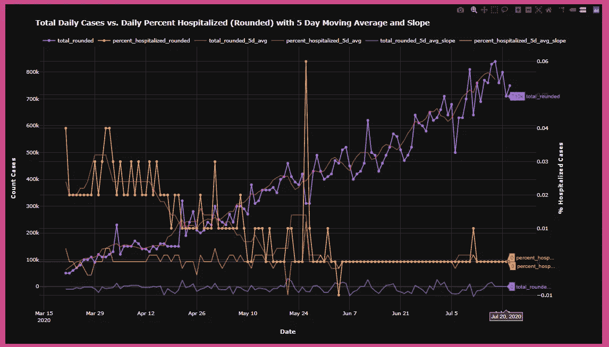**

## **部署在 Heroku**

**这可以说是最烦人的部分。因为这个问题越来越长，所以高层次的问题是:**

****过程文件:****

```
web: gunicorn app:server --timeout 1000
```

****Requirements.txt****

```
Run in venv or not in venv (but it will create a bigger slug file, b/c it will contain all your install libraries, for heroku and that will slow down your app if not in venv:pip freeze > requirements.txt
```

****风格脚本和应用程序的东西****

```
bgcolors = {
    'background': '#13263a',
    'text': '#FFFFFF'
}external_scripts = [
    '[https://www.google-analytics.com/analytics.js'](https://www.google-analytics.com/analytics.js'),
    {'src': '[https://cdn.polyfill.io/v2/polyfill.min.js'](https://cdn.polyfill.io/v2/polyfill.min.js')},
    {
        'src': '[https://cdnjs.cloudflare.com/ajax/libs/lodash.js/4.17.10/lodash.core.js'](https://cdnjs.cloudflare.com/ajax/libs/lodash.js/4.17.10/lodash.core.js'),
        'integrity': 'sha256-Qqd/EfdABZUcAxjOkMi8eGEivtdTkh3b65xCZL4qAQA=',
        'crossorigin': 'anonymous'
    }
]external_stylesheets = ['[https://codepen.io/chriddyp/pen/bWLwgP.css'](https://codepen.io/chriddyp/pen/bWLwgP.css')]#app stuff
app = dash.Dash(__name__,
                external_scripts=external_scripts,
                external_stylesheets=external_stylesheets)server = app.server
```

****布局和 html。Div 图形对象****

**我只是把所有的数字放在一个 div 中，就像这样(这个应用程序大约有 30 个数字):**

```
app.layout = html.Div(children=[
html.Br(),html.Div([
        dcc.Graph(figure=fig28)
        ]),html.Br(),html.Div([
        dcc.Graph(figure=fig29)
        ]),html.Br()
        ,html.Br()
        ,html.Br()
        ,html.Br(),html.H1(children='5 Day Moving Average Meets % of Daily Outcomes (Rounded)'),html.Br(),html.Div([
        dcc.Graph(figure=fig30)
        ])
```

****运行它:****

```
if __name__ == '__main__':
    app.run_server(debug=True)
```

****就是这样！如果你真的读到了所有这些，你就是一个骑兵，好悲伤。主要是供参考。我猜这将包含许多人们试图在 plotly 或 dash 中创建的东西——可能与 covid 无关，但我喜欢分享我的工作，因为我喜欢当我发现有用时人们分享他们的工作。****

**欢迎给我发消息，或者通过社交媒体渠道联系我。**

**[](https://www.buymeacoffee.com/31yearoldmoron)**

****Github**:[https://Github . com/Maxwell bade/covid _ us _ final/tree/master/covid _ one _ million](https://github.com/maxwellbade/covid_us_final/tree/master/covid_one_million)**