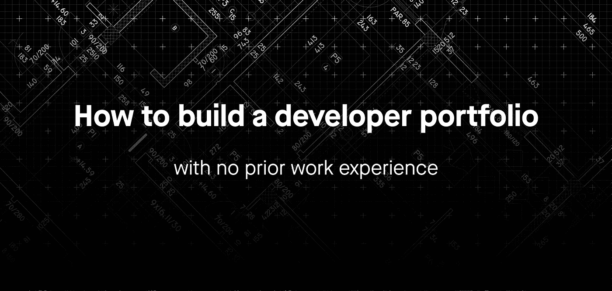

# 如何在没有工作经验的情况下构建开发人员组合

> 原文：<https://blog.devgenius.io/how-to-build-a-developer-portfolio-with-no-prior-work-experience-6af7f21774d6?source=collection_archive---------2----------------------->

这篇文章是为没有经验或经验很少的人准备的

我已经做了大约 9 年的软件工程师。作为我们部门的团队领导，我帮助招聘其他软件工程师。去年我进行了大约 45 次面试。其中 19 个是初级开发人员的职位。7 名候选人之前没有工程经验。

每次面试的第一步是收到一份候选人简历。通常它包含候选人以前的经历和教育。但是，当你没有**零**或**一点点**工程经验并渴望成为一名初级开发人员时，你能在简历中写些什么呢？在这篇文章中，我想探究一下**的个人项目**，作为展示候选人编程技能的一种方式。

# TL；土耳其

1.  专注于一种编程语言👨‍💻👩‍💻
2.  为你的个人项目🧠集思广益 2-3 个想法
3.  不要害怕公开💻
4.  不要让您的自述文件为空📝

# 专注于一种编程语言👨‍💻👩‍💻

这里有几条你可以遵循的途径:

## 1.在线课程

谈到在线学习，有很多选择。您可以根据以下标准选择合适的在线课程:

*   付款(预付、分期付款或找到工作后)
*   程序设计语言
*   强度和持续时间
*   毕业后保证实习

## 2.大学或编程学校

你也可以找到很多选择，但是它会比一个在线课程**更长。你需要 3 个月到 1 年的全日制学习。**

## 3.辅导和指导

这是对在线课程或学校的补充。我强烈推荐这种方法，尽管找到一个好的导师很困难。

**提示:**寻求**积极的指导**不要害怕投资于你的教育和自我发展。学习新技能总是要付出代价的。但是投资很快就会有回报。这将有助于保持你的动力，更快地达到你的目标。

# 为你的项目集思广益 2-3 个想法🧠

个人项目是将你的知识运用到行动中的一种方式。只要你感兴趣，这个项目可以和任何事情有关。这将有助于完成你的项目。**提示:**让**其他人**参与你的个人项目。你可以和其他程序员、数据科学家和图形设计师一起创造伟大而有趣的东西。最终每个人都会从这次旅行中受益。

以下是一些非常适合个人项目的主题示例:

*   **构建一个 web scraper:** 一个以 URL 作为输入并以 HTML 或 XML 的形式返回 URL 内容的工具
*   **创建短信停机报警器。**一个应用程序，将 URL 作为输入，当对 URL 的请求返回 200 (OK)以外的响应代码时，它会向您发送一条文本消息
*   **懒虫机器人。**如果你或你的团队使用流行的聊天应用 Slack，那么就开发一个机器人，让你(或你的团队)的生活变得更轻松。创意:一个点咖啡的机器人，一个每天向你的团队报告提交数量的机器人，或者一个每天起立提醒的机器人。
*   **你的个人网站。**在网上建立自己的形象永远不会有坏处。尤其是如果它有助于展示你的编程技能。

# 不要害怕公开💻

您的开发项目很可能会涉及一些代码。能把这个代码给别人看就不错了。你可以使用任何基于 git 的源码控制系统。GitHub 会做得很好。

请记住，你的项目不一定是一篇完成的文章。它可能只是一个 **MVP(最小可行产品)**，它只完成最少的期望功能，但足以实现您想要的。

**提示:**用**不同的技术**使你的项目多样化。不要重复使用相同的模式和框架。而是研究如何应用其他相关技术。

**例子**:假设你为个人项目开发一个 Java 后端。此外，您还可以了解:

*   Docker 将您的后端应用程序部署到云提供商
*   Angular 或 React 为您的后端提供一个 UI
*   Spring Framework 为您的 web 应用程序提供 REST API。

# 不要让您的自述文件为空📝

GitHub 上有个**工作代码**挺好的。但是考虑如何向观众展示你的**项目**也很重要。你可以利用自述文件。

## 自述文件中包含的内容:

1.  简要描述你的项目的特点和它的目的是什么
2.  如何在本地运行项目
3.  集思广益，写下你可能会添加到这个项目的未来功能

**技巧 1:** 把你的个人项目当成**真实项目**有**真实用户**。这表明你可以**展示你的作品**，这是软件开发中经常需要的。这也表明你有完成项目的奉献精神

**提示 2** :考虑使用[makereademe](https://www.makeareadme.com)来创建您的自述文件

好的自述文件示例:

1.  [据点](https://github.com/alichtman/stronghold#readme)
2.  [AutoExec](https://github.com/ArmynC/ArminC-AutoExec/#readme)
3.  [降价](https://github.com/amitmerchant1990/electron-markdownify#readme)
4.  [色彩](https://github.com/athityakumar/colorls#readme)

# 结论

1.  如果你以前没有工程经验，用个人项目来展示你的技能。
2.  让其他人参与你的个人项目。你更有可能以这种方式完成它。
3.  使用自述文件介绍项目的功能。