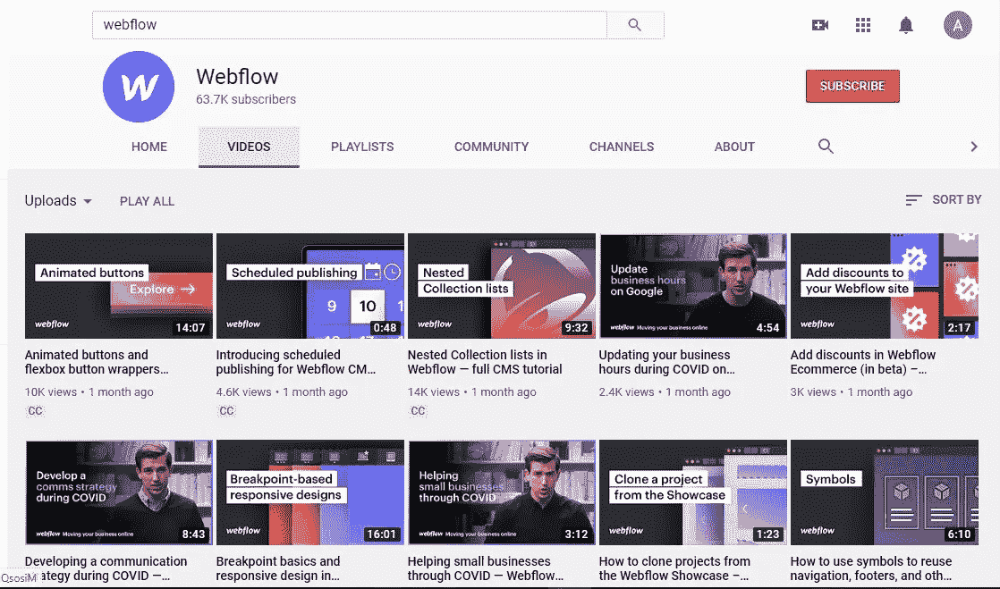

# 如何在不知道如何编码的情况下构建数字产品:“无代码”运动

> 原文：<https://blog.devgenius.io/how-to-build-a-digital-product-without-knowing-how-to-code-the-no-code-movement-4fc8432ea6b5?source=collection_archive---------43----------------------->

两三天前，我在 medium 上读到了一篇由 [Aboelez](https://medium.com/u/d4b38744d3d6?source=post_page-----4fc8432ea6b5--------------------------------) 撰写的关于无代码运动的未来的文章(如果你想看的话，我会在下面链接这篇文章)，我喜欢这篇文章，我发现这个主题非常有趣，所以我决定写一篇关于它的文章。

# **无代码运动:**

在过去的几年中，我们开始听到一个相对突然出现的有趣想法，这个想法是关于在几乎没有任何编程知识的情况下构建一个数字产品(网站、Saas 或任何其他数字产品)，一些人实际上喜欢这个想法，他们发起了一个名为“无代码”的运动来服务于这个目的。

[Webflow](https://webflow.com/?utm_medium=paid-search&utm_source=google-search&utm_campaign=branded&utm_term=keyword-targeting&utm_content=branded-search-ads&gclid=CjwKCAjwlZf3BRABEiwA8Q0qq1APz84vcQ6v2aapH5SKZnS4xlIJkdhZ_xmYRugPuzpU9o5A5i5BWRoC1A4QAvD_BwE) 、 [Tribeshare](https://www.sharetribe.com/) 、 [Zapier](https://zapier.com/?utm_source=google&utm_medium=cpc&utm_campaign=gaw-row-nua-search-trademark-brand_exact&utm_adgroup=brand-zapier&utm_term=zapier&utm_content=_pcrid_424479852149_pkw_zapier_pmt_e_pdv_c_slid__pgrid_93034149989_ptaid_aud-884433608118%3Akwd-298647606221_&gclid=CjwKCAjwlZf3BRABEiwA8Q0qq0F0Mo2TSI5pQMdvzuLWxMmClnSHdN58kq7rcXUNRsWp5x5MFw77FhoCzHMQAvD_BwE) 和许多其他平台允许你将你的想法转化为一个真实的项目，而无需接触任何代码行，甚至无需与开发人员打交道，你所要做的就是在这些平台上创建一个帐户，支付订阅费，然后通过拖放开始构建你的想法。即使你不知道如何使用这些平台，你也可以在谷歌或 youtube 上搜索，你会得到大量的结果来开始学习。

截图来自 Webflow 官方频道

其中一些平台有免费版本，但它们是如此有限，其中一些有每月订阅。

最受欢迎的“无代码”运动平台有:

*   Webflow:每月 12.00 美元起
*   TribeShare:每月 79.00 美元起
*   Shopify:每月 29.00 美元起
*   Makerpad:每月 20.00 美元起

# **使用无代码平台构建产品的好处:**

无代码平台允许你用最少的时间和资源将你的想法转化成一个活的项目。这些平台还允许您减少所需的时间、成本和对熟练开发团队的需求。有了无代码平台，你可以把更多的精力放在项目的营销和盈利上，而不是放在产品的构建和维护上。

# **什么时候应该使用无代码平台，什么时候不应该:**

如果你的项目想法是一个电子商务网站或在线学校或任何正常的东西，我鼓励你选择无代码。但是，如果你想构建一些疯狂的和非常可定制的东西，我建议你雇佣一个单独的开发人员或一整个团队的开发人员。

# **结论:**

这一运动在过去几年里越来越受欢迎，许多企业家开始投资于此，目前有许多项目服务于数千甚至数百万的客户。

这对任何有好主意但没有巨额预算的人来说都是一个机会。那么，你还在等什么？。

最后，希望这篇短文赢得您的赞赏，感谢您的关注。

[Aboelez](https://medium.com/u/d4b38744d3d6?source=post_page-----4fc8432ea6b5--------------------------------) 的一篇关于这个话题的文章:

 [## “无代码”的未来

### “随着互联网上的创作变得越来越容易，越来越多的人正在成为创作者。它不再是…

medium.com](https://medium.com/dev-genius/the-future-of-no-code-8502fc45e3b7)