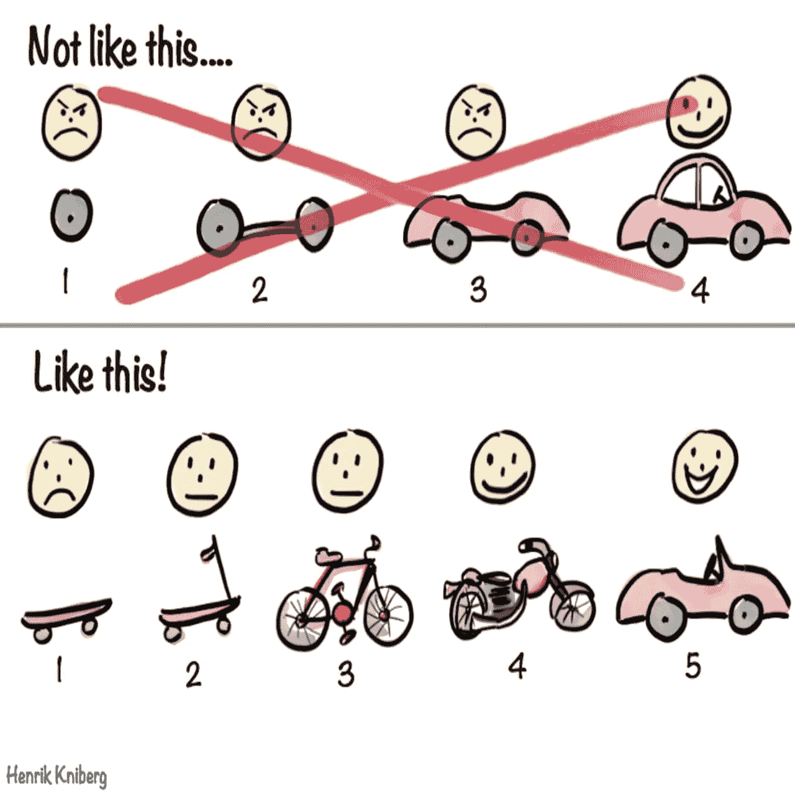

# 如何构建金融科技应用:方法、架构和可扩展性

> 原文：<https://blog.devgenius.io/how-to-build-a-fintech-app-approach-architecture-and-scalability-3cb5f3ff2ee?source=collection_archive---------6----------------------->

当构建一个像金融科技应用程序这样极其复杂的平台时，大多数时候你会提出一个“愿望清单”，包括所有你想在产品中拥有的“必备”。对于一个金融应用程序，它包含了几乎所有的东西，你的列表看起来会像这样:

百分百安全

百分之百的容错能力

百分之百的可靠性

100%可扩展性

100%灵活性

等等，等等…

然而，这在理论上似乎是不可能的。这就像在玩具店问一个小孩，“你想要什么？”显而易见但并不令人愉快的答案将是，“一切就在此时！”产品必须是可靠的，必须符合特定领域的法律，必须是灵活的和可伸缩的，以便您可以在它的基础上定制它所拥有的功能(并添加新功能)。

在开发完美的金融科技产品的道路上，你必须回答的第一个问题是，在构建应用程序的架构时，选择什么样的策略。虽然选择似乎是无限的，但在企业成长的不同阶段，所有选择都有其优势和劣势。在这篇文章中，我们将看看金融科技架构的不同方法，以帮助您为您的产品创建一个成功的战略。

# 稳定性和可伸缩性之间脆弱的平衡:上限定理

如果没有一个好的应用架构，任何伟大的金融科技想法都不会转化为有效和有竞争力的产品。在开发任何 IT 系统时，我们总是优先考虑业务需求，财务系统也不例外。这就是为什么将系统建立在技术需求上并不是一个好主意，例如，期望的技术，因为它们是次要的。由于所有系统在功能和需求方面都是独一无二的，应用程序的架构也会有所不同。那么，如何才能描述一个好的金融系统架构呢？让我们看一个例子，并描述所有可能的选项。

通常，在 MobiDev，我们从定义核心业务需求开始，它们可以被描述为用户或业务流。通过分析业务需求，我们更好地理解特定的业务目标，并且这种理解允许我们为未来的系统制定功能和非功能需求，考虑**“关键质量属性列表”**和**“每个质量属性的特定度量”**。

这些属性在金融应用的后续规划中起着关键作用，因为它们的实施直接取决于所选的架构或所提供的技术堆栈。不幸的是，并不是所有的属性都可以相互结合。事实上，我们无法满足应用程序的所有要求。这种说法的证明之一是 CAP(一致性、可用性、分区容差)定理，它可以适用于整个系统。

如果我们考虑到构建各种体系结构所需的时间投资，这将导致各种财务支出和维护成本，我们将同意，制定需求的优先级、开发成本和维护成本之间的平衡是至关重要的。

这就是为什么有必要了解一些事情:

*   并非所有的业务需求都能同时得到满足
*   每个业务需求都有实现和维护成本
*   平衡需求实现和成本是对业务有效的技术决策的关键

那么，在规划金融 app 架构之前，我们需要考虑哪些主要因素呢？

# 位置

一旦我们知道了未来业务的位置，我们就清楚地了解了特定国家或特定金融机构制定的监管要求或限制。实际上，这是一个对系统架构有巨大直接影响的关键因素。有必要考虑从位置区域或敏感数据处理(GDPR、CCPA 等)开始的广泛需求。)到具有各种服务/服务器的不同地理区域的管理。例如，我们可能在不同的地区有不同的税收制度，或者要求只在特定的国家或地区收集、存储和管理个人数据。这使得我们设计具有分布式架构的系统。

虽然我们总是听说向外扩展数据库，但考虑地理区域的业务逻辑在金融应用程序开发中发挥着巨大的作用。这就是为什么当谈到金融科技初创公司时，我们建议从一个或两个国家开始，以简化生产的第一阶段。

# 商业模式的类型和系统负载

业务模型的类型和系统负载——这两个标准密切相关。如果我们谈论的是 B2C 模式，我们的预测能力要比 B2B 模式低得多。在 B2C 业务中，我们必须处理日常/季节性负载，在社交媒体上开展广告活动的后果，甚至谣言。

更多地了解业务模型和潜在的系统负载不仅有助于预测主要的扩展类型:微服务架构、SOA(面向服务的架构)、可扩展的整体架构，或者仅仅是数据扩展(例如，数据库)，而且有助于更有效地开发系统。例如，混合几种方法可以让企业在业务需求和费用(包括开发和支持成本)之间取得平衡。你可以在这里阅读更多关于如何在快速发展的科技初创公司中扩大软件产品开发的内容。

# 性能/延迟

性能/延迟和网络延迟不仅对高速缓存和 CDN 等系统部件很重要，对将要使用的协议以及系统中架构模型和连接的选择也很重要。例如，流行的无服务器架构有一个很大的缺点——冷启动。虽然这个问题可以通过“预热”来缓解，但我们仍然会遇到连接微服务系统中几个串行功能块的问题，因为这将显著增加延迟。

然而，这只是建筑的一种方法，所以我们需要了解和使用建筑中的各种设计方法。

# 实时

尽管这一标准与性能和延迟密切相关，但它与它们略有不同。这就是为什么实时值得我们特别关注，因为我们需要在开发金融科技初创公司时考虑流媒体或聊天的可能性。尽管这些功能对于金融产品来说并不总是必要的，但无论如何，最好还是在这些功能上努力，这在 B2C 系统中尤其重要，例如，对于客户支持或通知来说。
安全协议和技术

安全协议和技术也是设计未来应用时需要考虑的重要方面。存储机密数据和敏感信息的必要性可以决定系统的架构；当我们谈论金融科技时，这是至关重要的。对于金融科技产品来说，极其重要的是:

*   设计用户和管理员流程，排除意外或有意的信息泄漏
*   开发清晰的访问和权限矩阵
*   通过多因素身份认证、KYC 验证、基础设施访问和漏洞监控、数据存储安全、静态硬盘加密来加强金融科技应用的安全性
*   保护应用程序免受 OWASP 十大漏洞的攻击
*   遵循为 fintech 软件制定的代码、存储、访问和权限检查流程

# 系统可靠性和容错能力

问题是，没有人(即使是像谷歌或亚马逊这样的巨头)可以保证 100%的正常运行时间，特别是当涉及到谷歌和亚马逊的云基础设施时。人们认为 99.99%的正常运行时间就足够了(这是 AWS 和谷歌云的信息)。

在微服务架构的情况下，系统某一部分的故障不如整体架构严重。因此，我们需要非常清楚地理解与系统可靠性和容错性相关的业务需求。业务需求缺乏透明度通常会导致不合理和过度的支出，或者如果选择了便宜但不太可靠的选项，甚至会导致服务可用性问题。

虽然每个业务案例都是独特的，但构建金融科技应用的常见步骤是相同的:明确业务需求、标准和关键的非功能性需求，然后才考虑上述所有因素来设计系统架构。然而，我们还需要考虑业务的当前状态，我们不仅指预算，还指业务增长的阶段:我们是为一家初创公司还是一家已成立的公司设计系统。换句话说，我们需要知道业务需求是否得到了充分的阐述和良好的描述，以及我们是否需要使产品适应市场。

这是我们面临的一个不同寻常的挑战:在许多文章中，我们读到微服务架构是金融系统的最佳选择(我们完全同意这一点！)但这种方法通常被用来忽略企业经历的成长阶段和对市场的适应。然而，这可能是商业成功的关键因素。让我们来看看最能说明问题的众所周知的图片。

不仅功能如此，app 架构也是如此。如果我们比较摩托车和汽车的发动机和传动装置，它们是完全不同的。

# 金融科技架构的三种选择:整体式、SOA 和微服务

最终，你要回答的下一个问题是，你应该选择哪种金融应用开发方法。嗯，你可以使用几乎所有的东西，选择有很大的不同，但是当从你可以使用的所有不同的方法中选择时，有陷阱也有好处。因此，让我们构建并分析一下金融应用程序的架构的效率。

这只是一个项目选择最合适的架构的例子，假设我们处于启动阶段，业务条件可以改变。在启动阶段，我们需要轻松地添加新功能，而不是在这些新功能的实现和支持上花费太多。我们将简化金融应用架构的标准，仅保留主要标准，例如:

*   增加工作负载的可扩展性
*   开发人员生产力和成本之间的关系
*   添加新功能的灵活性
*   容错

通常，对这些特征的评估对于第一阶段就足够了。此外，它们是相互联系和相互关联的。在大多数情况下，我们从以下三种架构方法中进行选择:Monolith、SOA 和微服务，因此根据我们的经验，我们创建了您可以在下面看到的表格。

**可扩展性成本灵活性容错**

其中“3”表示最好，“1”表示最差

评估的结果完全是经验性的，基于我们自己的经验。那么，如此复杂的评估对于创业公司意味着什么呢？分析和系统架构可以在业务增长的不同阶段改变的事实让我们明白，就成本而言，**最好从整体**开始，然后**留出系统中不可改变的部分来分离服务**，只有在这一步之后，**才转移到微服务**。

上述方法的核心区别在于服务的规模和每个服务执行的功能。如果在微服务中，每个服务通常都基于 Lambda 或类似的技术，并执行简单的功能，那么在 SOA 中，每个服务都是一个具有完整业务角色的成熟应用。Monolith 具有相同的功能，但是业务抽象之间的连接存储在应用程序内部，这与以前的方法不同。整体式应用程序作为一个整体进行扩展，这使得扩展变得困难且不太理想。当然，我们需要考虑系统的规模，但请记住，我们谈论的是初创公司。

出于这个原因，这里是**另一个重要的结论**:不同架构的 app 在 app 中的连接是相同的，但是业务抽象(功能)之间的连接是定位在 app 的不同层面上的。在单块应用和 SOA 的情况下，服务的业务逻辑连接通常放在编程代码中，服务之间的连接位于基础架构级别，但在微服务中，所有连接仅位于基础架构级别。这解释了基础设施即代码(IaC)方法的流行:它为开发人员简化了应用程序中的连接设计，但需要额外的知识和技能，包括云基础设施和服务的基础知识。

# 金融科技应用的最佳架构:如何选择？

微服务应用易于扩展，但构建起来更加困难和耗时:你需要花更多的时间来规划服务基础设施和服务连接。另外，您需要在 DevOps 上花费额外的时间来设置任务并控制其执行。事实上，根据我们的经验，与整体架构相比，构建微服务架构所需的时间(包括规划阶段和流程中的通信时间)可能会增加 1.3 倍，甚至 2.5 倍。

如果我们谈论 SOA，它使用“按业务能力分解”模式，这是最著名的策略之一，通过定义应用程序的业务能力并为每个业务能力创建特定的服务，将应用程序分解为服务。业务功能是客户在使用应用程序时可以使用的功能。与微服务不同，规划和构建项目所需的时间更少，因为系统需要的外部基础设施连接更少。此外，这种方法有助于在不断变化的业务需求的世界中创建更灵活的系统，因为只有当它们与特定的业务领域相关时，才在编程代码的级别上进行更改。

最后，就开发而言，整体架构是最快的，因为功能是在开发人员一方构建的，是他们的责任，不涉及基础设施级别。

在第一阶段，我们建议平衡将系统分成独立的块和增加成本。这就是为什么我们建议在从头创建金融应用时避免使用微服务。微服务使构建系统变得更加复杂和耗时，这通常伴随着支出的增加。就目前而言，这种方法对初创公司来说远非完美，关键问题是缺乏明确的需求。

**因此，fintech 创业公司的最佳策略是从单片架构开始，然后转向 SOA，定义未来不会改变的部分和会改变的部分，实现系统各部分之间的异步交互。然后** — **采用微服务优化系统维护成本。**

否则，在第一阶段缺乏最终确定的业务需求可能会导致不必要的更改和额外的功能，与整体架构相比，这将更加昂贵。这并不意味着这种方法是唯一可以利用的方法。实际上，我们在不同的情况下推荐不同的架构方法。

1.  如果我们没有完全确定的业务需求和业务流程，单一架构允许开发人员自己进行更改，而不涉及其他角色。例如，我们只在部署阶段需要 DevOps 专家，但在开发阶段不需要。
2.  如果我们已经有了一个现有的服务或者业务流工作的 80–90%的置信度，那么 SOA 方法是最好的。
3.  如果我们有一个现有的服务需要优化，微服务将是最佳选择。

当然，如果你的产品没有高负载的功能，那么在选择架构时应该考虑到这个功能。

总之，最好不要将所选择的架构视为永久的东西。随着你的创业成长和变化，系统架构也在进化。从单片开始是绝对没问题的，在成长阶段——将一些功能块分离成服务，从而转向 SOA，在优化阶段——转向微服务。在第一阶段就核心业务需求和架构方法达成一致是至关重要的，以避免误解并确保技术选择是合理的。

由 [MobiDev](https://mobidev.biz/services/web-application-development) 的 JavaScript 小组组长[塞维多夫·卢恰尼诺夫](https://mobidev.biz/our-team/yuriy-luchaninov)撰写。

*全文原载于*[*https://mobidev . biz*](https://mobidev.biz/blog/how-to-build-fintech-app-approach-architecture-scalability)*，基于 mobi dev 技术研究。*