# 当后端未准备好时，如何构建前端

> 原文：<https://blog.devgenius.io/how-to-build-a-frontend-when-the-backend-is-not-ready-f1fc6b541101?source=collection_archive---------6----------------------->

## Javascript 架构

## 当前端和后端团队需要并行工作时

构建一个前端并不是一件容易的事情，你需要理解许多关键概念，例如，HTML，CSS，至少一个 JS 框架，ts，浏览器限制，等等。


保罗·尼科勒洛在 [Unsplash](https://unsplash.com?utm_source=medium&utm_medium=referral) 拍摄的照片

然而，如果你花时间在这些概念上，你就能学会它们。

但是，最困难的任务是在你的 API 还没有准备好的时候构建你的页面或者移动应用。

但是，我们不能因此而停止，对吗？我们需要继续我们的项目。我知道，也许现在你在想，你到底在说什么？

放松点，兄弟…

以正确的方式使用正确的工具是可能的。

在开始列举我们的选择之前，我们需要知道一个关键概念。

## **合同优先开发**。

有一个工作流叫做**契约优先开发**。

契约优先开发是一种习惯，在开始编码之前有契约的定义，这将帮助我们发现我们是否遗漏了一些重要的部分。

这种实践将帮助我们创建自动化测试并验证我们的 API，模拟正在开发的服务，并在开始之前拥有良好的文档。

因此，两个团队可以并行工作，而不是通过后端开发来阻止前端开发。

这个概念不仅仅适用于 API，例如，如果你正在开发桌面应用程序，你可以使用这个概念来模仿你的 SDK、库、DLL 或者你正在使用的任何东西。

合同优先开发

## 一个应用编程接口

正如我所说的，有许多选项可以用来模仿我们的 API。在这个例子中，我将使用一个基本的 React 应用程序来说明我们所有的例子。

## JSON 文件

第一个也是最容易使用的是项目中的一个 JSON 文件，当我们需要数据时就包含它。

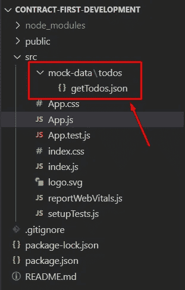

用 JSON 文件模拟数据

正如你所看到的，我在我的项目中做的唯一一件事是用我的服务定义存储一个文件，这将帮助我们模仿我们的 API。

我们的 JSON 文件包含以下内容

我建议添加一个服务层，以便只更改该服务中的源代码，考虑到在不久的将来，您将需要在一个真实的服务中更改 JSON 文件，如果您在代码的许多部分都使用这种方法，那么更改所有调用将会很痛苦。

最后，您只需要 JSON 文件，如第 2 行中的代码所示。

前面代码的结果将是我们的前端没有一个真正的后端。

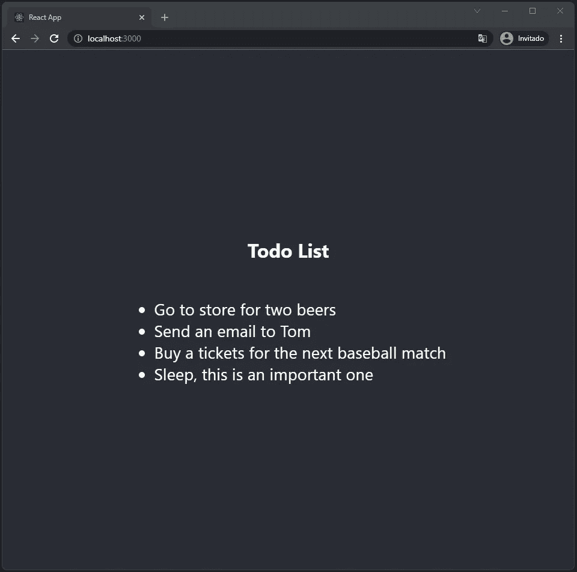

## 邮递员


许多开发人员使用 postman 来测试他们的后端，一些高级开发人员使用这个工具来记录他们的 API 并与他们的同事分享。但是这个工具是瑞士的 Armi 刀。

有了 Postman，你可以测试、记录、自动化、监控或模拟一个 API，以及许多其他与 API 相关的最酷的事情。

这是一种先进的方法，可能是最接近实际服务的方法。

要创建 API 模拟，打开您的 postman 应用程序，点击模拟服务器，然后创建一个模拟服务器。

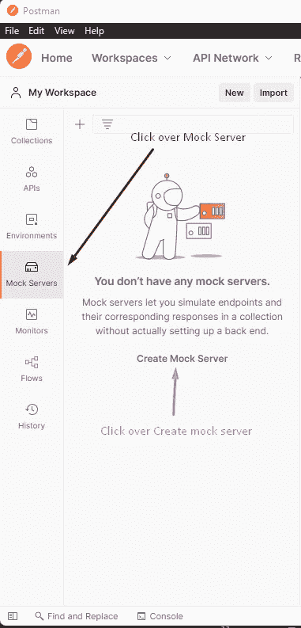

创建一个模拟服务器

之后，Postman 会提示我们一个新的表单，你需要定义你的 API，比如请求方法，请求 URL，响应代码等等。

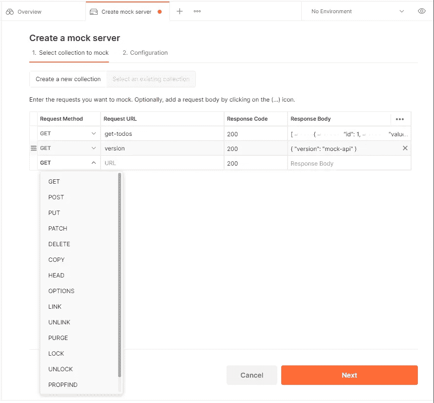

API 定义

在前面的图片中，我定义了`get-todos`方法，作为响应体，我粘贴了我们在第一种方法中使用的 JSON 文件。

如果需要，您可以将其他设置更改为方法或响应代码。当你完成所有设置后，点击**下一个**按钮。

要完成您的模拟服务器，您需要给模拟服务器一个名称

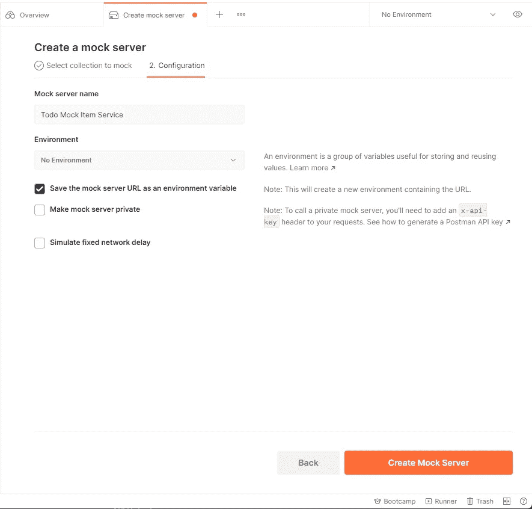

模拟服务器配置

之后，Postman 会给我们一个新的 URL，它将是我们将在代码中使用的 API。

在我们的代码中，我们只需要创建一个对此服务的调用，我创建了一个文件来存储所有与 todos 服务相关的调用。

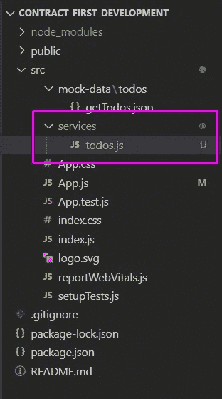

目前，我们的文件只包含这段代码。

最后，我们将这个 API 作为服务来使用。

同样，这只是一个基本的例子，我建议使用端点作为环境变量，并添加一个服务层来访问所有的 API。

## 海市蜃楼

Mirage 是一个流行的 API 模仿库，它将帮助我们在没有真正后端服务的情况下完成我们的工作。

我把这个留在最后，因为在我看来这是最完整的方法，因为你可以用你的最终资源在你的代码中模拟你的 API。换句话说，Mirage 将捕获您的所有请求，然后它将返回一个模拟响应，无论您是使用 fetch、Axios 还是任何其他 JS 库来调用服务。

要安装该库，只需运行以下命令:

```
npm install --save-dev miragejs
```

让我们假设我们在谷歌工作😉最终的网址是[https://api.google.com/get-todos](https://api.google.com/get-todos)，但我们的工程师仍在开发 API。

如果我们运行我们的项目，我们将得到一个与网络相关的错误。

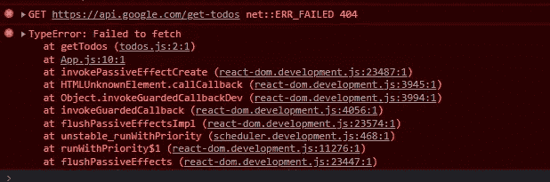

使用 mirage 时这不是问题，让我们创建一个名为 server.js 的文件

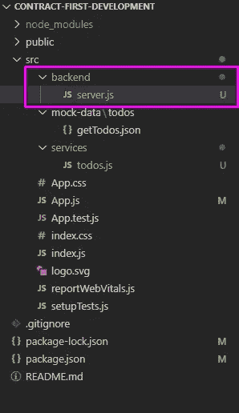

该文件将包含我们的 API 定义

在 routes 方法中，我们将为我们的 API 定义所有资源，正如你所注意到的，我们可以添加完整的 URL，但是我建议只使用资源，这只是作为一个例子。

另一个有趣的部分是路由的响应是一个箭头函数，这意味着我们可以在 mock 中添加更多的逻辑，但是在本例中，我们使用的是第一种方法中使用的 JSON 文件。

不要忘记改变你的 service/todo.js，记住现在我们是在为谷歌工作。

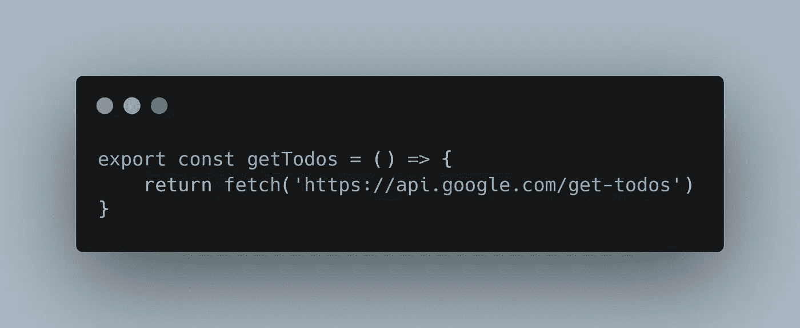

之后，在我们的 App.js 中，我们需要做两件事，第一件是导入我们的 server.js，然后在 useEffect 中运行它

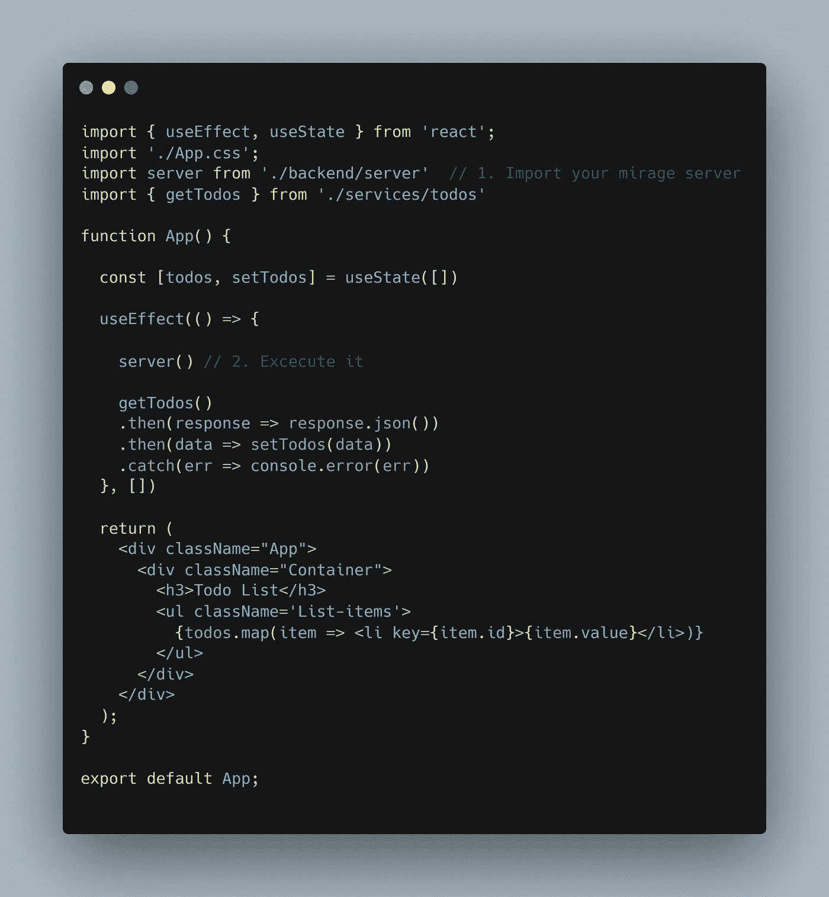

现在，如果您运行您的示例，您将在 web developer tools 中看到一个日志，它是记录哪个服务正在模仿的 mirage。

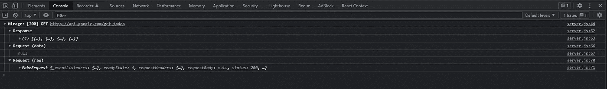

## 结论

我们可以使用许多其他工具来模拟我们的 API，根据您的需求使用其中的一种。重要的是，我们仍然可以在没有后端的情况下工作，有时会很困难，但这不再是借口。