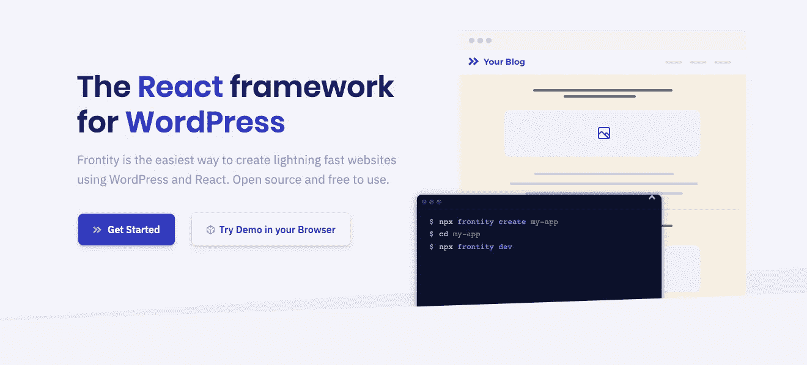
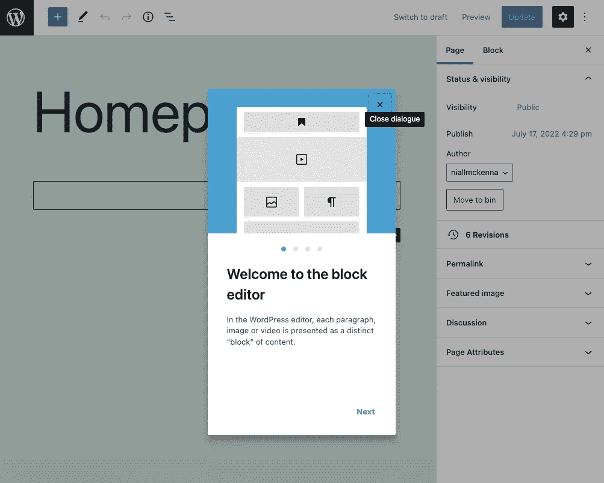

# 如何用 ReactJS & Frontity — Pt 建立一个无头 WordPress 网站？一

> 原文：<https://blog.devgenius.io/how-to-build-a-headless-wordpress-website-with-frontity-reactjs-pt-1-9cc49f63981e?source=collection_archive---------10----------------------->

我之前写过关于 WordPress 的 React 框架的 [Frontity](https://frontity.org/) *以及它如何成为一个 [**有用且非常简单的方法来将 WordPress**](/fronting-up-headless-wordpress-and-react-with-frontity-10422993a9db) 从它的前端解耦。使用 WordPress REST API 和 Frontity 允许你利用 ReactJS 的所有能力和它的组件驱动的设计模型为你的网站前端服务，并且仍然使用 WordPress 来存储和提供你的内容。*

在这个 **3 部分教程**中，我想总结一下你如何开始使用这个框架，用一个解耦的 WordPress 作为一个无头内容管理系统和一个 Frontity 前端应用程序来构建一个网站。虽然 Frontity 的文档很全面，但我发现当我建立我的第一个 Frontity 网站时，我不得不翻遍文档、基础教程，并在[社区论坛](https://community.frontity.org/)上提问，以获得一些问题的答案。Frontity 的“[入门](https://docs.frontity.org/getting-started/quick-start-guide)”教程向你展示了如何建立一个基本的博客，但我在 Frontity 的用例是一个 WordPress 网站，所以这篇教程的目的是告诉你我是如何做到的。

本教程将涵盖基本细节，但我还将包括相关文档的链接，在那里可以找到关于框架概念的完整解释。

## 在我开始之前。我将简要回顾一下 Frontity 到底是如何工作的。

这里有一个直接来自 Frontity 文档的概述…

“在 Frontity 项目中，WordPress 被用作一个无头或分离的 CMS，仅仅用于管理内容。Frontity 使用来自 WordPress REST API 的数据，并使用 React 生成显示在浏览器中的最终 HTML。

你仍然使用你的 WordPress 仪表盘以你习惯的方式编辑和创建内容。当你进行修改时，你的 Frontity 站点中的内容会自动更新，就像使用传统的 WordPress 主题一样。

**Frontity 应用需要 Node.js 服务器和 WordPress 服务器(PHP)才能运行。**有两种主要的前沿模式(架构或配置):

*   [**解耦模式**](/architecture/decoupled-mode) :在这种模式下，Frontity 从 WordPress 服务器的 REST API 获取数据，并将最终的 HTML 作为同构的 React 应用返回给访问者。
*   [**嵌入式模式**](/architecture/embedded-mode) :在这种模式下 [Frontity 嵌入式模式插件](https://api.frontity.org/frontity-plugins/embedded-mode)替换 PHP 主题，并向 Frontity 服务器请求检索 HTML 作为同构的 React 应用程序，由 WordPress 返回给访问者。

根据使用的模式，主域(如`www.domain.com`)将连接到 WordPress/PHP 服务器(嵌入式模式)或 Frontity/Node.js 服务器(分离模式)。”—[*Frontity 是如何工作的？*](https://docs.frontity.org/about)

*出于本教程的目的，我将只关注最常用的(也是我认为首选的)模式—* [***解耦模式***](/architecture/decoupled-mode) ***。***

# 第一步

如上所述， ***解耦模式*** 需要一个 WordPress 服务器。所以我首先想做的是找到一个主机提供商，并在上面安装 WordPress。假设你以前已经购买了域名和主机提供商，我就不告诉你这些细节了。只要你能安装 WordPress，那么你就可以开始了。

在你安装 WordPress 之前需要考虑的一件事是(虽然不是必须的)，如果你可以选择添加一个子域，有时最好将 WordPress 安装在像“wp.mydomain.com”这样的子域上，目的是将主域“mydomain.com”指向你的 Frontity 安装，该安装将在其他地方托管，我的建议是 Vercel，在大多数情况下，可以使用免费的软件包。或者，你的 WordPress 可以安装在一个完全不同的域名上。

Frontity 只适用于 WordPress 版本<= 6.0.1 so if you’ve installed a more recent version, which at the time of writing is the case, then you’ll need to roll back to this.

Frontity works out of the box without having to install anything else on the WordPress side. However, the documentation only covers manually added menus. If you want the menus on your frontend to be automatically added when you add menu items in WordPress, then you’ll need to add a plugin to your WordPress installation. You’ll need to install and activate the ***WP-REST-API V2 菜单*** 插件**。这个插件将有助于在 REST API 中显示你的菜单。**

假设你已经准备好了你的设计，你应该从添加页面开始，然后添加菜单到 WordPress。再说一次，我假设你在 2022 年已经熟悉了 WordPress 的基础知识，不再赘述。

现在，你应该有一些页面和菜单添加到你的 WordPress 安装中了。如果你导航到“***【mydomain.com/wp-json/menus/v1/locations】***”你会发现菜单确实已经在你的站点的 WordPress REST API 中暴露了。

你也可以试着给页面添加一些内容，我通常在 WordPress 块编辑器中这样做。基于我的设计，我将添加基本上概括和划分我的设计结构的块，将类名添加到我打算在 Frontity 中设计的内容节/div 中。这将包括图像、pdf 文档甚至联系表格等内容。重要的是要记住 WordPress 插件可以在 Frontity 前端应用中使用。

*继续阅读……*

*   [**如何用 Frontity / ReactJS — Pt 搭建一个无头 WordPress 网站？2**](https://medium.com/@mckenna.niall/how-to-build-a-headless-wordpress-website-with-frontity-reactjs-pt-2-3933990bab54) ****+**[**如何用 Frontity / ReactJS 构建一个无头的 WordPress 网站— Pt。3**](https://medium.com/@mckenna.niall/how-to-build-a-headless-wordpress-website-with-frontity-reactjs-pt-3-ff98d654ac75)**

**这个故事也可以@[https://www . nmk . dev/post/how-to-build-a-headless-WordPress-website-with-frontity-react js-pt-1-9cc 49 f 63981 e](https://www.nmk.dev/post/how-to-build-a-headless-wordpress-website-with-frontity-reactjs-pt-1-9cc49f63981e)**