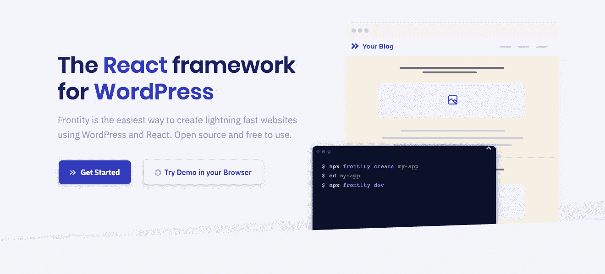
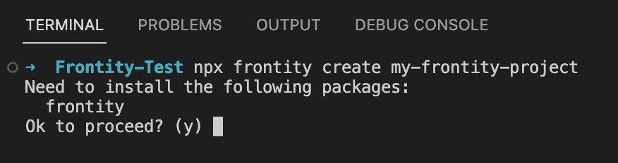

# 如何用 ReactJS & Frontity - Pt 建立一个无头 WordPress 网站？2

> 原文：<https://blog.devgenius.io/how-to-build-a-headless-wordpress-website-with-frontity-reactjs-pt-2-3933990bab54?source=collection_archive---------13----------------------->



设置 Frontity 项目的后续步骤…

**步骤 2:** 因为 Frontity 是一个 React 框架，所以在创建项目之前，您需要安装 Node。确保这样做，然后通过在终端中输入以下命令创建一个新的 Frontity 项目:

```
npx frontity create my-frontity-project
```

您将收到以下提示:



第一终端消息提示

输入(y)继续。在安装过程中，终端将再次提示您以下信息:


第二终端消息提示

您将被要求选择一个起始主题。建议如果是第一次使用 Frontity，那么应该选择`@frontity/mars-theme`开始使用。通过使用 Mars-Theme，Frontity 本质上给了你一个完全自举的项目，它有一个可以轻松定制的启动主题。Frontity 文档也将使用 Mars 主题作为参考，因此很容易遵循 Frontity 自己的安装和定制指南。一旦您选择了这个，安装将完成，并且将创建一个与您使用的项目名称同名的目录。它将具有与此类似的结构:

```
my-frontity-project/
|__ node_modules/
|__ package.json
|__ frontity.settings.js
|__ favicon.ico
|__ packages/
    |__ mars-theme/
```


您的 Frontity 项目安装后的样子

通过从终端执行以下命令，您可以在本地运行项目:

```
cd my-frontity-project && npx frontity dev
```

这样做将在 [http://localhost:3000/](http://localhost:3000/) 加载您的 Frontity 项目，在这里您将看到您也安装了 Mars-Theme。它应该如下所示:


用火星主题测试 Frontity 博客

目前，你的 Frontity 项目正在使用 Frontity 自己的测试 WordPress 网站——[https://test.frontity.org/](https://test.frontity.org/)的内容数据。这是个好消息，因为这意味着你的 Frontity 项目正在从 WordPress REST API 中提取数据，只是还不是你自己的站点。所以让我们来解决这个问题…

在你的 Frontity 项目中，在你选择的 I.D.E .中打开`frontity.settings.js`。您应该会看到以下代码:

```
const settings = {
  ...,
  packages: [
    ...,
    {
      name: "[@frontity/wp-source](http://twitter.com/frontity/wp-source)",
      state: {
        source: {
          // Change this url to point to your WordPress site.
          url: "[https://test.frontity.org/](https://test.frontity.org/)"
        }
      }
    }
  ]
}
```

要将你自己的 WordPress 安装设置为数据源，你可以通过设置`frontity.settings.js`文件中的`state.source.url`属性将你自己的 WordPress 站点连接到你的 Frontity 项目。

由于本教程的重点是比 Frontity 文档中使用的例子更深入一点，所以在 WordPress 安装端你还需要做一个改变…

Frontity WordPress 测试站点([https://test.frontity.org/](https://test.frontity.org/))是一个博客，Frontity 文档中的例子假设你正在建立一个博客站点。然而，我的教程告诉你如何建立一个包含博客的网站。因此，如果你自己的 WordPress 安装有页面，但此时没有帖子，你可能不会在本地主机上的 Mars-Theme 中看到你的内容。要解决这个问题，回到你的 WordPress 网站，进入你的网站主页，点击顶部管理栏中的“定制”。然后，您将看到以下内容:


WordPress 中的侧面定制面板

点击“主页设置”,然后将您的主页设置为静态页面，如下所示:


这里还有一个设置你的文章页面的选项，如果你已经添加了一个文章/博客页面，你也可以在这里设置。

一旦这些都设置好了，回到你的 Frontity 项目，再次打开`frontity.settings.js`文件。在此设置文件中，您可以通过添加以下内容来反映您刚才所做的更改:

```
const settings = {
  ...,
  packages: [
    ...,
    {
      name: "[@frontity/wp-source](http://twitter.com/frontity/wp-source)",
      state: {
        source: {
          // Change this url to point to your WordPress site.
          url: "[https://test.frontity.org/](https://test.frontity.org/)", 
          homepage: "[/](http://twitter.com/frontity/wp-source)homepage", 
          postsPage: "/blog"
        }
      }
    }
  ]
}
```

现在，您将看到您的静态主页以 Mars-Theme 呈现在您的本地主机中。你还会注意到它没有使用你的 WordPress 站点的菜单，而是仍然显示与 Frontity 测试站点相关的菜单。这实际上是硬编码在`frontity.settings.js`的火星主题中。让我们删除这些菜单项，取而代之的是从 WordPress 安装中提取动态菜单，从 REST API 调用。请记住，我们已经在 WordPress REST API 端公开了这一点，所以我们只需在 Frontity 项目中做一些更改就可以让它工作了。

首先，在`frontity.settings.js`的“套餐”/“名称”/“状态”/“主题”下，你会看到“菜单”，看起来如下:

```
"menu": [
  [
    "Home",
    "/"
  ],
  [
    "Nature",
    "/category/nature/"
  ],
  [
    "Travel",
    "/category/travel/"
  ],
  [
    "Japan",
    "/tag/japan/"
  ],
  [
    "About Us",
    "/about-us/"
  ]
],
```

从`frontity.settings.js`中删除以上内容。完成后，打开 Frontity 项目的 Mars-Theme — `src/components/`中“src”目录下的“组件”目录，并在组件目录— `src/components/handlers`中添加一个名为“处理程序”的新目录。然后在`src/components/handlers/menu-handlers.js`里面添加一个`menu-handlers.js`文件。为了从 WordPress API 获取实体，我们需要添加一个处理程序。这将是一个`menuHandler.js`组件，它将包含以下代码:

```
const menuHandler = {
    name: "menus",
    priority: 10,
    pattern: "/menu/:slug",
    func: async ({ link, params, state, libraries }) => {
        console.log("PARAMS:", params);
        const { slug } = params;// Fetch the menu data from the endpoint
        const response = await libraries.source.api.get({
            endpoint: `/menus/v1/menus/${slug}`,
        });// Parse the JSON to get the object
        const menuData = await response.json();// Add the menu items to source.data
        const menu = state.source.data[link];
        console.log(link);
        Object.assign(menu, {
            items: menuData.items,
            isMenu: true,
        });
    },
};export default menuHandler;
```

一旦添加了处理程序，就需要将其导入到您的`index.js`文件— `packages/mars-theme/src/index.js`中。看起来将如下所示:

```
// ...
import menuHandler from "./components/handlers/menu-handler";// ...libraries: {
  // ...
  source: {
    handlers: [menuHandler],
  },
},
```

您还必须向 actions 对象添加一个 beforeSSR 方法，如下所示:

```
actions: {
  theme: {
    // ...
    beforeSSR: async ({ state, actions }) => {
      await actions.source.fetch(`/menu/${state.theme.menuUrl}/`);
    }
  },
},
```

此时，你应该能够在`menu-handler.js`的`console.logs`中看到你的 WordPress 网站的菜单数据。你现在需要做的就是创建你自己的`Navigation.js`组件。我不打算涵盖这一部分的所有细节，因为这很大程度上取决于您的网站设计，但是我将解释如何从 REST API 将菜单数据放入组件。您的组件应该如下所示:

```
const Nav = ({ state }) => {
  const items = state.source.get(`/menu/${state.theme.menuUrl}`).items; console.log('ITEMS:', items); <SiteNavigation>
   ...
  </SiteNavigation>}
```

**Frontity 将状态定义为*“一个包含你的包所暴露的所有状态的 JavaScript 对象”*。**

添加动态菜单到此结束。
[了解更多关于从 WordPress REST API 获取菜单的信息](https://youtu.be/BMJn0RZ2I9s)

*继续阅读…*
**+**[**如何用 Frontity / ReactJS 构建一个无头 WordPress 网站— Pt。3**](https://medium.com/@mckenna.niall/how-to-build-a-headless-wordpress-website-with-frontity-reactjs-pt-3-ff98d654ac75)

回到…
**+** [**如何用 Frontity / ReactJS 构建一个无头 WordPress 网站— Pt。1**](https://medium.com/@mckenna.niall/how-to-build-a-headless-wordpress-website-with-frontity-reactjs-pt-1-9cc49f63981e)

这个故事也可以@ https://www . nmk . dev/post/how-to-build-a-headless-WordPress-website-with-frontity-react js-pt-2-3933990 Bab 54