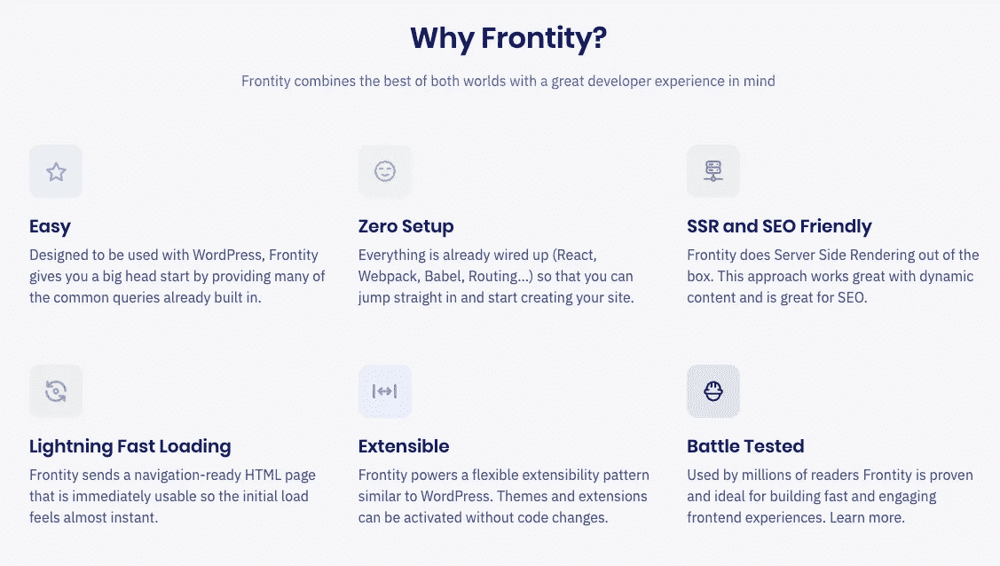

# 如何用 ReactJS & Frontity — Pt 建立一个无头 WordPress 网站？3

> 原文：<https://blog.devgenius.io/how-to-build-a-headless-wordpress-website-with-frontity-reactjs-pt-3-ff98d654ac75?source=collection_archive---------9----------------------->



尝试 Frontity 的理由

向 Frontity 项目添加内容非常简单。事实上，火星主题包括了所有能为你挑起重担的组件。让我们从您期望的地方开始:`src/components/index.js`。该组件看起来如下所示:

```
import { Global, css, connect, styled, Head } from "frontity";
import Switch from "[@frontity/components](http://twitter.com/frontity/components)/switch";
import Header from "./header";
import List from "./list";
import Post from "./post";
import Loading from "./loading";
import Title from "./title";
import PageError from "./page-error";/**
 * Theme is the root React component of our theme. The one we will export
 * in roots.
 *
 * [@param](http://twitter.com/param) props - The props injected by Frontity's {[@link](http://twitter.com/link) connect} HOC.
 *
 * [@returns](http://twitter.com/returns) The top-level react component representing the theme.
 */
const Theme = ({ state }) => {
  // Get information about the current URL.
  const data = state.source.get(state.router.link);return (
    <>
      {/* Add some metatags to the <head> of the HTML. */}
      <Title />
      <Head>
        <meta name="description" content={state.frontity.description} />
        <html lang="en" />
      </Head>{/* Add some global styles for the whole site, like body or a's. 
      Not classes here because we use CSS-in-JS. Only global HTML tags. */}
      <Global styles={globalStyles} />{/* Add the header of the site. */}
      <HeadContainer>
        <Header />
      </HeadContainer>**{/* Add the main section. It renders a different component depending
      on the type of URL we are in. */}
      <Main>
        <Switch>
          <Loading when={data.isFetching} />
          <List when={data.isArchive} />
          <Post when={data.isPostType} />
          <PageError when={data.isError} />
        </Switch>
      </Main>**
    </>
  );
};
```

上面，我用粗体突出显示了将加载内容的组件部分。就像在其他 React 框架中一样，Frontity 使用一个`<Switch>`组件进行页面路由，它包含一个`post.js`组件，WordPress 数据实际上就是从这个组件中获取的。

`post.js`组件将如下所示:

```
import { useEffect } from "react";
import { connect, styled } from "frontity";
import Link from "./link";
import List from "./list";
import FeaturedMedia from "./featured-media";/**
 * The Post component that Mars uses to render any kind of "post type", like
 * posts, pages, attachments, etc.
 *
 * It doesn't receive any prop but the Frontity store, which it receives from
 * {[@link](http://twitter.com/link) connect}. The current Frontity state is used to know which post type
 * should be rendered.
 *
 * [@param](http://twitter.com/param) props - The Frontity store (state, actions, and libraries).
 *
 * [@example](http://twitter.com/example)
```js
 * <Switch>
 *   <Post when={data.isPostType} />
 * </Switch>
```
 *
 * [@returns](http://twitter.com/returns) The {[@link](http://twitter.com/link) Post} element rendered.
 */
const Post = ({ state, actions, libraries }) => {
  // Get information about the current URL.
  const data = state.source.get(state.router.link);
  // Get the data of the post.
  const post = state.source[data.type][data.id];
  // Get the data of the author.
  const author = state.source.author[post.author];
  // Get a human readable date.
  const date = new Date(post.date);**// Get the html2react component.
  const Html2React = libraries.html2react.Component;**/**
   * Once the post has loaded in the DOM, prefetch both the
   * home posts and the list component so if the user visits
   * the home page, everything is ready and it loads instantly.
   */
  useEffect(() => {
    actions.source.fetch("/");
    List.preload();
  }, [actions.source]);// Load the post, but only if the data is ready.
  return data.isReady ? (
    <Container>
      <div>
        **<Title dangerouslySetInnerHTML={{ __html: post.title.rendered }} />**{/* Hide author and date on pages */}
        **{!data.isPage && (
          <div>
            {author && (
              <StyledLink link={author.link}>
                <Author>
                  By <b>{author.name}</b>
                </Author>
              </StyledLink>
            )}
            <DateWrapper>
              {" "}
              on <b>{date.toDateString()}</b>
            </DateWrapper>
          </div>
        )}**
      </div>{/* Look at the settings to see if we should include the featured image */}
      {state.theme.featured.showOnPost && (
        <FeaturedMedia id={post.featured_media} />
      )}{data.isAttachment ? (
        // If the post is an attachment, just render the description property,
        // which already contains the thumbnail.
        **<div dangerouslySetInnerHTML={{ __html: post.description.rendered }} />**
      ) : (
        // Render the content using the Html2React component so the HTML is
        // processed by the processors we included in the
        // libraries.html2react.processors array.
        <Content>
          **<Html2React html={post.content.rendered} />**
        </Content>
      )}
    </Container>
  ) : null;
};
```

我突出显示了将自动获取内容数据并根据它是页面还是文章来显示的区域。该组件从 **Frontity 状态**获取数据，然后有条件地呈现页面或帖子所需的页面部分。`dangerouslySetInnerHTML`用于设置“标题”和“描述”等元数据，但主页面内容数据是使用 Frontity 内置的一个名为`html2react`的库显示的。Frontity 将**库**定义为**“一组可重用的工具。但是，它的目的不是改变状态，而是改变应用程序的其他部分，并且可供许多软件包使用。—**[https://docs.frontity.org/learning-frontity](https://docs.frontity.org/learning-frontity)—核心概念

到现在为止，你的 Frontity 项目将会显示 WordPress 网站的内容和动态菜单。如果您在浏览器检查器中检查内容，您可以看到我之前推荐添加到 WordPress 块编辑器中的 div 和 sections 的类名(基于您自己的设计)。剩下您要做的就是在组件中构建您的设计，就像您对任何 React 应用程序从 Frontity 的 API 获取各种数据一样。JS 中的 CSS 用于设计你的应用程序，意味着你的 CSS 可以包含在每个组件中。但是为什么在 JS 中使用 CSS 呢？

因为:

*   **它只加载每个页面所需的 CSS**，从而提高了性能
*   你不必担心类和它的重复、错别字等问题
*   你不必担心厂商前缀，这样你就可以基于当前标准编写你的 CSS，Frontity 会为你处理剩下的事情
*   您可以使用 JavaScript 的所有**功能来设计您的组件，并用更少的代码创建动态样式。**

***现在你有了它，你的第一个 WordPress 和 Frontity 应用开始运行了。具有 Frontity 和 ReactJS 的解耦 WordPress。尽情享受吧！***

回到…
**+** [**如何用 Frontity/react js-Pt 搭建一个无头 WordPress 网站？1**](https://medium.com/@mckenna.niall/how-to-build-a-headless-wordpress-website-with-frontity-reactjs-pt-1-9cc49f63981e)

*   [**如何用 Frontity / ReactJS 构建一个无头 WordPress 网站— Pt。2**](https://medium.com/@mckenna.niall/how-to-build-a-headless-wordpress-website-with-frontity-reactjs-pt-2-3933990bab54)

这个故事也可以@[https://www . nmk . dev/post/how-to-build-a-headless-WordPress-website-with-frontity-react js-pt-3-ff 98d 654 AC 75](https://www.nmk.dev/post/how-to-build-a-headless-wordpress-website-with-frontity-reactjs-pt-3-ff98d654ac75)