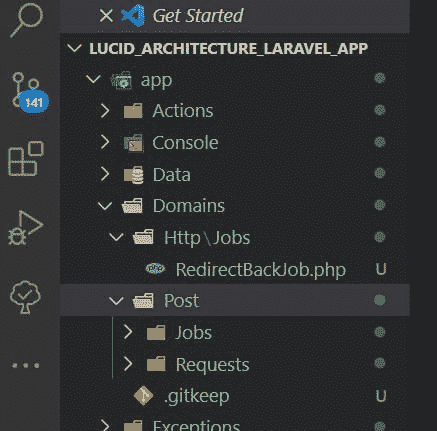

# 如何使用 Lucid 架构构建 Laravel 应用程序

> 原文：<https://blog.devgenius.io/how-to-build-a-laravel-application-using-lucid-architecture-34c42c839065?source=collection_archive---------2----------------------->


在本文中，我们将使用 lucid architecture——微变体——构建一个博客应用程序。

建筑是相互连接的结构的集合，或者是建造某物的艺术和过程。在本教程的上下文中，我们将看到构建 laravel 应用程序的艺术和过程。

Lucid 来自 Vinelab，作者为 [@mulkave](https://twitter.com/mulkave) 和[Abed Halawi——用于构建可扩展应用的 lucid 架构——Laracon EU 2016](https://www.youtube.com/watch?v=wSnM4JkyxPw)担任技术负责人。

“Lucid 是一个软件架构，用于构建可扩展的 Laravel 项目。

它在核心部分结合了命令总线和域驱动设计，在此基础上构建了一个目录和类的堆栈来组织业务逻辑。它还从 SOA(面向服务的体系结构)中派生出将功能封装在服务中的概念，并丰富了这个概念，使其不仅仅是一个类。"

使用 Lucid 来:

*   毫不费力地编写干净的代码
*   保护您的代码不会随着时间的推移而恶化
*   用通常所需时间的一小部分来评审代码
*   在您的应用程序中加入经过验证的实践和模式
*   导航代码并在代码库之间移动[来源](https://madewithlaravel.com/lucid)

这个架构融合了最佳实践、设计模式和经过验证的方法，我们决定将它们融入到代码的最前端。

Lucid 的内置模式是命令总线和域驱动设计，在此基础上，它构建了一系列目录和单元来组织业务逻辑。它还从 SOA(面向服务的体系结构)中派生出将功能封装在“服务”中的概念，并丰富了这个概念，使其不仅仅是一个类。

*   命令总线:分派工作单元。用通俗易懂的术语来说，这些单元将是一个特征、一项工作或一项操作。
*   领域驱动设计:通过根据工作单元所属的主题对它们进行分类来组织工作单元。
*   面向服务的架构:封装和管理具有相同目的的功能及其所需的资源(路由、控制器、视图、数据库迁移等)。)

**位置**

在一个典型的 MVC 应用程序中，Lucid 将是应用程序入口点和完成工作的单元之间的纽带，保护代码不会向极端的方向弯曲:


**堆栈**


阅读更多关于[清晰概念](https://docs.lucidarch.dev/concept/)或[清晰建筑 Abed Halawi 的概念](https://tech.vinelab.com/the-lucid-architecture-concept-ad8e9ed0258f)

**哲学**

我们想要简单的[吻]但在规模上有效。愉快地与所有级别的工程师一起工作。并且在整个陡峭的学习过程中提升理解抽象的水平。简单来说:

> *Lucid 是一套依靠我们的纪律来保持的原则*

更多关于[清晰哲学](https://docs.lucidarch.dev/philosophy/)

*   特征应服务于单一目的
*   作业应执行单一任务
*   域名不应该交叉
*   功能不应调用其他功能
*   作业不应调用其他作业
*   操作不得调用其他操作
*   控制器提供功能
*   编写人类可读的代码

一个单一目的的项目，包含适合类似环境的适量功能。

它包含 Lucid 堆栈的基本单元:域、特性、操作和数据，补充了 Laravel 框架:


> *什么时候使用微？*

Micro 适用于大多数项目，包括在某个时候应该成为实际产品的快速原型，这正是 Lucid 的用武之地，以减少随着时间的推移而强加的技术债务。或者旨在按规模组织的 API 项目。

顾名思义，它们最适合微服务，在这种情况下，您会有多个 Laravel * Lucid Micro 实例，每个实例代表您系统中的一个微服务。

> *安装*

Lucid Architecture 是作为一个 Composer 包 lucidarch/lucid 交付的。为了了解如何使用 lucid 微体系结构构建 laravel 应用程序，我们将构建一个简单的博客应用程序。

让我们从一个全新的 laravel 9 应用程序安装开始

```
laravel new lucid_architecture_laravel_app 
```

> *接下来，安装 Lucid*

```
composer require lucidarch/lucid
```

> *确保将 Composer 的项目供应商 bin 目录放在您的 PATH 中，这样 lucid 可执行文件就可以在您的系统中找到。通常，这是通过运行 export PATH="$PATH:。/vendor/bin "在您当前的终端会话中可用，或者将其添加到您相应的终端配置文件(例如~ ~/。bashrc，~/。bash_profile，~/。zshrc)在每次会话中永久加载它。*

```
export PATH="$PATH:./vendor/bin"
```


> *接下来，初始化一个微实例:*

[Lucid Micro](https://docs.lucidarch.dev/getting-started/micro/) 是单一用途应用的默认变体。

```
lucid init:micro
```

这将产生初始微结构:


> *接下来，提供应用程序*

```
php artisan serve
```


**清晰堆栈**

尽量减少控制器的工作，因为它们不是为应用程序工作，而是将请求指向正确的方向。简单地说，就是为用户提供预期的功能。

最终，我们将在每个控制器方法中有一行代码，实现尽可能薄的形式。

职责:为指定的功能服务。

在类中表示一个人类可读的应用程序特性，以你向你的同事和客户描述它的方式命名。它包含了以最小的摩擦和细节水平实现特性的逻辑，以保持简洁和直截了当。

它运行清晰的单元:作业和操作来执行它的任务。它们被认为是服务于其目的的过程中的步骤。一个特性可以从任何地方提供，最常见的是控制器和命令。也可以使用 Laravel 强大的排队功能排队异步运行。

从技术上讲，它是一个封装了单个请求/响应生命周期(或命令)所需的所有功能的类，其中 handle 方法表示当您希望在应用程序中实现它时的任务列表。

作业通过实现业务逻辑来完成实际的工作。作为 Lucid 中最小的单元，工作应该做一件事，而且只能做一件事——那就是:执行一个单一的任务。它们是我们有时希望拥有的代码片段，可以插入到我们应用程序的任何地方使用。

我们对工作的目标是限制单一功能的范围，以便我们知道在哪里找到它，当我们在它的上下文中时，我们不会将责任与其他工作混淆，以实现单一责任原则的最终形式。

通常由一个特性或一个操作调用，但是一旦被设置为自定义调度程序，可以由任何其他类从任何地方调用；因此，是最可共享的代码。

受领域驱动开发的启发，Lucid stack 的这一部分仅仅是目录，它们都是关于根据代码所属的主题来组织和分类代码。

没有具体的命名方法，因为每个案例都不一样，但是根据我们多年的经验，我们发现它们通常有两种类型,“内部”和“外部”类型的域。这里有几个例子来说明区别



> *请求类似于* [*Laravel 表单验证*](https://laravel.com/docs/9.x/validation#form-request-validation) *我们可以使用 lucid 命令创建一个定制请求来保持它们的组织性。*
> 
> *从 Lucid 堆栈中，我们将使用特性、作业、域和请求来实现以下内容:*
> 
> *接下来，在。环境文件*

```
DB_CONNECTION=mysql 
DB_HOST=127.0.0.1 
DB_PORT=3306 
DB_DATABASE=lucid_architecture_laravel_app 
DB_USERNAME=root DB_PASSWORD=
```

> *接下来，创建帖子表*

```
php artisan make:migration create_posts_table - -create=posts 
```

> *增加以下栏目*

```
$table->foreignId('user_id');
$table->string('title');
$table->text('description');
```

> *接下来，运行迁移命令*

```
php artisan migrate
```

> *接下来，使用 lucid 命令创建 PostController 来管理帖子，并为服务特性做好准备。*

```
lucid make:controller Post
```


> *在 app/Http/Controllers/post controller . PHP*找到

```
<?phpnamespace App\Http\Controllers;use Lucid\Units\Controller;class PostController extends Controller
{}
```

**注意控制器后缀的自动添加，用作命名约定以匹配 Lucid 堆栈中的其他后缀，如特性、作业和操作。**

> *接下来，使用 lucid 命令*创建 Post 模型

```
lucid make:model Post
```


> *更新岗位模型*

```
<?phpnamespace App\Data\Models;use App\Models\User;
use Illuminate\Database\Eloquent\Model;
use Illuminate\Database\Eloquent\Casts\Attribute;
use Illuminate\Database\Eloquent\Factories\HasFactory;class Post extends Model
{
    use HasFactory;protected $fillable = [
        'title', 'description'
    ];//setup the relationship with the users table
    public function user()
    {//User model comes as default in laravel but you may wish to use the lucid command to create one
        return $this->belongsTo(User::class);
    }//cast the created at attribute to be readable by humans
    public function created_at(): Attribute
    {
        return new Attribute(
            get: fn ($value) => $value->diffForHumans(),
        );
    }
}
```

> *更新用户模型*

```
<?phpnamespace App\Models;//models created using lucid command are placed in the data folder
use App\Data\Models\Post;use Laravel\Sanctum\HasApiTokens;
use Illuminate\Notifications\Notifiable;
use Illuminate\Database\Eloquent\Factories\HasFactory;
use Illuminate\Foundation\Auth\User as Authenticatable;class User extends Authenticatable
{
    use HasApiTokens, HasFactory, Notifiable;protected $fillable = [
        'name',
        'email',
        'password',
    ];protected $hidden = [
        'password',
        'remember_token',
    ];protected $casts = [
        'email_verified_at' => 'datetime',
    ];public function posts()
    {
        return $this->hasMany(Post::class);
    }
}
```

> *接下来，在 routes/web.php 文件中为博客应用程序的不同部分设置路由*

```
<?phpuse Illuminate\Support\Facades\Route;
use App\Http\Controllers\PostController;Route::controller(PostController::class)->group(function () {
    Route::get('/', 'all_posts');
    Route::get('/home', 'index')->name('home');
});Route::middleware(['auth', 'verified'])->group(function () {
    Route::resource('posts', PostController::class);
});
```

> *接下来，让我们使用 lucid 命令创建一个特征，并返回创建帖子表单视图*

```
lucid make:feature CreatePostFeature
```

**要素类 CreatePostFeature 创建成功。**

```
public function create()
    {
        return $this->serve(CreatePostFeature::class);
    }
```

> *CreatePostFeature.php*

```
<?phpnamespace App\Features;use Lucid\Units\Feature;class CreatePostFeature extends Feature
{
    public function handle()
    {
        return view('posts.create');
    }
}
```

> *接下来，存储帖子*

```
lucid make:feature StorePostFeature
```

**要素类 StorePostFeature 创建成功。**

```
public function store()
    {
        return $this->serve(StorePostFeature::class);
    }
```

> *为表单提交创建请求验证*

接收输入的第一步是验证它。我们将使用[表单请求验证](https://laravel.com/docs/9.x/validation#form-request-validation)，其中每个请求属于一个代表被管理实体的域，在本例中，它是包含 StorePost 请求类的 Post。

这将是在 Lucid 中使用域的开始。它们用于根据领域驱动的设计，对逻辑与特定主题相关联的作业和定制类进行分组。

从验证开始，Lucid places 在它们相应的域中请求类。让我们生成一个 StorePost 请求:

```
lucid make:request StorePost Post
```

**请求类创建成功。**

在 app \ Domains \ Post \ Requests \ store Post . PHP 找到它

在 StorePost 中，我们需要更新 authorize()和 rules()方法，它们是默认创建的，用于验证请求及其输入:

```
<?phpnamespace App\Domains\Post\Requests;
use Illuminate\Foundation\Http\FormRequest;class StorePost extends FormRequest
{
    public function authorize()
    {
        return true;
    }public function rules()
    {
        return [
            'title' => ['required', 'string', 'max:255'],
            'description' => ['required', 'string'],
        ];
    }
}
```

我们的请求准备好了，现在我们需要 StorePostFeature 在服务时使用请求类。我们可以通过简单地在特性的 handle()方法中注入 request 类来做到这一点，并且每次为该特性提供服务时，都会应用该验证。

```
public function handle(StorePost $request)
```

为了保存帖子，我们将创建一个保存帖子的作业，并在我们的功能中运行该作业，该作业将被添加到 app/Domains/Post/Jobs/SavePostJob 的帖子域中。

```
lucid make:job SavePost Post
```

**作业类 SavePostJob 创建成功。**

在 app \ Domains \ Post \ Jobs \ savepostjob . PHP 中找到它

SavePostJob 应该定义其构造函数(也称为作业签名)中所需的参数，而不是从请求中访问数据，以便我们可以从应用程序中的其他位置(例如，从命令或自定义类)调用该作业，而不受协议(在本例中为 HTTP 请求)的限制。

我们使用这种技术来提高工作隔离的程度，并确保单一责任原则。

```
<?phpnamespace App\Domains\Post\Jobs;use Lucid\Units\Job;
use App\Data\Models\Post;
use Illuminate\Support\Facades\Auth;class SavePostJob extends Job
{public function __construct(public $title, public $description)
    {}public function handle()
    {
        $attributes = [
            'title' => $this->title,
            'description' => $this->description,
        ];$post = new Post($attributes);
        $user = Auth::user();return $user->posts()->save($post);
    }
}
```

> *然后，我们将从该功能运行此作业，以在收到帖子时保存帖子:*

```
<?phpnamespace App\Features;use Lucid\Units\Feature;
use App\Domains\Post\Jobs\SavePostJob;
use App\Domains\Post\Requests\StorePost;class StorePostFeature extends Feature
{
    public function handle(StorePost $request)
    {
        $this->run(SavePostJob::class, [
            'title' => $request->input('title'),
            'description' => $request->input('description'),
        ]);
    }
}
```

在功能中调用$this->run($unit，$params)会导致底层调度程序在使用提供的$params 初始化 SavePostJob 后，通过调用其 handle 方法来同步运行 SavePostJob，这些$ params 作为关联数组传递，其中键必须与作业的构造函数参数在命名上匹配，但顺序不同。所以这仍然是一样的:

```
$this->run(SavePostJob::class, [
            'description' => $request->input('description'),
            'title' => $request->input('title'),
        ]);
```

下一步是将成功的请求重定向回创建表单。为此，我们将创建一个 RedirectBackJob，它将简单地回调()。尽管这看起来像是一种开销，但是请记住，我们是为扩展而设置的，随着我们的扩展，自由形式的代码越少越好；我们没有使用大量 back()和 back()->withInput()和其他调用，而是将它们集中在一个作业中，以便在我们想要修改或添加功能时，只需要在一个地方进行更改。

RedirectBackJob 将驻留在一个新的 HTTP 域中，这是一个放置所有 Http 相关功能的地方，这些功能并不特定于应用程序的业务实体，适合抽象类型的域，而不是实体类型。

```
lucid make:job RedirectBackJob http
```

已成功创建作业类 RedirectBackJob。

在 app \ Domains \ Http \ Jobs \ redirect back job . PHP 中找到它

我们的工作将提供选项 withMessage 来确定消息是否应该包含在重定向中。这是一个简单的例子，说明这样一个简单的作业如何在以后提供可以跨应用程序共享的功能。

```
<?phpnamespace App\Domains\Http\Jobs;use Lucid\Units\Job;class RedirectBackJob extends Job
{//PHP 8 constructor
    public function __construct(private $withMessage){}/**
     * Execute the job.
     *
     * [@return](http://twitter.com/return) void
     */
    public function handle()
    {
        $back = back();if ($this->withMessage) {
            //custom success message
            $back->with('success', $this->withMessage);
        }
        return $back;
    }
}
```

> *接下来，让我们更新 StorePostFeature，以便在创建帖子后使用重定向作业*

```
<?phpnamespace App\Features;use Lucid\Units\Feature;
use App\Domains\Post\Jobs\SavePostJob;
use App\Domains\Post\Requests\StorePost;
use App\Domains\Http\Jobs\RedirectBackJob;class StorePostFeature extends Feature
{
    public function handle(StorePost $request)
    {
        $this->run(SavePostJob::class, [
            'title' => $request->input('title'),
            'description' => $request->input('description'),
        ]);return $this->run(RedirectBackJob::class, [
            'withMessage' => 'Post created successfully.',
        ]);}
}
```

> *接下来，创建一个方法来处理用户显示的所有帖子，我们称之为 all_posts:*

```
public function all_posts(){
        return $this->serve(AllPostsFeature::class);
    }
```

> *创建由 all_posts 方法提供服务的 AllPostsFeature，以返回所有帖子*

```
lucid make:feature AllPostsFeature
```

> *AllPostsFeature.php*

```
<?phpnamespace App\Features;use Lucid\Units\Feature;
use App\Data\Models\Post;class AllPostsFeature extends Feature
{//The handle method is automatically created by the Lucid command which we'll use to return all the postspublic function handle()
    {
            $posts = Post::latest()->get();return view('home', compact('posts'));}
}
```

> *更新后控制器*中的 all_posts 方法

```
public function all_posts(){
        return $this->serve(AllPostsFeature::class);
    }
```

> *接下来，创建一个索引方法来处理用户创建的文章列表:*

```
public function index()
    {}
```

然后，索引方法将服务于运行显示帖子所需的作业的功能。生成名为 PostsIndexFeature 的要素:

```
lucid make:feature PostsIndexFeature
```

**要素类 PostsIndexFeature 创建成功。**

在 app \ Features \ postsindexfeature . PHP 中找到它

> *接下来更新索引方法以服务于文章索引特性*

```
<?phpnamespace App\Http\Controllers;use Lucid\Units\Controller;
use App\Features\PostsIndexFeature;class PostController extends Controller
{
    public function index(){
        return $this->serve(PostsIndexFeature::class);
    }}
```

> *PostsIndexFeature 中的 handle 方法是由 Lucid 命令自动创建的，我们将用它来返回所有的帖子*

```
<?phpnamespace App\Features;use Lucid\Units\Feature;
use App\Data\Models\Post;
use Illuminate\Support\Facades\Auth;class PostsIndexFeature extends Feature
{
    public function handle()
    {$posts = Post::where('user_id', Auth::user()->id)->latest()->get();return view('posts.index', compact('posts'));
    }
}
```

**使用上述功能、作业和请求的相同方法用于以下章节:**

> *显示帖子部分:*

```
lucid make:feature ShowPostFeature
```

已成功创建要素类 ShowPostFeature。

在 app \ Features \ showpost feature . PHP 中找到它

> *更新 ShowPostFeature.php*

```
<?phpnamespace App\Features;use Lucid\Units\Feature;
use App\Data\Models\Post;class ShowPostFeature extends Feature
{
    public function __construct(
        public Post $post,
    ) {
    }public function handle()
    {
        return view('posts.show')->with('post', $this->post);
    }
}
```

> *显示后控制器中的方法*

```
public function show(Post $post)
    {
        return $this->serve(ShowPostFeature::class, [
            'post' => $post,
        ]);
    }
```

> *编辑和更新帖子部分:*

```
lucid make:feature EditPostFeature
```

要素类编辑后要素已成功创建。

在 app \ Features \ editpostfeature . PHP 中找到它

> *更新 EditPostFeature.php*

```
<?phpnamespace App\Features;use Lucid\Units\Feature;
use App\Data\Models\Post;class EditPostFeature extends Feature
{
    public function __construct(
        public Post $post,
    ) {
    }public function handle()
    {
        return view('posts.edit')->with('post', $this->post);;
    }
}
```

> *后控制器中的编辑方法*

```
public function edit(Post $post)
    {
        return $this->serve(EditPostFeature::class, [
            'post' => $post,
        ]);
    }
```

> *后控制器中的更新方法*

```
lucid make:feature UpdatePostFeature
```

要素类 UpdatePostFeature 已成功创建。

在 app \ Features \ updatepostfeature . PHP 中找到它

> *创建更新发布作业*

```
lucid make:job UpdatePost Post
```

**作业类 UpdatePostJob 创建成功。**

在 app \ Domains \ Post \ Jobs \ updatepostbjob . PHP 中找到它

**UpdatePostJob.php**

```
<?phpnamespace App\Features;use Lucid\Units\Feature;
use App\Data\Models\Post;
use App\Domains\Post\Jobs\UpdatePostJob;
use App\Domains\Post\Requests\StorePost;
use App\Domains\Http\Jobs\RedirectBackJob;class UpdatePostFeature extends Feature
{
    public function __construct(
        public Post $post,
    ) {
    }public function handle(StorePost $request)
    {$this->run(UpdatePostJob::class, [
            'post' => $this->post,
            'title' => $request->input('title'),
            'description' => $request->input('description'),
        ]);return $this->run(RedirectBackJob::class, [
            'withMessage' => 'Post updated successfully.',
        ]);
    }}
```

> *更新 UpdatePostFeature.php*

```
<?phpnamespace App\Features;use Lucid\Units\Feature;
use App\Data\Models\Post;
use App\Domains\Post\Jobs\UpdatePostJob;
use App\Domains\Post\Requests\StorePost;
use App\Domains\Http\Jobs\RedirectBackJob;class UpdatePostFeature extends Feature
{
    public function __construct(
        public Post $post,
    ) {
    }public function handle(StorePost $request)
    {$this->run(UpdatePostJob::class, [
            'post' => $this->post,
            'title' => $request->input('title'),
            'description' => $request->input('description'),
        ]);return $this->run(RedirectBackJob::class, [
            'withMessage' => 'Post updated successfully.',
        ]);
    }}
```

> *后控制器中的更新方法*

```
public function update(Post $post)
    {
        return $this->serve(UpdatePostFeature::class, [
            'post' => $post,
        ]);
    }
```

> *删除帖子部分:*

**要素类 DeletePostFeature 创建成功。**

在 app \ Features \ deletepostfeature . PHP 中找到它

> *更新 DeletePostFeature.php 文件*

```
<?phpnamespace App\Features;use Lucid\Units\Feature;
use App\Data\Models\Post;class DeletePostFeature extends Feature
{
    public function __construct(
        public Post $post,
    ) {
    }public function handle()
    {$this->post->delete();return redirect()->route('posts.create')
        ->with('success', 'Post deleted!!!');
    }
}
```

> *要删除一篇文章，让我们使用销毁方法*

请注意，对于生产应用程序，请确保执行 [Laravel 软删除](https://beyondco.de/blog/a-guide-to-soft-delete-models-in-laravel#:~:text=The%20feature%20that%20you%20are,and%20soft%20deletes%20work%20instantly.)

```
public function destroy(Post $post)
    {
        return $this->serve(DeletePostFeature::class, [
            'post' => $post,
        ]);
    }
```

> *更新 DeletePostFeature.php*

```
<?phpnamespace App\Features;use Lucid\Units\Feature;
use App\Data\Models\Post;class DeletePostFeature extends Feature
{
    public function __construct(
        public Post $post,
    ) {
    }public function handle()
    {$this->post->delete();return redirect()->route('posts.create')
        ->with('success', 'Post deleted!!!');
    }
}
```

> *超级爽！！！关于 lucid architecture 的更多信息，请查看他们的* [*文档*](https://docs.lucidarch.dev/getting-started)

**让我们为应用程序提供服务并使用它**

> *创建帖子*


> *所有帖子*


> *显示具有编辑和删除功能的帖子*


[教程库— Lucid-Micro 分支](https://github.com/RaphAlemoh/lucid_architecture_laravel_app) **研究学分** [关于 Lucid 架构的更多信息](https://tech.vinelab.com/introducing-operations-the-lucid-architecture-bad45f259a1d) [Lucid 文档](https://docs.lucidarch.dev/getting-started/micro/) [Abed Halawi —构建可扩展应用的 Lucid 架构— Laracon EU 2016](https://www.youtube.com/watch?v=wSnM4JkyxPw&t=1535s)

> ***感谢您阅读本文。***

请与您的网络分享，并随时使用评论区的问题，答案和贡献。

*原发布于*[*https://alemsbaja . hashnode . dev*](https://alemsbaja.hashnode.dev/how-to-build-a-laravel-application-using-lucid-architecture)*。*