# 如何建立一个了不起的弹性搜索技术栈

> 原文：<https://blog.devgenius.io/how-to-build-a-marvelous-tech-stack-of-elasticsearch-798bae89b13c?source=collection_archive---------5----------------------->

## Elasticsearch、Logstash、Kibana 和 Grafana 快速指南


内特·雷菲尔德在 [Unsplash](https://unsplash.com/s/photos/earth-landscape?utm_source=unsplash&utm_medium=referral&utm_content=creditCopyText) 上拍摄的照片

全文搜索几乎是许多系统的必备功能。由于谷歌搜索引擎的普遍使用，键入一些文本来寻找一些东西是一种习惯行为，用户在电子商务网站和其他系统中寻找文件或记录时，只是希望有相同的功能。

然而，实现强大的搜索功能从来都不容易。大多数关系数据库(如 MySQL)都提供全文搜索功能，这可能是一个立竿见影的解决方案，但您会发现，当涉及到搜索准确性的微调和对非结构化数据的支持时，它不够灵活。

如果您正在考虑为您的系统构建全文搜索功能的解决方案，那么 Elasticsearch 是一个受欢迎的选择，它可能是一个不错的候选。这是一个支持非结构化数据的 NoSQL 文档数据库。它的索引机制由 Luene 支持，支持高性能的全文搜索。

仅仅部署 Elasticsearch 实例作为数据库是不够的，其他功能(如数据馈送、数据可视化和可观察性)也很重要，不容忽视。在本文中，我将向您简要介绍 Elasticsearch 的技术架构。您将学习如何使用和部署 Elasticsearch 的技术堆栈，设置数据馈送以及数据可视化。

# 技术堆栈概述

整体技术格局由 Logstash、Elasticsearch 和 Kibana 组成。该技术堆栈被称为 ELK 堆栈。下面的组件图说明了技术堆栈的数据流。

大多数企业系统的数据库不仅连接到应用程序，还将其他系统与数据源集成在一起。例如，在线电子商务系统可以从分析工具获取数据，以提供量身定制的用户体验。Logstash 是一个中间件，它以各种格式(如 CSV 和 JSON)从源系统中提取数据，然后转换并加载到 Elasticsearch 中。

虽然应用程序为客户的业务功能提供数据，但内部操作也需要数据访问，以便进行报告和分析。Kibana 充当前端层，允许数据分析师访问数据并创建有意义的图表和报告。

不要忘记系统监控，可观察性对于快速访问系统指标的系统支持至关重要，以便评估系统状态并在需要系统恢复时采取必要的措施。

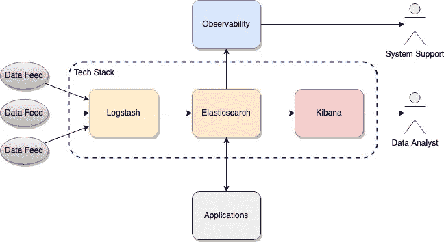

弹性搜索技术堆栈

为了浏览 ELK stack 的部署和使用，我将向您展示设置，并基于作为样本数据的国家书目图书数据集演示使用方法。本文涉及的所有材料，如 docker compose 定义、配置文件和样本数据集，都可以在这个 [GitHub 存储库](https://github.com/gavinklfong/docker-compose-collection/tree/main/elasticsearch)中获得。

# Docker 编写技术堆栈定义

Docker 使系统配置变得非常容易，服务器堆栈部署可以通过定义 YAML 格式的 docker compose 来完成。我们在 docker compose 定义中定义了一个 Elasticsearch 实例和 Kibana。这里的示例在单节点模式下部署了一个 Elasticsearch 实例，这只是为了进行演示。在生产环境中，建议部署一个包含 3 个节点的集群，以支持高弹性和可用性。详见[官方页面](https://www.elastic.co/guide/en/elasticsearch/reference/current/docker.html)。

要打开技术堆栈，请在命令提示符下将目录切换到 docker-compose.yml 文件的文件夹中，然后运行以下命令

```
docker compose up
```

## 弹性搜索 GUI

Elasticsearch 不提供任何 GUI 管理控制台，获取服务器集群状态、数据操作、搜索数据记录等所有操作都是通过 REST APIs 完成的。多亏了开发者社区的贡献，许多 GUI 客户端都是免费的。客户端使用 Elasticsearch 的 REST APIs，并在浏览器视图上显示信息。

其中一个 GUI 客户端是 [Elasticvue](https://elasticvue.com/) ，它可以作为插件在 Chrome 上运行。一旦你在 Chrome 上安装了插件，当你运行 Elasticvue 时，你会看到这个屏幕。只需点击“连接”按钮进入主屏幕，无需输入用户名/密码，因为新创建的 Elasticsearch 实例没有任何身份验证设置。

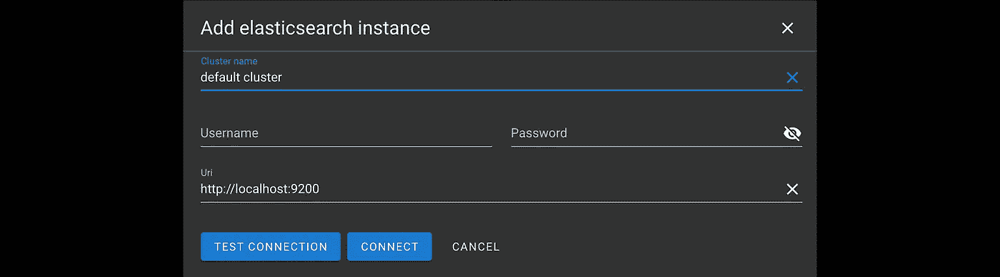

弹性值—连接屏幕

主页屏幕将显示表明系统健康状况的集群节点信息。

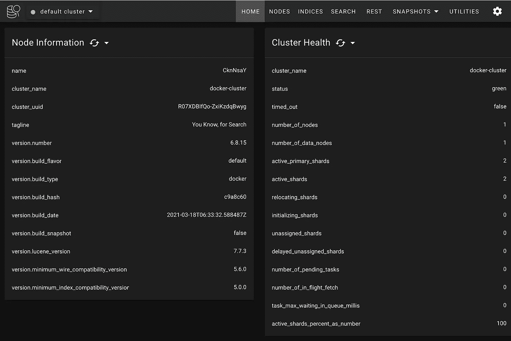

弹性值—节点信息

当你点击“索引”标签时，它不显示任何数据，因为这是一个新创建的 Elasticsearch 实例。

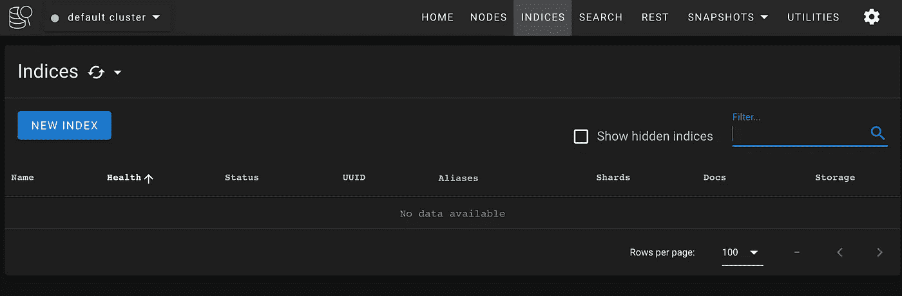

弹性值—指数

# Logstash 数据管道

随着 Elasticsearch 实例的启动和运行，是时候研究关于数据管道设置的细节了。Logstash 数据管道简单易懂。这是一个典型的 ETL 模式，即获取数据输入、转换数据记录并输出到目标。

让我们看看将数据从 CSV 文件加载到 Elasticsearch 的示例管道。

*   **输入** —从 CSV 文件开始读取，从起始位置开始读取数据。
*   **过滤器** —指定数据字段列表，以便管道知道如何提取 CSV 记录。
*   **输出** —将记录发送到两个输出— (1)写入控制台标准输出和(2)发送到 Elasticsearch 以创建新文档。

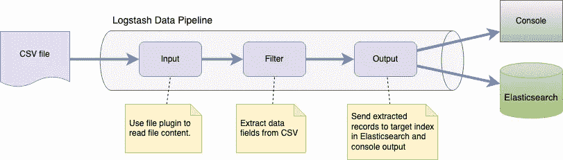

log stash—CSV 文件馈送的示例管道

管道配置是声明性的和直观的，因此您只需查看配置文件就可以快速了解数据流的概念。

与本演示一起，GitHub 存储库中提供了一个包含 **logstash-log** 文件夹中的 50k 图书记录( **book-sample-data.csv** )的样本数据集，它是英国国家书目图书数据集的子集。如果你对获得大约 300 万条记录的完整数据集感兴趣，你可以从[哈佛数据节](https://dataverse.harvard.edu/dataset.xhtml?persistentId=doi:10.7910/DVN/YGHGQB)下载 CSV 文件

运行这个命令来打开 Logstash 的 docker 容器

```
./run-logstash.sh
```

初始化完成后，Logstash 的管道将自动读取和处理 CSV 数据文件。由于数据管道会将记录输出到控制台和 Elasticsearch，因此在数据导入过程中，您会在控制台终端上看到提取的 CSV 数据记录。

因为 Logstash 将继续监视文件中的新数据条目，所以它将在数据导入完成后继续运行。

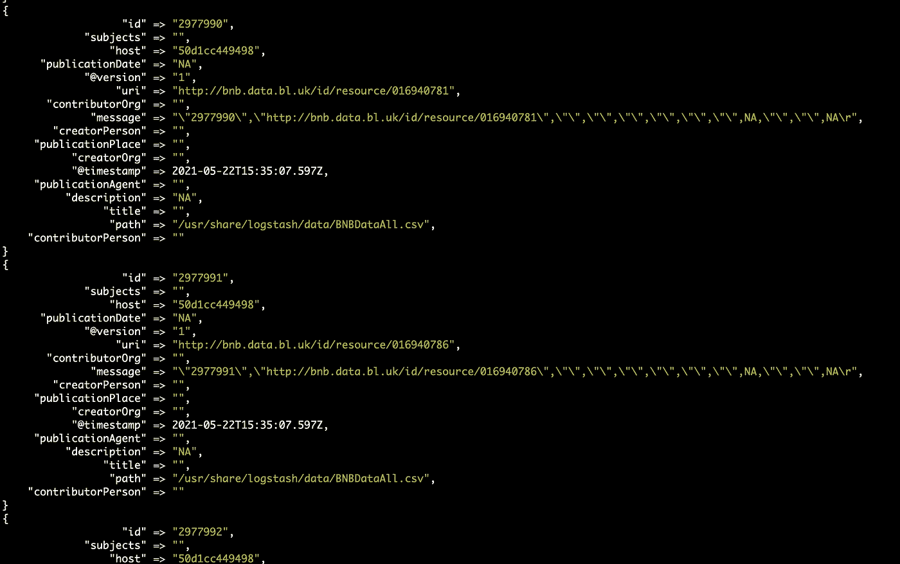

Logstash —示例 CSV 管道的控制台输出

如果您在 Elasticvue 上查看，那么您会发现新创建的索引“book”有 50k 条记录。

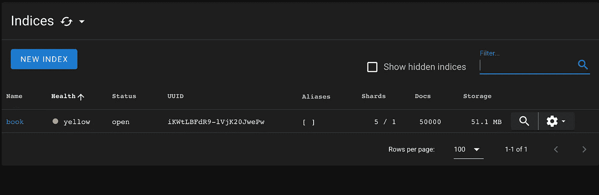

elastic value—包含新导入数据的索引

当您选择一个数据记录时，Elasticvue 将向您显示记录的详细信息。这里有一个例子:

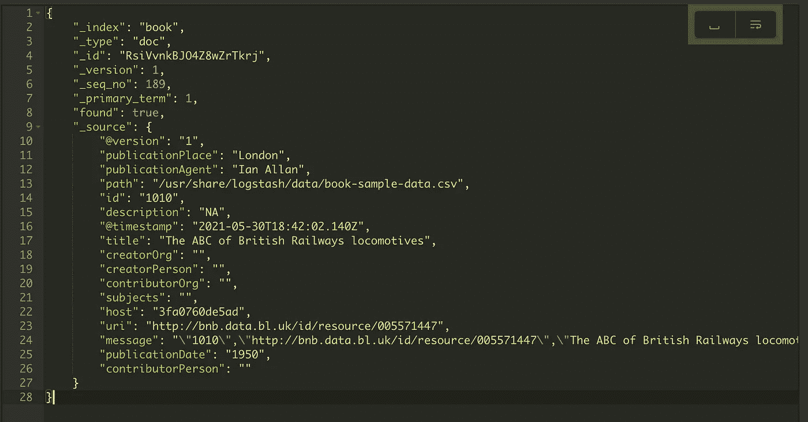

弹性值—查看记录详细信息

# 弹性搜索—REST API

Elasticsearch 为 CRUD 操作提供 REST APIs。应用程序通过使用数据存储的 API 与数据存储集成。让我们使用新导入的图书索引来简单探索一下 REST APIs。

## 搜索

为了进行查询，Elasticsearch 提供了 GET 和 POST HTTP 方法的 API。使用 GET 方法的 URI 搜索是一种简单的获取数据的方法，其搜索阶段在 URI 指定。下面的示例在所有字段中对文本短语“new age”进行全文搜索。

```
curl --request GET --url 'http://localhost:9200/book/_search?pretty&q=new%20age'
```

您还可以基于特定字段的值搜索记录。本示例获取出版物 place = "new york "的所有图书记录。

```
curl --request GET --url 'http://localhost:9200/book/_search?pretty&q=publicationPlace:new%20york'
```

POST 方法的查询支持更复杂的搜索标准。该查询是基于 JSON 格式的领域特定语言(DSL)。例如，此查询包含 2 个搜索条件—标题包含“水果”，出版地点是“伦敦”

```
curl -X POST "localhost:9200/book/_search?pretty" -H 'Content-Type: application/json' -d'
{
  "query": {
    "bool": {
      "must": [
        {
          "match": {"title": "fruit"}
        },
        {
          "term": {"publicationPlace.keyword": "London"}
        }
      ]
    }
  }
}’
```

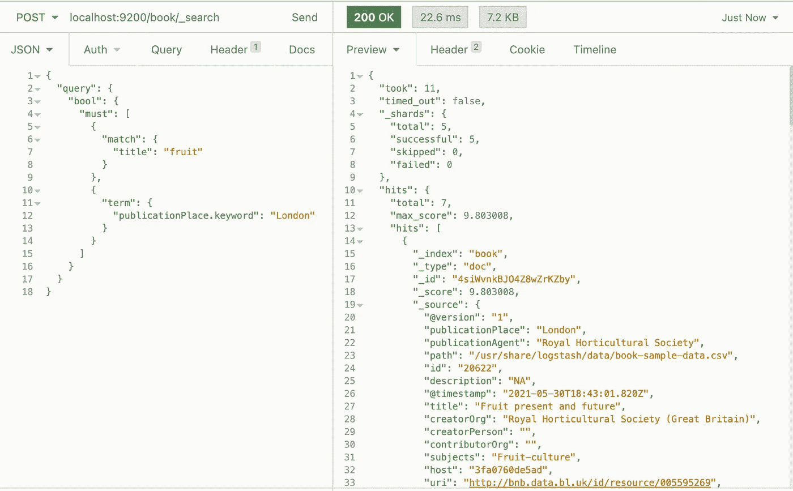

事实上，Elasticsearch Query DSL 是强大的，它支持复杂的搜索标准，如基于命中分数的搜索和其他专门的查询。如果您有兴趣了解更多信息，请访问 [Elasticsearch Query DSL](https://www.elastic.co/guide/en/elasticsearch/reference/7.13/query-dsl.html) 了解详情。

## 插入

要插入新记录，请使用 PUT 或 POST HTTP 方法插入 JSON 格式的数据。

```
curl -X PUT "localhost:9200/book/50001" -H 'Content-Type: application/json' -d'
{
"publicationPlace": "London",
"publicationAgent": "B.S.I",
"id": "50001",
"description": "NA",
"title": "Methods for the analysis of fruit and vegetable products",
"creatorOrg": "British Standards Institution",
"creatorPerson": "",
"contributorOrg": "",
"subjects": "Fruit--Standards;Vegetables--Standards",
"uri": "http://bnb.data.bl.uk/id/resource/005590057",
"publicationDate": "1975",
"contributorPerson": ""
}’
```

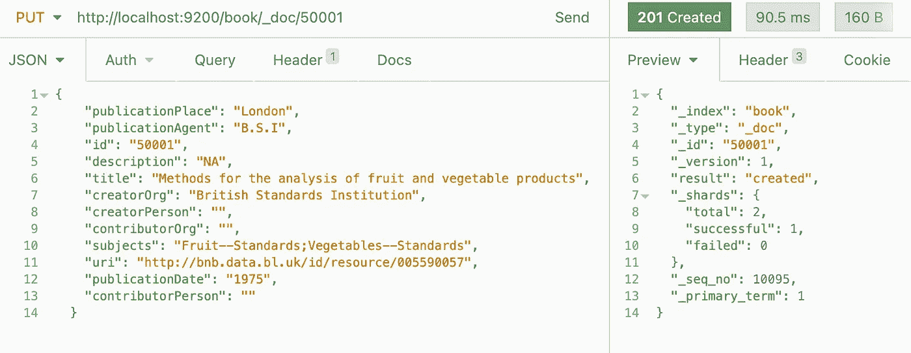

## 更新

数据更新与插入非常相似。您可以放入一个完整的文档，或者只指定某些字段值，用于目标文档 id 的记录更新。如果具有相同文档 id 的记录已经存在，那么 Elasticsearch 将更新现有记录。否则，它会将数据视为新记录。

这个例子演示了一个更新文档 id 50001 的发布地点和描述的请求

```
curl -X PUT "localhost:9200/book/50001" -H 'Content-Type: application/json' -d'
{
"publicationPlace": "Leeds",
"description": "New description"
}’
```

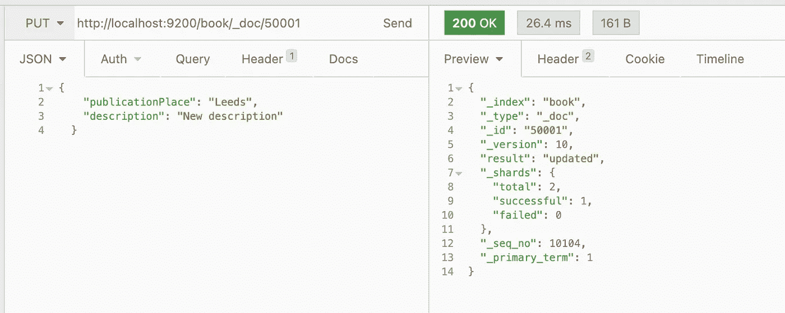

## 删除

删除可以简单到使用 DELETE HTTP 方法为目标文档 id 触发一个请求。

```
curl --request DELETE --url '[http://localhost:9200/book/](http://localhost:9200/book/_search?q=new%20york&pretty)50001’'
```

如果您希望根据查询条件删除一些记录，那么您可以使用 POST HTTP 方法。以下示例删除了所有出版地点为伦敦的书籍

```
curl -X POST "localhost:9200/book/_delete_by_query" -H 'Content-Type: application/json' -d'
{
  "query": {
    "bool": {
      "must": [
        {
          "term": {"publicationPlace.keyword": "London"}
        }
      ]
    }
  }
}’
```

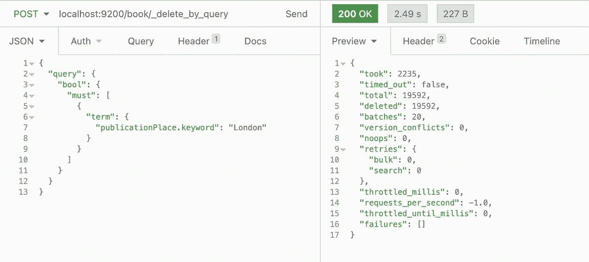

# Kibana —数据可视化

Kibana 通过在仪表板、图表、仪表和世界地图中呈现数据来实现数据可视化。它允许您通过创建数据检索查询来浏览数据，而无需发出任何 REST API 请求。

进入 [http://localhost:5601](http://localhost:5601) ，你会看到一个欢迎界面。只需点击“自己探索”按钮，并进入主屏幕。

要将新导入的图书数据集添加到 Kibana，请转到左侧菜单中的“管理”,然后单击“索引模式”下的“创建索引模式”按钮。将索引名“book”输入到模式中。

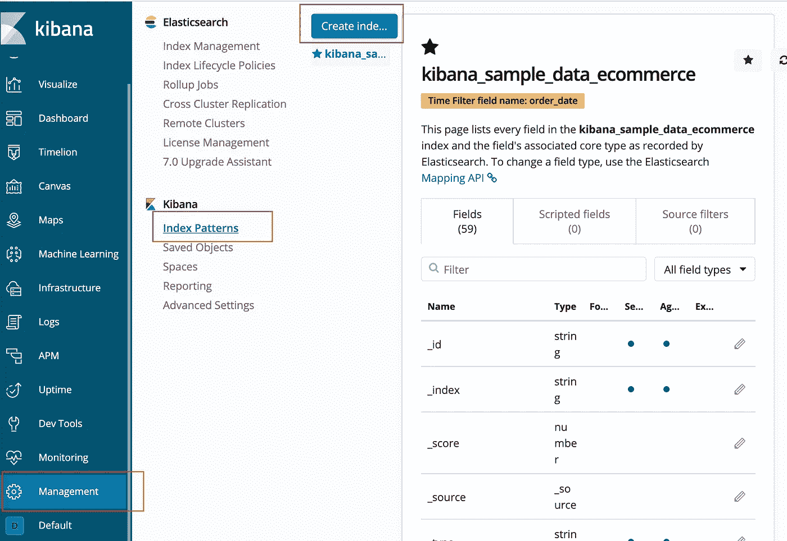

Kibana —添加索引模式

一旦添加了图书索引的模式，请转到左侧菜单中的 Discover。您可以指向“图书”索引并浏览数据集。

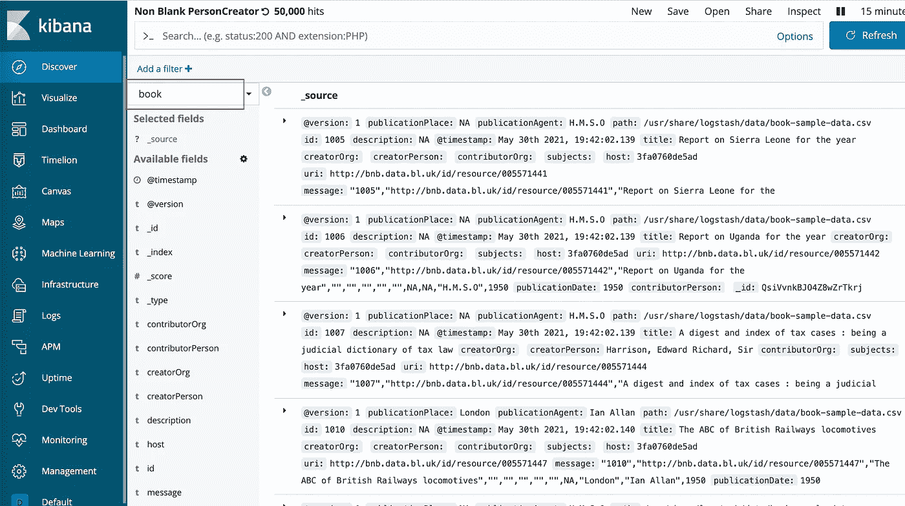

Kibana —发现图书索引

尝试搜索一个关键字或文本短语，你会看到一个记录列表与亮点。

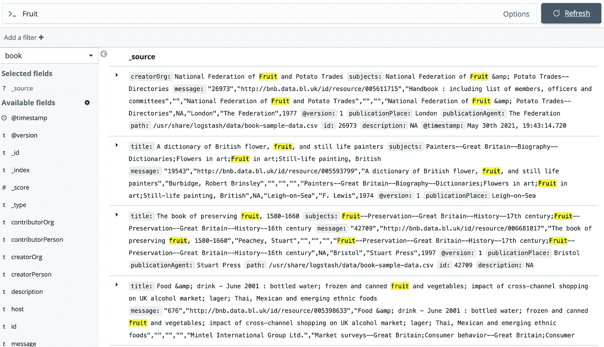

Kibana 查询结果

## 数据可视化

查看左侧菜单中的可视化功能。创建一个新的垂直条形图，Y 轴为记录数，X 轴为出版地点，Kibana 将分析数据并生成一个条形图，显示按地点出版的图书数量。

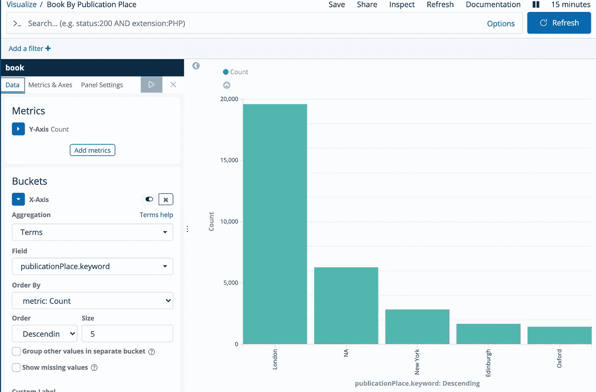

基巴纳—数据可视化—条形图

此示例在饼图中显示了书籍数量排名前 5 位的作者。

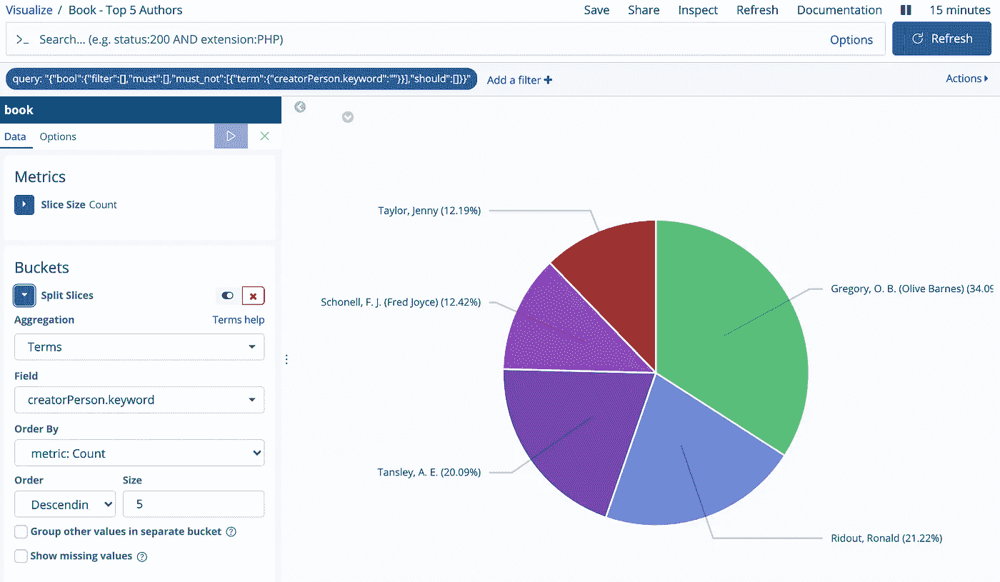

基巴纳—数据可视化—饼图

要汇总数据，您可以利用数据网格来呈现数字

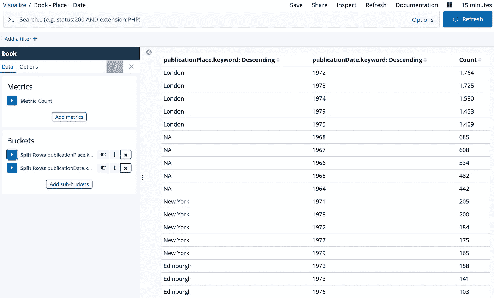

基巴纳—数据网格

## 更多样本…

Kibana 带有内置的样本数据，展示了数据可视化的能力。环顾四周，探索各种仪表板和图表是很有趣的。

除了样本数据，还有仪表盘、图表和地图视图，让您了解 Kibana 的功能。Kibana 是一个强大的工具，允许数据分析师审查数据，创建有意义的可视化和洞察力。

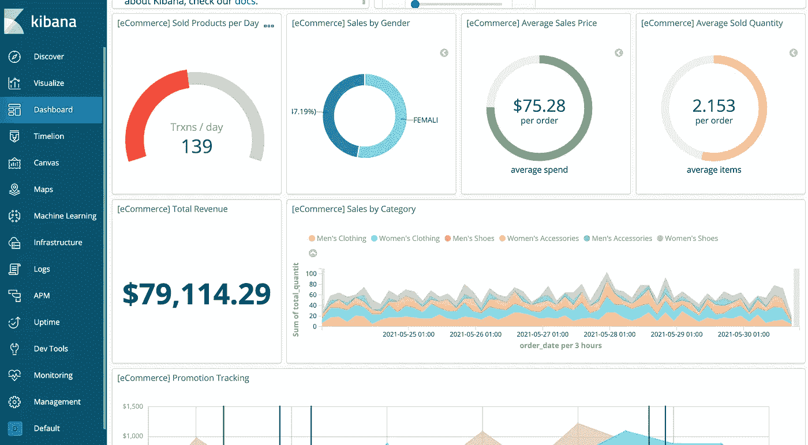

Kibana —仪表板示例

# 可观察性——Grafana 仪表板

没有适当监控的系统注定会失败。在缺乏系统度量和服务状态的信息的情况下，系统支持不可能排除故障并采取必要的措施来保持系统处于运行状态。

因此，快速访问系统状态和指标(如资源利用率和性能状态)对于维护健康的系统至关重要。用时序图表以组织良好的格式呈现系统状态不仅可以提供快速的洞察力，还允许系统专家预测趋势，以便通过制定预防措施来避免潜在的问题。

Grafana 是一个出色的前端系统，它组织系统指标，并在仪表板中显示数字和图表。下面的屏幕截图是 Elasticsearch 的仪表板示例，仪表板中的 KPI 数字是系统健康状况的关键指标。

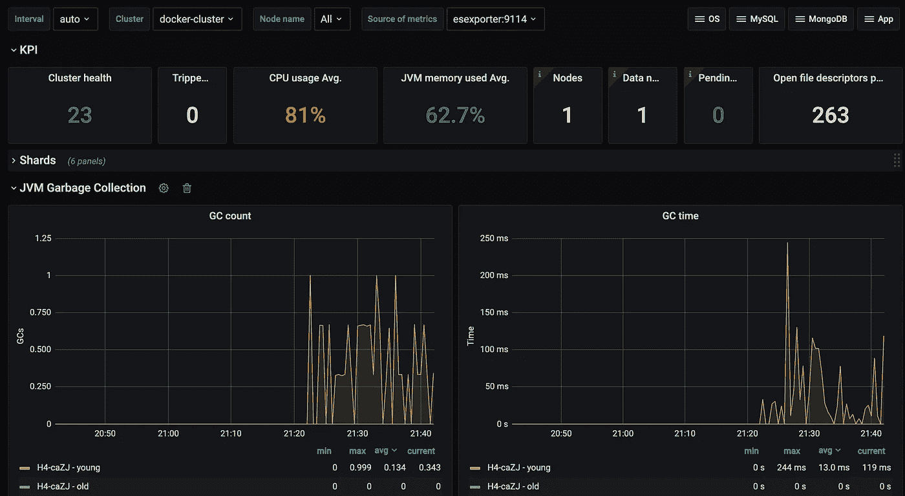

Grafana —弹性搜索仪表板

## 监控系统是如何工作的？

系统监控的实现是相当标准的。使用 Grafana + Prometheus 是业内通行的做法。下面的组件图概述了组件如何协同工作。Prometheus 是一个时间序列数据库，是收集和存储各种系统的系统指标的中心点。由于它可能无法与所有类型的系统直接集成，因此它依赖于导出器来抓取这些系统的信息。然后，Grafana 从 Prometheus 获取指标，并在仪表板中显示系统信息。

除了仪表板显示之外，如果系统使用率超过预定义的阈值，如内存使用率超过 80%，Prometheus 还支持警报触发。我将在另一篇文章中讨论细节。

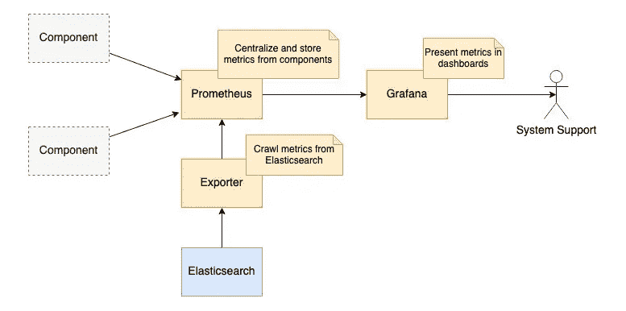

可观察性的技术栈

## 用于系统监控的技术堆栈实施

使用 docker compose 进行部署是构建服务组件堆栈的一种便捷方法。这个 docker 组合定义实现了上面组件图的设置。假设 Elasticsearch 在一个名为“elasticsearch_default”的 docker 网络上运行在一个独立的 docker compose 堆栈上，因此导出器通过同一个 docker 网络连接到 elasticsearch 服务器实例。

在系统初始化时，Prometheus 被配置为获取此配置文件，该文件指示 Prometheus 每 3 秒钟从导出器创建一个系统指标检索作业。

## 在 Grafana 中创建仪表板

一旦技术栈启动并运行，请访问 [http://localhost:3000](http://localhost:3000) 。您将看到 Grafana 登录屏幕。使用默认 id &密码登录:admin / admin。


Grafana —登录屏幕

Grafana 需要知道从哪里获得系统指标。因此，首先要做的是创建一个指向普罗米修斯的数据源。转到左侧菜单中的“配置→ IData 源”。


Grafana 添加数据源

输入网址:“ [http://prometheus:9000](http://prometheus:9000) ”。在 docker 网络中，DNS 名称与容器名称相同，因此您可以通过其容器名称连接到 Prometheus。

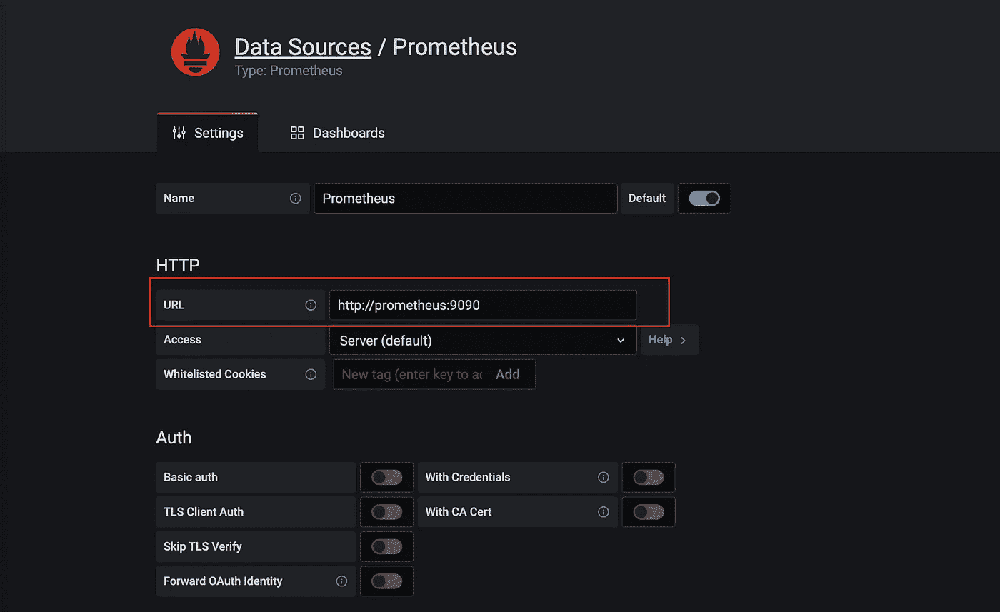

Grafana 添加数据源

接下来，转到“创建→导入”,通过导入创建新的仪表板。


Grafana —导入仪表板

Grafana 的官方网站维护着一个仪表盘库。一些仪表板是官方的，而另一些是由社区中的个人提交的贡献。存储库中新注册的仪表板会分配一个唯一的编号。在本例中，我们将导入这个仪表板(【https://grafana.com/grafana/dashboards/2322】T2)

要导入仪表板，只需提供仪表板的唯一 id。然后，将从 grafana.com 检索定义

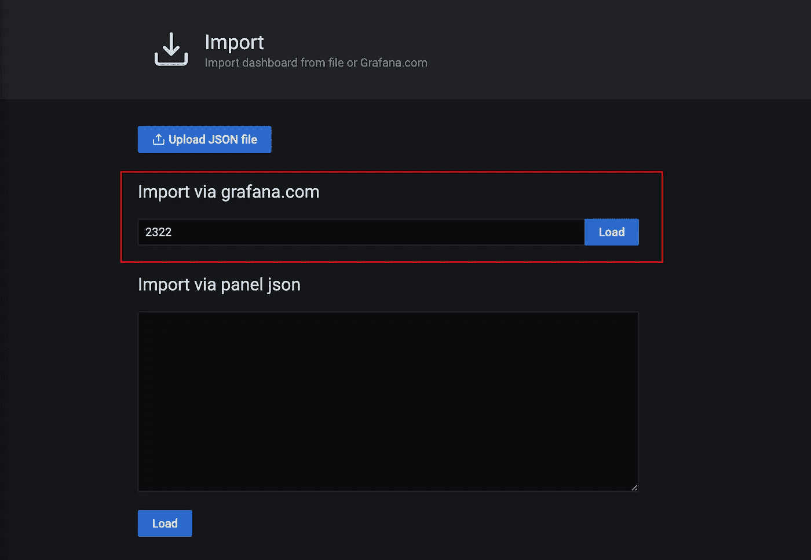

Grafana 按 ID 导入仪表板

然后，将新导入的仪表板的数据源设置为 Prometheus。

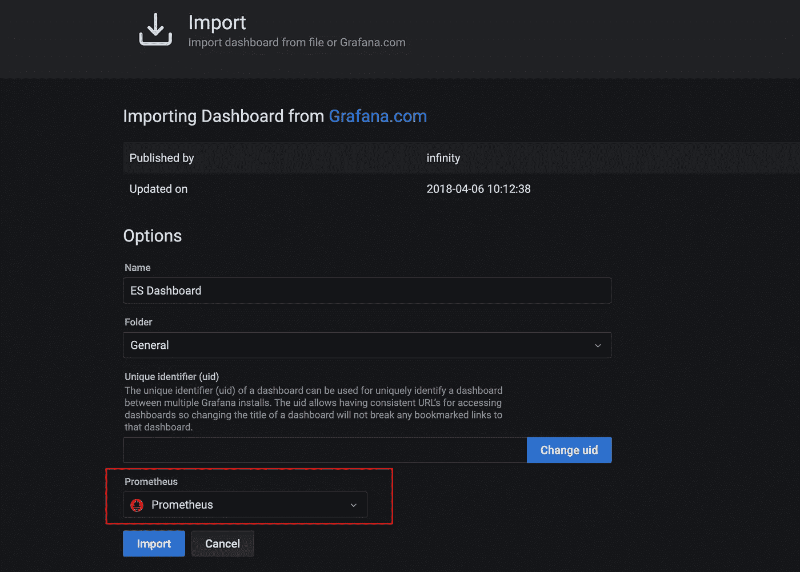

Grafana —导入仪表板—设置数据源

最后，仪表板创建完成。模板是一个起点，如果需要，您可以微调和定制仪表板。


Grafana 仪表板

# 最后的想法

Elasticsearch 是一个强大的全文搜索工具，它在数据查询方面优于其他数据库，因为它在索引方面非常灵活，并提供了出色的数据搜索性能。除了与 Elasticsearch 的应用程序集成之外，使用 Logstash 和 Kibana 建立完整的技术堆栈可以实现无缝数据集成和有效的数据可视化。实现简单明了，不需要构建任何应用程序代码。此外，观察能力也同样重要。Grafana + Prometheus 是仪表板创建的最佳选择。系统健康指标和有洞察力的数字提供了关键信息，这些信息对于维护健康的系统是必不可少的。