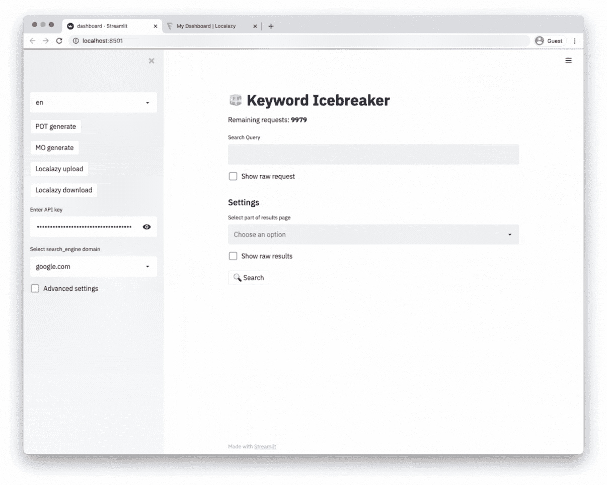
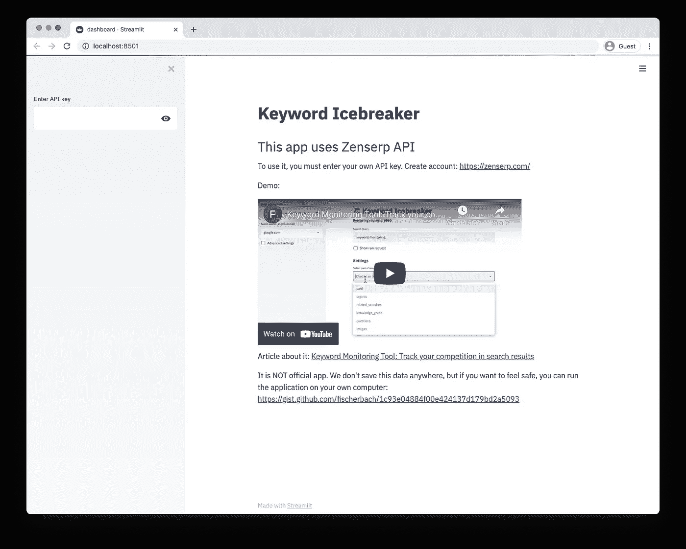
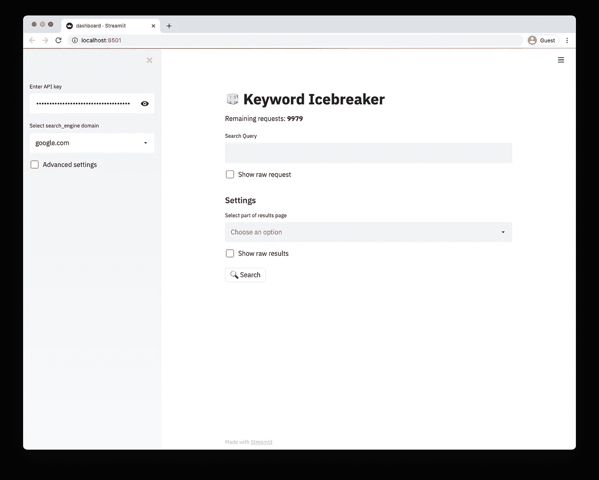
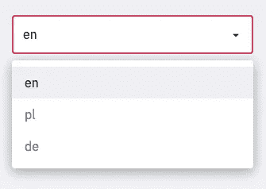
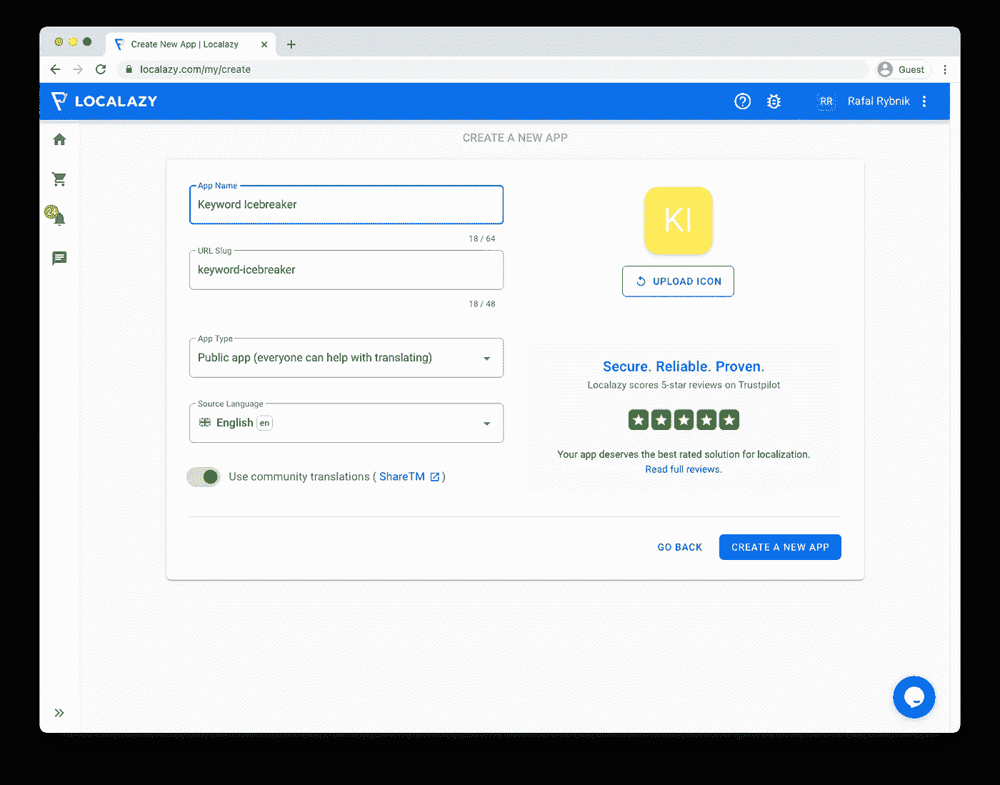
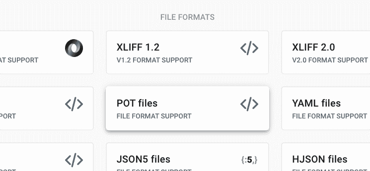
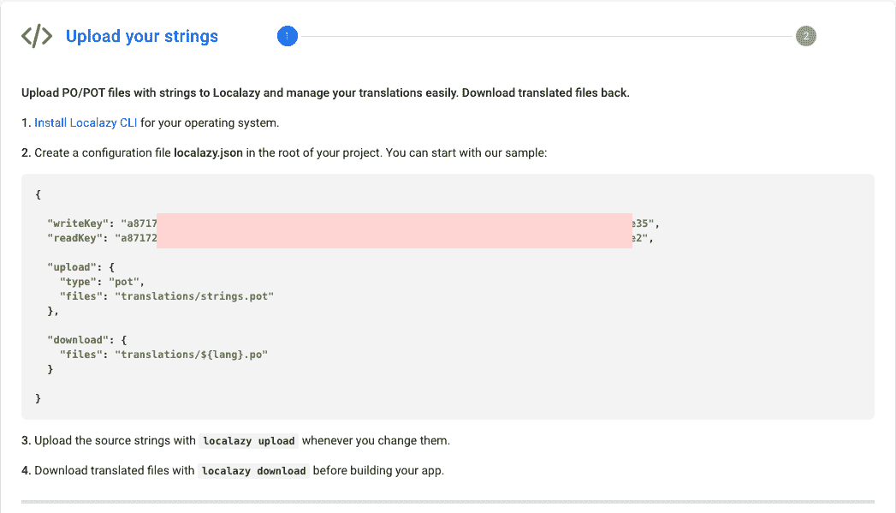
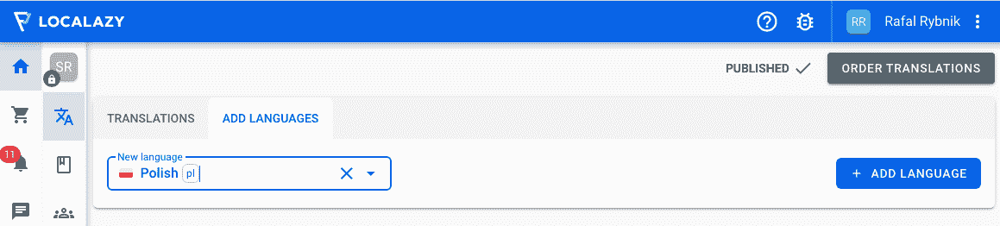
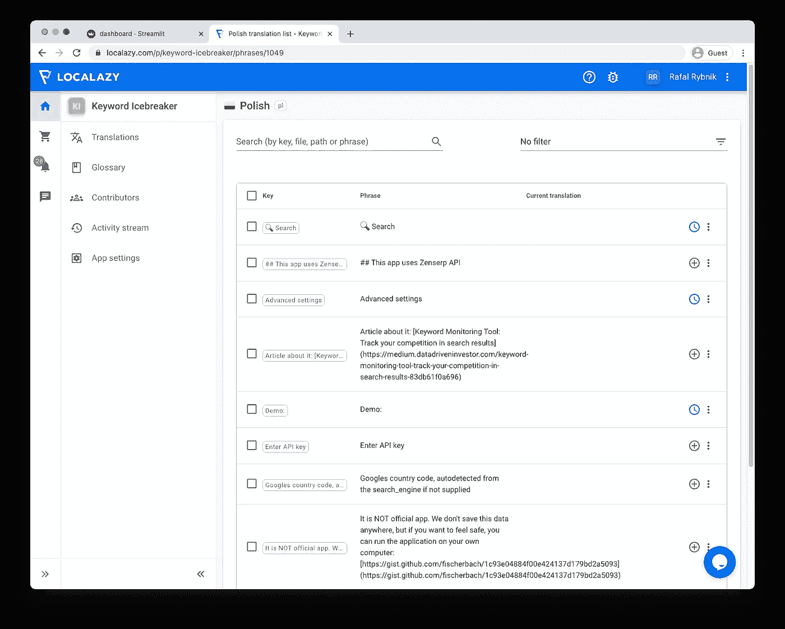
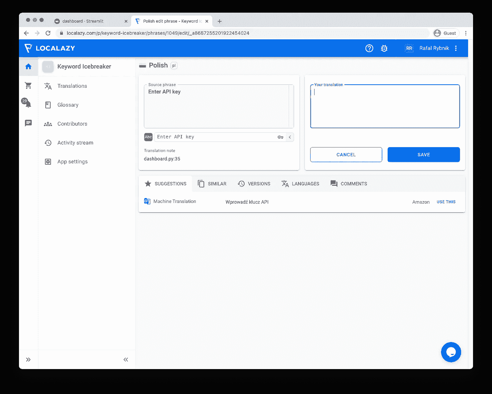

# 如何使用 Streamlit 构建多语言仪表板

> 原文：<https://blog.devgenius.io/how-to-build-a-multi-language-dashboard-with-streamlit-9bc087dd4243?source=collection_archive---------0----------------------->

## Streamlit + Gettext + Localazy

我为我最近的一篇关于[关键词监控](https://medium.datadriveninvestor.com/keyword-monitoring-tool-track-your-competition-in-search-results-83db61f0a696)的文章创建了一个 Streamlit 应用。它是用来在谷歌搜索关键词的，相当有用。由于搜索结果和搜索引擎优化主题通常都依赖于位置，我认为将应用程序界面翻译成几种语言会很有用。

现场演示:[http://keywordicebreaker.herokuapp.com/](http://keywordicebreaker.herokuapp.com/)

理论上，制作另一种语言版本似乎并不困难。毕竟，将单个标签和描述翻译成另一种语言并使用字典来映射它们就足够了。

实际上，这种简单的方法既耗时又容易出错。最好不要重新发明轮子，而是使用已有的解决方案。其中之一是 Gettext——一套用于产生多语言信息的通用工具。

从本文中，您将了解如何使用 Gettext 和 Localazy 翻译 Streamlit 应用程序。

[🔔想要更多这样的文章？在这里签名。](https://fischerbach.medium.com/membership)



# 项目开始

[https://github.com/fischerbach/streamlit-gettext](https://github.com/fischerbach/streamlit-gettext)

本文附有一个代码库。各个步骤被分成连续的分支。README.md 文件包含启动和运行仪表板的说明。

结果应该如下所示:



提供 API 密钥后:



也许，我们可以将消息翻译成其他语言，并根据用户的意愿使用`if`语句来改变它们，但是这种方法会很繁琐并且容易出错。因此，我们将首先从代码中提取所有的字符串，从业务逻辑中分别处理它们。

# Gettext

GNU gettext 是一个通用的工具集，用于生成多语言消息。它提供了一个框架来支持翻译的消息字符串。它支持许多编程语言😉，包括 Python。Python 标准库附带了`gettext`模块。gettext 最大的好处是它可以帮助我们无缝地将文本信息提取到不同的文件中。

我们将准备英语、波兰语和德语版本。首先，我们需要准备目录结构。

```
mkdir -p locales/{de,pl}/LC_MESSAGES
```

然后，我们应该从代码中提取信息。

```
/Library/Frameworks/Python.framework/Versions/3.8/share/doc/python3.8/examples/Tools/i18n/pygettext.py -d base -o locales/base.pot dashboard.py
```

要找到`pygettext.py`文件，可以使用命令:`locate pygettext.py`。

这将在`locales`文件夹中生成一个`base.pot`文件，其中的字符串取自`dashboard.py`文件。

不幸的是，生成的`base.pot`不包含任何字符串。为了解决这个问题，我们需要修改`dashboard.py`,将消息标记为翻译。

再次生成`base.pot`后，字符串出现在其中。

```
branch: step1
```

# 第一次翻译

现在让我们准备第一批译文。将 base.pot 复制并重命名到每个语言文件夹中:

```
cp locales/base.pot locales/de/LC_MESSAGES/base.po
cp locales/base.pot locales/pl/LC_MESSAGES/base.po
```

让我们修改各个语言文件:

为了在我们的程序中使用翻译，我们需要生成 MO 文件。MO 文件是由 Python `gettext`模块解析并在程序中使用的二进制数据文件。

```
msgfmt -o locales/de/LC_MESSAGES/base.mo locales/de/LC_MESSAGES/base
msgfmt -o locales/pl/LC_MESSAGES/base.mo locales/pl/LC_MESSAGES/base
```

现在我们可以修改`dashboard.py`文件来显示不同语言的报告。



在文件的开头添加:

从现在开始，用户可以从下拉菜单中选择一种语言。该界面将刷新由`_()`函数处理的每个标签:

应用程序中的两个标签是。翻译过来，该休息了。程序是一样的。每当源代码中出现一个带消息的字符串，就用函数`_(‘This is a string’)`把它括起来。完成后，从头开始生成 POT 文件，将它复制到每种语言的语言环境中，翻译它并生成二进制文件。

```
branch: step2
```

# 翻译管理

因此，在我们解决方案的下一次迭代中，我们将向仪表板添加生成 POT 和 MO 文件的功能。这里有所有的变化:

# Localazy

Localazy 是一款非常棒的软件，它让通常糟糕的翻译体验变得可以忍受，甚至几乎是愉快的。它支持许多框架和文件格式，并为构建自动化提供 CLI 工具。我最喜欢的功能是合作翻译的可能性和翻译文件变化的自动管理。



因此，让我们将我们的报告与 Localazy 结合起来。首先，[创建一个 Localazy 帐户](https://localazy.com/register)并安装 [Localazy CLI](https://localazy.com/docs/cli/installation) 。然后，创建一个新应用程序。

然后，从可用文件格式中选择 POT 文件。



您将看到一个模板配置文件`localazy.json`。将其复制到项目主文件夹中。



请记住修改语言环境文件夹路径。转到 Localazy 上的应用，添加一些新语言。



现在，您可以再次生成 PO 文件并将它们加载到 Localazy:


```
localazy upload
```

过一会儿，你会看到一个列表，列出了应用程序中每种语言需要翻译的短语。



顶部的樱桃，每个短语都有机器翻译。



一旦接受或创建了所有翻译，您就可以将它们下载到您的应用程序中，并重新生成二进制 MO 文件。

不幸的是，要将更改加载到 Streamlit 应用程序中，必须重置实例。如果我能解决这个不便，我会更新文章。

最终效果:

```
branch: step3
```

# f 弦问题

该项目广泛使用 f 弦。不幸的是，我们不能用它们作为`_()`函数的参数，gettext 会返回一个错误。我在前一篇文章中描述了如何解决这个问题:

[https://netlabe . com/how-to-create-automatic-data-report-in-multiple-languages-2a 53b 6417d 42](https://netlabe.com/how-to-create-automatic-data-report-in-multiple-languages-2a53b6417d42)

# 外卖食品

如您所见，Gettext 和 Localazy 的组合是本地化问题的灵活解决方案。每一个都解决了不同的工作负载来源，并且它们可以很好地互补。

Gettext 和 Localazy 的结合最好的一点是，如果我们生成新的 POT 文件(因此丢失了之前翻译的部分)，Localazy 会负责重新翻译它们，以免不必要的重复工作。


# 参考

GNU Gettext:
【https://www.gnu.org/software/gettext/ 

当地:
[https://localazy.com/](https://localazy.com/)

细流:
https://streamlit.io/