# 如何用 Rust 和 Twilio 构建一次性密码(OTP)验证 API

> 原文：<https://blog.devgenius.io/how-to-build-a-one-time-password-otp-verification-api-with-rust-and-twilio-d6dfc44052fa?source=collection_archive---------2----------------------->


涉及

组织总是在寻找创新的方法来应对他们平台上的威胁和漏洞。他们不断投资人力资源和技术，以帮助构建和发布安全的应用程序。双因素身份认证、身份验证器应用程序和生物识别等是组织为保持平台安全而采用的一些创新方法。

在这篇文章中，我们将学习如何使用 Rust 和 Twilio 的验证服务来构建使用电话号码验证用户身份的 API。在这篇文章中，我们将使用 Actix Web 来构建我们的 API。然而，同样的方法也适用于任何基于 Rust 的框架。

# 先决条件

要完全掌握本教程中介绍的概念，需要满足以下要求:

*   对铁锈的基本认识
*   Twilio 账户；[](https://marketplace.zoom.us/)**[**ignup**](https://www.twilio.com/try-twilio)**对于一个试用账户来说是完全免费的。****

# ****入门指南****

****首先，我们需要导航到所需的目录，并在我们的终端中运行以下命令:****

```
**cargo new rust-sms-verification && cd rust-sms-verification**
```

****该命令创建一个名为`rust-sms-verification`的 Rust 项目，并导航到项目目录。****

****接下来，我们通过修改`Cargo.toml`文件的`[dependencies]`部分来安装所需的依赖项，如下所示:****

****`actix-web = “4”`是一个基于 Rust 的框架，用于构建 web 应用。****

****`serde = { version = “1.0.145”, features = [“derive”] }`是一个序列化和反序列化 Rust 数据结构的框架。例如，将 Rust 结构转换为 JSON，反之亦然。****

****`dotenv = “0.15.0”`是一个管理环境变量的机箱。****

****`reqwest = { version = “0.11”, features = [“json”] }`是一个 HTTP 请求箱。****

*******PS*** *:上述板条箱中使用的* `*feature*` *标志启用板条箱的特定功能。*****

****我们需要运行下面的命令来安装依赖项:****

```
**cargo build**
```

# ****构建我们的应用程序****

****有一个好的项目结构是很重要的，因为它使项目可维护，并使我们和其他人更容易阅读我们的代码库。****

****为此，我们需要导航到`src`目录，并在该文件夹中创建一个`models.rs`、`services.rs`和`handlers.rs`文件。****

****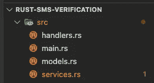****

****更新的文件夹结构****

****`models.rs`用于构建我们的应用数据****

****`services.rs`用于抽象我们的应用程序逻辑****

****`handlers.r` s 代表构建我们的 API****

****最后，我们需要将这些文件声明为一个模块，并将它们导入到如下所示的`main.rs`文件中:****

# ****设置 Twilio****

****为了在我们的 API 中启用 OTP 验证，我们需要登录到我们的 [Twilio 控制台](https://console.twilio.com/)来获取我们的**帐户 SID** 和一个 **Auth 令牌**。我们需要将这些参数放在手边，因为我们需要它们来配置和构建我们的 API。****

****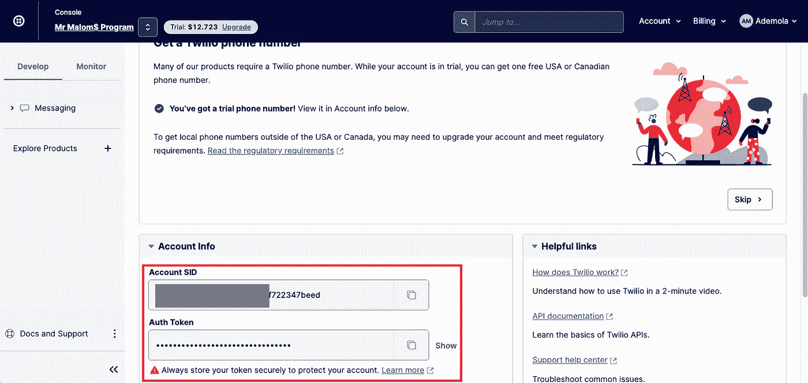****

****Twilio 证书****

******创建验证服务** Twilio 提供安全可靠的服务，通过短信、语音和电子邮件无缝验证用户身份。在我们的例子中，我们将使用 SMS 选项通过电话号码来验证用户。为此，导航至**浏览产品**选项卡，滚动至**账户安全**部分，并点击**验证**按钮。****

****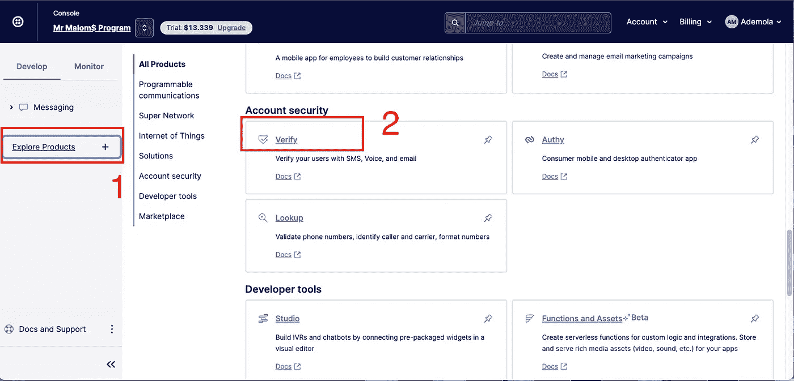****

****验证帐户****

****导航到**服务**选项卡，点击**创建新的**按钮，输入**短信服务**作为友好名称，打开**短信**选项，然后**创建**。****

****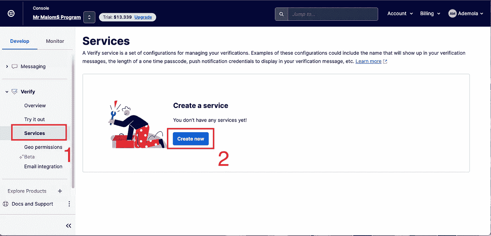****

****创建新服务****

****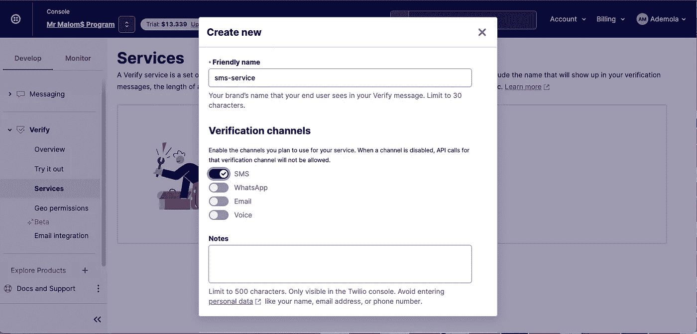****

****输入详细信息****

****在创建时，我们需要复制**服务 SID。在构建我们的 API 时，它也会派上用场。******

****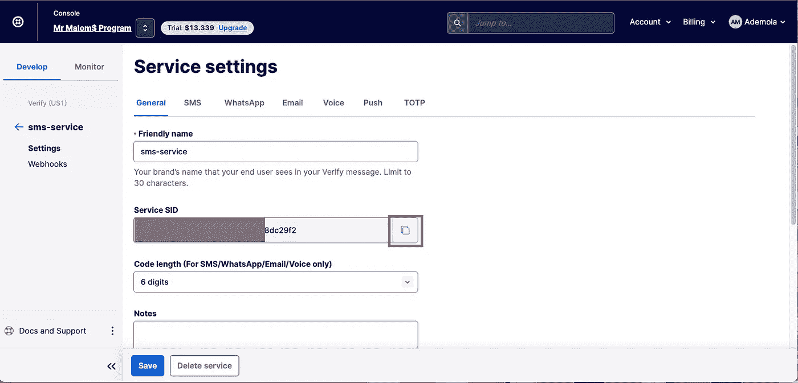****

****服务 SID****

******启用地理权限** 地理权限是 Twilio 为控制其服务的使用而设置的机制。它提供了一个工具来启用和禁用从 Twilio 帐户接收语音呼叫和短信的国家。****

****要启用短信，我们需要在搜索栏中搜索短信地理权限，点击**短信地理权限**结果，然后**查看**短信提供商运营的国家。****

****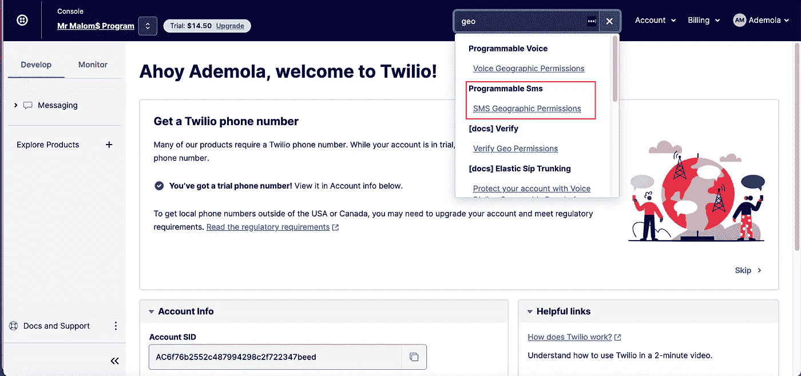****

****搜索****

****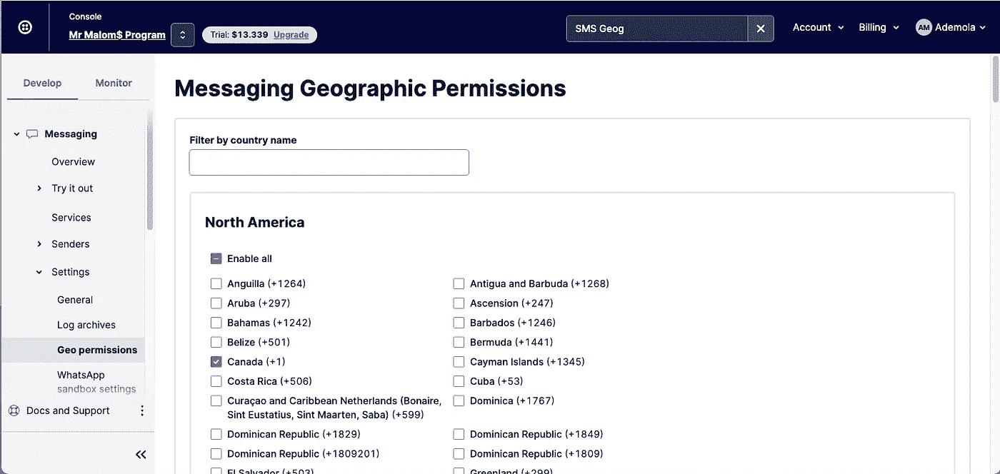****

****检查运营国家****

# ****在 Rust 中创建 OTP 验证 API****

****配置完成后，我们可以按照步骤开始构建我们的 API。****

******添加环境变量** 接下来，我们需要在根目录下创建一个`.env`文件，并添加下面的代码片段:****

```
**TWILIO_ACCOUNT_SID=<ACCOUNT SID>
TWILIO_AUTHTOKEN=<AUTH TOKEN>
TWILIO_SERVICES_ID=<SERVICE ID>**
```

****如前所述，我们可以从 Twilio 控制台和服务设置中获得所需的凭证。****

********

****Twilio 控制台****

********

****服务设置****

******创建 API 模型** 接下来，我们需要创建模型来表示我们的应用程序数据。为此，我们需要修改`model.rs`文件，如下所示:****

****上面的代码片段执行了以下操作:****

*   ****导入所需的依赖项****
*   ****创建具有 API 请求体所需属性的`OTPData`和`VerifyOTPData`结构****
*   ****创建具有 API 响应所需属性的`OTPResponse`、`OTPVerifyResponse`和`APIResponse`结构****

*******PS****:*`*#[serde(rename_all = “camelCase”)]*` *宏将 snake case 属性转换为 camel case，derive 宏增加了对序列化、反序列化和克隆的实现支持。*****

****创建 API 服务 Twilio 提供了一个开放的 API 规范来访问他们的服务。在本节中，我们将使用验证服务来发送和验证 OTP。为此，首先，我们需要更新如下所示的`services.rs`文件:****

****上面的代码片段执行了以下操作:****

*   ****导入所需的依赖项****
*   ****创建一个`TwilioService`结构****
*   ****创建一个向`TwilioService`结构添加方法的实现块****
*   ****添加一个`env_loader`助手方法来加载环境变量****
*   ****添加一个`send_otp`方法，该方法将`phone_number`作为参数，并返回`OTPResponse`或描述错误的字符串。该方法还执行以下操作:
    - **第 20–22 行** : —使用`env_loader`助手方法创建所需的环境变量
    - **第 24–27 行**:通过用所需的参数
    - **第 29–33 行**格式化来创建`url`:创建 API 请求头并将其设置为表单类型
    - **第 35–37 行** 接收 OTP 并将发送 OTP 的通道设置为`sms` - **第 39–46 行**:使用`reqwest`库创建一个客户端实例，通过传入所需的认证参数、请求头和表单主体
    - **第 48–57 行**:返回适当的响应来对 Twilio API 进行 HTTP 调用****

****最后，我们需要添加一个方法来验证发送的 OTP，如下所示:****

****上面的代码片段类似于`send_otp`方法。但是，我们将`url`更改为验证检查 URL，将表单主体中的`Channel`更改为`Code`，并通过检查响应状态为`approved`来返回适当的响应。****

******创建 API 处理程序** 随着服务的完全配置，我们可以使用它们来创建我们的 API 处理程序。为此，我们需要更新`handlers.rs`，如下所示:****

****上面的代码片段执行了以下操作:****

*   ****导入所需的依赖项****
*   ****创建一个带有`/otp` API 路由的`send_otp`处理程序，该处理程序使用`send_otp`服务发送 OTP，并使用`APIResponse`返回适当的响应****
*   ****创建一个带有`/verifyOTP` API 路由的`verify_otp`处理程序，该处理程序使用`verify_otp`服务来验证 OTP，并使用`APIResponse`返回适当的响应****

****完成后，我们需要更新`main.rs`文件以包含我们的应用程序入口点，并使用`send_otp`和`verify_otp`处理程序。****

****上面的代码片段执行了以下操作:****

*   ****导入所需的依赖项****
*   ****创建一个新的服务器，它添加了`send_otp`和`verify_otp`处理程序，并在`localhost:8080`上运行****

****完成后，我们可以使用下面的命令启动开发服务器:****

```
**cargo run main.go**
```

****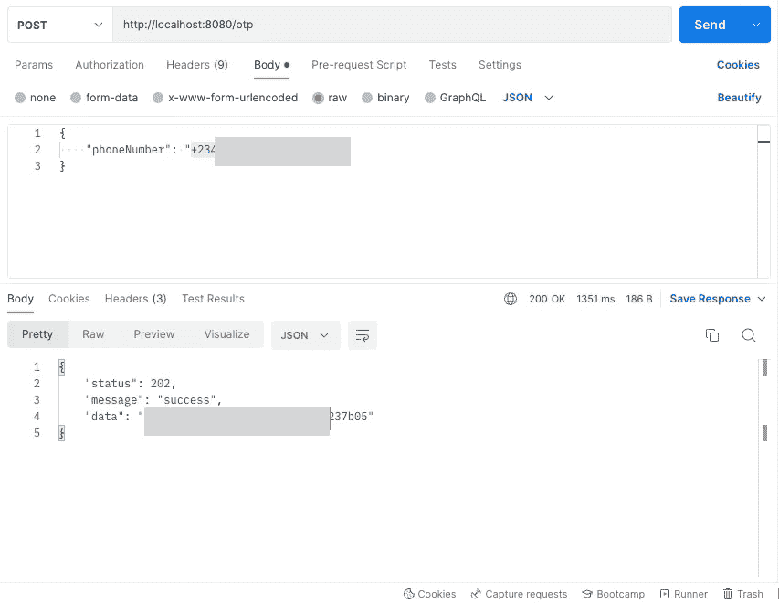****************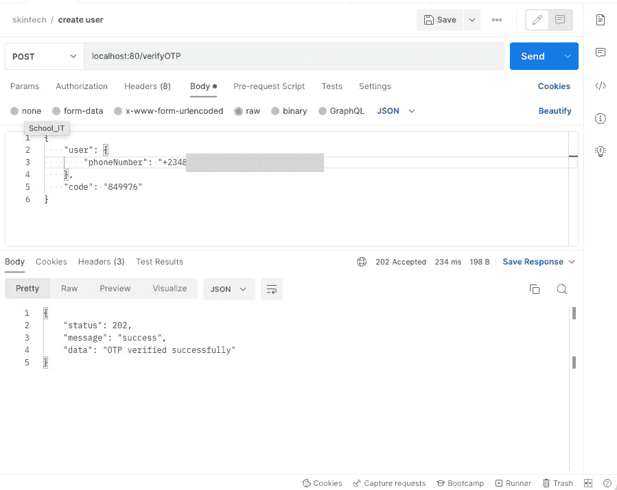****

****我们也可以通过导航到 Twilio 上**日志**的**验证**选项卡来验证消息日志****

****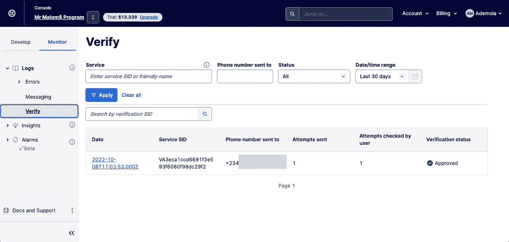****

# ****结论****

****这篇文章讨论了如何使用 Rust 和 Twilio 的验证服务创建检查和验证用户电话号码的 API。除了基于 SMS 的验证，Twilio 还提供多种服务，将身份验证无缝集成到新的或现有的代码库中。****

****这些资源可能会有所帮助:****

*   ****[Twilio 验证服务](https://www.twilio.com/docs/verify/api/service)****
*   ****[Reqwest HTTP 库](https://github.com/seanmonstar/reqwest)****