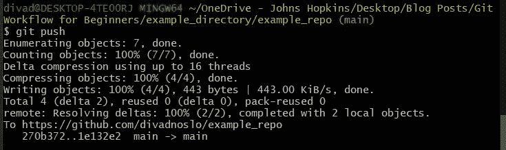
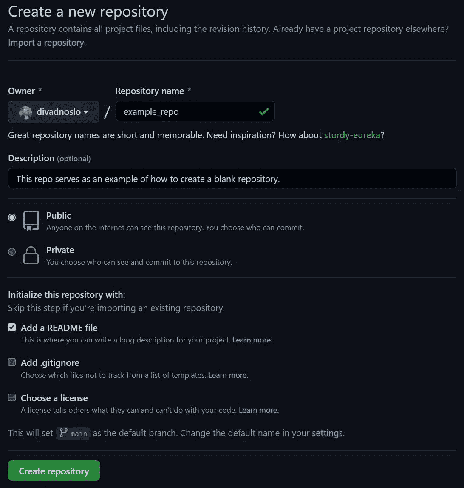
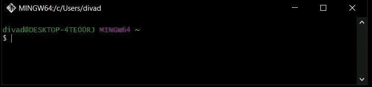
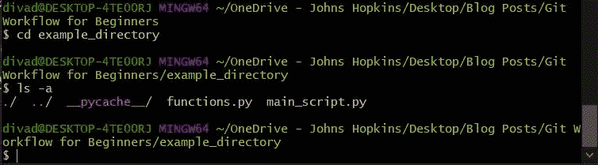
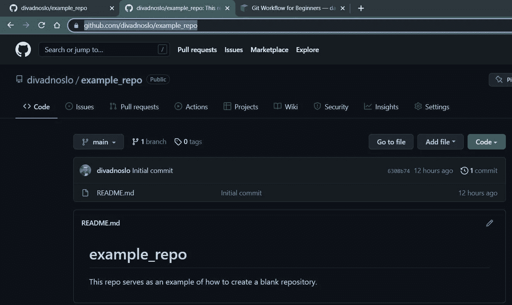
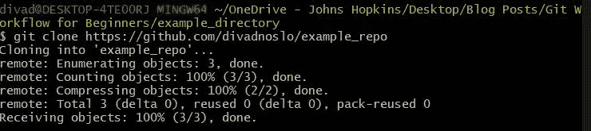
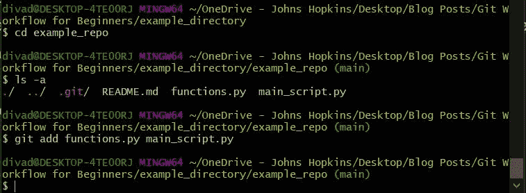
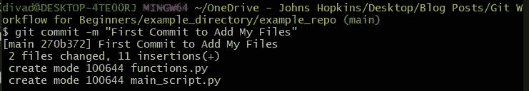

# 如何在 Git 和 GitHub 中构建存储库

> 原文：<https://blog.devgenius.io/how-to-build-a-repository-in-git-and-github-fd5a02d17cf4?source=collection_archive---------9----------------------->

下面是一个如何使用 Git 和 GitHub 管理和备份软件项目的例子！按照示例场景学习基本工作流！



## 如果您还没有在您的机器上安装 Git 和 GitHub，请使用我这里的指南进行快速简单的安装！

## [如何设置 Git 和 GitHub](https://www.davidolson.xyz/projects/how-to-setup-git-and-github)

[点击这里查看我的其他指南和项目！](http://linktr.ee/divadnoslo)

# 一个示例场景

假设我们有一个由这两个文件组成的简单 python 项目。

*   函数. py
*   main _ 脚本. py

每个文件的代码如下所示。编程语言的选择无关紧要，可以是 MATLAB 文件、C++文件，甚至 HTML 文件。代码内容对于这个例子来说没有意义，相反，我们关心的是如何使用 Git 和 GitHub。请随意复制这些文件并重复我下面所做的，或者通过下面的链接下载。

[**从我的 GitHub 下载示例代码**](https://github.com/divadnoslo/example_repo/archive/refs/heads/main.zip)

# 步骤 1:在 GitHub 中创建一个空白存储库

*   转到 GitHub 并导航到您的个人资料(即 www.github.com/<your-username-here>/)</your-username-here>
*   单击“存储库”，然后单击绿色的“新建”按钮。
*   输入您的存储库名称，如果愿意，还可以输入描述。我强烈建议选择“添加一个自述文件”选项，因为这会将“主”设置为默认分支。我不会在本指南中包括分支，但是它并不是一个稍后要学习的困难特性，并且让你的第一个分支自动构建会省去很多麻烦。
*   然后选择“创建存储库”



这将初始化您的存储库，并为您提供大量可以盲目复制并粘贴到终端的命令。抵制通过反复试验找出哪些有效的冲动。

# 步骤 2:导航到您的本地目录

目前，我的代码存储在我的 Windows 机器上名为“example_directory”的目录中。要将这个目录转换成 Git 存储库，我需要打开“Git Bash”。如果你用的是诸如 [Raspberry Pi](https://amzn.to/3tXiYgb) 之类的东西，你将能够打开一个终端并直接使用 Git 命令。

打开“Git Bash”。它看起来会像这样。Linux 用户可以直接使用他们的终端，而不是 Git Bash。



首先，导航到存储代码的目录。在这个场景中，我将导航到我的示例目录。

使用代表“更改目录”的命令“cd”，然后将文件路径粘贴到您的目录。例如:

```
cd <your_file_path_here>/example_directory
```

**注意:**如果路径中的任何文件夹有空格，您需要用单引号将文件夹名称括起来。

要查看该文件夹中的文件，请使用命令“ls -a”。这将列出该目录中的每个文件和文件夹，以便您可以确保您在正确的位置。

```
ls -a
```



# 步骤 3:从 GitHub 克隆您的远程存储库

现在您已经导航到了本地目录，是时候将该目录转换为存储库了。有多种方法可以做到这一点，但是要轻松地将 Git 存储库链接到 GitHub，请遵循以下步骤:

转到 [GitHub](https://www.github.com/) 并导航到您创建的空白存储库，从您的浏览器中复制 web URL。



现在回到 Git Bash 或您的终端，使用“git clone”命令。

```
git clone [https://github.com/divadnoslo/example_repo](https://github.com/divadnoslo/example_repo)orgit clone <your_repo_URL_here>
```



恭喜你，你已经创建了你的第一个本地知识库！

# 步骤 4:添加并提交文件

首先，将文件夹更改到您创建的新目录中。在这种情况下，我会使用以下命令:

```
ls -a
cd example_repo
```

然后，将您的文件移动到该目录中。当您的第一个本地存储库就位时，它当前并不跟踪您移动到该目录中的文件。要添加跟踪文件，我们需要先添加，然后提交文件。“add”命令不会添加到跟踪片段中，相反，它会添加要包含在提交中的文件。例如:

```
git add functions.py main_script.pyorgit add <your files here>
```



现在，是时候提交这些文件了。当您提交时，它会将其保存为一个版本，您可以在以后返回。要提交您的文件，请使用命令“git commit -m”您的消息。使用“-m”选项将帮助您记住在该提交中您完成了什么。例如，您可能最终消除了一个 bug 或获得了一个新功能。

像这样使用提交:

```
git commit -m "First Commit to Add my Files"
```



**注意:**每次你想提交你的项目时，你首先需要添加文件。当您“git add”一个文件时，它会将其添加到提交中，而不是用于跟踪的存储库中。

# 第五步:将代码推送到 GitHub

终于，我们期待已久的一步！是时候推进在步骤 6 中所做的提交了。只需使用以下命令:

```
git push
```


这就对了。现在你的代码通过 Git 进行版本控制，通过 GitHub 进行备份。

如果你在使用 push 命令后无法通过 GitHub 认证，请点击查看[我的创建个人访问令牌(PAT)指南。](https://www.davidolson.xyz/projects/how-to-setup-git-and-github)

# 对工作流程重复这些步骤

当你在你的软件项目上工作时，当你到达里程碑时，重复步骤 4 和 5。当您添加新功能和解决 bug 时，添加并提交您的工作，然后将这些更改推送到 GitHub

如果这个指南对你有帮助，请告诉我！如果你有问题，评论，或者只是告诉我我做错了什么，也请告诉我。[点击下面我的社交网站联系我](http://linktr.ee/divadnoslo)！