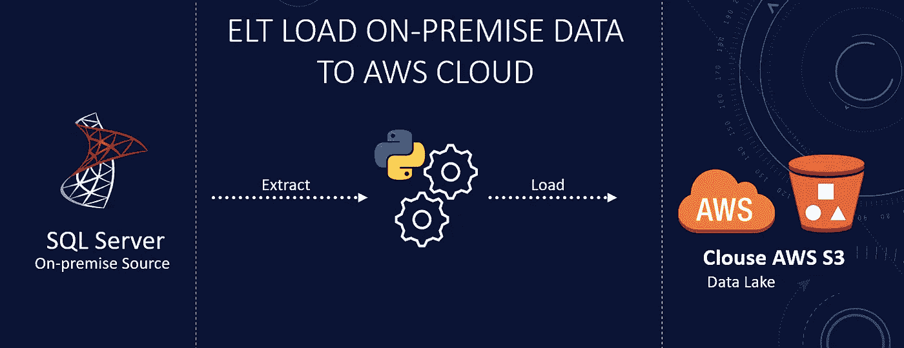
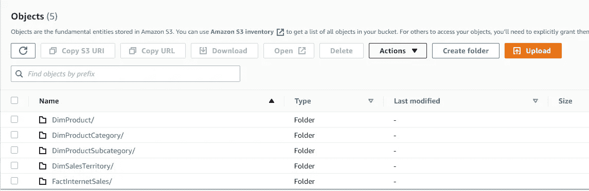

# 如何使用 Python 从本地数据库构建 S3 数据湖

> 原文：<https://blog.devgenius.io/how-to-build-a-s3-data-lake-with-python-from-on-premise-database-23d5d2cdd1da?source=collection_archive---------3----------------------->

将内部数据上传到数据湖

数据湖是一个集中式云存储，您可以在其中存储任何规模的所有数据，包括结构化数据和非结构化数据。该平台正迅速成为寻求存储和处理大数据的用户的标准。它位于云中，可在您需要时提供分析、报告和数据科学的可访问性。数据湖可以包括各种格式和类型的数据，包括关系数据库结构化数据(行和列)，半结构化数据，如 CSV、JSONs 等。这个共享存储库的主要目标是为所有数据提供单一来源。我们可以转换、分析和进一步处理这些数据。这些数据可用于机器学习算法、报告并保存到云数据仓库中。今天，我们将介绍如何使用本地数据库构建 AWS S3 数据湖。

如果你是视觉学习者，那么我在 YouTube 上有一个附带的视频，里面有完整代码的演示。

**背景**

我们将从本地 SQL Server 数据库读取数据，并使用 Python 自动将其加载到亚马逊对象存储 S3。我们将使用 AWS S3 API 来实现这一点。让我们开始吧。这里的想法是，我们有数据在我们的前提数据库。我们正在向云迁移，我们希望在 AWS Redshift 中构建一个用于分析的数据库。我们将使用 Python 连接到我们的本地数据库，将数据读入每个表的数据帧，并将这些数据写入每个表的单独文件夹中的 S3。要开始，显然需要一个 AWS 帐户，如果你没有的话，就去注册吧。您可以获得一个为期一年的免费等级帐户。

**设置**

*   在 AWS 中，我们需要的第一个资源是拥有访问 S3 的 API 密匙的用户。我们向该用户提供对 S3 资源的完全访问权限。我们将访问和密钥复制到一个 JSON 配置文件中，然后导入到 Python 脚本中。
*   第二个资源是 S3 存储对象。为了创建一个 S3 桶，我们前往 S3 服务。我们使用默认设置创建一个独特的存储桶。我们将在代码中按名称引用这个桶。

**代码**

我们连接到我们的本地数据库，并获取我们想要处理的表到云中的数据湖。我们选择我想从 SQL Server 的系统模式中提取数据的表。只需遍历表并查询它们。通过几行代码，我们查询了源代码并获得了作为 Pandas dataframe 的数据。

提取内部数据

**上传**

我们使用 boto3 库与 AWS S3 进行交互。我们使用在 AWS 上创建用户时获得的访问和密钥连接到 S3。我们用 StingIO()将数据帧转换成内存中类似文件的对象。然后我们使用这个对象作为 pandas“to _ CSV”函数的输入。我们从 S3 客户端调用 put object 函数，并将桶、文件路径和内存中的文件对象传递给它。如果它返回状态 200，那么我们已经成功地将数据上传到 S3。

上传数据到 S3

我们导航到 S3 桶，我们看到每个表都有子目录。这是我们在脚本中创建的文件夹结构。我们可以浏览文件夹，查看 csv 文件中每个表的数据。因此，我们已经自动将数据从本地 SQL Server 数据库上传到 S3 数据湖。

AWS S3 目的地时段

**结论:**

*   我们描述了什么是数据湖，以及它在现代数据驱动的世界中扮演的角色。
*   我们展示了如何提取内部数据并将其加载到 AWS S3。
*   我们通过 Python 和 AWS S3 编程访问实现了这一点。
*   完整的代码可以在[这里找到](https://github.com/hnawaz007/pythondataanalysis/tree/main/AWS%20Data%20Lake)