# 如何在 7 分钟内为 Linkedin 搭建一个抓取工具

> 原文：<https://blog.devgenius.io/how-to-build-a-scraping-tool-for-linkedin-in-7-minutes-tool-data-science-csv-selenium-beautifulsoup-python-a673f12ac579?source=collection_archive---------0----------------------->

## 使用 Python 和 Selenium。

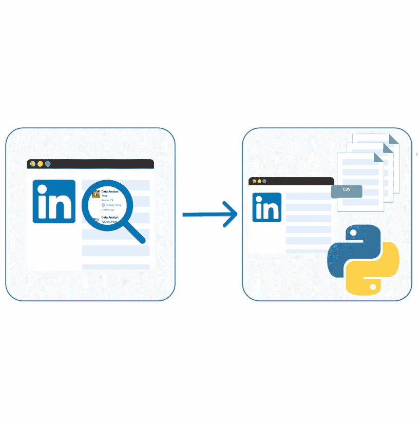

自创形象。

作为一名分析工程师，我非常有兴趣了解任何与数据相关的工作都需要哪些语言、云平台和工具。

然而，**我发现在 Linkedin 等不同的网站上浏览所有的关键信息很烦人，也很无聊。**

于是，我有了一个想法:*为什么我不试试* [*网络搜集*](https://medium.com/dev-genius/webscraping-in-2023-breaking-it-down-to-basics-programming-learning-scraping-python-web-data-science-10fa130cc8be) *Linkedin 的工作列表，直接在数据库中获取所有关键信息？*

*⚠️否认许多网站限制或禁止从他们的网页上抓取数据。在浏览他们的网站之前，请务必阅读他们的条款、条件和限制。*

让我们一起来学习如何创建这样一个工具！👇🏻

# #1.建立我们的环境。

要开发这样的项目，需要两个主要的库:

*   [**硒**](https://www.selenium.dev/) 是用于自动化 web 应用的。它允许你像人类一样打开浏览器并执行任务，比如点击按钮和在网站上搜索特定信息
*   [**beautiful soup**](https://www.crummy.com/software/BeautifulSoup/bs4/doc/)是一个 Python 库，用于从 HTML 和 XML 文件中提取数据。

自创形象。

此外，我们需要一个驱动程序来与我们的浏览器交互。要设置我们的环境，我们首先需要:

1.  **安装 Selenium:** 在命令提示符或终端`pip install selenium`中运行以下命令
2.  **安装美汤:**在您的命令提示符或终端`pip install beautifulsoup`中运行以下命令
3.  **下载驱动程序。我们需要一个驱动程序，这样`Selenium`才能和浏览器互动。检查你的谷歌 Chrome 版本，在这里下载正确的 Chrome 驱动。您需要解压缩驱动程序，并将其放入您记得的路径中——我们稍后将需要这个路径！；)**

⚠️ *因为我是谷歌 Chrome 的普通用户，我打算把它作为我的默认浏览器。️:但是你可以使用任何其他的浏览器。*

# #2.加载库

一旦我们在环境中安装了所有需要的库，我们就通过加载它们来开始我们的代码。除了`Selenium`和`BeautifulSoup`，我们还需要`Pandas`和`Time`。

# **#3。了解 Linkedin 网址，定义我们的工作和感兴趣的地点。**

就我而言，我想开始在美国寻找数据分析师的工作。如果我直接去 Linkedin，那就和在每个输入框里写两个关键词一样简单。

自制图片。显示在 Linkedin 中输入的工作和位置关键字。

如果我们搜索这样的工作和位置，我们可以观察到这两个关键字都反映在相应的 URL 中。

我们将有[关键字=数据% 20 分析师&位置=美国% 20 州。](https://medium.com/r?url=https%3A%2F%2Fwww.linkedin.com%2Fjobs%2Fsearch%3Fkeywords%3DData%2520Analyst%26location%3DUnited%2520States%26geoId%3D103644278%26trk%3Dpublic_jobs_jobs-search-bar_search-submit%26position%3D1%26pageNum%3D0)

这就是为什么，**我们可以简单地直接修改网址来选择我们想要的任何工作和地点——这让我们的生活变得更加轻松！；)**

我们唯一需要注意的是，每当我们使用一个以上的单词时，URL 将使用 *"%20 "来分隔每个单词。*因此，我们可以使用以下代码轻松生成我们想要的 URL:

# #4.加载驱动程序并创建实例

这里的基本思想是用我们的 python 代码控制 web 浏览器。为此，我们需要在 python 和我们的浏览器之间建立一座桥梁。这就是为什么我们使用在步骤 1 中下载的文件来生成我们的 web 驱动程序的实例— **记住路径！**

一旦我们有了实例，就像使用`driver.get()`命令打开工作列表 URL 一样简单。前面的代码将打开一个 chrome 窗口，显示我们的 Linkedin 网页。

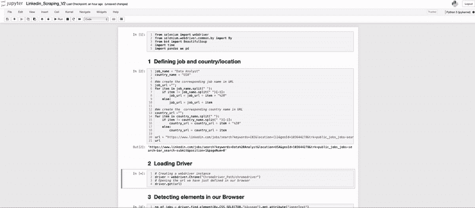

自制 gif。展示了如何使用 Python 在浏览器中打开 Linkedin 窗口。

# #5.检测有多少工作可用。

如果您不熟悉网页抓取，可以右击鼠标，选择*检查*，或者按 *F12* 。应该会出现以下弹出窗口:

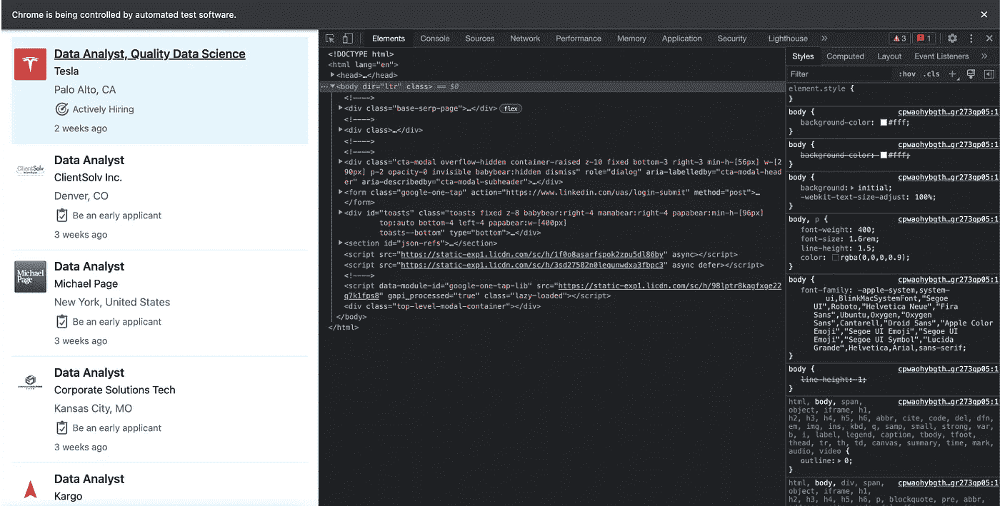

自创形象。Linkedin 检查元素弹出窗口的屏幕截图。

**Linkedin 的搜索结果通常每页有 25 个结果显示在左侧。**每个作业元数据显示在一个作业卡片上。

虽然工作卡包含了我们需要的大部分信息——职位、公司和地点——这很好，但它只有一个简短的工作描述。

**这就是为什么我们必须点击工作卡才能获得完整的工作数据。**

# #6.浏览所有工作

接下来，我们需要知道我们通过这次搜索找到了多少份工作。为此，我们使用 BeautifulSoup 库来获取出现在左上角的数字。

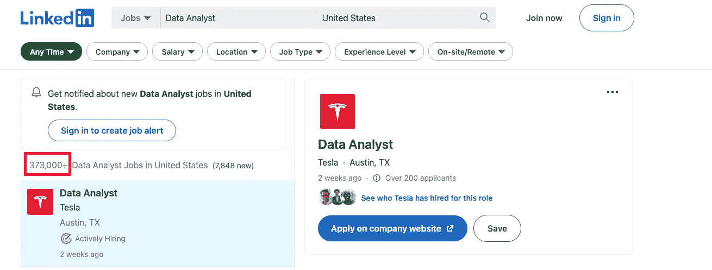

自创形象。显示我们的特定搜索有多少职位可用的屏幕截图。

**然后，我们需要了解 Linkedin 是如何显示工作列表的。【LinkedIn 的工作方式是，如果你向下滚动浏览器栏，就会加载更多的职位。然而，当你拖动工具栏几次，它不会自动加载，但你必须点击按钮*“查看更多工作”。***

这就是为什么首先我们必须向下滚动几次并加载更多的作业，然后，我们必须继续向下滚动并按下*“查看更多作业”*按钮以继续加载更多的作业。

为了适应这两种情况，我们添加了一个“try-except”过程。

如果我们执行前面的代码，我们的浏览器应该开始向下滚动。

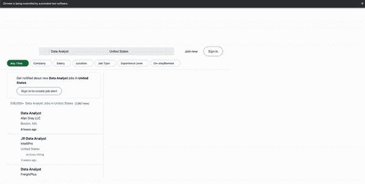

自制 gif。它展示了 Linkedin 网站如何向下滚动，显示更多的职位。

# #7.检测所有元素。

如果我们再次检查该网站，我们可以很容易地观察到每个工作卡都包含在一个

*   元素中。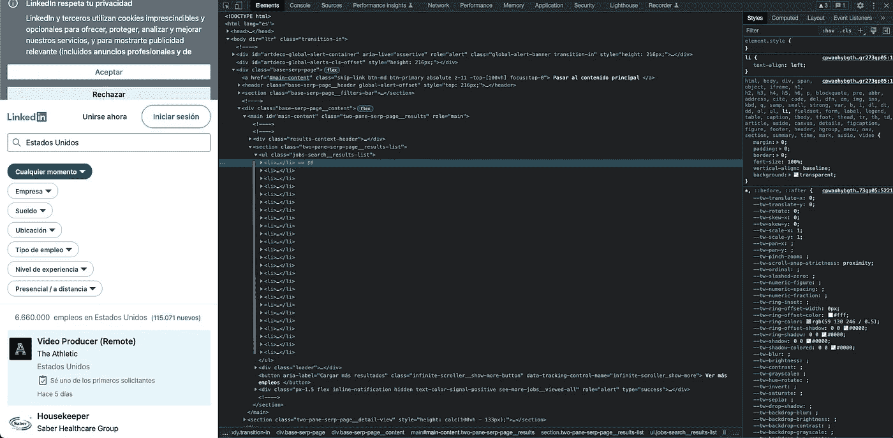

自创形象。您可以观察页面上显示的每个工作卡的所有*   元素。

在每个工作卡中，我们可以找到一个

元素，其中包含我们想要存储的所有缩写信息:

*   **职务**存储在一个< h3 >标题中，标题为‘base-search-card _ _ Title’。
*   **公司名称**在< h4 >标签容器中，类别为“base-search-card__subtitle”。
*   **公司位置**在< span >段中，类别为“求职卡 _ _ 位置”。
*   **发布日期**范围在<时间>部分，类别为‘求职卡 _ _ 列表日期’。

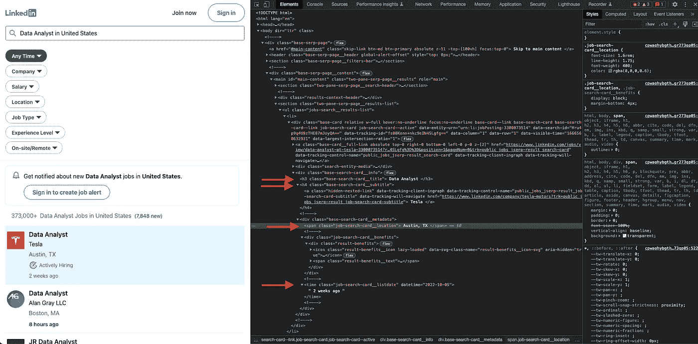

自创形象。您可以观察每个职务卡包含的所有子元素。

*⚠️要知道网页的结构可以随时改变，这一点很重要。这就是为什么，你应该通过检查元素来理解它是如何工作的。*

为了存储所有这些数据，我们首先获取上一步获得的所有作业的列表。在此之后，我们遍历所有作业，并从每个作业元素中提取所需的信息。

例如，要获取标题，我们只需使用命令`driver.find_element(By.CSS_SELECTOR,"element")`定位 h3 元素，并使用`.get_attribute("Inner Text")`命令获取数据。

对每个目标信息重复同样的过程。

# #8.获取每项工作的更多详细信息

正如我之前所说的，每个工作卡只包含缩写信息。然而，我们希望获得尽可能多的信息。这就是为什么，我们将滚动所有作业，单击它们并从它们的完整描述中获取所有数据。

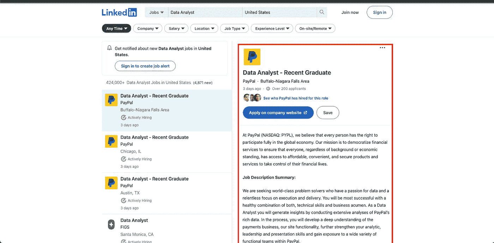

自制图片。显示给定作业的完整描述。

为此，我们再次定位每个作业的

*   元素并点击它。一旦完成，我们再次检查 html 结构以获得我们想要的信息。

*   **作业链接**直接包含在每张作业卡的<李>元素中。
*   **工作描述**包含在一个< div >中，class="show-more-less-html "
*   **工龄**包含在< ul >下的第一个< li >元素中。
*   **作业类型**包含在< ul >下的第二个< li >元素中。
*   **工作功能**包含在< ul >下的第三个< li >元素中。
*   **作业行业**包含在< ul >下的第四个< li >元素中。

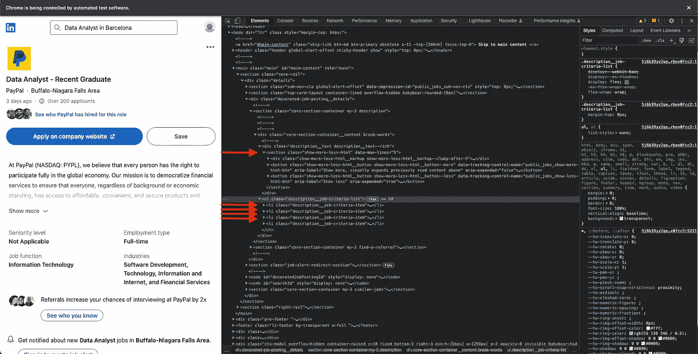

自创形象。Linkedin 截屏显示了每个工作的完整描述的结构。

我们重复与之前相同的过程，循环所有可用的作业，并使用`driver.find_element(By.CSS_SELECTOR,"element")`和`.get_attribute("Inner Text")`获取数据。

现在，我们的浏览器将向下滚动所有可用的工作，同时单击它们。

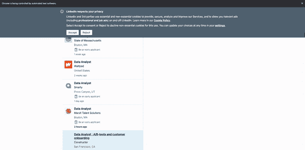

自制 gif。向下滚动浏览器，点击每项工作，获取完整描述。

# #9.创建我们的熊猫数据框架并保存起来。

一旦我们已经将所有数据存储在不同的列表中，我们只需要创建我们的 pandas 数据框，它将包含我们刚刚收集的所有数据。

完成后，我们应该获得如下所示的数据帧:

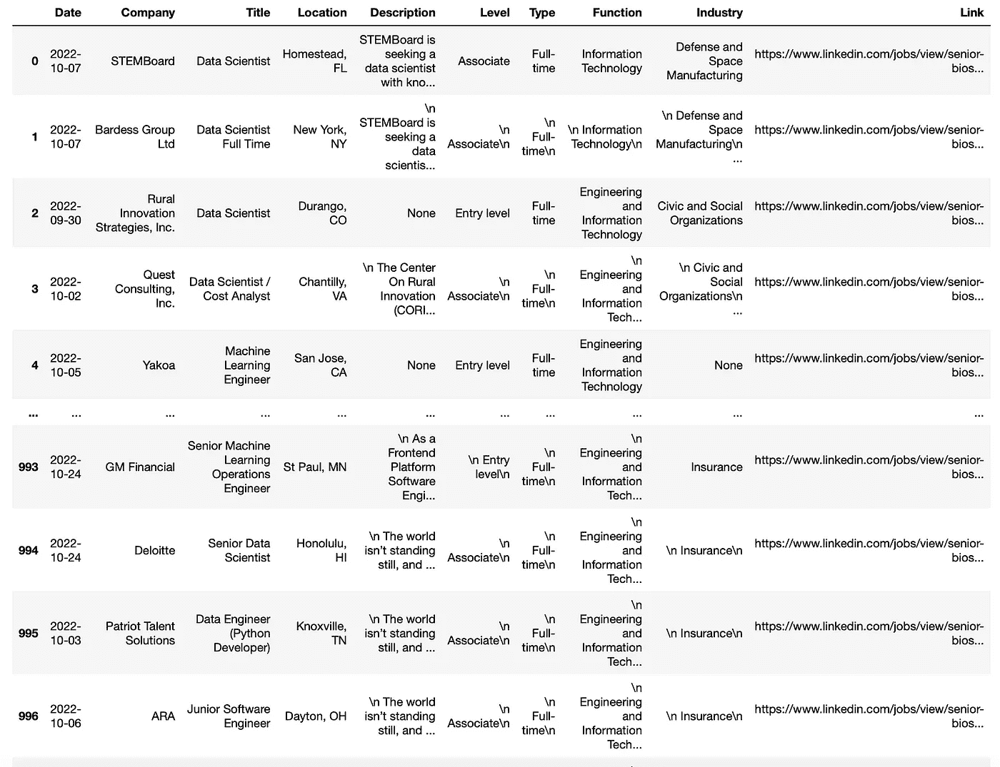

最后一步是将我们的数据帧保存为 CSV 文件。

**现在，我们已经将刚刚收集的数据全部保存在了笔记本电脑中！:)**

你可以在这里找到我的代码。希望这个故事对你理解如何收集 Linkedin 信息有用。

随时问我任何进一步的问题！:D

**数据总有更好的主意——相信它。**

你可以订阅我的 [**媒体快讯**](https://medium.com/subscribe/@rfeers) **继续关注并接收我的内容**。我保证这将是独一无二的！

如果你还不是正式的媒体成员，**就来看看** [**这里**](https://medium.com/@rfeers/membership) **支持我和其他很多作家。** *它真的帮助了* :D

其他一些不错的媒体相关文章，你应该去看看！:D

 [## 2023 年的网络抓取——将它分解为基础

### 以及如何通过 5 个简单的步骤在线收集数据

blog.devgenius.io](/webscraping-in-2023-breaking-it-down-to-basics-programming-learning-scraping-python-web-data-science-10fa130cc8be)  [## 创建最大的气候温度数据集

### 使用伯克利地球数据、python 和 beautifulsoup

medium.com](https://medium.com/geekculture/creating-the-biggest-climate-temperature-dataset-9136cafa4298)  [## 使用 Python & Selenium 抓取 Linkedin 个人资料

### 本文写于 2020 年 1 月，目前 Linkedin 布局如下:

gerrysabar.medium.com](https://gerrysabar.medium.com/scraping-linkedin-profile-using-python-selenium-88cb64888cf)