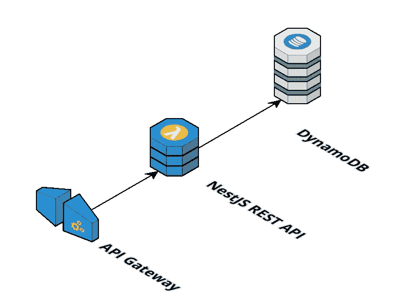
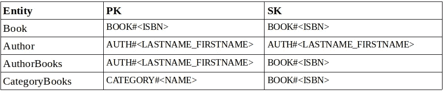
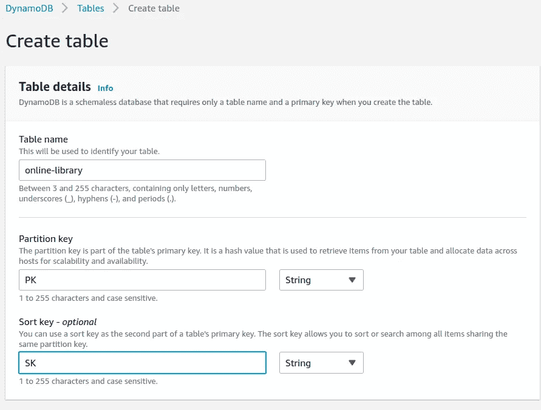
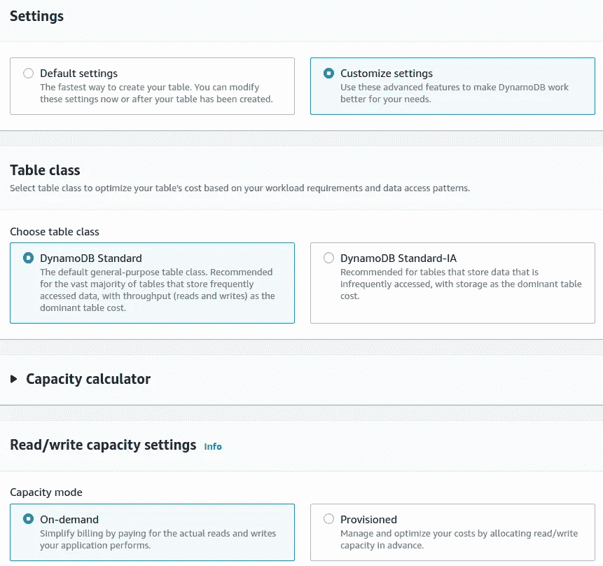
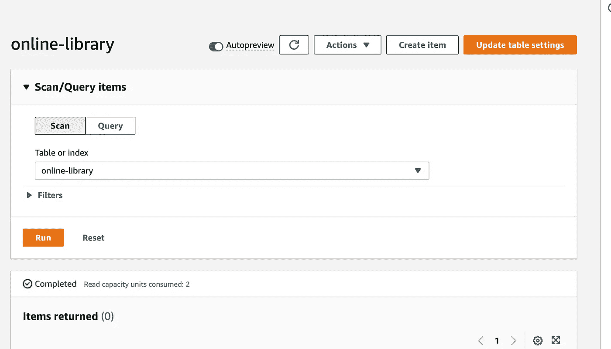
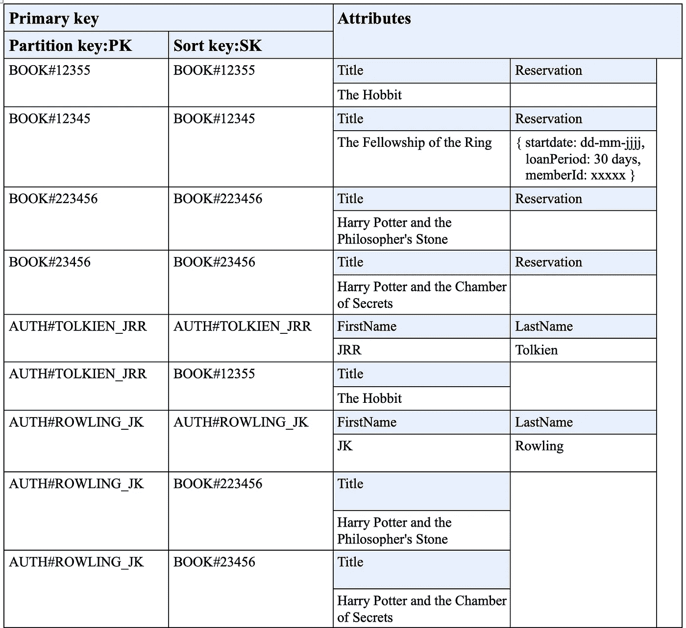
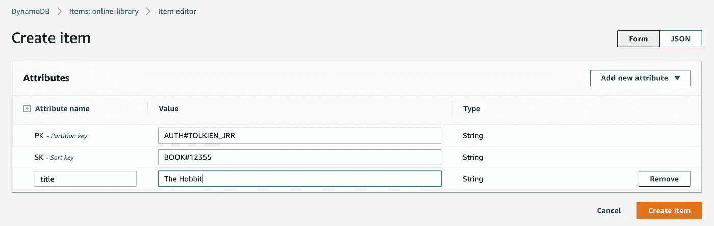
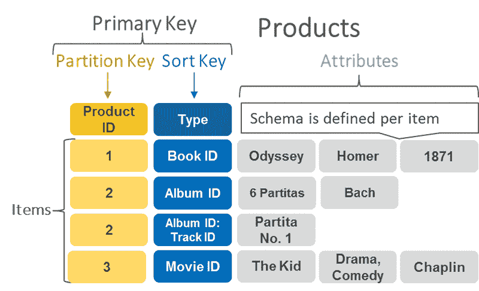

# 如何用 NestJS 和 DynamoDB 构建无服务器 REST API

> 原文：<https://blog.devgenius.io/how-to-build-a-serverless-rest-api-with-nestjs-and-dynamodb-7b58b5b59bf6?source=collection_archive---------2----------------------->


继我上一篇关于[单表设计](https://serverlesscorner.com/how-to-do-single-table-design-with-dynamodb-db9101a43277)的文章之后，我们将使用 NestJS 构建一个连接到 DynamoDB 表的无服务器 REST API。API 将在 AWS Lambda 上运行，并与 API 网关连接(见下图)。这种无服务器架构允许您以按请求付费的定价模式运行服务，只需最少的操作维护。



无服务器架构图

**简介**

> *这是涵盖使用 DynamoDB 的无服务器的一系列文章的第 3 部分***。本文给出了一个如何将 Serverless 与 DynamoDB 结合使用的示例。**
> 
> **★* [*本系列的第 1 部分是关于 DynamoDB 如何适应无服务器空间以及 DynamoDB 的关键概念。*](https://serverlesscorner.com/serverless-and-dynamodb-a-perfect-fit-c3afe99f14cc)*
> 
> **★* [*本系列的第 2 部分着眼于使用 DynamoDB 的单表设计。*](https://serverlesscorner.com/how-to-do-single-table-design-with-dynamodb-db9101a43277)*
> 
> *本系列的第 3 部分给出了一个如何使用 DynamoDB 的例子。*

*让我们快速介绍一下这里使用的技术，让您更好地了解我们将要在这里构建的内容。*

## *DynamoDB*

*DynamoDB 是一个按需付费、低维护的 NoSQL 数据库，非常适合无服务器架构。关键概念和建模数据的方法[在之前的文章中已经解释过了。](https://serverlesscorner.com/how-to-do-single-table-design-with-dynamodb-db9101a43277)*

## *无服务器框架*

*无服务器框架是一个独立于供应商的框架[为您完成繁重的工作](https://serverlesscorner.com/your-first-serverless-project-cbf1deee29f7)。它的平台包含许多插件，可以在各种使用情况下帮助你。使用无服务器 CLI，您可以用一个命令部署代码。*

## *NestJS*

*NestJS 是一个 NodeJS 框架，完全支持 Typescript，用于构建服务器端 NodeJS 应用程序。它支持像[依赖注入](https://www.freecodecamp.org/news/a-quick-intro-to-dependency-injection-what-it-is-and-when-to-use-it-7578c84fa88f/)这样的设计模式，并使用 decorator(Java 中的注释),这允许你快速定义路线、请求参数等。它是 [Spring MVC 注解](https://www.baeldung.com/spring-mvc-annotations)的 javascript 版本。*

## *API 网关*

*Amazon API Gateway 允许您发布、监控和保护基于 HTTP 的 API 来处理 HTTP 请求。它与 AWS Lambda 配合得非常好。*

# *让我们开始建造吧*

*那么，现在我们知道谁是聚会的客人，让我们开始建造。我们将构建一个在线图书馆服务，作为运行在 AWS Lambda 上的 REST API，并从 DynamoDB 存储库中获取数据。以下前提条件是您已经安装了节点和无服务器 CLI。如果没有，请参见“[你的第一个无服务器项目](https://serverlesscorner.com/your-first-serverless-project-cbf1deee29f7)，了解如何安装它们。*

> *本文的完整项目可以在 Github[https://github.com/cyberworkz/examples](https://github.com/cyberworkz/examples)的在线图书馆文件夹中找到。*

*使用以下命令，通过无服务器 CLI 创建一个新项目:*

```
*sls create --template-url [https://github.com/cyberworkz/serverless-templates/tree/main/aws-nodejs-typescript-restapi-nest](https://github.com/cyberworkz/serverless-templates/tree/main/aws-nodejs-typescript-restapi-nest) --path online-library*
```

*使用该模板，它将创建一个配置为作为 AWS Lambda 运行的 NestJS Typescript 项目。*

*使用 online-library 文件夹中的终端进行导航，并运行' *npm install'* ,以获取软件包。通过运行“npm run start”来测试项目，并在浏览器中导航到[http://localhost:3000/dev/hello](http://localhost:3000/dev/hello)。你应该会看到一条信息“你好，世界”*

## *嵌套 CLI*

*接下来，我们将使用 Nest CLI 进行构建。在终端中运行以下命令以安装 Nest CLI:*

```
*npm install -g @nestjs/cli*
```

*Nest CLI 让您[快速生成类型脚本类](https://docs.nestjs.com/cli/usages)节省您的时间。进入生成的在线库项目，运行以下命令:*

```
*nest g controller books*
```

*这将创建一个目录*‘books’*，带有类型脚本类 *books.controller.ts* 。打开这个类，你应该会看到一个标注了'*控制器*'和前缀*'书籍*'的类。这意味着所有对 *'/books'* 的请求都将被路由到这个类。*

*运行以下命令来生成一个*服务*和*存储库类*:*

```
*nest g service  books
nest g class    books/books.repository*
```

*使用类的构造函数，使用“*依赖注入*连接类。这是[用 nestj](https://docs.nestjs.com/providers#dependency-injection)注入依赖关系的默认方式。*

*这些类的设置是控制器类定义端点来处理传入的 HTTP 请求。服务类将处理任何业务逻辑，存储库类处理与数据库的通信。将这些关注点分开会带来灵活性。*

## *API 端点*

*现在，我们将向*控制器类*添加两个 API 端点来处理对我们在线图书馆服务的请求:*

*   *通过 ISBN 检索图书*
*   *检索作者的书籍*

*在方法 *getBookByISBN* 和*getbookbyauthor*上使用 decorators 会得到以下结果:*

*代码非常简单明了，这是使用 decorators 的一个很强的特性。*

# *DynamoDB*

*因此，现在让我们将注意力集中在从 DynamoDB 检索数据上。DynamoDB 中的数据模型将使用[单表策略](https://serverlesscorner.com/how-to-do-single-table-design-with-dynamodb-db9101a43277)，其中所有类型的数据都位于同一个表中。实体“Book”和“Author”将由分区键(PK)和排序键(SK)的以下结构定义:*

**

*实体数据模型*

*一个作者的所有书籍都在该作者主键的*‘条目集合*’中。*

## *创建 DynamoDB 表*

*创建 DynamoDB 表有多种方法，我最喜欢的是使用 AWS CDK，但是为了本文的简单，我将向您展示如何使用 AWS 控制台来完成。*

*登录你的 AWS 控制台，进入服务' *DynamoDB* '。在仪表板页面点击“创建表格”按钮。为表格命名，例如“online-library”。使用分区键字段的值 *PK* 和分类键字段的值 *SK f* 。*

**

*按照下面屏幕上的方式自定义设置，以坚持按需模式。*

**

*点击页面底部的“*创建表格*”按钮。现在您已经创建了一个 DynamoDB 表。*

*通过导航到表中的项目并点击“创建项目”按钮，向表中添加项目。*

**

*在线图书馆表格的项目*

*使用下表为作者和图书实体添加项目。*

**

*项目表*

*使用控制台创建项目应该如下所示:*

**

*创建项目的示例*

## *从 DynamoDB 读取数据*

*现在我们要实现 book repository 类来从 DynamoDB 表中获取数据。在构造函数中使用 DynamoDB 客户端初始化 repository 类:*

*启动 DynamoDB 客户端*

*Book 和 Author 实体的前缀将用于创建 PK 和 SK，以从 DynamoDB 获取数据。*

## *GetItem*

*让我们从检索一本书的 ISBN 号开始。我们将使用 GetItem 操作，该操作用于从 DB 中检索单个项目。这是读取单个项目的最有效方式。为此，我们需要一个项目的主键(PK + SK ),如下例所示。*

**

*参见下面的代码。我们使用带前缀的 ISBN 号来获取这本书的主键，并用它从 DynamoDB 中检索这本书。*

*如果没有找到书，就会抛出一个异常。相当简单的东西。*

## *询问*

*接下来，我们将实现使用作者的名字和姓氏从作者那里获取书籍。这里我们将使用*查询*方法。使用查询，DynamoDB 检索所有具有特定分区键的项目。在这些项目中，我们可以对排序关键字应用一个条件，并且只检索数据的一个子集。使用*查询*可以快速、高效地访问数据。*

*参见下面的代码。为了从作者那里获取书籍，我们将使用作者的 PK，并使用 SK 上的一个条件来过滤实体，其中我们使用书籍前缀作为参数。这里我们用了条件“T4”开头。*

## *扫描*

*从 DynamoDB 读取数据的另一种方法是使用扫描操作。然而，应该谨慎使用扫描，因为它们会消耗大量的系统资源。就目前来说，用了也没什么用。*

*所以，这就结束了。我希望这对你的无服务器之旅有所帮助。同样，这个项目的代码可以在 Github 上找到👇在线图书馆文件夹中的 https://github.com/cyberworkz/examples。*

# *海科·范德沙夫*

*   ****如果你喜欢这个，请*** [***跟随 Serverlesscorner.com 上媒***](https://serverlesscorner.com/about) ***。****
*   ****爱情*** ❤️ ***阅读*** ***我的故事和其他关于媒？*** [***成为会员***](https://serverlesscorner.com/membership) ***如果你还不是会员的话。****
*   ****想阅读更多无服务器？报名我的*** [***月报***](https://serverlessconsulting.org/newsletter) ***📬关于无服务器技术和使用案例的启发性和深刻的故事。****