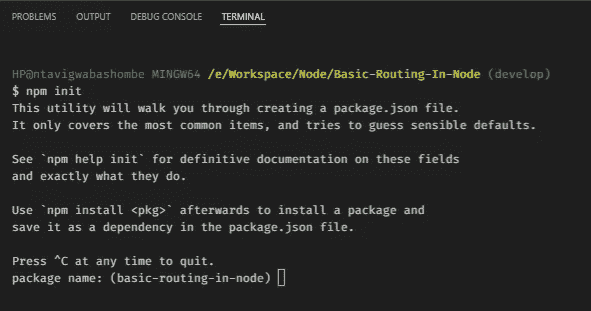
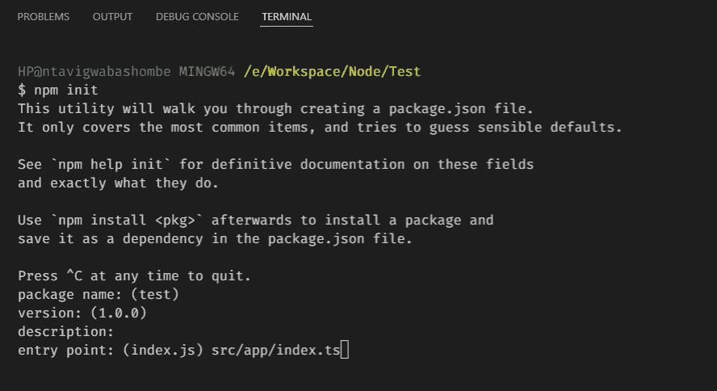
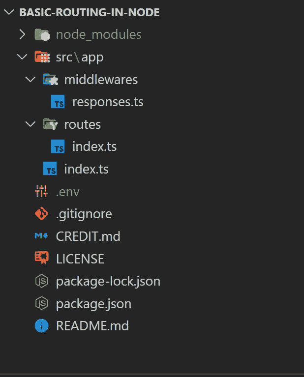
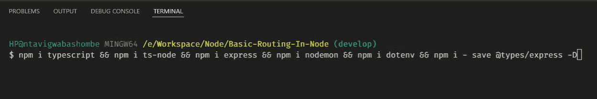
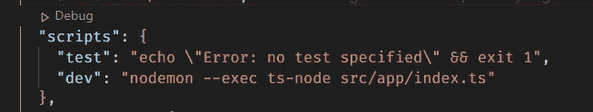
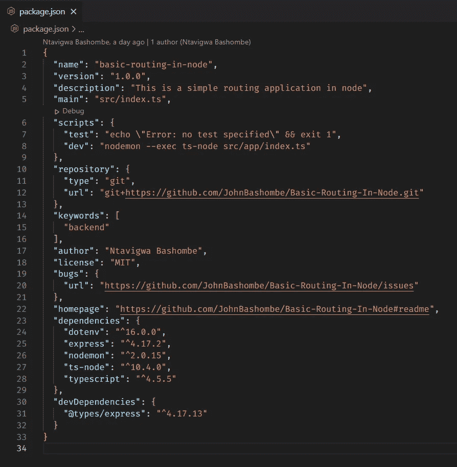
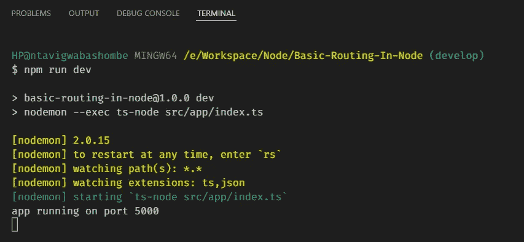
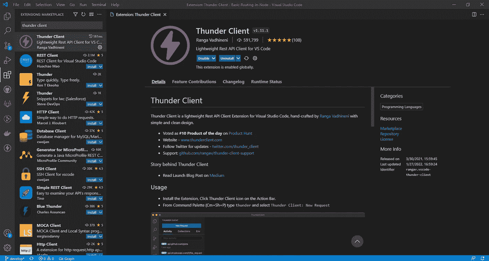
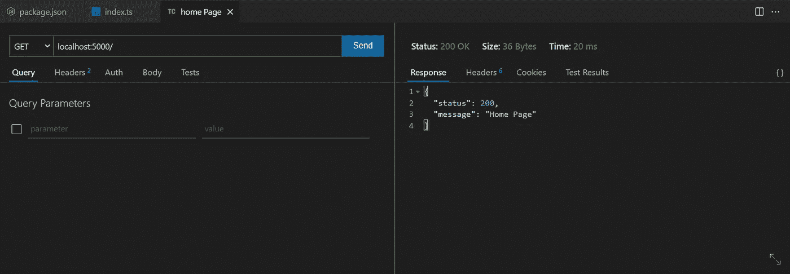
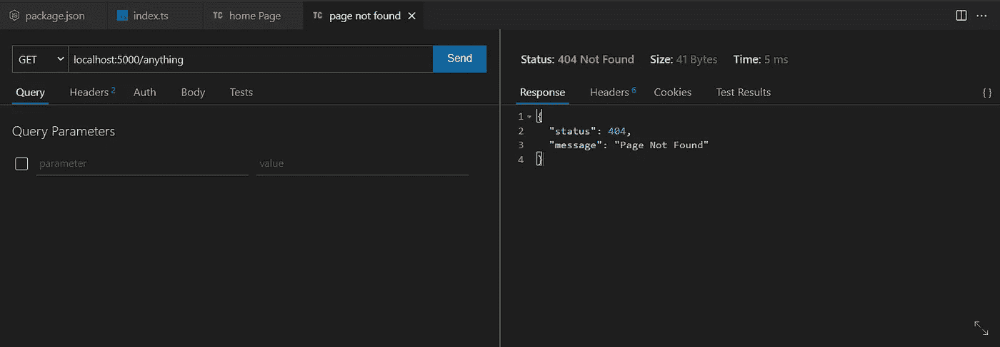

# 如何在 TypeScript 中用 Node & Express 构建一个简单的 RESTFUL 后端 API 应用程序？

> 原文：<https://blog.devgenius.io/how-to-build-a-simple-restful-backend-api-application-with-node-express-in-typescript-7ff1c21b3755?source=collection_archive---------8----------------------->

## *后端开发*

## **基本介绍**

软件开发经验

你好。

在本帖中，我们将学习如何用 **Node.js** 创建和构建一个 restful 后端应用，并在 **Typescript** 中表达**框架**。

这个小型的介绍性应用程序将向您介绍 node 如何工作的基本概念，以及构建真实世界的应用程序需要什么。您可以立即开始使用这个项目结构，开始构建任何中小型项目，对 node 和 typescript 非常有信心。

所以让我们开始吧。

# **基本概念**

## node.js 是什么？

Node.js 是一个开源的跨平台运行时环境，在浏览器之外运行 JavaScript。它旨在构建可伸缩的网络应用程序。

## 什么是 Typescript？

Typescript 是 JavaScript 的超集，它向语言添加了可选的静态类型。Typescript 代码在执行时被转换编译成 JavaScript 代码。

# **项目初始化**

由于 typescript 只是 JavaScript 的一个更高级的版本，我们将通过初始化根文件夹中的节点来启动我们的 typescript 项目，就像我们通常启动 JavaScript 项目一样。

您将需要在您的 PC 上安装的 **node.js 来运行这个命令。如果没有安装 node.js，可以点击 [**这里**](https://nodejs.org/en/) 下载安装。**

> npm 初始化

通过运行 **> > > npm init** 初始化一个节点项目

该命令将引导您完成节点项目的初始化，并将为您创建一个 package.json 文件，在该文件中将添加我们所有的依赖项和 devDependencies。

如果您不想添加任何自定义配置，只需通过键入 enter 键接受除入口点之外的所有默认节点设置，入口点是包含模块主要逻辑的文件。入口点是**代码的开头。**

> 入口点: **src/app/index.ts**

设置入口点

# **文件夹结构**

现在我们已经初始化了我们的项目，让我们创建我们的项目结构。这很简单。一切都将存储在 src 文件夹下，我们将有一个应用程序文件夹，其中又将包含两个文件夹:中间件和路由文件夹。

在我们的中间件中，我们将有 Responses 类，在 routes 中，我们将有 routes 类。在 app 文件夹中，我们将有一个 index.ts 文件来初始化项目。

文件夹结构

# **添加依赖项和开发依赖项**

现在我们已经建立了我们的结构，让我们向在根文件夹中创建的 package.json 文件添加一些依赖项。

一个 **package.json** 文件保存了与项目相关的各种元数据。它向 npm 提供信息，使其能够识别项目并处理项目的依赖关系

该命令将添加我们将在项目中使用的所有包。

## 命令:

> NPM I typescript & & NPM I ts-node & & NPM I express & & NPM I nodemon & & NPM I dotenv & & NPM I-save @ types/express-D

安装依赖项和 devDependencies

*   打字稿:这是我们将要使用的语言
*   Ts-node:它将帮助我们将 typescript 翻译成 JavaScript，这样它就可以直接在 node 上运行，而无需预编译
*   Express:它是 node 的后端 web 应用程序框架。
*   Nodemon:当检测到目录中的文件更改时，它将用于自动重启我们的应用程序
*   Dotenv:它将帮助我们从一个. env 文件中加载环境变量。在我们的例子中，我们只有。环境文件。

## 让我们也添加这个脚本:

> " dev ":" node mon-exec ts-node src/app/index . ts "

将“**开发”**脚本添加到 package.json

## Package.json 文件

package.json 文件

到我们的 package.json 文件的脚本部分。它将用于运行我们的应用程序。现在我们已经安装了所有的依赖项和 dev dependencies，让我们在 routes 文件夹中创建 index.ts 文件，该文件将包含我们所有的应用程序路由。

路线/索引. ts

现在我们已经创建了我们的路线，让我们在 app 文件夹中创建一个 index.ts 文件，它将初始化我们的应用程序，并通过调用从 **routes** 导出的 route 函数来初始化路线。

src/app/index.ts

在我们的 middlewares 文件夹中，让我们创建一个 index.ts 文件，它将包含我们的响应方法。

中间件/索引. ts

在根文件夹中，创建一个. env 文件并初始化端口

。环境文件

现在我们已经设置好了一切，让我们通过打开终端并键入命令来运行我们的应用程序:

> **npm 运行开发**

本地运行我们的应用

你在那里，

您已经使用 typescript 在 node 和 express 中成功构建了一个简单的 restful 后端 API 应用程序。

> 要测试 API，您可以使用 POSTMAN，或者如果您正在使用 Visual Studio 代码进行编码，您可以使用扩展 Thunder Client。它们都提供了完整的 API 测试功能。

## 这些是您可以测试的端点:

> 主页:localhost:5000/
> 
> 关于我们:localhost:5000/关于
> 
> 联系我们:本地主机:5000/联系
> 
> 找不到页面:localhost:5000/任何内容

# 将 Thunder 客户端添加到 VS 代码

进入 VS code 侧边栏的扩展图标，搜索“**迅雷客户端”**，然后点击 install。安装后，侧边菜单会增加一个迅雷客户端的新图标。单击那个 thunder 图标，开始测试我们在会话中创建的端点。

# 迅雷客户端测试截图(VS 代码扩展)

## 主页路由

## 页面未找到路线

# **总结**

在本文中，我们将指导您使用 Typescript 中的 node 和 express 创建一个简单的后端 API 应用程序，以及如何为中小型后端项目构建项目。

下一次，我们将讨论如何在 node 和 express 中使用类似 Sequelize 的 ORM(对象关系映射)构建一个简单的身份验证 app。

**感谢您通读。**

***快乐编码！！！***

*如果想获得完整代码，可以在我的 GitHub 资源库* [***这里***](https://github.com/JohnBashombe/Basic-Routing-In-Node) ***获得。***