# 如何在 Typescript 中用 Node & Express & MySQL & TypeORM 构建一个简单的 restful BLOG API 后端应用程序

> 原文：<https://blog.devgenius.io/how-to-build-a-simple-restful-blog-api-backend-application-with-node-express-mysql-typeorm-266237ab1bba?source=collection_archive---------2----------------------->

## 后端开发

## 基本概念

你好，

今天在这篇文章中，我们将使用 node 和 typescript 构建一个简单的 CRUD“创建、读取、更新和删除”应用程序。

这个小型的介绍性应用程序将向您介绍如何使用 node.js 和 typescript 进行数据库设计和连接，以及如何向数据库发出简单的请求并从数据库获得响应。

在本节课之后，您将学习在 node.js 中构建 CRUD 应用程序所需的所有基本概念。

那我们开始吧。

# **基本概念**

## node.js 是什么？

Node.js 是一个开源的跨平台运行时环境，在浏览器之外运行 javascript。它旨在构建可伸缩的网络应用程序。

## 什么是 Typescript？

Typescript 是 Javascript 的超集，它向语言添加了可选的静态类型。Typescript 代码在执行时被转换为 Javascript 代码。

## 什么是 MySQL？

MySql 是一个开源的关系数据库管理系统。

## 什么是 TypeORM？

TypeORM 是在 node.js 中运行的高级对象关系管理模块。ORM 是用您选择的语言编写的完全普通的库，它封装了操作数据所需的代码，因此您不再需要使用 SQL。

# **项目初始化**

由于 typescript 只是 javascript 的一个更高级的版本，我们将通过初始化根文件夹中的 node.js 来启动我们的 typescript 项目，就像我们通常启动 javascript 项目一样。

> **NPM init**

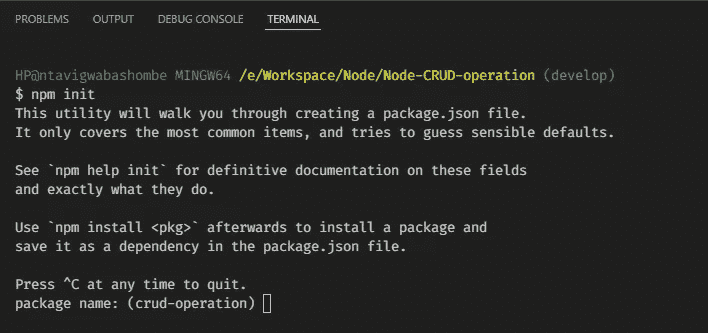

该命令将引导您完成节点项目的初始化，并将为您创建一个 package.json 文件，在该文件中将添加我们所有的依赖项、devDependencies 和脚本。

# **文件夹结构**

现在我们已经初始化了我们的项目，让我们创建我们的项目文件夹结构。

一切都将存储在 src 文件夹下，在那里我们将有一个 app 文件夹，该文件夹又将包含四个文件夹:中间件、路由、控制器和数据库。在我们的中间件中，我们将有响应处理器、代码和错误消息。在路由中，我们将有自己的路由类。在控制器中，我们将拥有连接路由和服务的控制器类。在数据库文件夹中，我们将拥有将应用程序连接到数据库的实体和服务。在 app 文件夹中，我们将有一个 index.ts 文件来初始化项目。

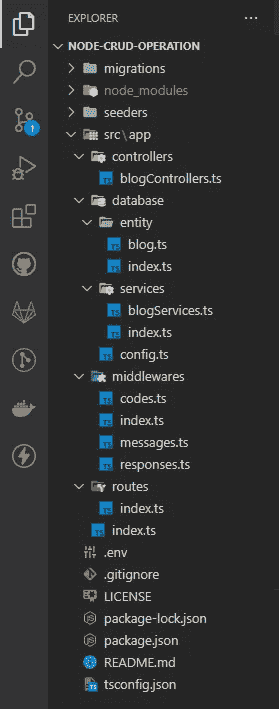

我们的。env 将在我们的根文件夹中创建。

我们还将在根文件夹中有一个 tsconfig.json 文件。

# **添加依赖项、开发依赖项和脚本**

现在我们已经建立了我们的结构，让我们向在根文件夹中创建的 package.json 文件添加一些依赖项。

让我们一次添加我们将在这个项目中使用的所有包。

## 运行以下命令:

> ***NPM install dotenv express MySQL 2 nodemon ts-node type ORM typescript&&NPM I—save @ types/express-D***

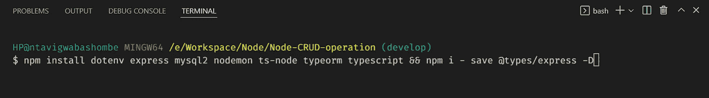

*   打字稿:这是我们将要使用的语言
*   Ts-node:它将帮助我们将 typescript 翻译成 javascript，这样它就可以直接在 node.js 上运行，而无需预编译
*   Express:是 node.js 的后端 web 应用框架。
*   Nodemon:当检测到目录中的文件更改时，它将用于自动重启我们的应用程序
*   Dotenv:它将帮助我们从一个. env 文件中加载环境变量。在我们的例子中，我们只有 PORT 作为环境变量。
*   MySQL2:它是 node.js 应用程序的快速 MySQL 驱动程序

## 这个脚本将允许我们启动我们的应用程序。

> ***【开始】:" nodemon–exec ts-node src/app/index . ts "***

由于我们将使用 MySQL，我们将需要一个 web 服务器提供商，在我们的例子中，我们将使用 XAMPP。有很多服务器提供商，你可以选择任何你觉得舒服的。XAMPP 是跨平台、Apache、MySQL、PHP 和 Perl 的缩写。XAMPP 是由 Apache Friend 开发的免费开源跨平台 web 服务器解决方案堆栈包。你可以在这里下载 XAMPP*。*

*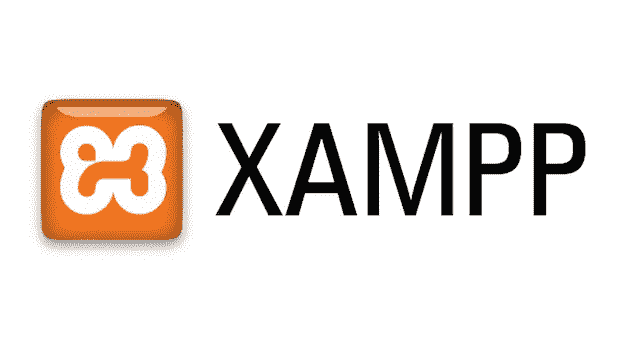*

*安装完成后，打开它并启动 MySQL。*

*对于这个演示，您需要为我们的应用程序创建一个数据库。转到[http://localhost/phpmyadmin/](http://localhost/phpmyadmin/)并创建一个名为**“simple _ blog _ crud _ db**的新数据库。*

*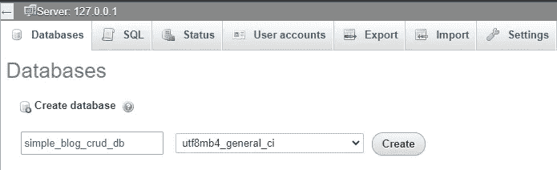*

*现在我们已经运行了服务器，创建了数据库，添加了所有的包，*

*现在让我们开始编写应用程序逻辑。*

***我们需要在 src/app/index.ts 中初始化我们的应用***

*然后我们在 src/app/routes/index.ts 中创建我们的路线*

***然后我们需要在 src/app/controllers/blog controllers . ts 中创建控制器类***

*让我们在 src/app/middleware 中创建我们的中间件*

***我们将拥有响应处理器***

***代码响应***

***消息响应***

***和一个一次导出所有三个类的索引文件。***

***在我们的数据库文件夹中，我们将有一个 config.ts 文件来初始化与数据库的连接，***

*我们将拥有包含博客实体的实体文件夹。*

***和导出该实体的 index.ts 文件***

***我们还会有一个服务文件夹。它包含一个将控制器连接到数据库的 blogServices.ts 文件。***

***和一个 index.ts 文件，该文件导出服务并初始化数据库连接。***

*要运行该应用程序，请转到您的终端并运行:*

> **npm 启动**

*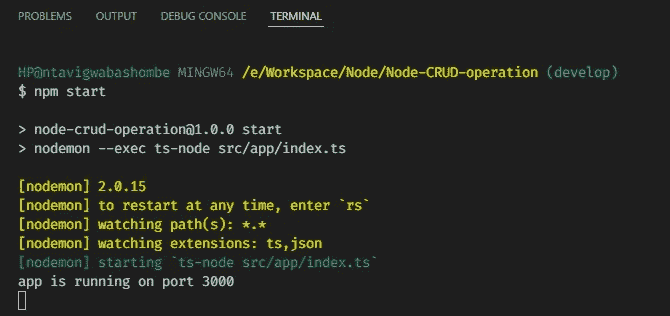*

*该命令将在应用程序启动时创建我们所有的迁移。因为我们只有一个表，所以只创建一个表。*

*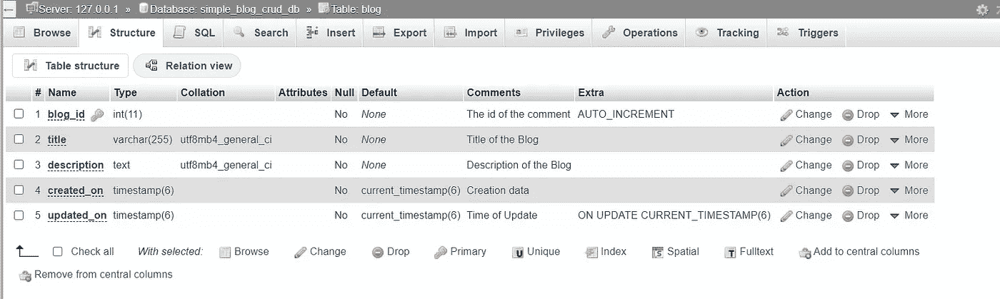*

*在运行这个命令之前，不要忘记打开你的 MySQL 服务器，否则，你会得到一个错误，告诉你先启动你的服务器。*

*现在让我们使用 thunder client 测试我们的端点。您可以使用自己选择的任何 API 测试平台。*

*转到 visual studio 代码，并确保安装了 thunder 客户端扩展。在 thunder client 中创建一个新的集合，并按照您想要的方式命名，然后创建新的请求来开始测试我们的应用程序端点。*

*让我们从测试“home”和“not found”页面开始，它们是“get requests”。*

## *主页:*

*GET:***localhost:3000/****

*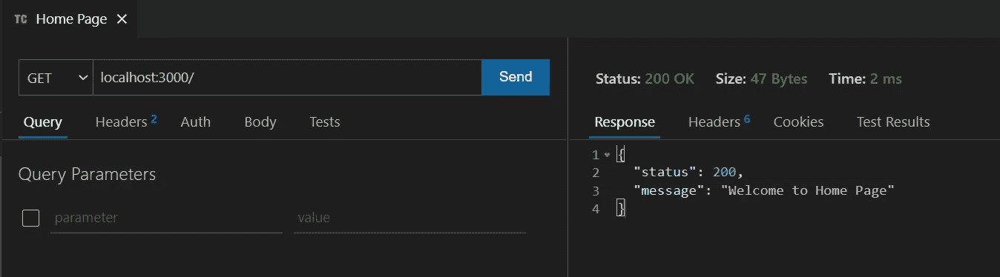*

## *找不到页面*

> **获取* : ***本地主机:3000/任何东西****

*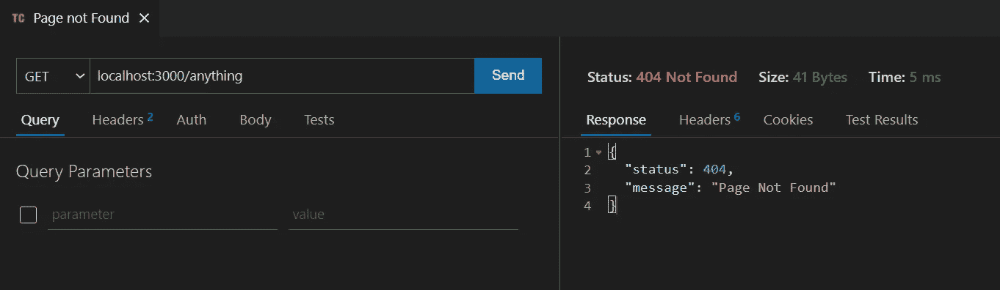*

*既然我们的 get 请求正在工作，现在让我们开始向我们的数据库添加一个新的帖子。*

## *创建帖子:*

> **帖子:****localhost:3000/create****

*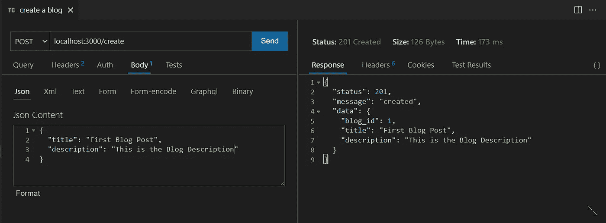**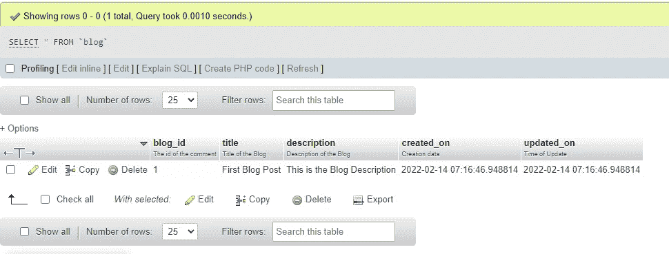*

## *让我们获取所有可用的已创建的博客。*

> **获取*:***localhost:3000/博客****

*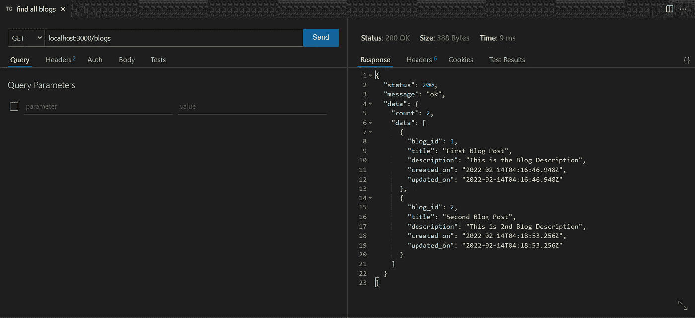*

## *让我们只获取一个 blog_id = 1 的博客。*

> **获取*:***localhost:3000/blogs/1****

*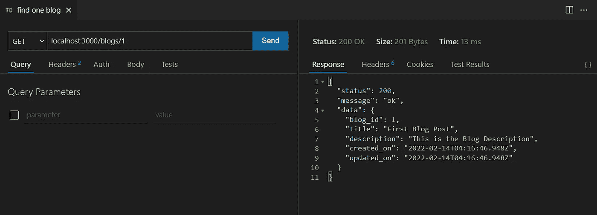*

## *现在让我们更新一个 blog_id = 1 的博客*

> **放*:***localhost:3000/update/1****

*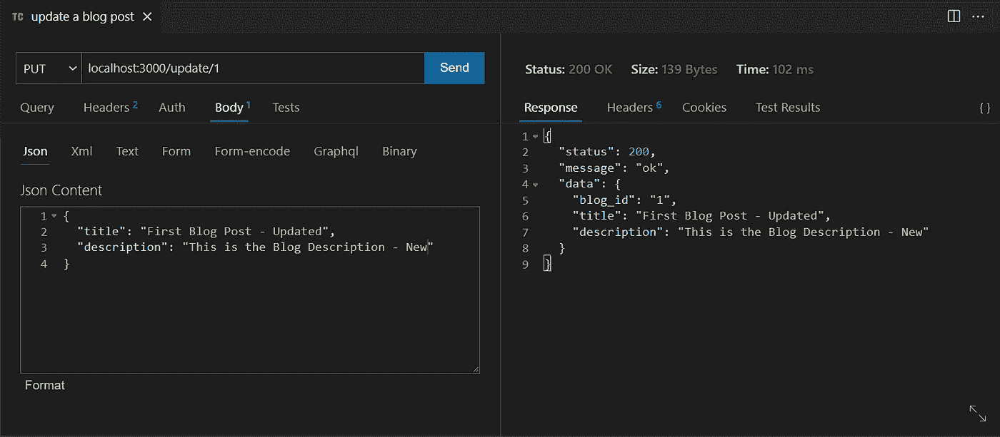**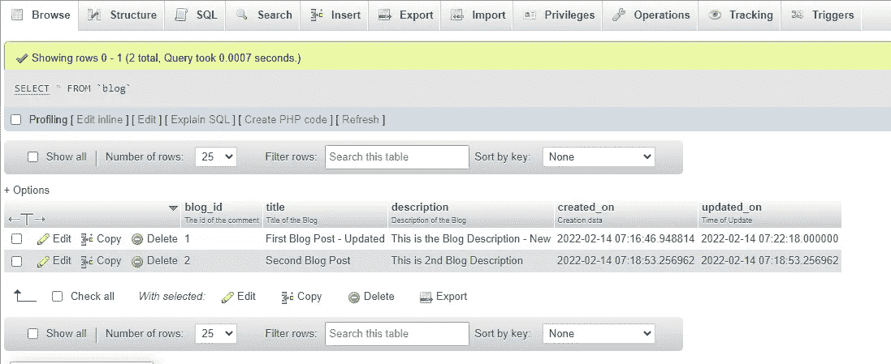*

## *现在让我们删除一个 blog_id = 1 的博客*

> **删除*:***localhost:3000/DELETE/1****

*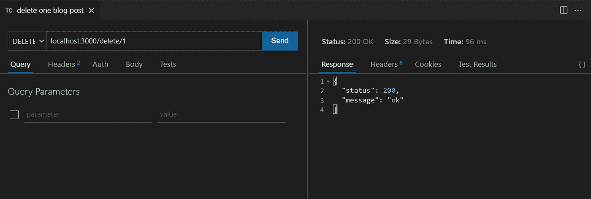**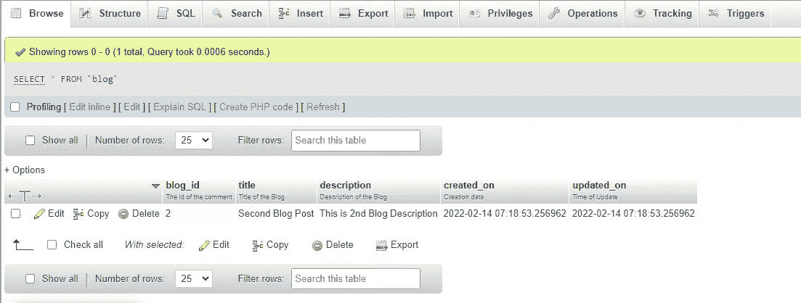*

# ***总结***

*在本文中，我们将指导您使用 Typescript 中的 node、express、MySQL 和 typeORM 创建一个简单的 restful 后端博客 API 应用程序。*

*下一次我们将讨论如何使用相同的堆栈构建一个简单的认证应用程序。*

*感谢您的阅读。*

*编码快乐！*

*如果你想获得完整的代码，你可以在我的 GitHub 库 [***这里***](https://github.com/JohnBashombe/Basic-Routing-In-Node) 获得*