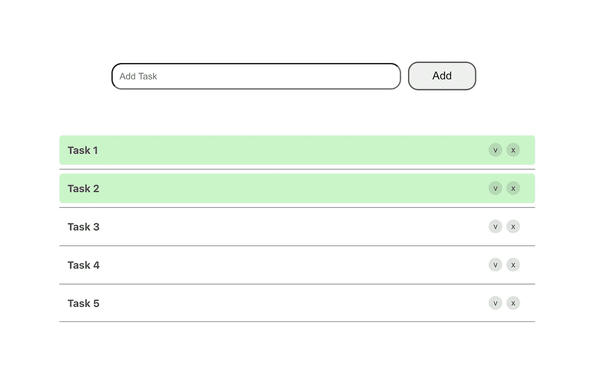
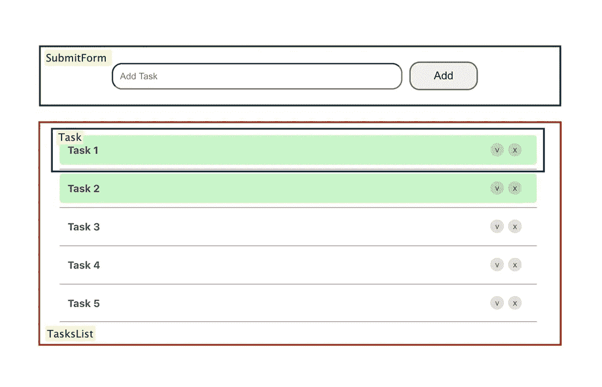

# 如何用 React 构建一个简单的 Todo 应用

> 原文：<https://blog.devgenius.io/how-to-build-a-simple-todo-app-with-react-dd979a6a7a8a?source=collection_archive---------2----------------------->

## *你今天就可以开始构建的有趣的附带项目*



如果您正在尝试学习 React，那么您可能已经看到很多文章和教程告诉您开始构建自己的项目，以便扩展您的能力和知识。的确如此，在我看来，这也是为了高效学习新东西的最快方法。

弄清楚要构建什么可能很难，而且需要很多时间。另一个“你好，世界！”像应用程序不会真的教你太多。另一方面，面对一个几乎面面俱到的巨大项目也不是一个好主意。很容易被压倒，结果你可能会放弃。你不想发生这种事！

在本教程中，我将涵盖所有的细节，以建立自己版本的简单待办事项应用程序。这是一个众所周知的项目，几乎每个开发人员在学习过程的开始都会做这个项目。这个小项目涵盖了 React 中许多有趣的细节，是将您的编码技能提升到一个新水平的绝佳实践！

本教程假设您对 JavaScript 概念有基本的理解。本质上，您需要知道什么是变量、数组、函数和对象，但是您不需要有构建 React 应用程序的经验，我们将一起讨论所有细节。

# 在开始之前

规划是关键！规划阶段是每个软件项目最重要的阶段，不管它是大是小。构建完美的应用程序或成为一名出色的程序员不仅仅是学习特定编程语言的语法。如果你想让你的技能更上一层楼，你需要在开始编码之前投入更多的时间和精力来规划你的项目，这样做肯定会提高你的思维能力，也会带来更好的结果。

让我们从构建一个简单的模式开始，我们将在处理待办事项应用程序时遵循该模式，该模式将让我们对我们正在构建的内容有一个基本的了解，并且还将包含为了获得预期结果而应该构建的所有组件。



如上面的模式所述，我们需要构建三个 react 组件:

1.  **SubmitForm** —该组件包含用户需要填写的表单，以便向列表中添加一个任务。它包括一个用于输入的编辑框和一个提交按钮。
2.  **任务列表** —这是所有现有任务的容器。
3.  **任务** —该组件用于单个任务。它包含任务术语和两个按钮，一个用于将任务标记为完成，另一个用于从任务列表中删除任务。

除了这三个组件，我们还将拥有“App”组件，它将在创建 react 应用程序时自动生成，最终它将包含所有其他组件，以形成最终的 Todo 应用程序。

# 设置

为了实现这个 Todo 应用程序，我将使用 [Visual Studio 代码](https://code.visualstudio.com/)作为我的文本编辑器。你可以考虑使用任何你喜欢的文本编辑器，比如 [Atom](https://atom.io/) 或者 [Sublime Text](https://www.sublimetext.com/) 。为了使事情更容易，作为开始，我建议从 Visual Studio 代码开始。

您还需要在本地开发机器上安装[node . js](https://nodejs.org/en/download/)version>= 8.10。这将确保安装一个名为`[npm](https://www.npmjs.com/)`的包管理应用程序，它还包括一个名为 npx 的工具，可以运行可执行的包。

npx 工具使我们能够运行一个远程脚本，该脚本将从为我们的新项目创建一个新目录开始，还将在该目录中运行“npm install ”,以便下载我们将需要的所有附加依赖项。

# 开始吧！

若要安装基础项目，请运行以下命令:

```
npx create-react-app todoapp
```

创建的 react 应用程序的名称是“todoapp”。你可以选择你想要的名字，但是一定要用小写字母。

现在，您的项目被设置在一个名为“todoapp”的新目录中。让我们转到这个新目录:

```
cd todoapp
```

此时，您已经创建了一个新项目，并且存在于根目录中。键入以下命令将启动项目:

```
npm start
```

运行此命令将自动在浏览器窗口中打开初始项目。如果这种情况没有发生，您仍然可以通过访问这个地址`[http://localhost:3000/](http://localhost:3000/)`来手动完成。我建议您在浏览器中打开项目，这样您就可以看到网站的运行情况，并一步一步地跟踪您所做的所有更改。

为了保持我们的项目有条理，我建议你导航到“src”目录，并在那里创建一个名为“components”的新文件夹。在这个目录中，创建三个目录，每个目录对应一个创建 Todo 应用程序所需的组件: **SubmitForm** 、 **TasksList** 和 **Task** 。

现在，您可以在想要使用的文本编辑器中打开项目，并且可以通过打开“App.js”文件并删除 render 函数中的所有默认行来开始。对于这个函数，我们将添加我们创建的组件来形成 Todo 应用程序。

# 提交表单

导航到我们之前创建的“Components”目录中的“SubmitForm”文件夹，并创建以下两个文件:“SubmitForm.js”和“SubmitForm.css”。这里我们希望创建 SubmitForm 组件，它将负责从用户那里获取输入，并将其传递给其他组件。

如上面的模式所述，我们需要创建一个“表单”元素，它包含两个元素:输入和提交按钮。让我们一起做吧！

通过扩展“React”创建 SubmitForm 组件。组件。接下来，用 JSX 语句向 render()方法添加一个 return 语句，该语句呈现我们想要看到的元素。当我们用 CSS 样式化这些元素时，你在上面看到的类名会很有用。让我们看看我们的“SubmitForm.css”文件:

如果您的“SubmitForm”组件不能访问它，这个 CSS 就没有用。在“SubmitForm.js”的顶部，确保导入了“SubmitForm.css”文件。

在这个“SubmitForm.css”中，我希望为用户添加任务提供最小且清晰的输入区域。我希望它在页面中央，白色背景，灰色边框，没有轮廓。对于'添加'按钮，我想有一个更深的灰色背景时，悬停在它上面，以便有更多的用户友好的界面。

让我们进入下一部分！现在我们应该处理点击“添加”按钮向列表添加新任务的情况。首先，我们应该将“ref”属性添加到“input”元素中，以便存储对用户想要添加的输入的引用。让我们称这个属性为' _inputElement '。下面一行将是最后一个“输入”元素:

```
<input className='input' ref={(a) => this._inputElement = a} placeholder='Add Task' />
```

让我们创建“addItem”函数，它将负责处理用户想要添加的新输入:

首先，向“SubmitForm”类添加一个构造函数。添加到组件“tasksCount”的状态中，我们将使用该计数器作为每个创建的任务的唯一 id，这将在我们想要删除特定任务时帮助我们。此外，确保绑定 addItem()方法。

接下来，创建接受一个参数“e”的“addItem”函数，检查对输入的引用是否不为空，这意味着编辑框中存在新的输入，如果为真，则创建具有以下字段的新项:术语的文本、该任务的唯一编号的 id 和一个键。

如您所见，我们在 props 中调用了 addTask()函数。此函数将从其父组件(即“App”组件)传递给“SubmitForm”组件。现在，让我们使用它，并将新创建的条目作为输入传递给它。当我们开始构建“应用程序”组件时，我们将详细解释它以及为什么我们需要它。

对于表单元素，我们应该添加“onSubmit”属性，并传递对 addItem()方法的引用，该方法将处理这种情况:

```
<form onSubmit={this.addItem}>
```

# 工作

导航到我们之前创建的“Components”目录中的“Task”文件夹，并创建以下两个文件:“Task.js”和“Task.css”。

下面我们来看看渲染函数:

“Task”类包含两个将在 render 函数中使用的方法，因此我们需要将它们绑定在构造函数中。接下来，我们将添加“backgroundColor”到状态，这将存储任务的当前背景颜色。如果任务被标记为完成，我们希望背景颜色是浅绿色，否则，我们应该保持白色。

在上面的 render 函数中，您可以看到一个 div，它包围着

## 和 buttons 元素，类名为“task-container-background”。我们向这个元素添加了一个样式属性，以便根据我们当前的状态设置背景颜色。

让我们来看看 removeTask()函数，这里我们简单地调用 props 中存在的 removeTask()函数，这个函数应该从它的父组件(即“App”组件)传递给“Task”组件。我们将在构建“应用程序”组件时详细讨论这一点。

确保为每个按钮元素添加“onClick”属性，并添加对单击按钮时应调用的方法的引用。单击“删除按钮”时，应调用 removeTask()方法。对于“完成按钮”，应调用 markDone()函数。

让我们来看看“Task.css”文件:

# 任务列表

让我们继续构建我们的第三个组件，TasksList！

在 render()函数中，创建一个类名为“任务-列表-组件”的

。在这个容器中，用类名“tasks-list”再创建一个。

“TasksList”应该从其父节点获得一个包含所有任务的输入。看看这个渲染函数中最重要的一行，我们从道具中取出所有的任务，然后我们将每个任务映射成一个<task>组件。</task>

对于每个<task>组件，我们传递任务的键、id 和文本。您可以看到，我们还传递了 removeTask()函数，该函数是从“App”父级获得的，目的是让每个任务能够在单击删除按钮时删除自身。</task>

在这里，您可以看到“TasksList.css”文件:

# 应用

“App”组件是在我们创建 React 应用程序时自动生成的，它包含一些默认的 JSX 行。移除渲染函数中的所有东西，让我们一起来构建它。

在渲染函数中添加一个类名为“App”的

元素。在这个 div 中添加<submitform>组件，然后添加<taskslist>。确保在“App.js”文件的开头导入这些组件。</taskslist></submitform>

我们将向该组件的状态添加“tasks”数组，该数组将存储所有现有的任务。将构造函数中的此数组初始化为空数组[]。

addTask()函数接受一个参数，即我们要添加到“tasks”数组中的任务。这个功能应该传递给<submitform>组件，因为这是负责向列表添加新任务的组件。</submitform>

removeTask()函数将任务的 id 作为参数，并过滤“tasks”数组，以便删除具有此特定 id 的特定任务。除了' tasks '数组之外，这个函数还应该传递给<taskslist>组件，以便能够将它传递给每个<task>组件，这样当按下任务的 delete 按钮时，它就可以调用 removeTask()函数，就像我们前面提到的那样。</task></taskslist>

# 下一步是什么？

在本教程中，我们成功构建了一个 Todo 应用程序，允许您添加新任务，将任务标记为完成，并删除旧任务。从这一点开始，我们可以发挥创造力，想出几个主意来改进这个应用程序，并更多地练习我们的 JavaScript 技能。

例如，我们可以为每项任务添加一个优先级，表明该任务有多重要。我们可以通过使用不同的背景颜色来区分任务的重要性！我们还可以让用户能够移动和拖动列表中的任务，这样他就可以决定他希望任务完成的顺序。你可以想象我们离[看板](https://en.wikipedia.org/wiki/Kanban_board)风格有多近。

在建设这个项目的过程中，你可能会遇到一些困难，尽管开口吧！我很乐意帮助你，回答任何可能出现的问题。

感谢您的阅读，祝您编码愉快！

*原载于 2020 年 7 月 7 日 http://shadencodes.com*[](https://shadencodes.com/2020/07/07/how-to-build-a-simple-todo-app-with-react/)**。**