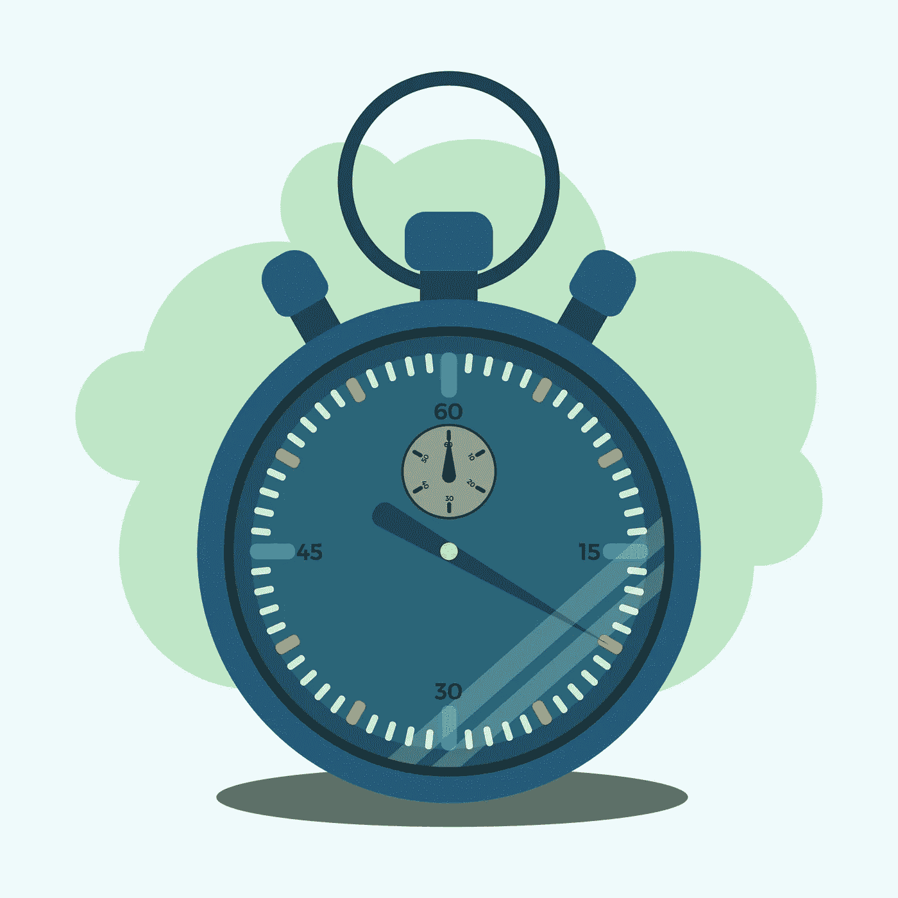
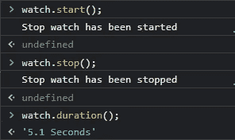
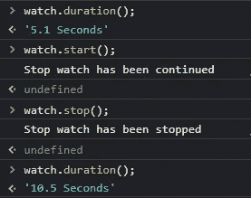
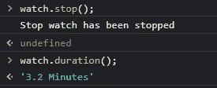

# 如何使用构造函数在 JavaScript 中构建秒表

> 原文：<https://blog.devgenius.io/how-to-build-a-stopwatch-in-javascript-using-a-constructor-function-765496bfb1ae?source=collection_archive---------3----------------------->

图片来源:vecteezy.com

在我今天的文章中，我将向您展示如何使用构造函数在 JavaScript 中构建一个简单的秒表。

构造函数是用于创建对象的函数。

# 物品复习

对象是**键值**对中无序的数据集合。一对这样的数据被称为该对象的属性。

以下是用 JavaScript 创建对象的一些方法；

*   使用对象文字语法 **{ }**

*   使用构造函数

*   使用工厂函数

理解了什么是对象，以及如何创建对象之后，我将向您展示如何使用构造函数来创建秒表。

# 我们开始吧

我们的构造函数将被命名为**秒表**，它将有变量和方法*来启动我们的手表、停止我们的手表、重置我们的手表并显示持续时间*。

> *方法是包含函数定义的对象属性。*

我们将在下面的构造函数中创建变量，这些变量只能被函数中的方法修改。

以下是我们的构造函数中的变量:

*   `**isStart**`

这个变量将用于检查我们的手表是否启动。如果值为**真**，则表示手表已启动；如果值为**假**，则表示手表已*停止或未启动*。

*   `**startCount**`

这个变量将存储我们的手表启动时的时间戳。

*   `**stopCount**`

这个变量将存储我们的手表停止时的时间戳。

*   `**durationCount**`

该变量通过查找`**startCount**` & `**stopCount**`之间的**差值**来存储持续时间

*   `**preDuration**`

只要秒表未复位，此变量就会存储之前的持续时间。

# 开始方法

现在，我们将创建负责启动手表的第一个方法。

该方法将检查:

*   如果手表已经启动，即`**isStart == true**`

如果是，它将向控制台记录一条消息，通知用户*手表已经启动*。

如果否，它将通过从日期对象中检索时间戳并将其存储到`**startCount**`来启动手表，然后将`**isStart**` 的值更改为**真。**

*   如果**开始计数**为零(0)。

这个变量保存我们的手表启动时的时间戳。如果值为零(0)，它将通过从日期对象中检索时间戳并将其存储到`**startCount**`来启动手表，然后将`**isStart**`的值更改为**真**。然后它会通知用户*手表已经启动*。

*   如果以上都不是真的

它将通过从日期对象中检索时间戳并将其存储到`**startCount**`来启动手表，然后将`**isStart**`的值更改为**真**。然后它会通知用户*手表已经继续。ie 简历。*

# 停止方法

这个方法将负责停止我们的手表。

该方法将检查:

*   如果手表启动了。ie `**isStart == true**`

如果没有，它会通知用户*手表还没有启动*。

如果是，它将通过从日期对象中检索时间戳并将其存储到`**stopCount**`来停止观察，然后将`**isStart**`的值更改为 **false** 。

然后它会通知用户*手表已经停止*。

# 持续时间方法

这个方法负责计算并返回我们的手表经过的时间，以秒为单位。

需要注意的是，使用方法 **getTime()** 从 date 对象中检索时间戳，返回以**毫秒**为单位的时间，我们需要用这个时间除以 **1000** 来得到以秒为单位的时间。

然后，我们将结果存储到先前的持续时间变量`**preDuration**`中，这样，只要手表没有复位，我们就会将它添加到新的持续时间中。

您还会注意到，如果时间大于 60 ，我会将时间转换为分钟。这意味着您将看到 2 分钟而不是，而不是显示 *120 秒。*

大多数结果将以小数结束，因此有必要使用方法 **toFixed()将其近似到小数点后 1 位。**

# 重置方法

这是我们秒表的最后一种方法，用于将手表重置回初始状态。

它所做的只是将我们的构造函数中声明的变量重置为它们的初始状态。

这是完整的代码

为了测试我们的手表，您需要将上面的构造函数复制并粘贴到您的浏览器控制台中，创建一个对象实例，然后测试运行！

这里有一个方法列表；

*   **start()** :这个方法启动手表或者恢复一个停止的手表。
*   **stop()** :此方法停止手表。
*   **duration()** :这个方法计算并返回经过的时间。
*   **reset()** :此方法将手表复位到初始状态

这是我的结果

当我希望手表从它停止的地方继续时，我只需调用 **start()** 方法，而不必重置手表。

如果我们让秒表跑几分钟呢？

如果您需要重置手表，只需在您的对象实例上调用 reset 方法 **reset()** 。

你可以用你新的**基于计算机的 JavaScript 秒表**进行比赛，并通过计时你的开始&停止，然后与你的**本地秒表**进行比较来检查你的结果的一致性。谁知道呢？它们可能只是持续时间相同。

谢谢你。

你读过我写的关于如何使用 octaValidate 验证 HTML 表单的文章吗？如果没有，[请通过以下链接访问文章。](https://blog.bitsrc.io/client-side-form-validation-using-octavalidate-javascript-b150f2d14e99)