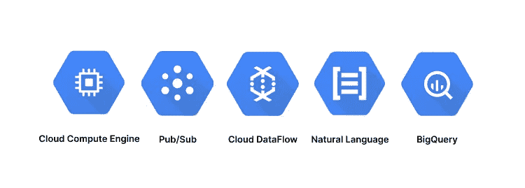
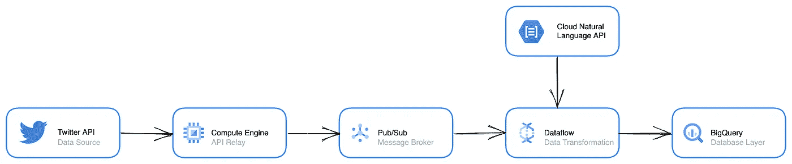
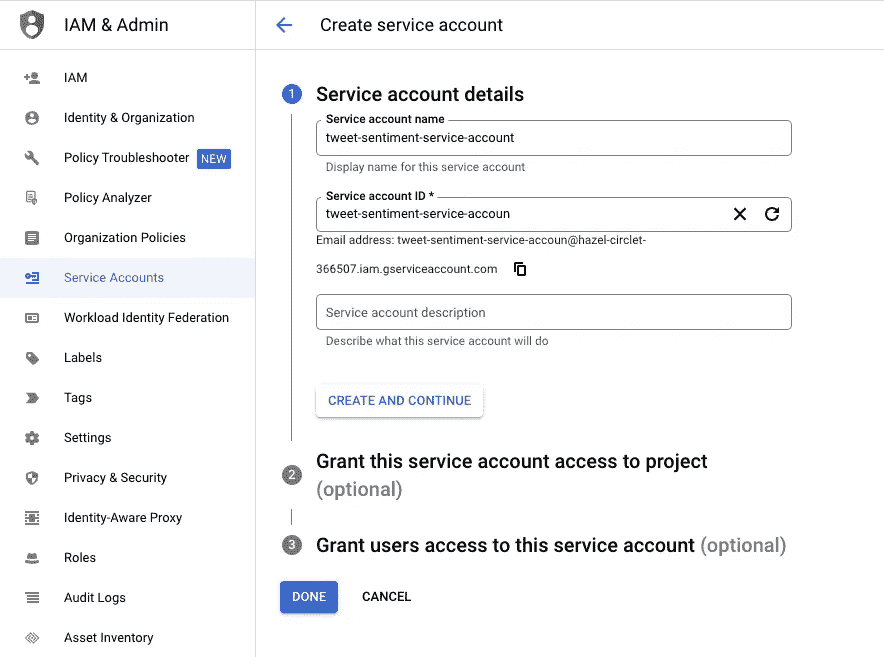
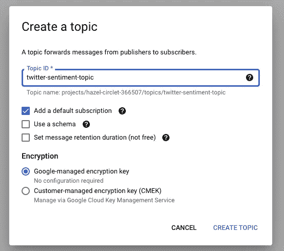
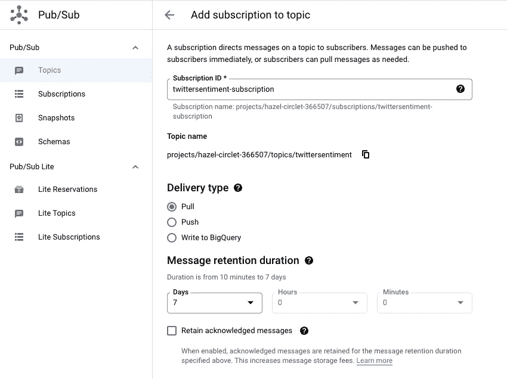
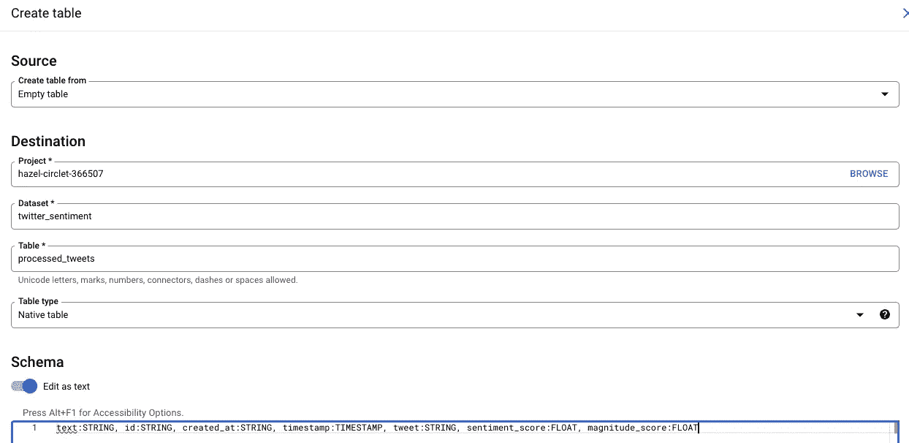
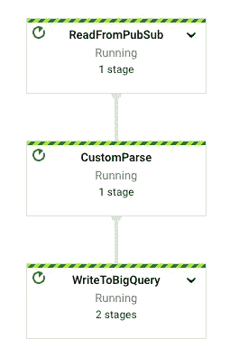
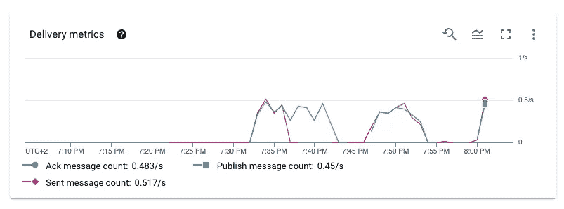
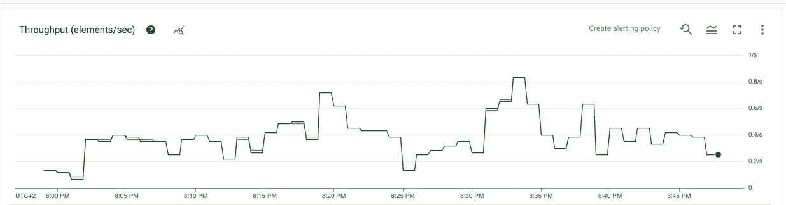
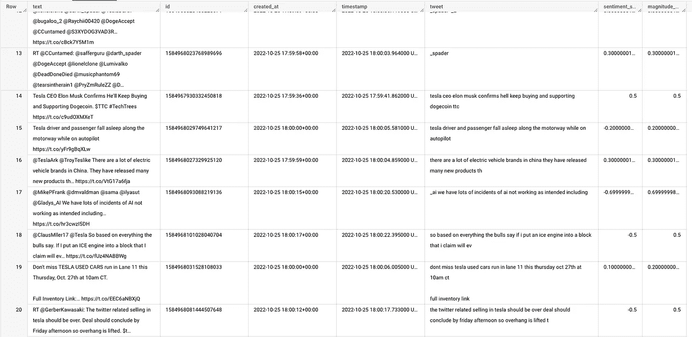

# 如何使用 GCE、Pub/Sub、Dataflow、BigQuery 和自然语言 API 为 Twitter 情感分析构建一个流管道

> 原文：<https://blog.devgenius.io/how-to-build-a-streaming-pipeline-for-twitter-sentiment-analysis-with-gce-pub-sub-dataflow-2e204115c81?source=collection_archive---------5----------------------->



大约三年前，当我开始从事数据工程时，我非常渴望建立并运行我的第一条管道。我听说 GCP 很流行，我知道流式数据是游戏的名字。所以我着手建立 Twitter 情绪分析管道。接下来是大约两个月的沮丧和心痛。我几乎跨过了终点线，但由于某种原因(依赖地狱)无法让它在我的本地机器之外工作，我最终决定继续前进。

幸运的是，我现在对为什么以及如何使用管道中的组件有了更好的理解，并决定从头开始重新构建它。不时重温旧的项目想法是很有意义的。尤其是当你有更多经验的时候。

这是 GitHub 回购协议的链接。

# 范围和架构

在本教程结束时，我们将建立必要的资源，以便:

1.  与 Twitter API 通信
2.  向发布/订阅主题发送推文
3.  订阅 Pub / Sub 主题，清理 tweets 并调用 Cloud NL API，使用数据流中的 Apache Beam worker 获得情感分数
4.  向 BigQuery 发送原始和干净的推文以及它们的情感分数

管道步骤如下所示:



# 入门指南

## **1。Twitter API 证书**

首先，我们需要申请一个 Twitter 开发人员帐户，以便与 API 进行通信。前往 developer.twitter.com，注册您的帐户，创建一个应用程序，并将相关密钥保存在您的本地计算机上，因为您很快就会需要它们:

*   API 密钥
*   API 密钥机密
*   访问令牌
*   访问令牌秘密

# **2。GCP 服务账户**

需要一个服务帐户来验证我们的 GCP 服务，并允许它们相互通信。转到云控制台中的 Admin & IAM 窗格，创建一个新的服务帐户并添加以下角色:



*   *“发布/订阅用户”*
*   *"BigQuery 数据编辑器"*
*   *“存储管理员”*
*   *“服务账户用户”*
*   *“数据流管理”*

创建完成后，单击服务帐户并生成一个. json 密钥。将它保存到您的本地环境中，因为您稍后将需要引用它。

# **3。发布/订阅**

到目前为止一切顺利。现在，我们将返回云控制台，设置我们的发布/订阅主题和订阅:



# 4.BigQuery

在 BigQuery 中，创建一个新的数据集和一个关联表。确保在创建表时添加模式:

```
text:STRING, id:STRING, created_at:STRING, timestamp:TIMESTAMP, tweet:STRING, sentiment_score:FLOAT, magnitude_score:FLOAT
```



# 5.数据流

在您的本地机器上打开一个终端，克隆 Twitter-Streamer repo 并启动您的 IDE:

```
git clone [https://github.com/sharisiri/twitter-streamer-GCP.git](https://github.com/sharisiri/twitter-streamer-GCP.git)
cd twitter-streamer-GCP
code .
```

导航到 Dataflow 文件夹并运行以下命令。注意，根据 [GCP 迁移指南](https://googleapis.dev/python/language/latest/UPGRADING.html#enums-and-types)，google-cloud-language 被设置为高于 v2(尽管我自己没有测试过任何其他版本)。

```
pip install ‘apache-beam[gcp]’
pip install google-cloud-language==2.6.1
```

修改 beamtwittersentiment.py 中的凭据

```
#!/usr/bin/env python
import argparse
import json
import os
import logging
import apache_beam as beam
from apache_beam.options.pipeline_options import PipelineOptions, StandardOptions
import relogging.basicConfig(level=logging.INFO)
logging.getLogger().setLevel(logging.INFO)os.environ["GOOGLE_APPLICATION_CREDENTIALS"] = '<YOUR_CREDS.JSON_FILE>'
INPUT_SUBSCRIPTION = "projects/<PROJECT_ID>/subscriptions/<YOUR_PUBSUB_SUBSCRIPTION>"
BIGQUERY_TABLE = "<PROJECT_ID>:<DATASET_ID>.<TABLE_NAME>"
BIGQUERY_SCHEMA = "text:STRING, id:STRING, created_at:STRING, timestamp:TIMESTAMP, tweet:STRING, sentiment_score:FLOAT, magnitude_score:FLOAT"class CustomParsing(beam.DoFn):
    """ Custom ParallelDo class to apply a custom transformation """def to_runner_api_parameter(self, unused_context):
        return "beam:transforms:custom_parsing:custom_v0", Nonedef process(self, element: bytes, timestamp=beam.DoFn.TimestampParam, window=beam.DoFn.WindowParam):
        # Super important to keep this import here and not at the top.
        from google.cloud import language_v1
        parsed = json.loads(element.decode("utf-8"))
        text = parsed["text"]
        # Removes website URLs
        text = re.sub('[http://\S+|https://\S+'](http://\S+|https://\S+'), '', text)
        # Removes mentions
        text = re.sub(r"@[A-Za-z0-9]+", "", text)
        # Removes mentions where username has underscores
        text = re.sub(r"@[A-Za-z0-9]+_", "", text)
        # Removes hashtags
        text = re.sub(r"#[A-Za-z0-9]+", "", text)
        # Removes punctuation
        text = re.sub(r'[^\w\s]', '', text)
        # Removes retweets
        text = text.replace("RT", "")
        text = text.lower()
        text = text.strip()
        parsed["tweet"] = text
        parsed["timestamp"] = timestamp.to_rfc3339()# Instantiates the Language API client
        client = language_v1.LanguageServiceClient()
        # Analyzes the input text
        document = language_v1.Document(
            content=text, type_=language_v1.Document.Type.PLAIN_TEXT
        )# Detects sentiment
        sentiment = client.analyze_sentiment(
            request={"document": document}
        ).document_sentiment
        parsed["sentiment_score"] = sentiment.score
        parsed["magnitude_score"] = sentiment.magnitudeyield parseddef run():
    # Parsing arguments
    parser = argparse.ArgumentParser()
    parser.add_argument(
        "--input_subscription",
        help='Input PubSub subscription of the form "projects/<PROJECT_ID>/subscriptions/<YOUR_PUBSUB_SUBSCRIPTION>."',
        default=INPUT_SUBSCRIPTION,
    )
    parser.add_argument(
        "--output_table", help="Output BigQuery Table", default=BIGQUERY_TABLE
    )
    parser.add_argument(
        "--output_schema",
        help="Output BigQuery Schema in text format",
        default=BIGQUERY_SCHEMA,
    )
    known_args, pipeline_args = parser.parse_known_args()# Creating pipeline options
    pipeline_options = PipelineOptions(pipeline_args)
    pipeline_options.view_as(StandardOptions).streaming = True# Defining our pipeline and its steps
    with beam.Pipeline(options=pipeline_options) as p:
        (
            p
            | "ReadFromPubSub" >> beam.io.gcp.pubsub.ReadFromPubSub(
                subscription=known_args.input_subscription, timestamp_attribute=None
            )
            | "CustomParse" >> beam.ParDo(CustomParsing())
            | "WriteToBigQuery" >> beam.io.WriteToBigQuery(
                known_args.output_table,
                schema=known_args.output_schema,
                write_disposition=beam.io.BigQueryDisposition.WRITE_APPEND
           )
        )if __name__ == "__main__":
    run()
```

保存文件，从终端运行以下命令，在数据流上启动光束运行器:

```
python3 beamtwittersentiment.py \
    --project "<YOUR_PROJECT_ID>" \
    --input_topic "projects/<PROJECT_ID>/subscriptions/<YOUR_PUBSUB_SUBSCRIPTION>" \
    --runner DataflowRunner \
    --staging_location "gs://<YOUR_BEAM_BUCKET>/stg" \
    --temp_location "gs://YOUR_BEAM_BUCKET/temp" \
    --region europe-north1 \
    --save_main_session True \
    --streaming \
    --max_num_workers 1
```

确认数据流运行程序启动并运行，准备接收消息。



# **6。计算引擎**

计算引擎 VM 将充当 Twitter API 和 Pub / Sub 主题之间的中继，并基于一个关键字持续流式传输 tweets。

在本地 repo 的 GCE/PubSub 文件夹中，有几个文件可以帮助我们设置必要的资源。

首先，将服务帐户密钥文件(json)复制到 repo，并在 **tweetstreamer.py** 中引用它，与前面步骤中的其他凭证放在一起。另外，请确保更改下面您想要跟踪的关键字。

```
#!/usr/bin/env python
import json
import tweepy
from google.cloud import pubsub_v1
from google.oauth2 import service_account# Service Account File
key_path = "<YOUR_CREDS.JSON_FILE>"
credentials = service_account.Credentials.from_service_account_file(
    key_path,
    scopes=["[https://www.googleapis.com/auth/cloud-platform](https://www.googleapis.com/auth/cloud-platform)"]
)# Pub/Sub Client
pubsub_client = pubsub_v1.PublisherClient(credentials=credentials)# Pub/Sub Topic(ID, Topic)
topic_path = pubsub_client.topic_path(
    '<YOUR_PUBSUB_ID>', '<YOUR_PUBSUB_TOPIC>')# # Twitter API Key / Access Token
twitter_api_key = 'YOUR_API_KEY'
twitter_api_secret_key = 'YOUR_API_SECRET_KEY'
twitter_access_token = 'YOUR_ACCESS_TOKEN'
twitter_access_token_secret = 'YOUR_ACCESS_TOKEN_SECRET'class TweetStreamer(tweepy.Stream):def on_status(self, status):
        tweet = json.dumps(
            {'id': status.id, 'created_at': status.created_at, 'text': status.text}, default=str)
        print(tweet)
        pubsub_client.publish(topic_path, data=tweet.encode('utf-8'))def on_error(self, status_code):
        print(status_code)
        if status_code == 420:
            return False# Initialize steamer instance
streamer = TweetStreamer(
    consumer_key, consumer_secret,
    access_token, access_token_secret
)# Filter real-time Tweets by keyword
streamer.filter(languages=["en"], track=["Keyword-To-Track"])
```

然后在 **startup-script.sh** 中做同样的操作

```
#!/bin/bash
cd /home/$USER
apt -qq update
apt-get install -yq python3 python3-pip
gsutil cp gs://<BUCKET_NAME>/pubsub_creds.json .
gsutil cp gs://<BUCKET_NAME>/requirements.txt .
gsutil cp gs://<BUCKET_NAME>/tweetstreamer.py .
pip3 install -r requirements.txt
python3 tweetstreamer.py
```

我强烈推荐下载 [gcloud CLI 工具](https://cloud.google.com/sdk/docs/install-sdk)，这将使创建资源和与云环境同步变得更加容易。

使用控制台或使用 gsutil 命令将 **pubsub_creds.json** 、 **requirements.txt** 、和 **tweetstreamer.py** 上传到上述存储桶:

```
gsutil cp pubsub_creds.json gs://<BUCKET_NAME>/ \
gsutil cp tweetstreamer.py gs://<BUCKET_NAME>/ \
gsutil cp requirements.txt gs://<BUCKET_NAME>/
```

最后，从 GCP 云 Shell 或通过您的本地终端运行以下命令:

```
gcloud compute instances create <VM_NAME> \
--project=<YOUR_PROJECT_ID> \
--zone=<YOUR_ZONE> \
--machine-type=<INSTANCE_TYPE> \
--service-account=<SERVICE_ACCOUNT_EMAIL> \
--create-disk=auto-delete=yes,boot=yes,device-name=<VM-NAME>,image=projects/debian-cloud/global/images/debian-11-bullseye-v20220920,mode=rw,size=10 \
--metadata=startup-script-url=gs://<BUCKET_NAME>/startup-script.sh
```

如果您不想 SSH 到虚拟机并检查进度，您可以在本地或在云 Shell 中运行以下命令来查看启动进度:

```
gcloud compute instances get-serial-port-output <VM_NAME> --zone=<YOUR_ZONE>
```

一两分钟后，您应该开始在发布/订阅中看到消息:



在数据流中:



最后是 BigQuery 中的输出:



# 结论

你有它！一个用于实时情绪分析的漂亮的小流管道。

在关闭之前，我运行了大约四天的管道。它跟踪了关键词特斯拉(因为目前对这个话题的看法似乎变化很大)，管道最终收集了大约 30 万条推文。

我遇到的唯一主要问题是自然语言 API 仅限于一系列受支持的语言。尽管在 API 获取阶段将语言设置为英语作为过滤器，但一些 tweets 设法通过，随后数据流中出现错误。但是，这些消息会被丢弃，不会影响 BigQuery 的整体性能或吞吐量。

确保对代码进行试验，尝试不同的关键字、语言等。但是请记住，如果你选择了某些被大量讨论的话题，你可能最终会触及 API 比率的极限！