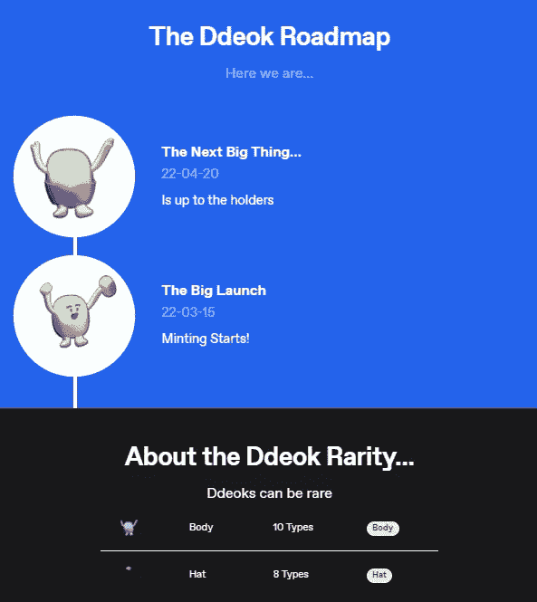
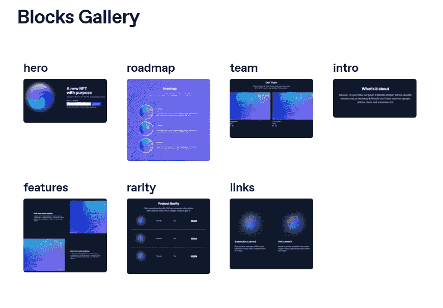

# 如何建立一个网站建设者 101

> 原文：<https://blog.devgenius.io/how-to-build-a-website-builder-101-e681dd31ae7a?source=collection_archive---------9----------------------->

图片来源:Unsplash 上的 [@kellysikkema](http://twitter.com/kellysikkema)

如果你看过学习编程视频。其中很多都是关于克隆热门网站，比如网飞、Airbnb 等等。虽然这些视频对前端开发人员来说是很好的开始，但到目前为止，我最有价值的编程经验是在构建多租户网站构建器应用程序时学到的。

以下是创建功能多租户应用程序所需学习的各种功能的概述。

# **App 概述**

1.  动态 CRUD 路线(将父组件嵌套在其自身内的能力等。)
2.  桶存储 API S3/DO 等处理用户图像上传
3.  根域、自定义域和子域路由
4.  设计组件的快捷用户界面。
5.  通配符域和自定义域的后端服务器管理
6.  命令工作流(撤消和重做功能)
7.  处理草稿/发布状态的后台作业

到目前为止，我只实现了这些指导方针的 5/7，完成了创建一个网站构建器所需的大量工作。

让我们开始讨论如何处理前 3~4 个问题，这样你就可以开始创建自己的多租户、网站构建应用了！

我的应用程序是用 Ruby on Rails 编写的，但是无论你使用 React 还是其他框架，方法都是一样的。和往常一样，Rails 应用被分成 MVC 框架组件。

让我们从数据库建模开始。

# **数据库建模**

不像大多数应用程序有 1000 个关于如何编码的教程，这一个我只是凭直觉去做每件事。欢迎就如何改进代码库提出建议。我是这样做的:

**用户**

*   有许多网站

**网站**

*   有许多部分
*   属于用户

**章节**

*   有许多元素

**元素**

*   有许多链接
*   属于部分

**链接**

*   属于元素

可能有更好的方法来为站点创建模板，比如纯粹的 JSON blocks api。但是对于我的简单的网站设计者来说，有 3 层嵌套就很好了。这将完成 MVP 的工作。我喜欢在编程时快速行动，快速原型化想法，而不是“诗意和完美的代码”。

我不会详细讨论每个模型的属性，但它们都有点相似。他们每个人都有用户照片上传的照片关联，背景颜色，比例，类型，位置，所有你需要为用户定制他们的网站部分的基础。

# 控制器和路线

接下来，让我们谈谈应用程序中的各种重要控制器。简单来说，我们可以把这个 app 分解成三个不同的部分。根域(网站建设者本身)，子域(用户获得免费托管的网站)，自定义域(用户指向他们刚刚建立的网站的 CNAME 记录)。

所以我把我的控制器分成了几个不同的部分。

这是几个控制器

构建器(仅根域/构建器部件)、域(子域)和页面(自定义域)

在开始使用这个应用程序之前，我认为我可以把所有的自定义域放在子域控制器上，但是我发现，简单地将用户的自定义域路由到根域，并让控制器读取主机名更容易设置 DNS。

我也在 routes.rb 中设置了如下的域约束。

lvh。me 是本地主机的代理，对于多租户非常有用

Rails 的厉害之处在于，我可以将这种约束直接插入到我现有的路由中，并且只为根域、子域等呈现特定的路由。

基本上，用于确定请求是在根域、外部主机还是子域上的所有逻辑都位于页面控制器中。这里的关键是 is_host 确定我们是在本地主机上开发还是在我们的生产域上发出请求。

接下来，我们有一个简单的 if 语句，说明如果我们不是根域，并且自定义域没有子域(自定义域不允许子域)，那么我们可以将它们转发给自定义域的处理程序。

最后，如果我们在我们的根域，而不是“www ”,我们将它们重定向到处理子域逻辑的站点控制器。变量 current_site_build 也将允许我们查看他们是否有站点。

显然这不是最漂亮的代码，但它完成了工作，而且只花了几分钟就开始工作了。我总是试图尽可能多的完成工作，而不是尽可能的完美。

# 有趣的东西:构建生成器

现在是有趣的部分:为构建器构建前端主要只是 html 模板和一些条件渲染逻辑。Rails 的伟大之处在于。erb 模板和在提供给客户端之前呈现 html 服务器端的能力。

对于 MVP，我有大约 5 个基本的构建模块和一个自定义模块，用户可以在其中放置自己的东西。下面是它们的样子:

路线图和稀有部分

这是它们的大概样子

是的，这是一个 NFT 铸造网站，但我们今天在这里谈论建设网站建设者！不同的模板通过 Ruby 的 switch-case 块来呈现。每个部分都有一个“模型”列，根据创建时对应的块来命名。我在这个应用中重复使用了同样的开关逻辑。也许有更好的方法有条件地呈现大量不同的模板。有兴趣了解更多信息！

最终，我需要将 erb 中现有的 if then 块重构为 helper 方法来进行清理。

将这些难看的块重构到 section_helper.rb 方法中

这将有助于清理我们的观点，并以 Rails 方式’做事

# 接下来:内嵌编辑

有一些关于使用 Rails 和 turbo 帧进行内联编辑的内联编辑教程，但是我不想增加在其他 turbo 帧中嵌套 Turbo 帧的额外复杂性，所以我选择了优秀的普通 Javascript。

这比我想象的要简单得多，而且比其他人想象的要简单得多，您可以简单地用一个具有相同类名的表单字段替换您想要编辑的任何内容。

在视图中，我有一个简单的 onclick 函数，它接受自己的部分 id、模型类型和元素，并用自己的输入字段进行替换。在尝试了这一点之后，它很容易工作，你所要做的就是确保在你想要编辑的部分呈现一个表单，这样就完成了！

迷你演示！

# 活动存储:图像上传

我把这部分留到最后，因为我基本上没有为此做任何工作。您可以按照本教程使用带扶手的储物桶。无论您使用 AWS S3 还是 DO spaces，概念都是一样的。我确实发现来自 DO 的 CDN 使用非常慢，所以我停止了它，但是从那以后它一直运行得很平稳。强烈推荐！

 [## 如何通过数字海洋空间|数字海洋在 Rails 6 中使用 ActiveStorage

### 作为“为捐赠而写”计划的一部分，作者选择了“技术多样性基金”来接受捐赠。当…

www.digitalocean.com](https://www.digitalocean.com/community/tutorials/how-to-use-activestorage-in-rails-6-with-digitalocean-spaces) 

我将提到的另一个警告是，当在控制器中查询您的记录时，请确保添加。使用 _attached_photo 或您指定的任何名称来调用您的活动存储上传。这将消除(N+1)查询问题，因为 Rails 将告诉服务器进行一个大的 SQL 查询，而不是顺序查询。

还有！不要忘记预载

我还补充道。预加载以加速我的查询，因为我将总是查询属于一个节的元素。同样，您总是可以将元素作为 JSON 对象的一部分或其他内容，但这超出了本文的范围。

# 概观

好吧，太多了！我们经历了三个独立域的路由(在一个应用程序中)，回顾了我们的数据库建模，并讨论了我们如何开始构建和干燥我们的视图。我们甚至讨论了如何开始将主动存储桶上传与云提供商集成。

构建这个应用程序的下一个挑战部分是安装和配置 Caddy 2 服务器以在 droplet 上运行。设置一个 droplet 应该很容易，尤其是如果你之前已经安装了 Ruby on Rails 的话。单独安装 Ruby 有点麻烦。我在这里单独写了一个关于我的配置的教程:[https://medium . com/@ austinw . 035/how-to-use-caddy-server-2-初学者-a24747d175db](https://medium.com/@austinw.035/how-to-use-caddy-server-2-beginner-a24747d175db)

请记住，这对我很重要，因为我希望我的用户有一个*.websitebuilder.com 通配符域。如果你只想自定义域名，你绝对可以使用 Heroku 或其他 PaaS。不幸的是，大多数企业通配符域名解决方案相当昂贵。所以球童 2 号现在只能做这个了。

为了便于部署，我尝试使用 Hatchbox.io，它非常方便。尽管我禁用了所有部署脚本和随之而来的 nginx 特性。如果你在像 Digital Ocean 或 AWS 这样的云提供商上托管自己的东西，我绝对推荐 Hatchbox 这么做。就开始而言，这是一个巨大的时间节省。(在开始这个项目之前，我从未接触过云提供商)。

希望你从阅读这篇文章中获得了一些关于构建一个网站建设者的见解，我还没有找到任何关于这种特定类型的应用程序的好教程。祝你好运！下次见。