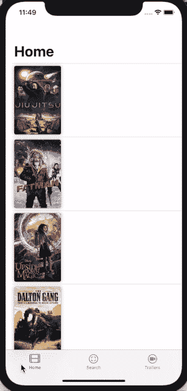
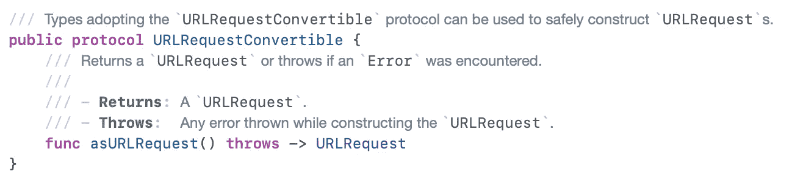

# 如何用面向协议编程构建 Alamofire 网络层并结合

> 原文：<https://blog.devgenius.io/how-to-build-alamofire-network-layer-with-protocol-oriented-programming-and-combine-4de005290566?source=collection_archive---------0----------------------->

照片由 [Alina Grubnyak](https://unsplash.com/@alinnnaaaa?utm_source=medium&utm_medium=referral) 在 [Unsplash](https://unsplash.com?utm_source=medium&utm_medium=referral) 上拍摄

# 什么是面向协议的编程？

面向协议编程是 Swift 使用的一种新的编程范式。在面向协议的方法中，我们通过定义协议开始设计我们的系统，然后定义协议扩展、协议继承和协议组合，这允许我们不仅向一种类型添加新的功能，而且向所有符合相同协议的类型的整个集合添加新的功能。

Swift 中的值类型，如 struct 或 enum，不能从其他 struct 或 enum 继承，这意味着我们不能对值类型使用继承，但值类型可以从协议继承，甚至可以从多个协议继承，这是 Swift 最强大的功能，它给了我们更多的重用和更少的代码冗余。强烈推荐在 Swift WWDC 观看[面向协议的编程](https://developer.apple.com/videos/play/wwdc2015/408)并阅读更多关于[苹果联合收割机](https://medium.com/dev-genius/learn-combine-by-code-55e661a5256c)的信息。

假设我们有一个`User`，用户有一封电子邮件，我们需要检查这封电子邮件是否有效，那么让我们按以下顺序开始:

## 1-定义协议

*   定义`EmailValidator`协议和该协议需要的输入，如`email`。

## **2-扩展协议**

*   扩展协议并应用我们需要验证的所有逻辑，看`email`是否有效。

## 3-应用协议

*   然后将`EmailValidator`应用到`User`结构中，无需编写任何代码来验证电子邮件，用户将继承它。超级简单，是吧？😍
*   我们可以将`EmailValidator`协议应用于任何需要验证电子邮件的类或结构，而不需要编写更多的代码。🎉

## 4-使用协议进行测试

*   使用 POP 最强大的功能是*测试*，假设我们因为某些原因需要返回所有无效的电子邮件，我们所需要的就是扩展`EmailValidator`被`MockUser`符合的地方，并覆盖`isValidEmail`的逻辑以总是返回`false`超级简单，我喜欢！。

这就是我们如何在 Swift 中使用面向协议的编程，它很容易重用和测试，因此我们将在网络层应用相同的概念。

*   在这个演示中将学习如何调用网络请求来获取电影流行列表，你可以查看本文末尾的所有代码。

## 1-定义协议

*   定义符合`URLRequestConvertible`协议的`URLRequestBuilder`协议，该协议是 Alamofire 的一部分。
*   然后我们需要定义我们的协议需要的所有输入，但是在此之前我们需要检查`URLRequestConvertible`协议。

*   当我们检查`URLRequestConvertible`协议时，会发现只有一个函数`asURLRequest()`会返回`URLRequest`。
*   因此，我们需要知道如何构建`URLRequest`，因此将定义网络请求需要的所有输入，如:`URL`、`path`、`ParameterEncoding`、`HTTPHeaders`、`HTTPMethod`。

## 2-扩展协议

*   做`URLRequestBuilder`扩展并添加每个输入的实现，这将取决于请求，比如:如果 httpMethod 是`.get`，那么编码将是`URLEncoding`，如果它是`.post`，那么编码将是`JSONEncoding`。
*   用 httpMethod 构建`URLRequest`,并为请求添加头值。
*   尝试用参数对 urlRequest 进行编码，并在`asURLRequest`函数中返回。

## 3-应用协议

*   在这个例子中，我们有两个网络调用，一个获取受欢迎的电影列表，另一个搜索电影，然后我们需要将我们的`URLRequestBuilder`协议应用到它们中，所以让我们看看如何进行。

*   创建`MoviesAPIs` enum，它将扩展我们的协议`URLRequestBuilder`，并且有两个网络调用的两种情况。

*   在`MoviesAPIs`扩展中实现每个案例/调用的路径。

*   在`MoviesAPIs`扩展中实现每个案例/调用的参数，比如:我们需要为 **getPopularList** 案例/调用准备`language`、`api_key`、`page`。

*   在`MoviesAPIs`扩展中，为每个案例/调用实现 http 方法。

## 4-创建网络服务

*   创建具有一个执行 URLRequest 功能的`NetworkServiceProtocol`协议。
*   在`NetworkServiceProtocol`将实现`execute`功能，现在 Alamofire 支持[联合](https://github.com/Alamofire/Alamofire/blob/master/Documentation/AdvancedUsage.md#using-alamofire-with-combine)。
*   首先，我们需要通过调用带有模型类型的`publishDecodable`来获得`DataResponsePublisher`，我们将把它解码为可编码的。
*   然后我们需要在后台队列上订阅发布者来执行我们的网络调用。
*   然后我们需要在主队列上接收发布者来处理所有的 UI 更改。
*   然后我们需要下沉到发布者以获得结果并在完成时返回。
*   最后，我们需要从 Sink 函数返回`AnyCancellable`，这样我们就可以随时取消它。

## 4-如何使用网络服务

*   只需创建网络服务类，执行类似`Endpoints.getPopularList(**self**.pager.nextPage).resolve()`的网络请求，并添加类似`MoviesResponse.**self**` 的响应类型，网络层本身就会处理剩下的事情，超级简单！**😃**

希望你和我一样喜欢😃🎉如果是这样，请随意鼓掌😄并与您的朋友分享，与人分享总是令人愉快的，如果您也想查看，这里有所有源代码:

 [## deda9/MovizySwiftUI

### GitHub 是超过 5000 万开发人员的家园，他们一起工作来托管和审查代码、管理项目和构建…

github.com](https://github.com/deda9/MovizySwiftUI)