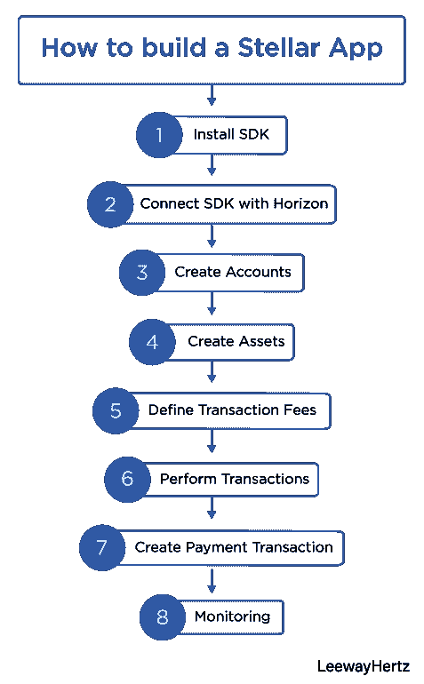

# 如何在恒星区块链上搭建一个 app？

> 原文：<https://blog.devgenius.io/how-to-build-an-app-on-stellar-blockchain-1253df73fc15?source=collection_archive---------5----------------------->

自从引入市场以来，区块链技术越来越受欢迎。区块链技术早期的应用是在金融方面，比如加密货币。随着世界变得更加全球化以及跨境支付需求的增长，公司将被推动在区块链支付领域进行创新。正如区块链的专家所认为的，Stellar Core 是最重要的分布式技术之一，它允许任何人创建低成本、快速的金融解决方案。

**恒星区块链概念**

[Stellar](https://www.stellar.org/) 和致力于创建它的团队的目标是使人们能够在世界各地安全顺利地接收和发送资金。它将支付服务、银行和用户联系起来，并将它们整合在一起，使资金转账变得容易。使用基于 Stellar 区块链的应用程序或软件，移动货币应用程序可以实现互操作，从而降低交易成本，提高效率。Stellar 区块链利用一个开放和分散的数据库，这使它能够保持 3-5 秒的确认时间。由于恒星区块链不是用图灵完全语言编写的，所以事务率也比较高。

让我们来了解一下恒星区块链是如何被用来促进跨境支付的情况。例如，您希望向欧洲的业务伙伴(John)发送一定金额的美元，并接收欧元资金。你的银行和约翰的银行都连接到恒星网络。当您试图向 John 汇款时，会向 John 的银行发送一个交易请求，以确定他是否合规。在获得欧洲银行的批准后，资金从银行账户中扣除，并以流明为单位转移到 Stellar 网络。在将 Stellar Lumens 发送到网络之后，资金被转移到 John 的银行并记入他的账户。作为一个点对点和分散的网络，恒星区块链记录所有交易，并作为一个开放和透明的分类账。

**在恒星区块链上搭建 app 的步骤:**

**第一步**

从安装 SDK 开始，该 SDK 对应于您打算用于构建应用程序的技术。例如，如果您希望创建一个基于 Python 的应用程序，您将安装 Python SDK。Python SDK 可以使用 pip 实用程序安装。

**第二步** 接下来要做的是在 SDK 和地平线网络之间建立连接。成功安装 Python SDK 后，下一步是将其连接到 Horizon 网络。Horizon 是恒星区块链生态系统面向客户端的 API 服务器。它充当恒星核心和希望连接到恒星网络的应用程序之间的通道。Horizon 使您能够发送网络交易、订阅事件流以及检查您的帐户状态。Horizon 可以通过 cURL/web 浏览器直接访问。

Horizon 包括用于流式分类帐数据的分类帐端点。它支持通过多个端点流式传输效果、分类帐、报价、操作、账户、订单簿、交易、支付和交易。首先，从 Stellar Python SDK 导入 Horizon 对象。Horizon API 端点可以通过 Horizon 对象进行访问。然后，创建两个函数:一个用于管理展望期响应，另一个用于在流模式下调用展望期/分类帐端点。

**第三步**

下一步是注册。将 SDK 连接到 Horizon 服务器后，下一步是创建一个 Stellar 网络帐户。帐户用于存储您在 Stellar 中的所有资金，以及接收和发送付款。每个重要帐户都由一个秘密种子和一个公钥唯一标识。Stellar 使用公钥加密来确保每笔交易的安全性。公钥可以安全地共享，其他方将需要它来验证您的帐户，并验证您的交易是否合理。

然而，秘密种子是建立您的帐户所有权的机密信息。你不被允许与任何人分享种子。这相当于锁上的密码。任何知道锁的密码的人都能打开它。同样，任何知道你账户种子的人都可以控制它。

**第四步**

第四步，创建各种资产。Stellar 分布式网络用于存储、安全跟踪和转移任何资产，包括欧元、美元、股票、黄金、比特币和其他有价证券。在 Stellar 网络上，一项资产可以与任何其他资产进行交换和交易。在 Stellar 网络上创建资产不需要可靠的操作。相反，您可以通过执行付款操作来创建资产。发行账户用其发行的资产进行支付，然后用于在网络上创建资产。使用新命名的资产，发行资产向分配帐户付款。

在发行账户解锁之前，对分发账户的支付可用于创建新代币。如果您打算对该资产做任何事情，下一步是创建一个 stellar.toml 文件，该文件包含交易所、钱包、市场列表服务和令牌持有者所需的信息，以理解它所代表的内容。

之后，你可以创建一个卖出要约，让你的资产在 Stellar decentralized exchange 上市，并参与做市，以帮助创造流动性。

**第五步**

这一步需要定义交易费用。Stellar 要求低交易费用和最低账户余额，以确保网络的效率和防止垃圾分类账。在 Stellar 上，交易数量可以从 1 到 100 不等。

**第六步**

这一步需要进行交易。交易是用于改变分类帐状态的命令，例如发送付款、更改帐户配置或创建报价。每笔交易都有一个支付费用的源帐户，并为交易分配一个序列号。事务由一个或多个操作组成，每个操作都有一个默认的源帐户，该帐户等于事务的源帐户。

**第七步**

这一步需要建立支付交易。利用 Python Stellar SDK 创建、签署和提交事务。如果事务需要签署多个公钥才能被视为有效，则必须使用多签名帐户。这是通过为您的帐户配置阈值级别来实现的。每个操作都有一个低、中或高的阈值级别。

**第八步**

最后也是最关键的一步是监控。网络配置完成并投入运行后，监控网络性能以确保网络高效运行至关重要。为了帮助监控，Stellar Core 公开了可用于监控节点和识别潜在问题的关键信息。

您可以通过发出命令和检查 Stellar Core 的输出来获取有关监控的信息。此外，您可以连接 Prometheus 服务器以实现轻松快速的监控，将其与 Alertmanager 集成以自动通知，并使用预构建的 Grafana 仪表板创建节点健康状况的可视化表示。

虽然 Stellar 目前没有得到广泛采用，但它是您可能希望集成到您的业务中的最重要的开源项目之一。此外，Stellar 支持用各种语言编写的 SDK，包括 Python、Go、C++和 JavaScript。您可以使用 Stellar 创建经济高效且易于集成的支付解决方案。虽然 [Stellar 区块链应用开发](https://www.leewayhertz.com/build-stellar-app/)为企业家创造了许多新的机会，但在 Stellar 网络上构建解决方案可能需要技术专长。