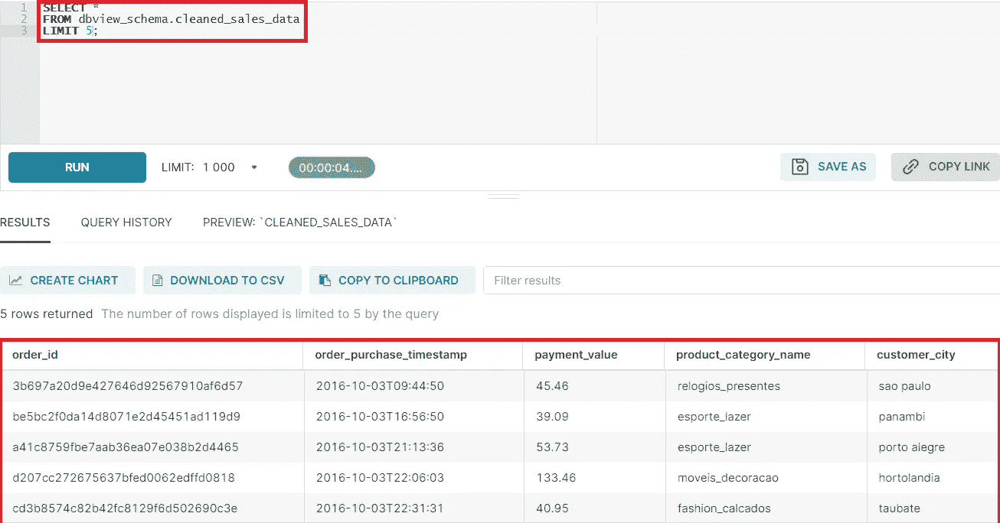
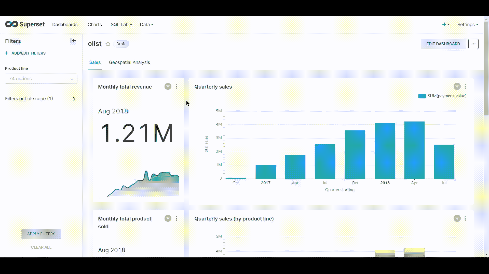
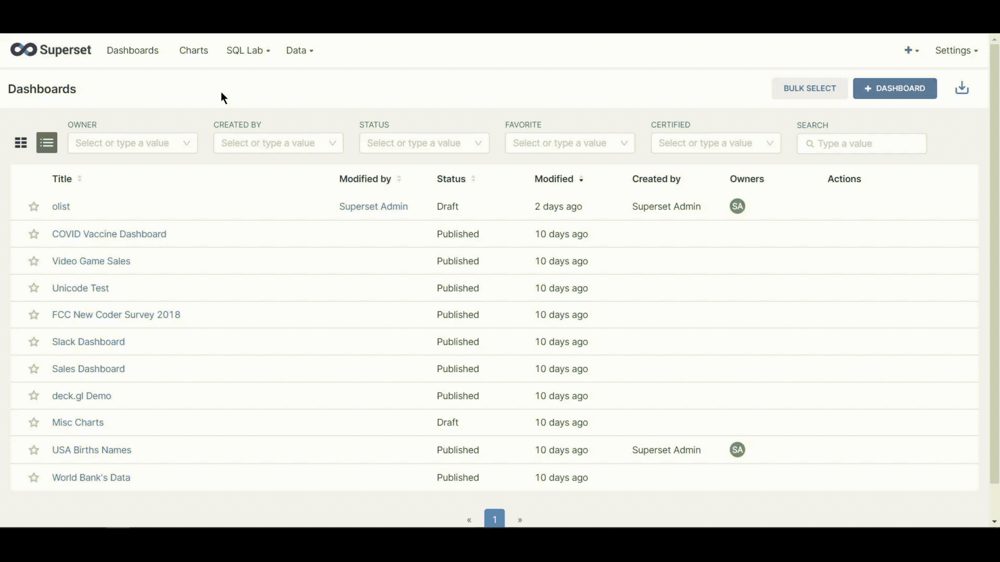
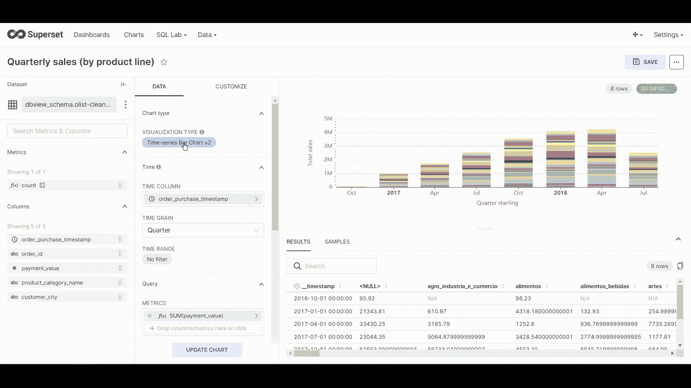
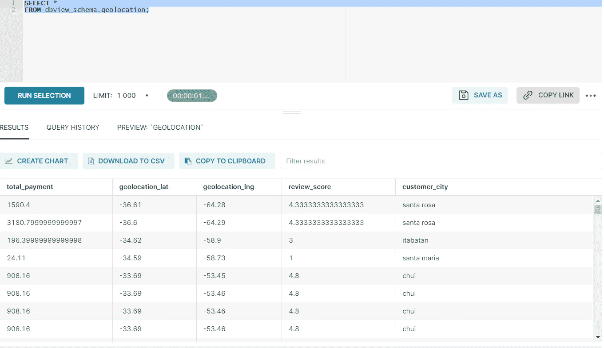
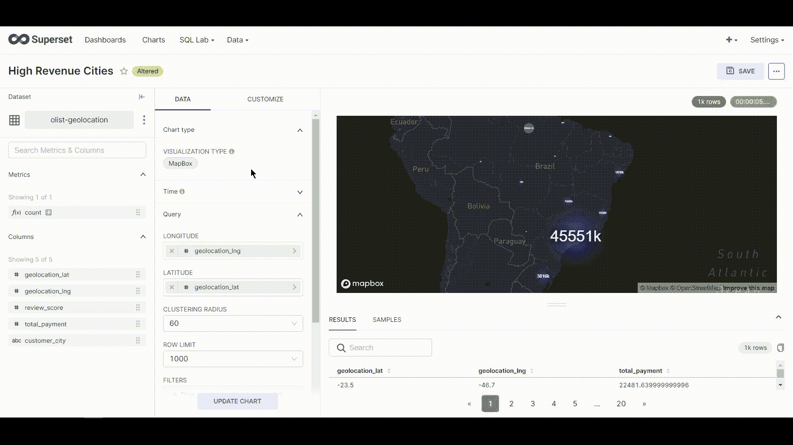

# 如何用 Apache-superset 和 Docker 构建电子商务销售仪表板

> 原文：<https://blog.devgenius.io/how-to-build-an-ecommerce-sales-dashboard-with-apache-superset-and-docker-100c19eee603?source=collection_archive---------4----------------------->

## 构建电子商务仪表板的灵活开源平台。


在这篇博客中，我将向您展示如何使用开源 BI 工具、Apache-Superset 和 Docker 容器构建和定制一个基本的销售仪表板。

# 什么是 Apache-Superset？

很长一段时间以来，专有工具是商业智能(BI)环境中的规范。对于企业 BI 用例，Tableau、Power BI 和最近的 Looker 是首选。但是后来 Apache Superset 出来了。

[Superset](https://superset.apache.org/) 最初是 Airbnb 的一个黑客马拉松项目，后来在 2017 年进入了 Apache 社区的大家庭。在过去的六年中，它发展成了我们今天所知的 Apache 超集，作为一个开源项目，为全世界的开发人员提供了专有 BI 工具(以及更多)的特性。不出所料，此后数十家公司很快接受了它。

# 什么是 Docker 和 Docker-compose？

简而言之， [**Docker**](https://www.docker.com/) 是一组平台，允许开发者在操作系统之上的容器内开发、部署和运行应用。这极大地增强了数据研究和软件开发的安全性、可再现性和可扩展性。简而言之，如果我构建了一个应用程序并将其打包到 docker 映像中，其他人可以获取它并在另一个环境中复制该应用程序，而不必担心环境不兼容或缺少或不正确的应用程序依赖项，如库、解释器和代码/二进制文件。

[**Docker Compose**](https://docs.docker.com/compose/)**是一个工具，可以让用户构建和运行需要多个 Docker 容器的应用。Docker-compose 允许您在一个`docker-compose.yml`文件中将 Docker 容器作为单独的`services` 进行配置和管理。通过一个简单的命令，docker-compose 将创建并运行在`docker-compose.yml`文件中定义的配置中的所有服务。**

# ****构建您的销售仪表板****

**我已经使用 Kaggle 提供的[巴西电子商务](https://www.kaggle.com/datasets/olistbr/brazilian-ecommerce)数据集创建了一个销售仪表板的[开源示例](https://github.com/ali-mhmzadeh/ecommerce-analytical-dashboard)。repo 提供了一个完全码头化的环境来构建基本销售仪表板的容器。通过三个简单的命令，您就可以开始运行并准备好分析清理后的销售数据及其相应的地理坐标，以便进行进一步的地理空间分析。在这篇笔记中，我将带您了解整个过程，并描述基本的工作流程。**

**资源库:[https://github . com/Ali-mhmzadeh/ecommerce-analytical-dashboard](https://github.com/ali-mhmzadeh/ecommerce-analytical-dashboard)**

*****注意:确保在运行容器之前已经安装了***[***Docker***](https://www.docker.com/)***和***[***Docker-Compose***](https://docs.docker.com/compose/install/)***。*****

## ****步骤 1:克隆存储库****

```
$ git clone https://github.com/ali-mhmzadeh/ecommerce-analytical-dashboard.git
```

## ****步骤 2:启动 dockerized 服务****

**在克隆 GitHub repo 之后，是时候使用 docker-compose 并使用以下命令构建容器了:**

```
$ cd ecommerce-analytical-dashboard && docker-compose up
```

**在后台，docker-compose 为我们推出了一些有用的容器，特别是:**

*   ***开发—* 该容器与 PostgreSQL 数据库交互，以开发一个定制的电子商务数据库，该数据库带有附加视图，稍后将用于创建图表。它为读取存储在 data 文件夹中的 CSV 格式的表格数据、处理它们(例如，将类似时间的列转换为 DateTime 对象)然后将它们转换为 PostgreSQL 表提供了基础。它进一步创建了两个 Postgres 视图，其中包含干净的销售数据及其相应的地理位置信息。这些视图可以在*示例*文件夹下的 *view.sql* 文件中访问。**
*   ***PostgreSQL DB* —该容器使用标准 PostgreSQL 引擎构建默认数据库，并通过专用端口与开发容器通信。dev 容器连接到数据库，并使用 Pandas to_sql 方法将存储在数据帧中的记录写入 SQL 数据库。**
*   ***超集* —最后，这个容器扮演前端框架的角色，使我们能够通过与销售数据库交互来创建有洞察力的可视化。一旦连接了数据库，我们就可以使用内置的 SQL IDE 从数据库中获取数据(例如销售、客户和位置)，并为可视化做准备。**

## ****第三步:启动你的销售仪表板****

**Docker 容器启动并运行后(大约 3-5 分钟，取决于提供给 Docker 的资源)，我们需要引导集群来初始化超集应用程序并构建 Olist 仪表板。当日志显示一切正常时，继续运行下一个命令来引导集群。**

```
$ sh bootstrap.sh
```

**该脚本完成了将表格数据转换为 SQL 表以及将仪表板模式导入超集应用程序的所有繁重工作。引导脚本完成后，打开 web 浏览器，使用以下默认凭据登录到[http://localhost:8080/log in/](http://localhost:8080/login/):**

```
username: admin
password: admin
```

**恭喜你。现在超集在本地建立。导航到仪表板页面，查看“Olist”仪表板。**

# **深入了解仪表板:**

**我本可以花几个月的时间为这篇笔记制作精美的交互式图表，但我决定先制作少量图表，更多地关注 Superset 在制作交互式图表和创建即时仪表板方面的功能。**

**在我们深入研究图表以及它们是如何创建的之前。让我们仔细看看可以在“dbview_schema”下找到的“clean_sales_data”视图。一个简单的 SELECT 语句告诉我们表中包含哪些列，即 order_id、order_purchase_timestamp、payment_value、product_category_name 和 customer_city。我使用这些列创建了一些信息丰富的图表，包括每月购买和收入趋势、季度销售和高收入产品。**

****

**清洁销售数据集的详细视图**

## ****例 1 —修改月总收入图****

**对于第一个示例，让我们修改一个现有的图表，即“每月收入趋势”，并将时间间隔从每月更改为每季度。为此，导航到“Olist”仪表板，然后点击“月度总收入图表”上的三个点(见下面的 GIF)。这将在您的浏览器中打开一个具有超集 UI 空间的新选项卡，您可以在其中修改图表并保存(另存为)更改，这些更改也将反映在仪表板上。**

**从这里开始，我们按照一系列步骤来修改我们的“每月总收入”图表。但是，超集使得将这个顺序的大部分应用到其他图表变得很简单，甚至是新图表，以便进一步修改或定制。顺序是这样的:**

*   **选择数据集(它已经被选中)。**
*   **选择可视化类型(带趋势线的大数字)。**
*   **选择时间列(请注意，时间列仅适用于某些图表)。**
*   **指定时间粒度以设置将用于时间聚合的时间间隔。为了实现这个例子的目的，将其从*月*改为*季度*。**
*   **以 SQL 聚合函数的形式确定“指标”,为图表提供数据点。由于我们对每月总收入趋势感兴趣，因此该指标被定义为支付价值的总和。**
*   **更新图表看看吧！**
*   **最后，保存图表并在仪表板中检查结果。**

****

**如何创建月度收入趋势**

## ****示例 2 —按产品线构建季度销售图表****

**在本例中，我们将进一步练习从头开始创建我们自己的数据集和图表。我们首先需要准备一个数据集作为图表的基础。幸运的是，超集提供了一个内置的 SQL IDE，允许我们实现各种查询，从简单的 SELECT 语句到复杂的连接和聚合多个表的查询。要使用此功能，请选择“SQL Lab”选项卡，然后导航到“SQL editor”页面。为了简化这个过程，我创建了一个名为“cleaned_sales_data”的物化视图，并将其添加到一个名为“dbview_schema”的新模式中。在 SQL IDE 块中运行以下查询，并查看输出数据集:**

```
SELECT *
FROM dbview_schema.cleaned_sales_data
```

****

**如何导航到内置的 SQL IDE**

**太棒了。现在，我们将使用这个数据集创建一个简单的按产品线细分的季度销售图表。**

**让我们使用上一个示例中描述的步骤来创建一个新图表:**

*   **创建数据集-在上一步中，您已经创建了一个数据集。选择“创建图表”并为您的数据集取一个新名称。**
*   **选择可视化类型—对于本例，我们将使用“时间序列条形图”时间序列函数帮助我们按给定的时间间隔临时汇总销售记录。**
*   **选择时间列。**
*   **将时间粒度设置为“四分之一”。**
*   **定义图表的指标。在本例中，它是季度报告中“支付值”的“总和”。**
*   **最后，我们定义维度，通过这个维度，我们可以将条形分成可识别的类别，在我们的例子中，就是“产品线”。**
*   **更新图表，等待超集为您准备图表。**
*   **如果图表尚未堆叠，导航至“自定义”，向下滚动，并选择“堆叠系列”选项。**

**瞧！这就是你在超集中按产品线划分的季度条形图。你现在需要做的就是保存图表，并将其添加到“Olist”仪表板。**

****

**按产品线划分的季度销售图表**

## **示例 3 —构建地理空间地图以确定高收入位置**

**我认为可能对这篇博客有用的最后一个图表是一个显示大部分收入来源的交互式地图。由于源数据包含每次购买的地理位置坐标，我认为分析 Superset 的地理空间数据可视化功能可能会很有趣。**

**感谢 André Sionek 在他的 Kaggle 内核上威胁到了地理位置！**

**现在，按照我们的步骤，我们首先需要为图表创建一个数据集。我已经为这个例子创建了一个名为“geolocation”的视图，它包含客户付款的地理空间信息，可以在“dbview_schema”下找到。在超集中打开一个新的 SQL IDE，并键入以下 SQL 语句:**

```
SELECT * 
FROM dbview_schema.geolocation;
```

**一个简单的 SELECT 语句显示“地理位置”数据集包含关于 total_payment、地理位置坐标(纬度和经度)、平均评论分数和 customer_city 的信息。**

****

**地理位置数据点示例**

**此图表的目标是提供一个交互式地图，我们可以使用叠加在基础地图上的经度和纬度坐标来定位“高收入”位置，以便更好地了解他们在地球上的位置。基本地图由一个 [MapBox](https://www.mapbox.com/) API 提供服务，我已经将它作为一个环境变量集成到超集中。**

**从这里开始，我们需要做的就是遵循简单的步骤，最后进行小的标签定制:**

*   **选择可视化类型—在本例中，我们将使用“地图框”图表。**
*   **在这个例子中我们不需要时间聚合，所以跳过时间列。**
*   **设置地理坐标(geolocation_lat 和 geolocation_lng ),如下图 GIF 所示。**
*   **我们可以将配置的其余部分保留为默认值。但是，一次更改一个要素并查看地图上的结果将会发生变化是一种很好的做法。**
*   **最后，在标签子类别下，将“标签”设置为“total_payment”，将“集群标签聚合器”设置为“Sum”。这样，超集将 SUM 聚合函数应用于每个分类中的点列表，以创建分类标签。换句话说，当我们放大和缩小时，SUM 聚合函数将应用于同一聚类内的点列表，以标记该聚类。**
*   **更新图表并查看结果！**

****

# **后续步骤**

**感谢阅读！这是对 Apache-Superset 和 Docker 的介绍，以及它们在构建简单销售仪表板方面的底层技术能力。我们回顾了如何在超集生态系统中构建和修改三种不同的图表，包括“带趋势线的大数”、“时间序列条形图”和“地图框”图。希望这些例子能帮助你更好地理解整个工作流程。**

**请继续关注下一篇博客，通过对巴西电子商务数据集的情感分析，深入探讨这个例子的分析方面。**

**此外，如果你是一名数据科学家，想从事一些创新研究，并希望将其与 Superset 和 Docker 集成，请联系我。我就差一个 ping 了:)**