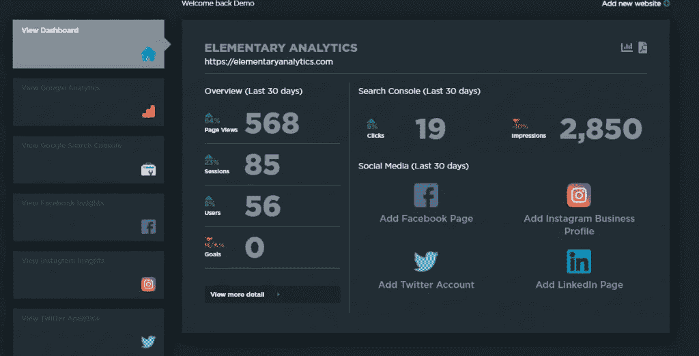

# 如何构建有效的分析仪表板

> 原文：<https://blog.devgenius.io/how-to-build-an-effective-analytics-dashboard-cca098b3b6de?source=collection_archive---------3----------------------->

[https://elementary analytics . com/how-to-build-an-analytics-dashboard/](https://elementaryanalytics.com/how-to-build-an-analytics-dashboard/)

很容易迷失在扔给你的数据海洋中。

你可能会问自己:“我该如何理解这一切？”答案很简单；构建分析仪表板！

分析仪表板将帮助您跟踪和衡量最重要的事情。因此，您可以为您的业务做出更明智的决策。

在这篇博客文章中，我们将向您展示如何创建一个带有基本分析的仪表板。

我们还将介绍一些关于如何最好地解释来自这些工具的数据的技巧，以便它对您的业务需求有意义。

只需今天投入一点时间，您就可以获得明天成功运营所需的关键信息！

通过审核您的数字平台(网站、社交媒体账户、广告活动)的关键绩效指标(KPI)。

你可以追踪你投入的时间和金钱，实际上帮助你发展你的业务。

## 哪些分析对您的业务很重要

这可能是一个棘手的问题，这里没有放之四海而皆准的方法。

这完全取决于你的业务是什么，以确定跟踪什么。

电子商务企业很可能会从其网站上跟踪销售情况。

如果你是一个出版商，博客，或者创造了大量的内容。你的目标可能是增加网站流量。

软件公司现在追踪他们获得了多少新用户。

如果你是本地企业，那么你跟踪的可能是询盘或预约。

弄清楚跟踪什么是你制定数字营销策略的关键。

以及能够看到你的任何策略是否有效。

## 为什么您需要一个分析仪表板来跟踪 KPI

如果你在一家公司做营销工作，这并不重要。并负责向主管或客户报告营销业绩。

您需要一种简单的方法来跟踪数据，您可以随时访问这些数据，以便向您的同事或老板提供最新信息。

这同样适用于你拥有的企业。您希望能够在任何给定的时间要求他人获取数据或自己获取数据。

有一个这样的仪表板可以解决很多问题。

从谷歌、脸书、Instagram、Twitter 上获取你需要的所有数据需要多长时间？更不用说广告平台或业务经理了。

为什么没有一个任何人都可以随时访问的仪表板呢？这表明他们需要的所有信息。

接下来，我将向您展示创建仪表板是多么简单。这将减少你花在分析上的时间。给你更多的时间来检查你的数据。

## 从谷歌分析开始

你的网站是你拥有的最重要的数字资产，无一例外。

你想在网上实现的一切都会在你的网站上。

在脸书或亚马逊上开店或做生意的人。在流沙中打下基础。

这些平台只需轻轻一点，就能让你沉入海底。

这是我的咆哮。

因为您的网站是创建仪表板的关键。从使用[谷歌分析](https://analytics.google.com)作为你的“单点事实”开始。

然后，您可以使用谷歌搜索控制台信息跟进此事。

## 谷歌分析仪表板

有一百万和一种方法来跟踪网站分析。是的，谷歌分析可能很麻烦，很难操作。

这仍然是跟踪网站分析的最佳方式。

在初等分析公司。我们设计了一些仪表板，可以帮助你理解你的谷歌分析数据。

一旦你将一个网站整合到初级分析中，你可以很快看到许多仪表板来帮助你理解事情。

一旦整合。您的初级分析帐户的主屏幕将显示您的网站在过去 30 天的 4 个关键指标。

以及允许你链接不同平台的其他分析数据到你的网站统计数据。

我们还有一个屏幕，可以让你在一个屏幕上看到多个网站的谷歌分析信息。

每个“小部件”再次向您显示关键指标。也向你展示了你的网站在过去 30 天里每天的表现。

对于数字营销机构、多个企业主和大型控股公司来说，能够跨多个领域查看绩效是一个游戏规则改变者。

由于通过 Google Analytics 可视化跨域跟踪可能很困难，您可以使用初级分析将这些多个网站视图聚集在一起。

你也可以更深入地研究一个网站的统计数据。点击“查看更多详细信息”按钮，您将进入细分屏幕。

此屏幕略有不同，因为我们向您显示了过去 7 天的每日统计数据。您可以更改此视图以显示过去 14、30 和 90 天的每日分析。

我们还汇总了四个不同时期的数据。帮你简单了解一下这几个月的表现。

下周展示过去 12 个月的每月表现。

这有助于你和你的企业了解事情进展如何，以及你是否经常访问网站的 KPI。

最后，当然不是最不重要的。我们为您提供了过去 30 天前 10 个登录页面和退出页面的查看信息。

这有助于你看到什么对你有效，所以你可以加倍下注。也向你展示了人们可能会离开你的网站。

这可能是关键。例如，如果您经营一家电子商务商店，而您的结账页面在退出页面列表中，那么结账页面本身可能有问题。或者顾客在点击结账页面之前的旅程。

现在，让我们看看谷歌分析以外的其他数据，你会想为你的网站保持跟踪。

## 谷歌搜索控制台分析

当我写这篇文章的时候，我想知道每天在谷歌上有多少搜索。

它震撼了我小小的心灵。谷歌上每天有 56 亿次搜索。让我再说一遍，每天有 56 亿次谷歌搜索。

这太疯狂了。

任何认真对待自己网站的人，希望人们通过谷歌搜索找到你。你需要跟踪你的谷歌搜索分析。

## 谷歌搜索控制台仪表板

不像谷歌分析，它有超过 200 个数据点可以查看。谷歌搜索控制台分析只有极少数，这是可怕的。

问题是这很难与你的谷歌分析数据联系起来。

这就是初等分析可以帮助你的地方。

从您帐户的主屏幕。一旦你添加了谷歌分析网站。你会看到一个按钮，上面写着“添加谷歌搜索控制台”。

这将允许您将任何域从您的谷歌搜索控制台帐户链接到网站。

一旦联系在一起。你不仅可以在主屏幕上看到你的谷歌分析数据。但你也谷歌搜索控制台分析。

初级分析。一旦你开始将不同的平台连接在一起。我们有一个预先构建的屏幕，向您展示您的分析可能如何关联。

我们通过“堆叠”来自您链接在一起的所有平台的数据来做到这一点。从谷歌分析开始，然后在下面显示谷歌搜索控制台数据，以显示性能趋势。

我在查看我的营销分析时遇到的一个挫折是，每个平台以不同的方式展示给你。

我甚至发现很难在谷歌分析的网站之间切换。初等分析解决了这些问题。帮助您专注于理解数据，而不是浪费时间尝试从不同平台获取数据。

正如我们的谷歌分析视图。如果需要，您可以查看多个 Google 搜索控制台记录的概述。

同样，我们以一致的方式呈现谷歌搜索控制台分析，允许您更改时间段。查看过去 90 天的整理分析，并给出 12 个月的运行率。

我们的谷歌分析仪表板和谷歌搜索控制台仪表板之间有什么不同。是“前 10 名”名单。

用你的谷歌搜索控制台分析。我们向您展示了过去 30 天中搜索次数最多的 10 个页面。以及向您展示人们使用什么搜索查询来查找您的数据。

这有助于你回顾这些网页，以确保它们有助于实现你的网站的目标。以及洞察人们在使用什么样的搜索词。

人们如何浏览你的网站可能会令人惊讶。谷歌可以为你的网站排名，现在想都没想过。

## 更多分析小工具

如果这些对你来说还不够，你甚至可以开始在你的网站之外加入分析。

元素分析支持最大的社交媒体和营销平台的小部件。

允许你从你的[脸书](https://elementaryanalytics.com/top-5-facebook-page-metrics-to-track-when-starting-out/)和 [LinkedIn](https://elementaryanalytics.com/top-5-linkedin-analytics-to-track-when-starting-out/) 页面或 Instagram 商业账户链接分析。

我们甚至从谷歌和脸书广告平台获取数据，允许你创建一个小工具，让你全面了解你的营销分析和统计数据。

你的公司有多个网站吗？借助初级分析，您可以根据需要构建任意多的小部件和仪表盘来监控统计数据，从而帮助您发展业务。

## 开始构建您自己的 web 分析仪表板

如您所见，web analytics 仪表盘可以帮助您减少登录、导航和浏览 web analytics 数据所花费的时间。

这样，您可以花更多的时间获得有价值的见解，为您的数字营销工作提供信息，帮助您的业务增长并向前发展。

## 想要为您的企业创建一个数据仪表板？

借助初级分析，您可以在几分钟内连接所有关键业务分析并构建仪表板。

[开始免费试用](https://app.elementaryanalytics.com/Account/Register)