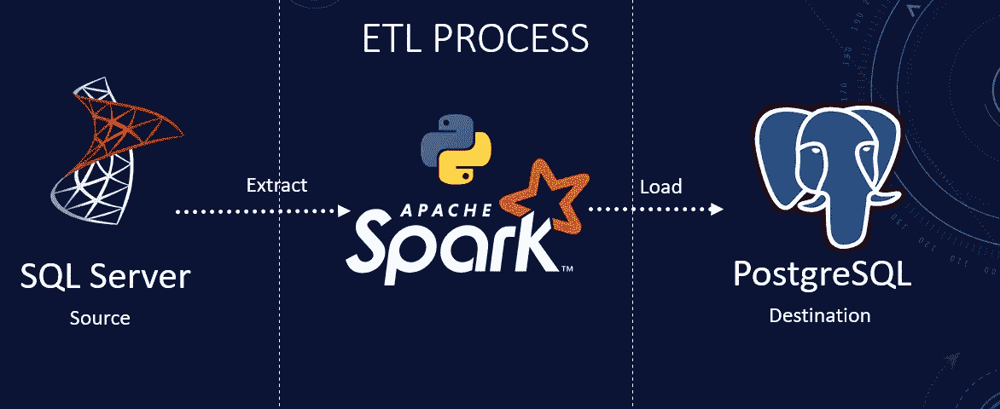

# 如何用 PySpark 搭建 ETL 管道？

> 原文：<https://blog.devgenius.io/how-to-build-an-etl-pipeline-with-pyspark-dfbac56f7fa5?source=collection_archive---------1----------------------->

**使用 Python、PySpark、SQLAlchemy、SQL Server 和 PostgreSQL**



PySpark ETL 概述

今天我们将使用 PySpark(一种 Apache Spark API)开发一个 ETL(提取、转换和加载)管道。Apache Spark 是一个用于大规模数据处理的分析引擎。我们将建立在前两次 PySpark 会话的基础上，利用 PySpark [设置](https://medium.com/dev-genius/setup-pyspark-locally-build-your-first-etl-pipeline-with-pyspark-91c3060c6133)和 [DataFrame API](https://medium.com/dev-genius/getting-started-with-pyspark-dataframe-api-5af17af6a2aa) 知识从源 SQL Server 提取数据并将其加载到 PostgreSQL。我们将把使用 pandas 用 Python 构建的 [ETL 管道](https://medium.com/dev-genius/how-to-build-an-etl-pipeline-with-python-1b78407c3875)转换成 PySpark。我们将遵循与本教程相似的设计模式。Python [ETL 管道](https://medium.com/dev-genius/how-to-build-an-etl-pipeline-with-python-1b78407c3875)可以处理小到中等大小的数据集。然而，一旦我们进入大数据领域，单台机器的资源就无法大规模处理数据。Apache Spark 是在集群上运行的分布式引擎之一，可以处理大数据。用于 ETL 管道的完整源代码可以在 [GitHub](https://github.com/hnawaz007/pythondataanalysis/tree/main/PySpark) 上获得。

如果你是视觉学习者，那么我在 YouTube 上有一个附带的视频，里面有完整代码的演示。

本 PySpark 教程将帮助您:

*   从源数据库 SQL Server 读取数据
*   使用 Spark 上的数据框架 API 将数据加载到数据框架中
*   将数据保存到目标数据库 PostgreSQL 数据库。

**阿帕奇火花 vs 熊猫**

Apache Spark 是一个用于大型数据处理的分布式平台。根本的区别在于，Pandas 数据帧位于一台计算机上的一个特定位置，而 Spark 数据帧可以跨越数百台称为节点的计算机。将数据放在多台计算机上的原因应该很直观:要么是数据太大，一台计算机无法容纳，要么是在单台计算机上执行计算需要太长时间。

**先决条件**

我们准备了 [SQL Server](https://www.youtube.com/watch?v=e5mvoKuV3xs) 和 [PostgreSQL](https://www.youtube.com/watch?v=fjYiWXHI7Mo) 环境，分别作为源环境和目的环境。我们将使用 SQL Server 的 AdventureWorks 数据库作为源，用 Python 加载 PostgreSQL 中的数据。此外，我们已经在此会话[中执行了数据库设置](https://medium.com/dev-genius/how-to-build-an-etl-pipeline-with-python-1b78407c3875)。如果你想继续下去，一定要检查这些来源。

**设置**

我们将 Java home 变量设置为 Java 安装目录，并定义几个变量。此外，我们需要为我们试图建立连接的各个数据库提供 jar 文件。我们可以从 [maven](https://mvnrepository.com/artifact/org.postgresql/postgresql) 站点下载适用于我们数据库的兼容 jar。我们用***extra class path***设置 Jar 路径位置。在这个位置，我们有用于 SQL Server 和 PostgreSQL 数据库的 jar。

```
os.environ["JAVA_HOME"] = "C:\Program Files\Java\jdk-18.0.2.1"
```

```
conf = SparkConf() \
    .setAppName("ETLPipeline") \
    .setMaster("local") \
    .set("spark.driver.extraClassPath","G:/pyspark/*")
```

为了连接到数据库，我们需要凭证，我们从环境变量中获取这些凭证。我们也可以将它们定义为变量名后的字符串。接下来，我们用服务器名、源和目标数据库名来定义变量。Spark 也需要驱动程序类，所以我们为 SQL Server 和 postgres 定义了驱动程序类。使用这些变量，我们定义数据库 jdbc URLs。一个用于源数据库，一个用于目标数据库。当我们用 java 连接数据库时，使用 Java 编写的 jar，通常我们通过 [JDBC](https://www.baeldung.com/java-jdbc) 连接数据库。

```
#get password from environmnet var
pwd = os.environ['PGPASS']
uid = os.environ['PGUID']
#sql db details
server = "localhost"
src_db = "AdventureWorksDW2019"
target_db = "AdventureWorks"
src_driver = "com.microsoft.sqlserver.jdbc.SQLServerDriver"
target_driver = "org.postgresql.Driver"
```

```
# source connection
src_url = f"jdbc:sqlserver://{server}:1433;databaseName={src_db};user={uid};password={pwd};"
# target connection
target_url = f"jdbc:postgresql://{server}:5432/{target_db}?user={uid}&password={pwd}"
```

**摘录**

我们需要一个策略来规划我们的 ETL 管道。通常，我们将每个表从源环境映射到目标环境。在两种环境中创建具有匹配数据类型的相似对象。我们连接到两个环境，为每个表执行映射，然后触发管道。听起来工作量很大！别担心，我们不会经历那么多麻烦的。我想展示一下 **Python** 和 **PySpark** 的多功能性，以及它们可以让这个过程变得多么简单。我将获取我想从 SQL Server 的系统模式中提取数据的表。只需遍历表并查询它们。通过几行代码，我们查询了数据源并获得了 DataFrame 形式的数据。

**负载**

DataFrame API 使得使用“写入”功能将数据加载到 SQL 数据库变得轻而易举。当我们遍历并查询提取中的每个表时，我们调用定义为 load 的下一个函数。我们将遵循 truncate and load 方法，因为它很简单，每次运行都会替换表。这可以是您的分段环境，您可以在其中以给定的时间间隔获取新数据。从这里，您可以将数据转换并加载到表示层。下面的代码演示了如何使用 **PySpark** DataFrame 连接并存储数据到 **PostgreSQL** 数据库中。

**结论**

*   我们展示了用 PySpark 创建 ETL 管道是多么容易。
*   我们使用 Python，PySpark 实现了一个基本的 ETL 管道。
*   完整的代码可以在[这里](https://github.com/hnawaz007/pythondataanalysis/tree/main/PySpark)找到