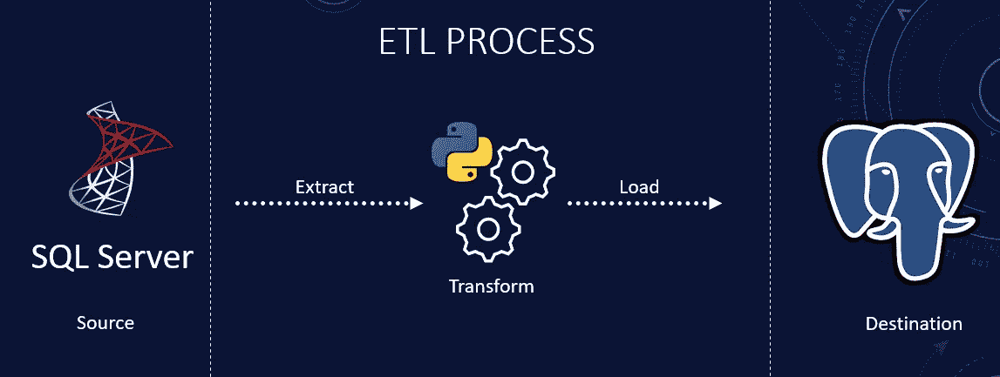

# 如何用 Python 搭建一个 ETL 管道？

> 原文：<https://blog.devgenius.io/how-to-build-an-etl-pipeline-with-python-1b78407c3875?source=collection_archive---------0----------------------->

**使用 Python、Pandas、SQLAlchemy、SQL Server 和 PostgreSQL**

ETL 过程概述

ETL 代表提取、转换、加载。ETL 是一种数据集成，它从一个或多个源(API、数据库或文件)中提取数据，将其转换为符合目标系统的要求，然后将其加载到目标系统中。ETL 管道是数据工程中一种重要的工作流类型。我将使用 Python，尤其是 pandas 库来构建一个管道。熊猫让执行 ETL 操作变得超级容易。我想展示用 Python 简化 ETL 过程是多么容易。用于 ETL 的完整源代码可以在 [GitHub](https://github.com/hnawaz007/pythondataanalysis/tree/main/ETL%20Pipeline) 上获得。

如果你是视觉学习者，那么我在 [YouTube](https://www.youtube.com/watch?v=dfouoh9QdUw&t) 上有一个附带的视频，里面有完整代码的演示。

**为什么选择 ETL 管道？**

分析、决策支持系统和运营报告依赖于数据。这些对业务至关重要，尽管我们可以对源系统进行分析，但是源系统很少针对查询进行优化。额外的分析工作负载会降低面向业务的应用程序的速度。ETL 在这方面发挥了作用，它从源移动数据、转换数据并将其加载到优化的数据库/存储层以进行数据分析。我将重点介绍 ETL 的提取和加载组件。对于转换，我们可以利用 [**熊猫**](https://www.youtube.com/watch?v=-jerzfh2bS0) 库中所有可用的提示和技巧。我们希望展示使用 Python 自动提取和加载的简便性。

**建立 ETL 管道**

我们可以使用许多不同的工具和技术来构建 ETL 管道。具体需要什么取决于您的需求和技能。我们将使用 **Python** ，特别是 **Pandas** 和 **SQLAlchemy** 来提取和加载数据。

**设置**

我准备了 [SQL Server](https://www.youtube.com/watch?v=e5mvoKuV3xs) 和 [PostgreSQL](https://www.youtube.com/watch?v=fjYiWXHI7Mo) 环境，分别作为源环境和目的环境。我们将使用 SQL Server 的 AdventureWorks 数据库作为源，用 Python 加载 PostgreSQL 中的数据。如果你想跟进，一定要看看这两个视频。在编写 ETL 管道之前，我将在数据库端执行一些基本的设置。以下 SQL 脚本可在 [GitHub](https://github.com/hnawaz007/pythondataanalysis/tree/main/ETL%20Pipeline) 上获得。我将在 pgAdmin4 中执行几个查询。

*   首先，我将创建一个数据库来存放传入的表和数据。

创建数据库

*   其次，我将创建一个用户，并授予其 connect 权限以及 select、insert、update 和 delete 权限。我将继续在 SQL Server 环境中创建同一个用户，以保持一致性。

创造用户

*   第三，我将把凭证保存在环境变量中。单独存储您的凭据是一个好习惯。目标是保护凭证不被暴露在 ETL 脚本中。您可以使用配置文件或系统环境变量。

**摘录**

我们需要一个策略来规划我们的 ETL 管道。通常，我们将每个表从源环境映射到目标环境。在两种环境中创建具有匹配数据类型的相似对象。我们连接到两个环境，为每个表执行映射，然后触发管道。听起来工作量很大！别担心，我们不会经历那么多麻烦的。我想展示一下 **Python** 和**熊猫**的多功能性，以及它们可以让这个过程变得多么简单。我将获取我想从 SQL Server 的系统模式中提取数据的表。只需遍历表并查询它们。通过几行代码，我们查询了源代码并获得了作为 Pandas dataframe 的数据。

ETL 提取功能

**负载**

Pandas 使用 pandas 的“to_sql()”函数轻松地将数据加载到 SQL 数据库中。当我们遍历并查询提取中的每个表时，我们调用定义为 load 的下一个函数。我们将遵循 truncate and load 方法，因为它很简单，每次运行时都会替换表。这可以是您的分段环境，您可以在其中以给定的时间间隔获取新数据。从这里，您可以将数据转换并加载到表示层。下面的代码演示了如何使用 **Pandas** 连接和存储 **PostgreSQL** 数据库中的数据。

ETL 加载功能

**结论**

*   我们描述了什么是 ETL，以及它在当今数据驱动的世界中有多重要。
*   我们展示了用 Pandas 创建 ETL 管道是多么容易。
*   我们使用 Python、Pandas 和 SQLAlchemy 实现了一个基本的 ETL 管道。
*   完整的代码可以在[这里](https://github.com/hnawaz007/pythondataanalysis/tree/main/ETL%20Pipeline)找到
*   跟进 ETL 增量数据加载技术[源变更检测](/python-etl-pipeline-incremental-data-load-source-change-detection-28a7ceaa9840)和[目的地变更比较](/python-etl-pipeline-the-incremental-data-load-techniques-20bdedaae8f)