# 如何用 Sendbird UIKit 构建 iOS 聊天应用

> 原文：<https://blog.devgenius.io/how-to-build-an-ios-chat-app-with-sendbird-uikit-d2db2a15c80f?source=collection_archive---------19----------------------->

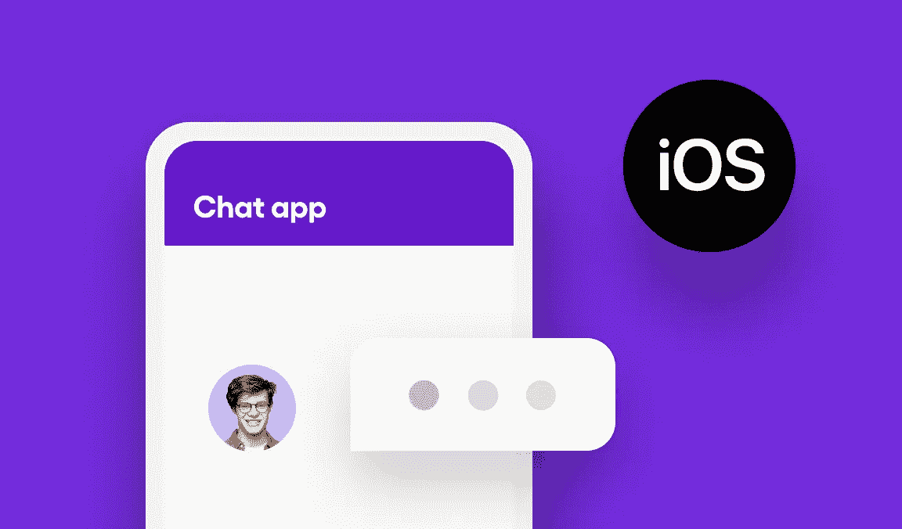

## 在不到 10 分钟的时间内创建一个现代的、功能丰富的聊天体验

*在构建您的应用程序时，您可能会发现查看* [*示例代码*](https://github.com/sendbird/sendbird-uikit-ios/tree/master/Sample) *很有用。如需更多指导，请查看我们的* [*文档*](https://sendbird.com/docs/uikit/v1/ios/quickstart/send-first-message) *。您还可以查看应用内聊天的* [*演示*](https://sendbird.com/demos/in-app-chat) *，了解更多关于*[*UIKit*](https://sendbird.com/features/chat-messaging/uikit)*的信息。*

> *成为第一个了解新教程、开发者相关聊天/电话发布以及其他重要更新的人，* [*注册*](https://get.sendbird.com/dev-newsletter-subscription.html) *订阅我们的开发者简讯。*

# 介绍

本入门指南使用了[**Sendbird UIKit**](https://sendbird.com/blog/introducing-sendbird-uikit-get-chat-running-in-minutes)，这是一套丰富的预建 UI 组件，您可以使用它在 10 分钟内在您的应用程序中创建现代 messenger 体验。也可以使用[**Sendbird Chat SDK**](https://sendbird.com/docs/chat)配合自己的自定义 UI。

要发送您的第一条消息，您需要完成两个里程碑:

1.在 Sendbird 环境中创建一个 Sendbird 帐户和用户。
2。将 Sendbird UIKit SDK 集成到您的应用程序中。

本指南详细介绍了这两个步骤，面向任何熟练程度的开发人员，以便他们可以看到在应用程序中发送第一条消息是多么容易——从头开始！

我们开始吧！

# 第一步。创建一个 Sendbird 帐户

1.注册一个[免费 Sendbird 账户](https://dashboard.sendbird.com/auth/signup)。

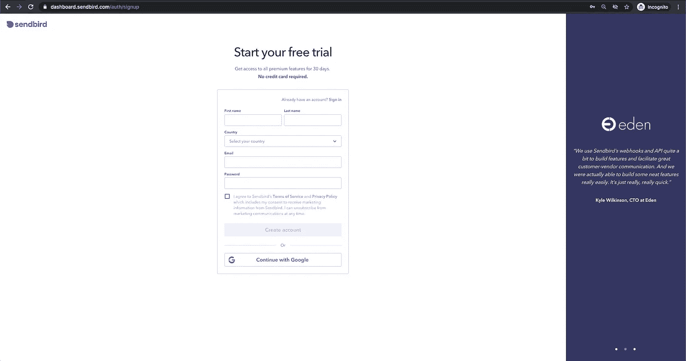

2.使用您的电子邮件创建一个帐户，或单击**继续使用 Google。**
3。通过输入**组织名称**和**电话号码**设置您的**组织**。

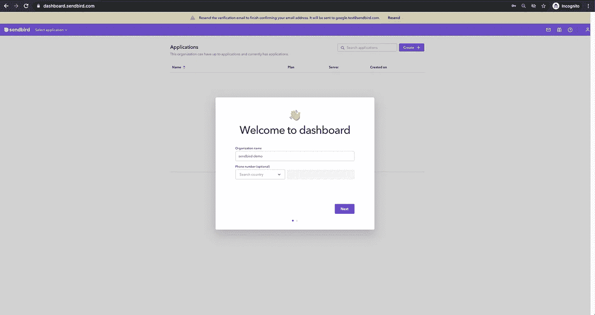

4.选择**产品类型**并输入**应用程序名称**、**地区**后，创建您的 Sendbird 应用程序。

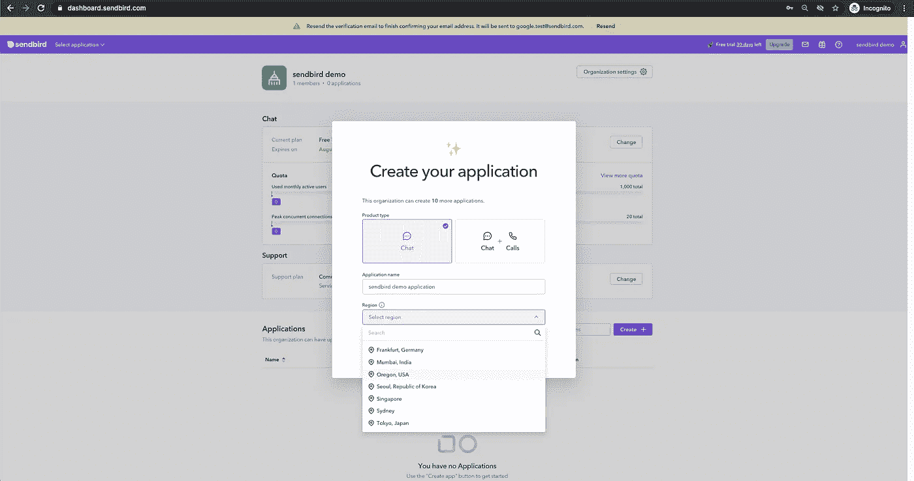

创建您的 Sendbird 应用程序

5.您将被引导到 Sendbird 仪表板的主页，开始在您的产品中实现 Sendbird Chat SDK 和 API。

6.一旦你进入，从**应用程序**部分复制你唯一的**应用程序 ID** 并粘贴到你的剪贴板。

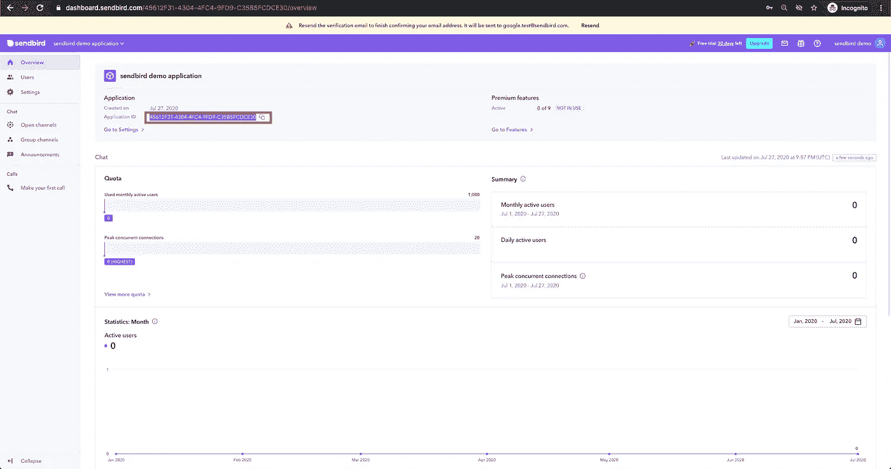

# 第二步。在 Sendbird 仪表板中创建用户

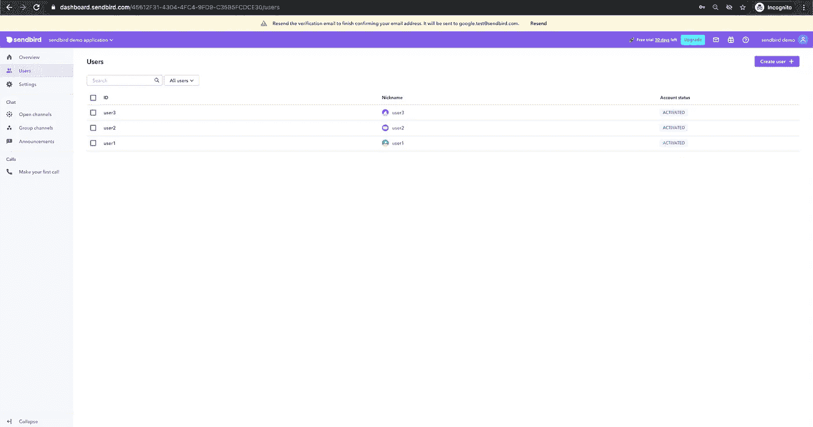

1.  导航到仪表板左侧导航中的**用户**部分。
    2。点击右上角的**创建用户** +图标。

3.通过填写以下字段创建一个新用户:
–**ID**
–**昵称**
–**个人资料 URL** —可选
–**颁发访问令牌** —可选

首先，至少创建两个用户，这样您的应用程序中就有了可以互相聊天的用户。

# 第三步。添加 Sendbird UIKit SDK

我们将使用 Xcode 创建一个新的 Swift 应用程序，并使用 CocoaPods 添加 Sendbird UIKit SDK。

或者，您可以创建一个 Objective-C 应用程序来与 Sendbird UIKit 一起使用。你也可以按照这些 [**安装步骤**](https://sendbird.com/docs/uikit/v1/ios/quickstart/send-first-message#2-install-with-carthage) 用 Carthage 安装 Sendbird UIKit SDK。

1.在 Xcode 中创建您的应用程序。

打开 Xcode >点击**新建 Xcode 项目**选择 **App**

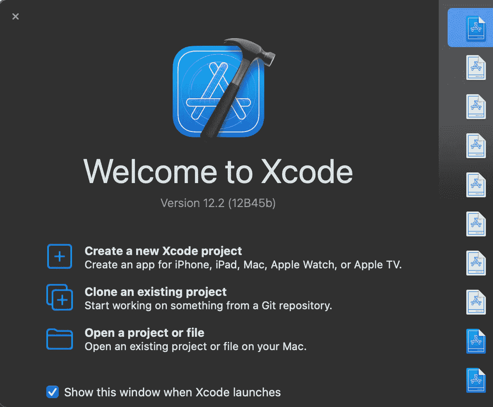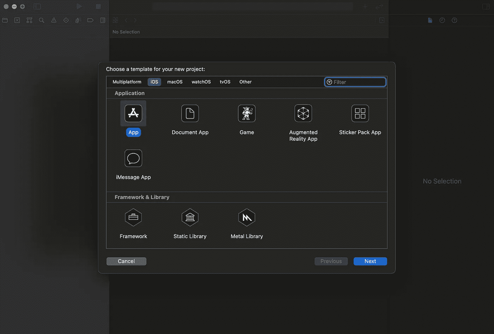

根据需要命名您的项目并指定您的组织信息。为了遵循这个例子，将应用程序命名为**sendbirdpapplication**。

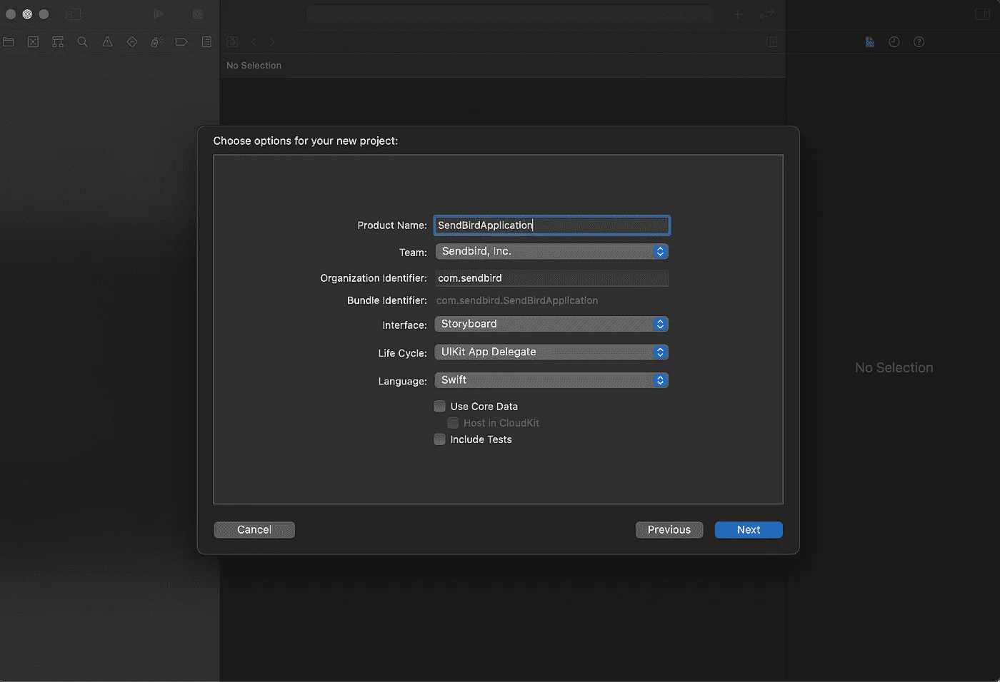

选择要保存应用程序的目录，然后单击**创建**。您的应用程序已创建，您的 Xcode 项目现已打开。Xcode 自动为你创建了一些重要的项目文件，比如 **AppDelegate.swift** 和 **SceneDelegate.swift** 。我们以后会用到这些文件。

2.使用 CocoaPods 为 iOS 安装 UIKit。

在您的 Mac **终端**应用程序中，请导航到包含您的新 Xcode 项目的项目目录(**sendbirdpapplication . Xcode proj**)。
为了方便找到这个目录，在 Xcode 中选择你的项目，复制完整路径并粘贴到**终端**。

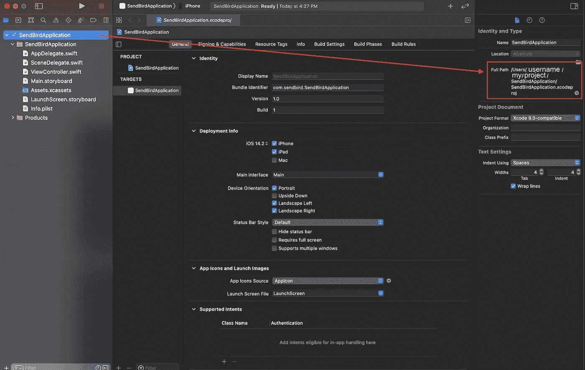

您应该在该目录中看到以下文件。

在**终端**中，创建你的 **Podfile** 并打开它。

将 **SendBirdUIKit** 添加到您的 Xcode 中的 **Podfile** 中，如下所示，然后保存。

回到**终端**，通过**协同包**安装**sendbiruikit**框架。您应该看到下载和安装正在进行，并且推荐使用 Xcode 工作空间文件。您的目录现在已经有了 **Pods** 文件夹和以下文件: **Podfile** 、 **Podfile.lock** 、**sendbirdapplication . xcworkspace**。

如果需要，通过 **CocoaPods** 更新 **SendBirdUIKit** 框架。在 GitHub 上检查你有最新版本的 [**SendBirdUIKit。**](https://github.com/sendbird/sendbird-uikit-ios/blob/master/CHANGELOG.md)

3.打开**sendbird application . xc workspace**文件继续 Xcode。

在 Xcode 中，您的应用程序现在应该有了 **Pods** 文件夹和项目。

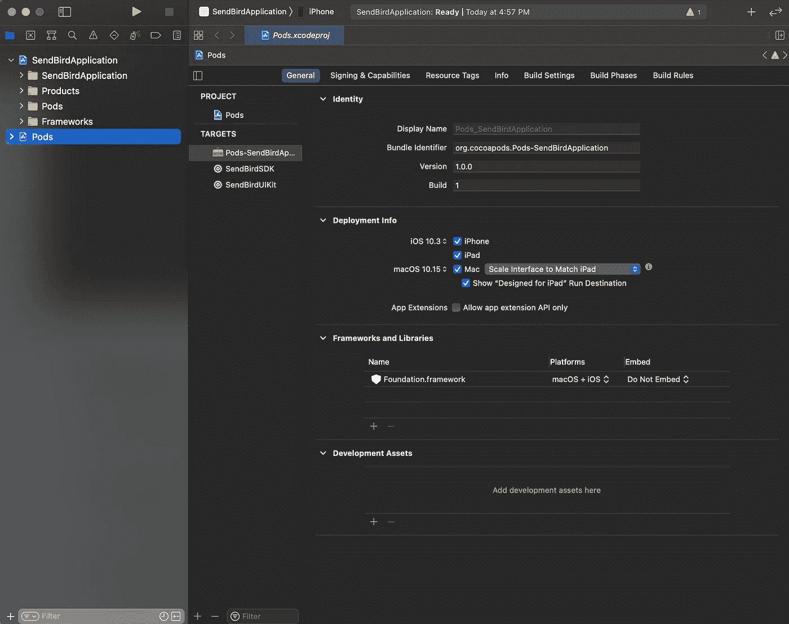

# 第四步。将 Sendbird UIKit 连接到您的应用程序

1.将 Sendbird UIKit 连接到您的应用程序并创建一个用户。

在 Xcode 中的**Sendbird Application . xc workspace**中，添加您之前在仪表板中创建的 Sendbird 应用程序的**应用程序 ID** ，以初始化 **AppDelegate** 类中的 Sendbird 聊天 SDK。

您的**应用程序 ID** 将类似于这个:45612 f31–4304–4fc 4–9fd 9-c 35 b5 fcd ce 30

通过 **AppDelegate** 为 UIKit 设置 **CurrentUser** ，如下所示。在启动 Sendbird UIKit 之前，必须在 **SBUGlobal** 中将用户信息设置为 **CurrentUser** 。

2.加载频道列表。

UIKit 允许您创建一个专门用于一对一聊天的频道，并列出一对一聊天频道，以便您可以轻松地查看和管理它们。使用**sbucnellistviewcontroller**类，您可以为最终用户提供一个完整的聊天服务，其中包含一个 [**频道列表**](https://sendbird.com/docs/uikit/v1/ios/guides/key-functions#2-list-channels) 。

将以下代码添加到 **AppDelegate 类应用程序(_:difinishlaunchingwithoptions:)**方法和 **SceneDelegate** 类**场景(_:willconnetto:options:)**方法中。

现在， [**AppDelegate**](https://developer.apple.com/documentation/uikit/uiapplicationdelegate) 和 [**SceneDelegate**](https://developer.apple.com/documentation/uikit/uiscenedelegate) 类应该如下所示。

# 第五步。测试您的集成

1.通过点按顶部的播放图标，在 Xcode 中运行您的应用程序。

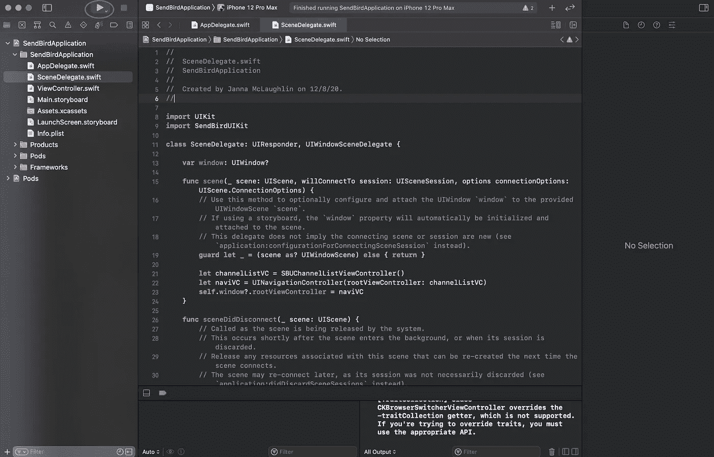

您的应用程序现在应该可以在 iPhone 模拟器或 iOS 设备上构建和运行了。

2.创建频道并邀请用户加入。

您现在可以在您的应用程序中创建一个供用户聊天的频道。点击视图右上角的“ **+** ”图标，创建新的群组频道并邀请用户。

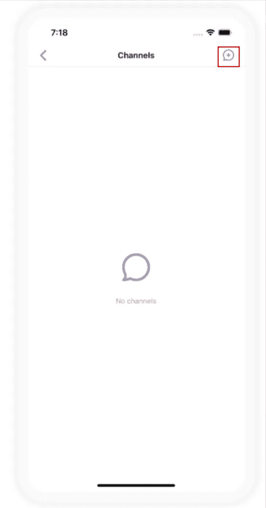

3.发送您的第一条消息。

试着输入一条信息，然后点击发送。您应该能够在应用程序中新建的聊天中成功发送您的第一条消息。

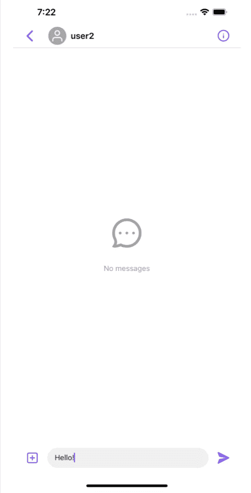

# 结论

恭喜你！您已经准备好使用 Sendbird UIKit 在 iOS 应用程序中发送和接收信息。有关 Sendbird UIKit for iOS 的更多信息，请查看我们的 [**iOS 文档**](https://sendbird.com/docs/uikit/v1/ios/quickstart/send-first-message) 。如果你想为 web 和 Android 构建，检查一下 [**Android**](https://docs.sendbird.com/android/ui_kit_getting_started) 和 [**JavaScript**](https://sendbird.com/blog/getting-started-guide-sendbird-uikit-for-javascript) 文档。

开心聊楼！

> *成为第一个了解新教程、开发者相关聊天/电话发布以及其他重要更新的人，* [*注册*](https://get.sendbird.com/dev-newsletter-subscription.html) *我们的开发者简讯。*