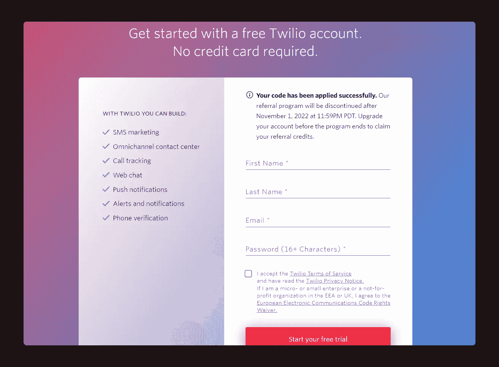
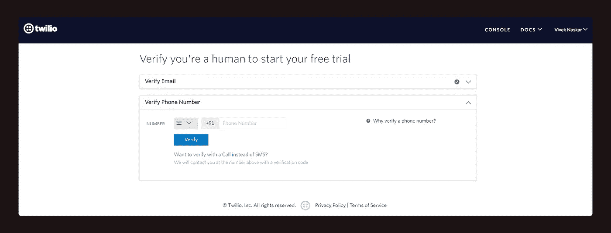
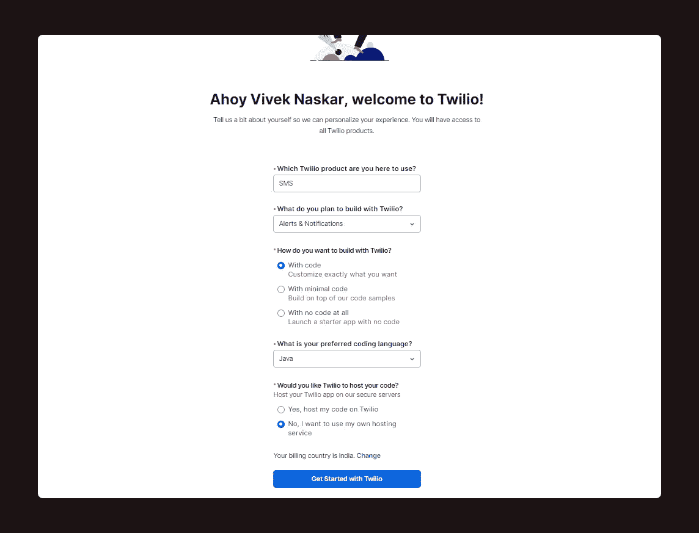
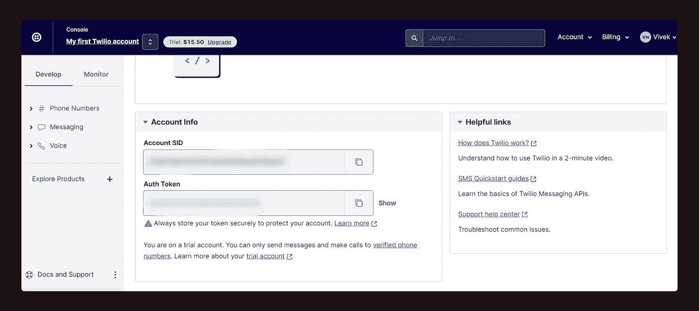
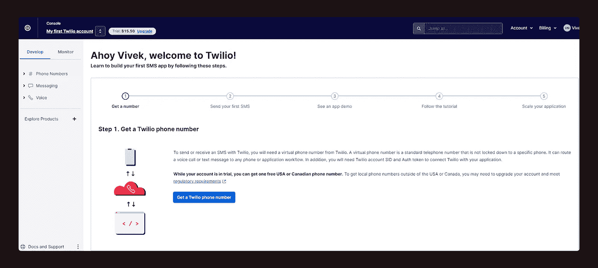
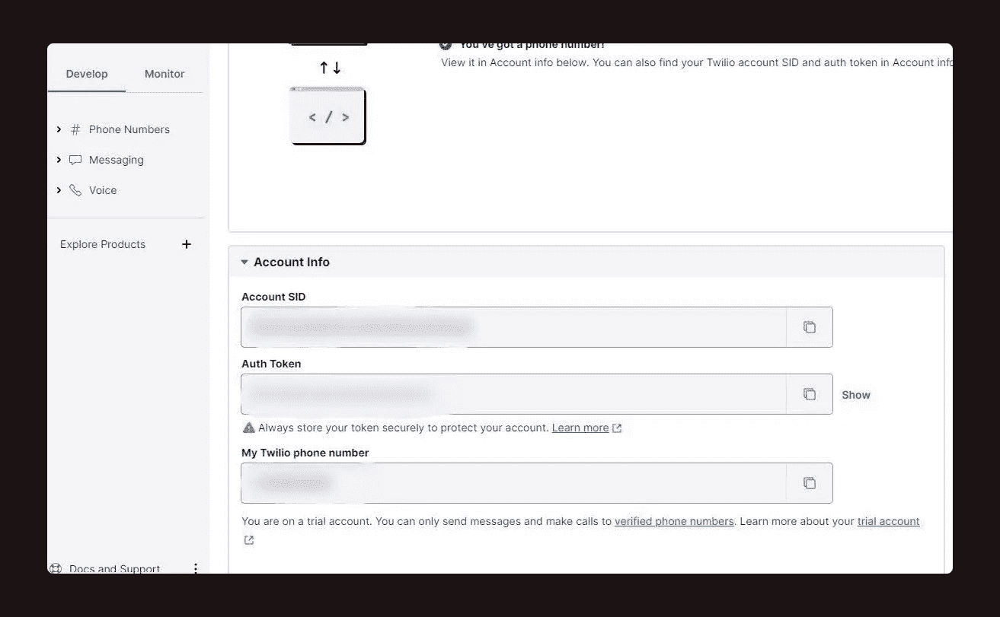
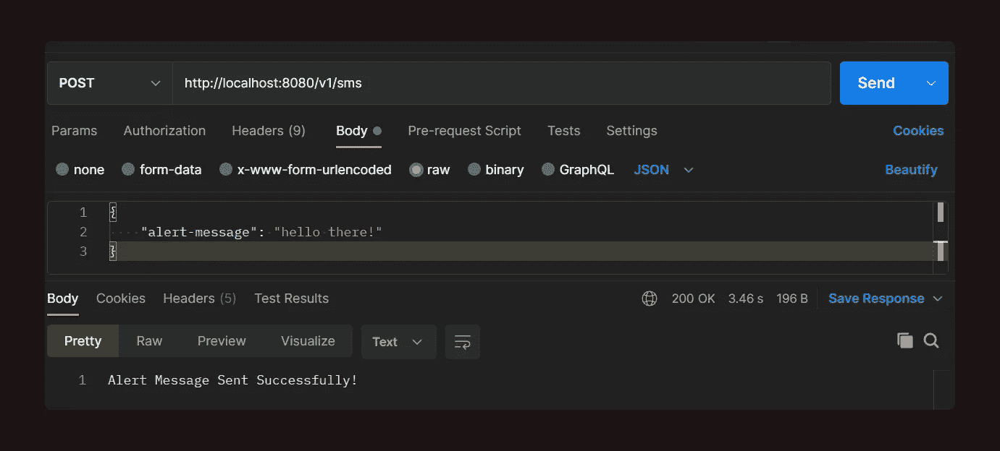
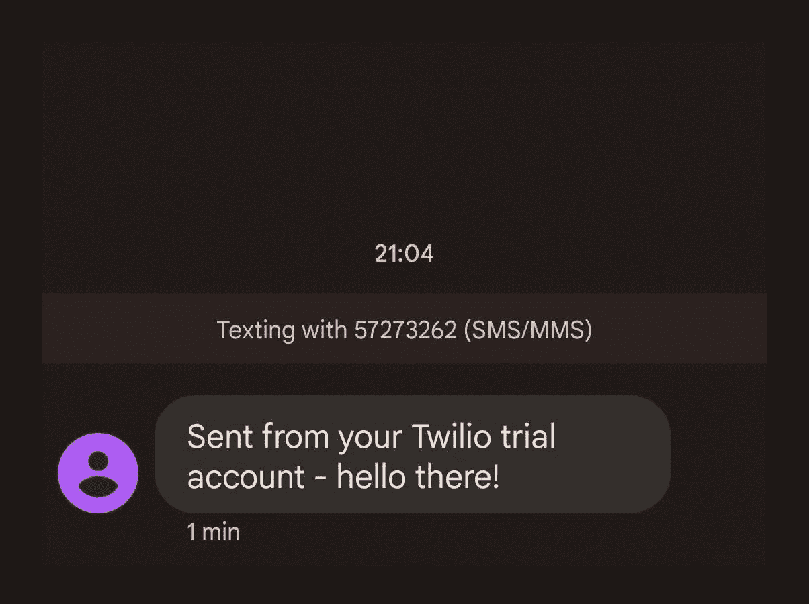

# 如何在 Java 中用 Spring Boot 构建短信提醒系统

> 原文：<https://blog.devgenius.io/how-to-build-an-sms-alert-system-using-spring-boot-in-java-ddca192280f5?source=collection_archive---------3----------------------->

## 创建自己的警报系统非常容易，而且可能性无穷无尽。


由[像素](https://www.pexels.com/)上的[赖爷子](https://www.pexels.com/photo/concentrated-young-male-using-smartphone-during-coffee-break-on-street-4559593/)拍摄的照片

我们都被多个应用程序的通知淹没了，无论是 WhatsApp、Instagram、Reddit 还是 Snapchat。当有重要事件时，我们会通过应用程序内的弹出窗口、邮件和短信得到通知。

你有没有尝试过随时建立一个警报系统？在这篇文章中，我将尝试做同样的事情——每当调用 API 时，构建一个短信提醒系统。

我们所需要的是 *Twilio* ，这是一个客户参与平台，成千上万的平台用它来为他们的客户创造定制体验。

# 开始前你需要什么

在开始之前，您应该对 Java、Maven 和 Spring Boot 有一个基本的了解。

出于本项目的目的，我将使用:

*   [Java 11](https://www.oracle.com/java/technologies/downloads/)
*   Spring Boot 2.7.x
*   阿帕奇 Maven 3 . 6 . 3
*   [Twilio 账户](https://www.twilio.com/try-twilio?promo=YbalWV)
*   [IntelliJ Idea](https://www.jetbrains.com/idea/download/#section=windows) 社区版(IDE)

# 在 Twilio 创建一个免费帐户

您需要创建一个免费的 Twilio 帐户，在接下来的步骤中，您需要设置您的电话号码。此外，创建免费帐户，不需要信用卡。

使用此链接创建一个 Twilio 帐户:[*https://www.twilio.com/try-twilio*](https://www.twilio.com/try-twilio)



一旦您填写了详细信息并确认了您的验证邮件，您需要添加并确认您的电话号码，短信提醒系统将被激活。



确认电话号码后，您应该会看到一个欢迎页面，在点击 ***开始使用 Twilio*** 按钮之前，您需要填写以下所需的详细信息。



Twilio 控制台将看起来像:



***账号 SID*** 和 ***Auth Token*** 中的字段不能共享，否则任何人都可以访问你的 Twilio 账号。在接下来的步骤中，我们将使用这两个字段。

在同一个控制台中，有一个按钮，“ ***获取试用电话号码”*** ，这将使您能够获取有效的 Twilio 电话号码。这是用 Twilio 发送手机短信所必需的。



一旦生成有效的电话号码，它将与*帐户 SID* 和*身份验证令牌*一起出现在 Twilio 控制台中。



# 设置 Spring Boot 应用程序

和往常一样，你可以从[*Spring Initializer*](https://start.spring.io/)下载空白演示应用。

将 Twilio SDK 依赖项添加到 spring boot 项目的 *pom.xml* 文件中。

```
**<dependency>
   <groupId>com.twilio.sdk</groupId>
   <artifactId>twilio</artifactId>
   <version>9.0.1</version> <!-- Add the latest version -->
</dependency>**
```

因此， *pom.xml* 中完整的依赖列表如下所示:

# 建立警报系统

对于这个简单的应用程序示例，我使用了一个控制器来接收您希望作为有效负载发送的警报消息。因此，该消息是可定制的。

现在，为了使用 Twilio SDK，您必须通过使用`[***@PostConstruct***](https://docs.oracle.com/javaee/7/api/javax/annotation/PostConstruct.html)`注释中的 *init()* 方法来初始化它的凭证。

*TwilioConfig* 类中的*帐户 SID、*T1、 *Auth Token* 、`**${twilio.auth.token}**`将通过 *application.properties* 文件中的`[***@Value***](https://docs.spring.io/spring-framework/docs/current/javadoc-api/org/springframework/beans/factory/annotation/Value.html)` 批注传递。

当静态方法`***Message.creator(param1, param2, param3)***`传递了所有参数时，发送 SMS 消息的核心功能就工作了。这里，`***param1***`是接收方的电话号码(*你的电话号码*)，`***param2***`是发送方的电话号码( *Twilio 电话号码*)，而`***param3***` 是要发送的消息。

上述功能已经在 *AlertServiceImpl* 类的`***sendSMS()***`方法中实现，该方法实现了 *AlertService* 接口类。

如前所述，控制器类非常简单。它调用 *AlertService* 接口类的方法`***sendSMS()***`。

# 测试应用程序

一旦应用程序启动，你可以通过你定制的邮件测试它。



如果成功，您将在您的电话号码中收到该消息。



这就对了。您使用 Spring boot 发送了第一条短信。

注:你可以从[*【https://github.com/viveknaskar/sms-alert-system】*](https://github.com/viveknaskar/sms-alert-system)获得邮差合集的完整代码。

我非常喜欢撰写这篇文章，我希望你们也喜欢自己的消息传递系统。这仅仅是皮毛。我们可以做得更多。

您可以随意摆弄代码，尝试向多人发送 SMS 消息，或者从有效负载本身获取接收者的电话号码。

如果你喜欢读这篇文章，你可能也会发现下面的文章值得你花时间去读。

[](https://levelup.gitconnected.com/everything-you-need-to-know-about-the-completablefuture-api-ec357e731a5c) [## 关于 CompletableFuture API 您需要知道的一切

### 使 Java 中的异步编程令人兴奋的 API！

levelup.gitconnected.com](https://levelup.gitconnected.com/everything-you-need-to-know-about-the-completablefuture-api-ec357e731a5c) [](https://levelup.gitconnected.com/5-important-lessons-that-every-software-developer-should-know-learn-7e63b71a7984) [## 每个软件开发人员都应该知道和学习的 5 条重要经验

### 做一个软件开发人员很容易，但是要成为一个更好的软件开发人员？

levelup.gitconnected.com](https://levelup.gitconnected.com/5-important-lessons-that-every-software-developer-should-know-learn-7e63b71a7984) 

*如果你喜欢阅读有助于你更好地学习、生活和工作的故事，可以考虑* [*成为订阅者*](https://viveknaskar.medium.com/subscribe) *。成为会员后，你可以无限制地阅读 10000 篇故事、文章和作家。每月只要 5 美元。* [*如果你用我的链接*](https://viveknaskar.medium.com/membership) *注册，我会赚一点佣金，帮助我写更多的文章。*