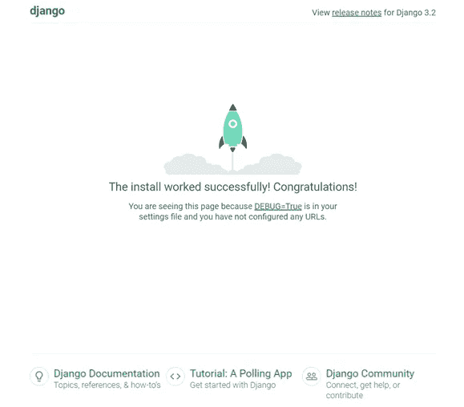
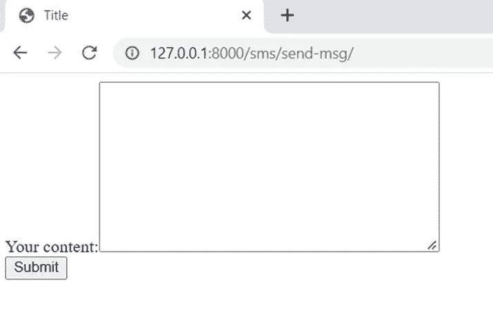
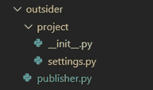
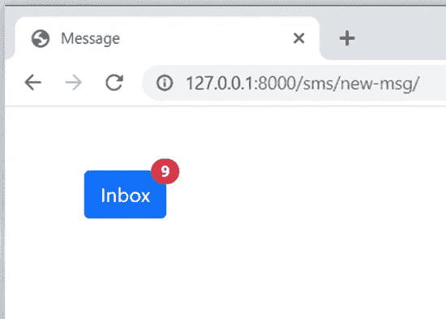
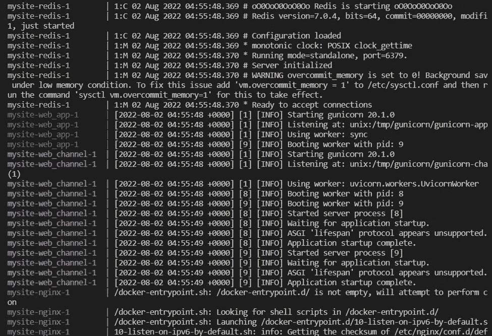
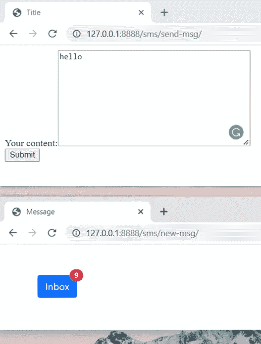

# 如何构建和容器化一个简单的实时通知系统

> 原文：<https://blog.devgenius.io/how-to-build-and-containerize-a-simple-live-notification-system-765fd55bac64?source=collection_archive---------6----------------------->

在[上一篇文章](https://slow999.medium.com/how-to-design-and-plan-a-simple-live-notification-system-part-1-2-d0e67712b90c)中，我们已经通过使用故事映射完成了计划流程。在这篇文章中，我将带你经历实际的开发(执行)过程。请注意，您需要一些 Django 的基础知识来理解讨论。让我们开始吧。

# 属国

*   Python 3.8
*   Django 3.2
*   渠道 3.0.4
*   请参阅 requirements.txt 文件中的其他 Python 依赖项
*   码头工人

# 第一步。基础项目

我们将从一个基础项目开始。它附在下面的标签中。请下载并解压文件 **mysite.zip** 。

[https://github . com/slow 999/DjangoAndLiveNotification/releases/tag/0 . 0 . 0](https://github.com/slow999/DjangoAndLiveNotification/releases/tag/0.0.0)

在设置好虚拟 env 并运行服务器之后，我们应该在 [http://127.0.0.1:8000/上看到这个页面。](http://127.0.0.1:8000/.)



基础项目的页面

# 第二步。设置频道

在 **requirements.txt** 文件中，添加**通道**和**通道-redis** 。它应该看起来像下面的。

```
channels==3.0.4
channels-redis==3.4.0
```

在 **mysite** 文件夹中创建一个 **asgi.py** 文件。内容如下。

```
"""
ASGI config for mysite project.It exposes the ASGI callable as a module-level variable named ``application``.For more information on this file, see
[https://docs.djangoproject.com/en/3.2/howto/deployment/asgi/](https://docs.djangoproject.com/en/3.2/howto/deployment/asgi/)
"""import os
from channels.auth import AuthMiddlewareStack
from channels.routing import ProtocolTypeRouter, URLRouter
from django.core.asgi import get_asgi_applicationos.environ.setdefault('DJANGO_SETTINGS_MODULE', 'mysite.settings')application = ProtocolTypeRouter({
    'http': get_asgi_application()
})
```

在 **settings.py** 文件中，将**频道**库添加到 **INSTALLED_APPS** 中。如下图。

```
INSTALLED_APPS = [
    … 'channels',
]
```

在 **settings.py** 文件中，设置 ASGI 应用和通道层。如下图。

```
ASGI_APPLICATION = 'mysite.asgi.application'
CHANNEL_LAYERS = {
    'default': {
        'BACKEND': 'channels_redis.core.RedisChannelLayer',
        'CONFIG': {
            'hosts': [{'address': ('redis', 6379), 'password': 'mypassword'}],
        }
    }
}
```

注意，我们使用 Redis 作为通道层。因为我们将容器化构建，所以这个服务也叫做**‘redis’**。如果您想在项目之外使用 Redis 服务，服务名是一个 URL。比如**' https://myredisservice . domain . com '**。最重要的是，我们为 Redis 服务实现了基本的身份验证。

# 步骤 3 构建应用程序内发布者

这一步包括构建发布者的应用程序视图和模板。

使用下面的命令创建一个新的应用程序 **sms** 。

```
python manage.py startapp sms
```

在 **settings.py** 文件中，将 **sms** app 添加到 **INSTALLED_APPS** 中。它看起来像下面的。

```
INSTALLED_APPS = [
    … 'channels', # we add in the previous step
    'sms.apps.SmsConfig'
]
```

在**短信** app 中创建一个 **forms.py** 文件。内容如下。

```
from django import formsclass MessageForm(forms.Form):
    content = forms.CharField(widget=forms.Textarea, label='Your content')
```

在**短信** app 的 **views.py** 文件中，添加以下内容。

```
import time
import datetime
from django.shortcuts import render, HttpResponse
from channels.layers import get_channel_layer
from asgiref.sync import async_to_sync
from sms.forms import MessageFormdef send_msg(request):
    if request.method == 'GET':
        return render(request, 'sms/send_msg.html', {'form': MessageForm()})
    elif request.method == 'POST':
        form = MessageForm(request.POST)
        if form.is_valid():
            print('Sending sms...')
            channel_layer = get_channel_layer()
            async_to_sync(channel_layer.group_send)('new_message', {'type': 'notify_client', 'message': f'email is sent.{datetime.datetime.now()}'})
            print('Message is sent.')
        else:
            print('Something is wrong')
            print(form.errors)
        return render(request, 'sms/send_msg.html', {'form': MessageForm()})
    else:
        return HttpResponse('Wrong method.')
```

请注意，消息将被发送到名为 **new_message** 的用户组。处理该消息的动作类型被称为**通知客户端**。我们稍后将在订户部分开发它。

在**短信** app 中创建一个**模板**文件夹。在**模板**文件夹中，创建一个**短信**文件夹。在我们刚刚创建的 **sms** 文件夹中，创建一个 **send_msg.html** 文件。内容如下。

```
<!DOCTYPE html>
<html lang="en">
<head>
    <meta charset="UTF-8">
    <title>Title</title>
</head>
    <body>
        <form action="." method="post">
            
            {{ form }}
            <br>
            <input type="submit" value="Submit">
        </form>
    </body>
</html>
```

在**短信** app 中创建一个 **urls.py** 文件。添加一个新的 URL，如下所示。

```
# chat/urls.py
from django.urls import pathfrom . import viewsurlpatterns = [
    path('send-msg/', views.send_msg, name='send_msg'),
]
```

在 **mysite/urls.py** 文件中，如下连接**短信**的 URL。

```
urlpatterns = [
    … path('sms/', include('sms.urls')),
]
```

让我们运行服务器并检查一下。我们应该在[http://127 . 0 . 0 . 1:8000/SMS/send-msg/](http://127.0.0.1:8000/sms/send-msg/)看到下面的一个基本表单。



应用程序内发布器的用户界面

# 第四步。构建-应用程序发布者

这将是一个独立的 Python 脚本。我们可以在任何地方运行它。为了在一个存储库中提供本文中的材料，我想将它们添加到这个项目中。

在根目录下创建一个文件夹**局外人**。

在**局外人**文件夹中。创建一个 **publisher.py** 文件。内容如下。

```
import datetime
from channels.layers import get_channel_layer
from asgiref.sync import async_to_syncchannel_layer = get_channel_layer()
async_to_sync(channel_layer.group_send)\
    ('new_message', {'type': 'notify_client', 'message': f'email is sent.{datetime.datetime.now()}'})
```

在**外部**文件夹中创建一个**项目**文件夹。在**项目**文件夹中，创建一个 **__init__。py** 文件和**设置. py** 文件。 **settings.py** 文件内容如下。

```
CHANNEL_LAYERS = {
    'default': {
        'BACKEND': 'channels_redis.core.RedisChannelLayer',
        'CONFIG': {
            'hosts': [{'address': ('127.0.0.1', 6666), 'password': 'mypassword'}],
        }
    }
}
```

**settings.py** 的目的是模拟 Django 的运行时环境。因为似乎 channels 会假设它运行在 Django 环境下，并查找 CHANNEL_LAYERS 变量来连接 Redis 服务。除此之外，请注意，我们使用“127.0.0.1”而不是“redis”。因为发布者在这个项目之外运行。它需要通过主机的 URL 连接 Redis。

文件结构应该如下所示。



应用程序外发布程序的文件结构

# 第五步。构建通知界面

在 **sms/views.py** 文件中，创建一个名为**通知**的查看函数。内容如下。

```
def notification(request):
    return render(request, 'sms/notification.html', {'unread_count': 9})
```

请注意，我们的通知从 9 个未读开始。

在 **sms/urls.py** 文件中，在 **urlpatterns** 中创建一个通知 URL。是这样的。

```
urlpatterns = [
    …
    path('new-msg/', views.notification, name='notification'),
]
```

在 **sms/templates/sms/** 文件夹中，创建一个**notification.html**文件。内容如下。

```
<!DOCTYPE html>
<html lang="en">
<head>
    <meta charset="UTF-8">
    <title>Message</title>
    <link href="[https://cdn.jsdelivr.net/npm/bootstrap@5.1.3/dist/css/bootstrap.min.css](https://cdn.jsdelivr.net/npm/bootstrap@5.1.3/dist/css/bootstrap.min.css)" rel="stylesheet" integrity="sha384-1BmE4kWBq78iYhFldvKuhfTAU6auU8tT94WrHftjDbrCEXSU1oBoqyl2QvZ6jIW3" crossorigin="anonymous"
</head>
<body>
    <div class="container" style="margin-top:50px;margin-left:50px;">
        <button type="button" class="btn btn-primary position-relative">
          Inbox
          <span id="unread-content" class="position-absolute top-0 start-100 translate-middle badge rounded-pill bg-danger">
            {{ unread_count }}
          </span>
        </button>
    </div>
</body>
</html>
```

现在让我们运行服务器并检查它。我们应该看到一个通知“收件箱”框，从 9 个未读开始，在[http://127 . 0 . 0 . 1:8000/SMS/new-msg/](http://127.0.0.1:8000/sms/new-msg/)。如下图。



通知的用户界面

# 第六步。构建异步消费者(订户)

在**短信** app 中，创建一个**消费者. py** 文件。内容如下。

```
import json
import asyncio
from channels.generic.websocket import AsyncWebsocketConsumerclass NotificationConsumer(AsyncWebsocketConsumer):
    async def connect(self):
        self.group_name = 'new_message'await self.channel_layer.group_add(
            self.group_name,
            self.channel_name
        )await self.accept()async def disconnect(self, close_code):
        await self.channel_layer.group_discard(
            self.group_name,
            self.channel_name
        )async def receive(self, text_data):
        passasync def notify_client(self, event):
        print(f'Notification consumer ins id {id(self)}')
        print(event)
        message = event['message']
        await self.send(text_data=json.dumps({
            'message': message
        }))
```

在**短信** app 中，创建一个 **routing.py** 文件。内容如下。

```
from django.urls import re_path
from . import consumerswebsocket_urlpatterns = [
    re_path(r'ws/sms/notification/$', consumers.NotificationConsumer.as_asgi()),
]
```

在 **mysite/asgi.py** 文件中，在**应用**变量中添加 websocket 设置和导入路由文件。如下图所示。

```
import sms.routingapplication = ProtocolTypeRouter({
    'http': get_asgi_application(), # we added previously
    'websocket': AuthMiddlewareStack(
        URLRouter(
            sms.routing.websocket_urlpatterns
        )
    )
})
```

# 第七步。构建更新数字的客户端代码

在**SMS/templates/SMS/notification . html**文件中，在 **< body >** 元素中添加一些代码，如下所示。

```
<body>
…{{ unread_count|json_script:"unread-count" }}
    <script>
        var unread_count = JSON.parse(document.getElementById('unread-count').textContent);const notifySocket = new WebSocket(
            'ws://'
            + window.location.host
            + '/ws/sms/notification'
            + '/'
        );notifySocket.onmessage = function(e) {
            const data = JSON.parse(e.data);
            console.log(data);
            unread_count += 1;
            document.querySelector('#unread-content').textContent = unread_count;
        };notifySocket.onclose = function(e) {
            console.log('Web socket is closed.')
        };
    </script></body>
```

至此，发布者和订阅者都完成了。但是，在我们完成生产实践部分之前，我们无法复习它。休息一会儿。让我们进入下一步。

# 第八步。集装箱化应用

在根目录下，添加一个 **gunicorn.app.conf.py** 文件。其内容如下。

```
wsgi_app = 'mysite.wsgi:application'
bind = 'unix:/tmp/gunicorn/gunicorn-app.sock'
worker_class = 'sync' # default
worker = 4
accesslog = '-'
```

在根目录下，添加一个**guni corn . channel . conf . py**文件。其内容如下。

```
wsgi_app = 'mysite.asgi:application'
worker_class = 'uvicorn.workers.UvicornWorker'
workers = 2
bind = 'unix:/tmp/gunicorn/gunicorn-channel.sock'
accesslog = '-'
```

在根目录下，添加一个 **Dockerfile** 文件。其内容如下。

```
FROM python:3.8-alpineRUN apk add python3-dev build-base linux-headers pcre-dev libffi-devRUN mkdir /codes/
WORKDIR codesCOPY requirements.txt requirements.txt
RUN pip install gunicorn uvicorn[standard]
RUN pip install -r requirements.txtCOPY mysite mysite
COPY sms sms
COPY Dockerfile Dockerfile
COPY manage.py manage.py
COPY db.sqlite3 db.sqlite3
COPY gunicorn.app.conf.py gunicorn.app.conf.py
COPY gunicorn.channel.conf.py gunicorn.channel.conf.pyRUN python3 manage.py collectstaticEXPOSE 8000
```

# 第九步。集装箱化分销

在根目录下，添加一个 **docker-compose.yml** 文件。内容如下。

```
version: "3.9"
services:
  redis:
    image: redis
    command: redis-server --requirepass mypassword
    ports:
      - 6666:6379
    restart: unless-stopped
```

请注意我们在上一步中提到的密码和端口。

# 第十步。集装箱化 Nginx

在根目录下，创建一个 **nginx** 文件夹。在文件夹内，创建 **Dockerfile** 、 **mysite.nginx.conf、**和 **nginx.conf** 文件。它们的内容如下。

Dockerfile :

```
FROM nginx:latestCOPY nginx.conf /etc/nginx/nginx.conf
COPY mysite.nginx.conf /etc/nginx/sites-available/mysite.nginx.conf
RUN mkdir /etc/nginx/sites-enabled
RUN ln -s /etc/nginx/sites-available/mysite.nginx.conf /etc/nginx/sites-enabled/CMD ["nginx", "-g", "daemon off;"]
```

**mysite.nginx.conf** :

```
upstream app-backend {
    # fail_timeout=0 means we always retry an upstream even if it failed
    # to return a good HTTP response # for UNIX domain socket setups
    server unix:/tmp/gunicorn/gunicorn-app.sock fail_timeout=0;# for a TCP configuration
    # server 192.168.0.7:8000 fail_timeout=0;
}upstream channel-backend {server unix:/tmp/gunicorn/gunicorn-channel.sock fail_timeout=0;# for a TCP configuration
    # server web_channel:8001 fail_timeout=0;
}server {
    listen      80;
    server_name 127.0.0.1;
    charset     utf-8; location /static {
        alias /var/www/mysite/static/;
    } location / {
        proxy_pass [http://app-backend](http://app-backend);
        proxy_set_header X-Forwarded-For $proxy_add_x_forwarded_for;
        proxy_set_header X-Forwarded-Proto $scheme;
        proxy_set_header Host $http_host;
        # we don't want nginx trying to do something clever with
        # redirects, we set the Host: header above already.
        proxy_redirect off;
        proxy_buffering off; } location /ws/ {
        proxy_pass [http://channel-backend](http://channel-backend); proxy_http_version 1.1;
        proxy_set_header Upgrade $http_upgrade;
        proxy_set_header Connection "upgrade"; proxy_redirect off;
        proxy_set_header Host $host;
        proxy_set_header X-Real-IP $remote_addr;
        proxy_set_header X-Forwarded-For $proxy_add_x_forwarded_for;
        proxy_set_header X-Forwarded-Host $server_name;
    }
}
```

**nginx.conf:**

```
user  root;
worker_processes  auto;error_log  /var/log/nginx/error.log notice;
pid        /var/run/nginx.pid;events {
    worker_connections  1024;
}http {
    include       /etc/nginx/mime.types;
    default_type  application/octet-stream; log_format  main  '$remote_addr - $remote_user [$time_local] "$request" '
                      '$status $body_bytes_sent "$http_referer" '
                      '"$http_user_agent" "$http_x_forwarded_for"'; access_log  /var/log/nginx/access.log  main; sendfile        on;
    #tcp_nopush     on; keepalive_timeout  65; #gzip  on; #include /etc/nginx/conf.d/*.conf;
    include /etc/nginx/sites-enabled/*;
}
```

# 第十一步。将构建产品化

让我们把所有的东西都放到 **docker-compose.yml** 文件中。最终结果应该如下。

```
version: "3.9"
services:
  web_channel:
    build: .
    command: gunicorn --config=gunicorn.channel.conf.py
    volumes:
      - socket_data:/tmp/gunicorn/
    restart: unless-stopped web_app:
    build: .
    command: gunicorn --config=gunicorn.app.conf.py
    volumes:
      - static_data:/var/www/mysite/static/
      - socket_data:/tmp/gunicorn/
    restart: unless-stopped nginx:
     depends_on:
       - web_app
       - web_channel
     build: nginx/
     ports:
       - 8888:80
     volumes:
       - static_data:/var/www/mysite/static/:ro
       - socket_data:/tmp/gunicorn/
     restart: unless-stopped redis:
    image: redis
    command: redis-server --requirepass mypassword
    ports:
      - 6666:6379
    restart: unless-stoppedvolumes:
  static_data:
  socket_data:
```

请注意，我们将使用端口 8888 访问该站点。

至此，我们已经完成了所有的任务。让我们组成构建并检查。要启动项目，请运行以下命令。

```
docker compose build
docker compose up
```

如果一切正常，我们应该会在控制台中看到如下的打印结果。



控制台的打印

# 测试

## 应用测试

在浏览器中打开[http://127 . 0 . 0 . 1:8888/SMS/send-msg/](http://127.0.0.1:8888/sms/send-msg/)和[http://127 . 0 . 0 . 1:8888/SMS/new-msg/](http://127.0.0.1:8888/sms/new-msg/)。在表格中输入任何内容，然后点击**提交**按钮。通知号码应该从 9 增加到 10。



应用程序内发布者和订阅者的页面

## 应用外测试

让容器运行并让[http://127 . 0 . 0 . 1:8888/SMS/new-msg/](http://127.0.0.1:8888/sms/new-msg/)打开。

打开新的终端。激活虚拟环境。转到**局外人**文件夹。使用以下命令之一设置环境变量 **DJANGO_SETTINGS_MODULE** 。

```
# Windows
$env:DJANGO_SETTINGS_MODULE="project.settings"# Linux or Mac
export DJANGO_SETTINGS_MODULE=project.settings
```

通过以下命令运行发布服务器。我们应该会看到通知数量增加。

```
python publisher.py
```

# 概述

在本文中，我们经历了组装一个简单的实时通知系统的所有步骤。回头看看上一篇文章，你会注意到我们完全是按照用户故事地图的顺序开发的。如果您对代码库感兴趣，我已经将它上传到 Github 资源库，如下所示。请随时留下您的评论。感谢阅读。敬请关注。

[https://github.com/slow999/DjangoAndLiveNotification](https://github.com/slow999/DjangoAndLiveNotification)