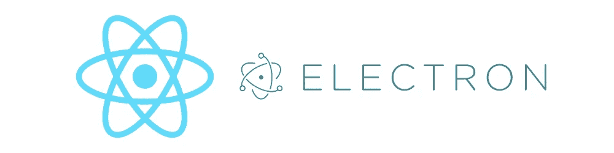
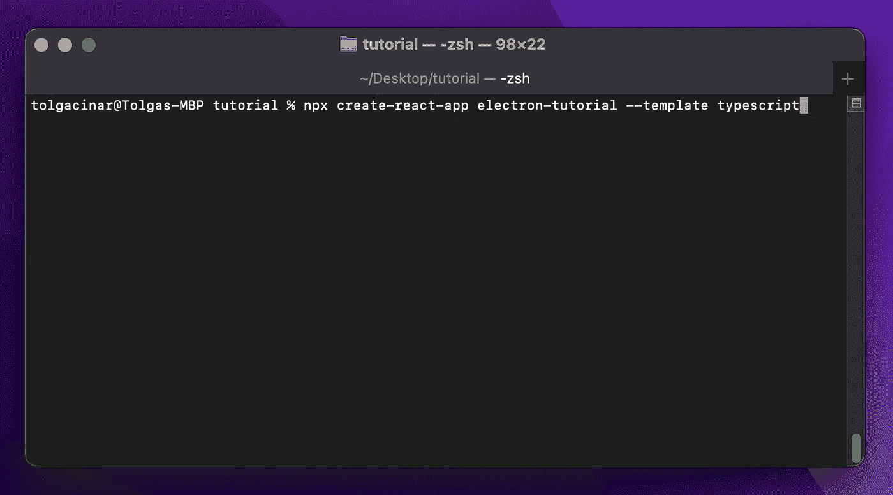
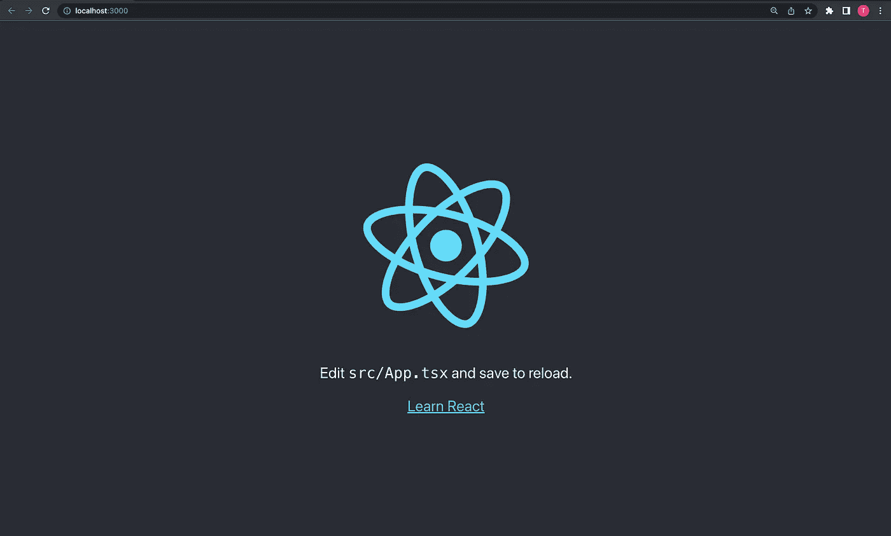
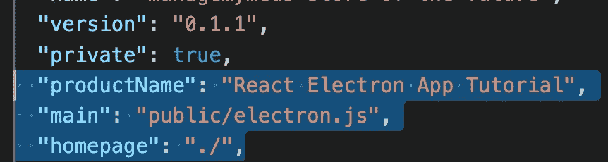
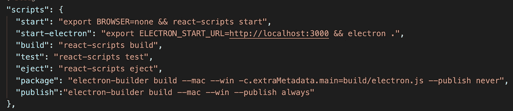
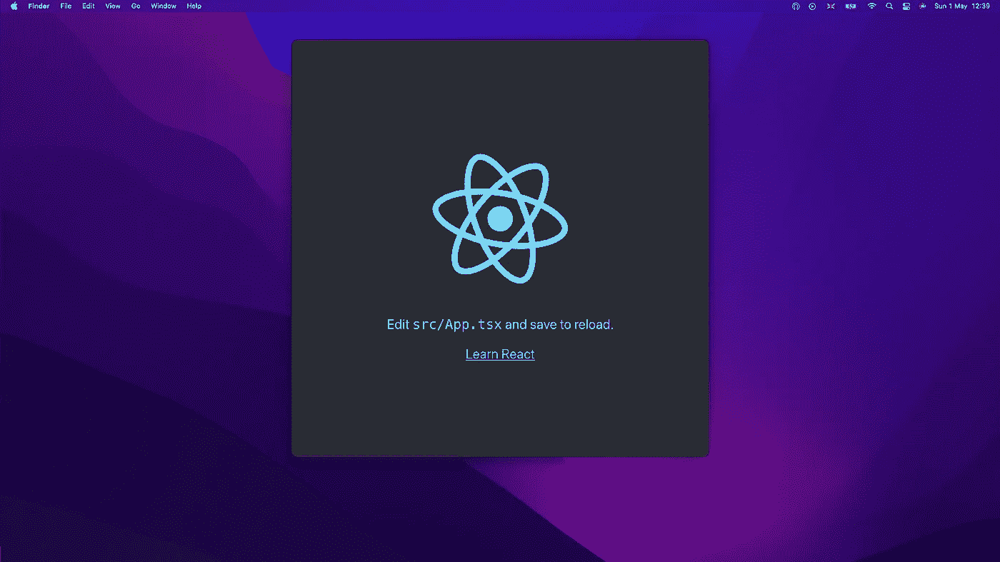
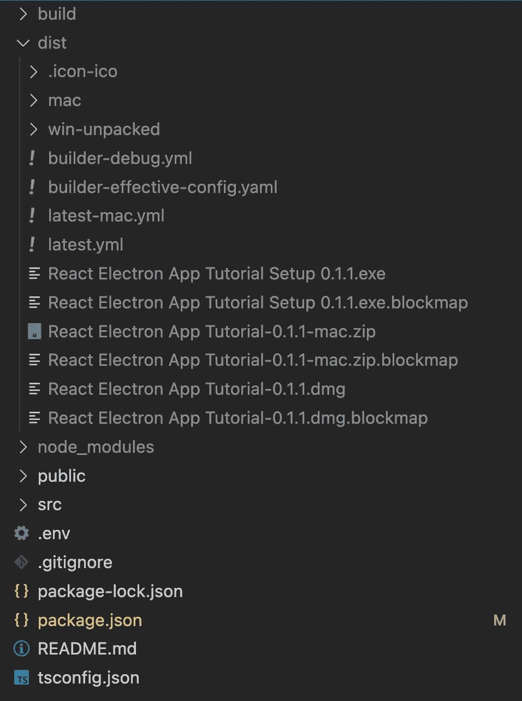
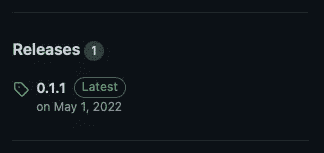

# 如何用 React 构建并发布一个电子 App？|教程

> 原文：<https://blog.devgenius.io/how-to-build-and-publish-an-electron-app-with-react-tutorial-971e1d9d27ce?source=collection_archive---------0----------------------->

大家好，

在这篇文章中，我将创建一个 React 应用程序，然后集成电子图书馆。我将解释基本的集成、构建和发布过程。



在开始教程之前，我想解释一下什么是电子，以及我为什么使用它。Electron 是一个 JS 框架，它帮助我们通过基于 Web 的技术创建本地应用程序。比如 HTML，Css，JS 等等。从[这里](https://www.electronjs.org)可以找到更多信息。

在这篇文章之前，我只用过两次。第一次体验就想利用跨平台优势。我开发了一个应用程序，并针对 Win/OSx/Linux 发布。我用了棱角分明的。网芯。该应用程序运行顺利。第二次，我和我的团队开发了一个 kiosk 应用程序。由于时间有限，我们想使用网络技术而不是桌面应用程序。使用现成的模板很容易开发，这对客户来说是一个很好的体验。

让我们开始开发吧！

我将在教程中使用一个新的 react 项目。如果你有一个当前的项目，你可以跳过这一部分。此外，我更喜欢使用 typescript 模板。如果您使用 javascript 模板，它不会影响集成过程。



**截图一:**创建一个 react app。

现在，项目已经准备好了。在开始集成 electronic 之前，可以通过以下命令检查 react 项目。

```
npm start
```



**截图二:**查看 React app。

检查 react 项目后，我将运行以下命令，将电子和电子构建器库包含到我的项目中。

```
npm install --save-dev electron
npm install --save-dev electron-builder
```

作为集成的第一步，我将在 **public** 文件夹中创建一个新的 js 文件。这个文件将是我的电子应用程序的入口点，文件名将是 **electron.js** 。我将在文件中有一些配置，并有可能添加更多。该文件基本上类似于下面的代码。

```
const { app, BrowserWindow } = require('electron');const path = require('path');const url = require('url');function createWindow() { const startUrl = process.env.ELECTRON_START_URL || url.format({ pathname: path.join(__dirname, '../index.html'), protocol: 'file:', slashes: true, }); const win = new BrowserWindow({ width: 800, height: 800, webPreferences: { nodeIntegration: true } }); win.loadURL(startUrl); app.on('window-all-closed', () => { if (process.platform !== 'darwin') { app.quit() } });} app.whenReady().then(createWindow);app.on('window-all-closed', () => { if (process.platform !== 'darwin') { app.quit() }}); app.on('activate', () => { if (BrowserWindow.getAllWindows().length === 0) { createWindow() }});
```

第二步，我将在 **package.json** 文件中定义一些配置变量，我将在本地运行/构建应用程序或创建包时使用它们。此外，Package.json 文件的版本号是应用程序的版本号。package.json 里已经有了，如果没有，加一个就好了。

主变量的值是新 JS 文件的路径，正如我前面提到的，它是电子应用程序的入口点。



**截图三:** Package.json

在这三个新字段之后，我将更新 package.json 文件中的脚本部分。首先，我将更新我的启动脚本，因为我不想在本地运行应用程序时打开浏览器窗口。然后我会添加以下三个字段。我将在运行电子应用程序、在本地创建包和在 GitHub 上发布包时使用这些字段。

```
**"start-electron":** "export ELECTRON_START_URL=http://localhost:3000 && electron ."**"package":** "electron-builder build --mac --win -c.extraMetadata.main=build/electron.js --publish never"**"publish":** "electron-builder build --mac --win --publish always"
```

对于 windows，电子启动命令应该如下所示。

```
**"start-electron":** "set ELECTRON_START_URL=http://localhost:3000 && electron ."
```

我的脚本部分的屏幕截图如下。



**截图 4:** 脚本部分。

作为最后一个配置步骤，我将把以下 json 部分添加到 package.json 文件中。当我想在 Github 上发布一个新的包时，我会使用这个部件。在 json 文件中，owner 和 repository 字段应该用您的存储库和帐户信息进行更新。如果您的存储库是私有的，那么您应该使用【T2 私有:真字段。如果您的存储库是公共的，那么您可以跳过这个字段。此外，您应该有一个存储库的访问令牌。您应该将它传递给 **Mac/publish/token** 字段和 **win/publish/token** 字段。

```
"build": { "mac": { "publish": { "provider": "github", "owner": "Github Owner", "repo": "Repository Name", "private": true, "token": "" } }, "win": { "publish": { "provider": "github", "owner": "Github Owner", "repo": "Repository Name", "private": true, "token": "" } }, "files": [ "build/**/*", "node_modules/**/*" ], "publish": { "provider": "github", "private": true, "owner": "Github Owner" }}
```

搞定了！让我们试着测试一下。

在本地运行；

```
npm start
npm run start-electron
```



**截图 5:** 本地 Electon App

创建本地包；

```
npm run build
npm run package
```

运行以上命令后，构建将出现在**项目的 root/dist** 文件夹中。一个样本截图如下。另外，给**添加一个 dist 文件夹也很好。gitignore** 文件。



**截图 6:** 本地构建。

在 Github 上发布一个包；

```
npm run build
npm run publish
```

运行上述命令后，该包将出现在存储库中的 Releases 部分。



**截图 7:** Github 发布

[这里的](https://github.com/cinarrtolga/ART-React-Electron-App)是教程的源代码。

我试图分享基本的反应电子集成。希望这能有所帮助。:)我打算写第二个关于这个主题的教程，分享如何自动更新，创建闪屏和一些基本的配置更改。

如有任何补充或错误信息，请联系我。