# 如何使用 Docker & GitHub 操作构建和运行 NodeJS 应用程序

> 原文：<https://blog.devgenius.io/how-to-build-and-run-a-nodejs-app-with-docker-github-actions-59eb264dfef5?source=collection_archive---------0----------------------->

使用 GitHub 操作将 NodeJS 应用程序映像部署到 Docker Hub

> **假设—** 在本教程演示中。我假设您对构建 NodeJs 应用程序有些熟悉，对 Docker 和 GitHub 操作有一些基本的基础知识。否则，首先检查以下内容:

*   [什么是 Docker？【简单英语】](https://blog.usejournal.com/what-is-docker-in-simple-english-a24e8136b90b)
*   [什么是 GitHub 动作以及如何使用它们](https://blog.bitsrc.io/what-are-github-actions-and-how-to-use-them-e89904201a41)

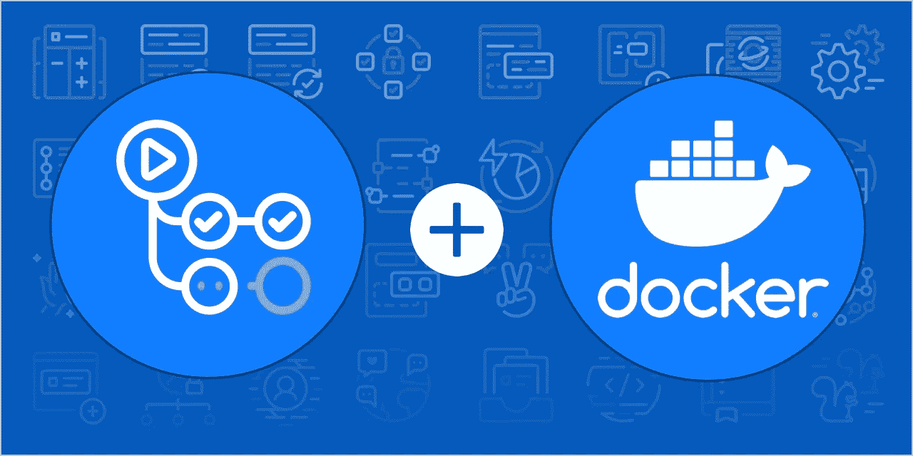

图片来源:[lab.github.com](https://lab.github.com/githubtraining/github-actions:-write-docker-container-actions)

在这个演示中，我们将创建一个使用 [Express](https://expressjs.com/) 框架的 nodeJS 演示应用程序。我们将构建 nodeJS 应用程序 docker 映像，并在 docker 容器中运行它以在本地测试它。

然后，我们将为 CI/CD 设置一个 GitHub 操作作业，该作业构建 docker 映像并将其推送到 [Docker Hub](https://hub.docker.com/) 供将来使用。

最后，我们将从 Docker Hub 存储库中提取存储的映像，并在本地构建另一个容器，以展示我们如何使用 Docker 重新创建和扩展应用程序。

# 1.构建 NodeJS 应用程序

> 如果您已经有了 nodejs 应用程序，请跳过这一步！！

让我们首先创建一个项目的目录，我将把我的命名为`node-demo`。我正在 GitHub 上创建一个 git repo，它将在我的计算机上克隆，如下所示:

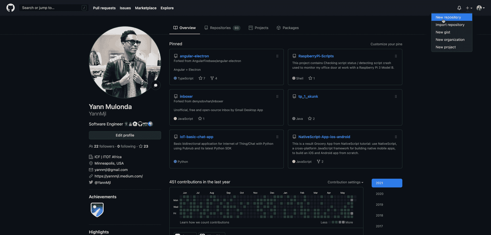

接下来，在 EDI 上打开 repo，让我们创建应用程序的文件，以及所有需要的其他文件夹。我们需要创建的主要内容是:

*   创建`app.js`文件，这将是应用程序的入口点。

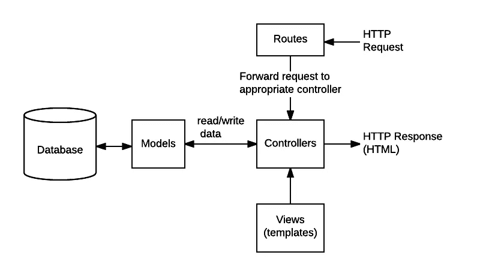

图片来源:[developer.mozilla.org](https://developer.mozilla.org/en-US/docs/Learn/Server-side/Express_Nodejs/routes)

*   "**路由**"将支持的请求(以及请求 URL 中编码的任何信息)转发给适当的控制器功能。
*   **控制器**的功能是从模型中获取请求的数据，创建一个显示数据的 HTML 页面，并返回给用户在浏览器中查看。
*   控制器用来呈现数据的页面或视图 (HTML 页面)——我们将把它用于主页。

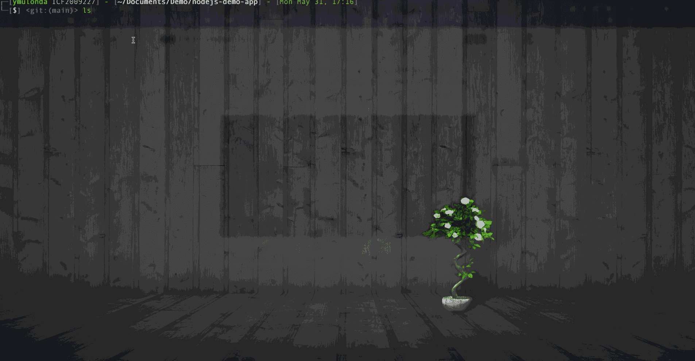

初始化项目—这将创建 package.json 文件:

```
npm init
```

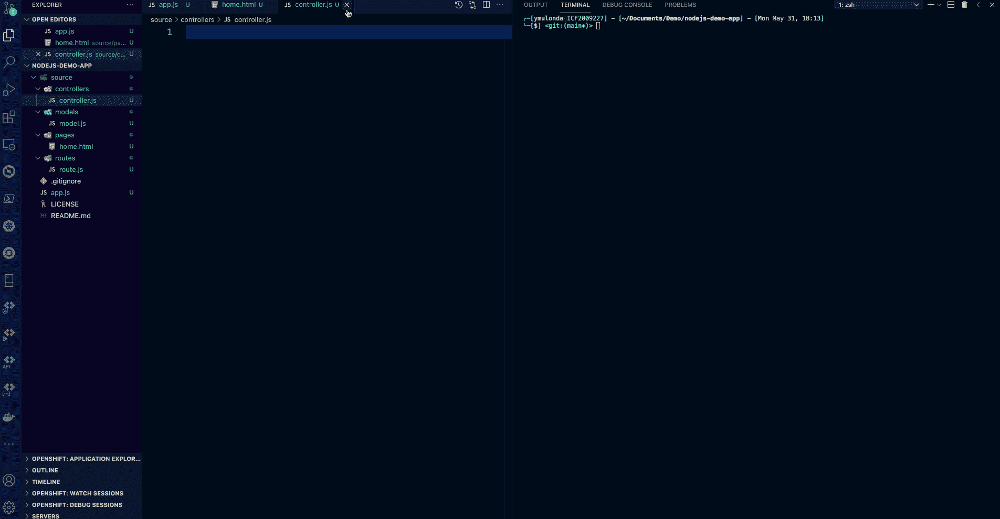

安装运行应用程序所需的所有依赖项—我们将使用 [Express](https://expressjs.com/) 框架— [babel-preset-env](https://babeljs.io/docs/en/babel-preset-env) 允许您使用最新的 JavaScript，而无需微观管理语法转换— [Jest](https://jestjs.io/) 是一个 JavaScript 测试框架，我们将使用它来测试 nodeJS 应用程序(添加了 _test_ folder 和`test.spec.js`文件)。

```
npm install express  
npm install babel-cli
npm install babel-preset
npm install babel-preset-env  
npm install jest
```

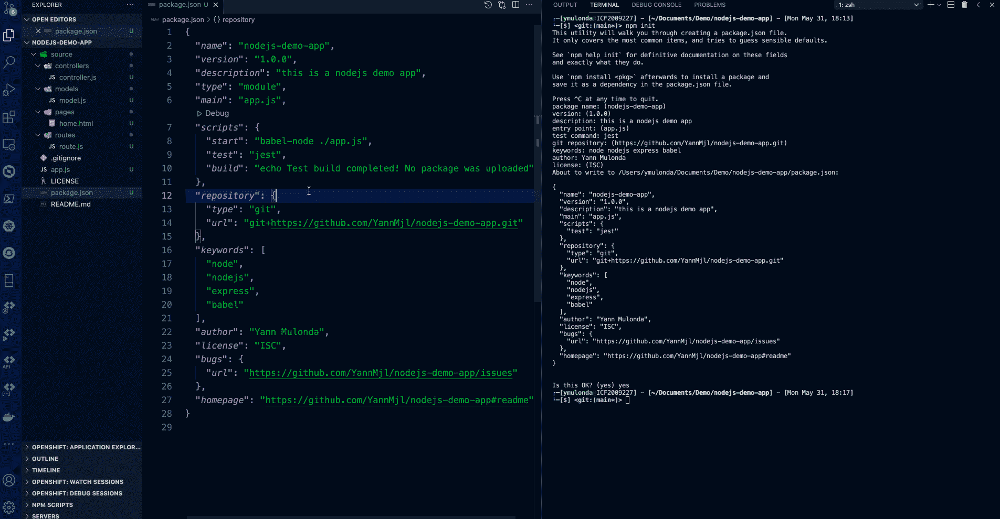

安装依赖项并添加测试文件

现在让我们在主项目目录中打开`app.js`来定义项目的配置。我的`app.js`长这样:

请阅读评论，以了解每个部分或行做什么！

让我们在`./source/pages/home.html`中为这个演示项目建立一个 HTML 主页。我的看起来像这样:

接下来，让我们在`./source/controllers/ontroller.js`中定义一些演示函数，这些函数将被传递到 route.js 文件中的每个路由或端点。我的`controller.js`长这样:

请阅读评论，以了解每个部分或行做什么！

这个阶段的下一步是在`./source/routes/route.js`中设置端点，这些是将被传递到 app.js 文件中的 nodeJS 应用程序的路由端点。我的`route.js`长这样:

请阅读评论，以了解每个部分或行做什么！

最后但同样重要的是，让我们在`./source/_test_/test.spec.js`中添加一个测试函数，这是当*“test”*:“jest”运行时将运行的函数。这是在我们的 package.json 中定义的。

现在，让我们通过运行以下命令来测试和启动 nodeJS 应用程序:

```
npm test  
npm start
```

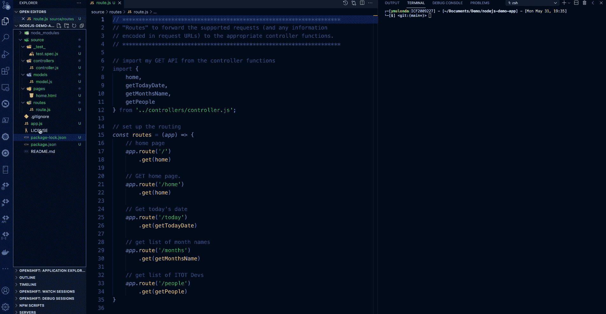

演示测试节点应用程序正在运行

# 2.设置 Docker-构建 NodeJS 应用程序 Docker 映像

现在我们有了 nodeJS 应用程序。让我们设置 docker 构建上下文来构建 docker 映像。

> **创建 dockerignore**

我们将从在项目的根目录中创建`.dockerignore`开始。 **dockerignore** 文件类似于 git 工具使用的 gitignore 文件。类似于。gitignore file，它允许您为文件和文件夹指定一种模式，在生成构建上下文时，这些文件和文件夹应该被 **Docker** 客户端**忽略**。我的`.dockerignore`文件是这样的:

> **创建 Dockerfile**

Dockerfile 就像一个蓝图，它定义了 docker 映像将如何构建，并指定当映像在 docker 容器中运行时，我们的应用程序中将包含什么。我的`Dockerfile`文件是这样的:

请阅读评论，以了解每个部分或行做什么！

> **构建应用程序 docker 映像**

现在让我们使用`[docker build](https://docs.docker.com/engine/reference/commandline/build/)`命令构建应用程序映像。带有`docker build`的`-t`旗帜将允许您为图像添加一个易于记忆的名称:

```
docker build . -t your_dockerhub_username/nodejs-demo
```

在上面的命令中，我将我的图像标记为`yanndocker/nodejs-demo`。确保你用自己的 Docker Hub 用户名替换了`your_dockerhub_username`,并随意命名你的应用映像。这很重要，因为我们将把图像推送到 Docker Hub。docker 映像构建完成后，检查您的映像:

```
docker images
```

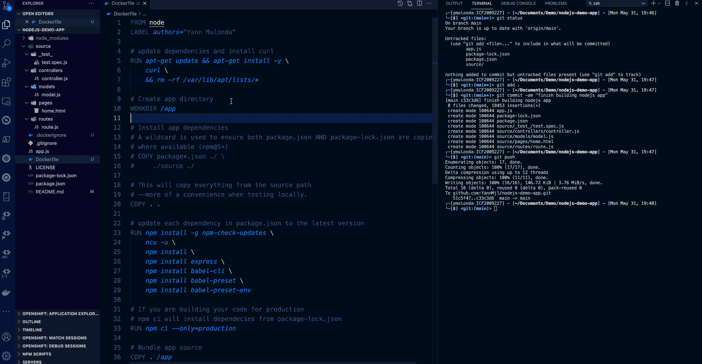

构建 docker 图像—屏幕截图

> **在容器中运行应用程序映像**

让我们用之前使用`[docker run](https://docs.docker.com/engine/reference/commandline/run/)`构建的 app docker 映像创建一个容器:

```
docker run --name nodejs-app-demo -it -d -p 3000:3000 yanndocker/nodejs-demo
```

*   `-p`:发布容器上的端口，并将其映射到主机上的端口。我使用主机上的端口`3000`,但是如果您有另一个进程在该端口上运行，可以随意修改。
*   `-d`:这在后台运行容器。
*   `-it`以交互模式启动容器，允许您与容器的`/bin/bash`交互。
*   `--name`:给容器起一个有意义的名字。

有关这些标志如何工作的更多信息，请查阅 [***docker 文档***](https://docs.docker.com/engine/reference/commandline/run/#:~:text=Attach%20to%20STDIN%2FSTDOUT%2FSTDERR,output%20and%20input%20as%20needed.&text=This%20pipes%20data%20into%20a,only%20to%20the%20container's%20STDIN%20.) 。一旦您的容器启动并运行，您可以使用`[docker ps](https://docs.docker.com/engine/reference/commandline/ps/)`来检查正在运行的容器列表:

```
docker ps
```

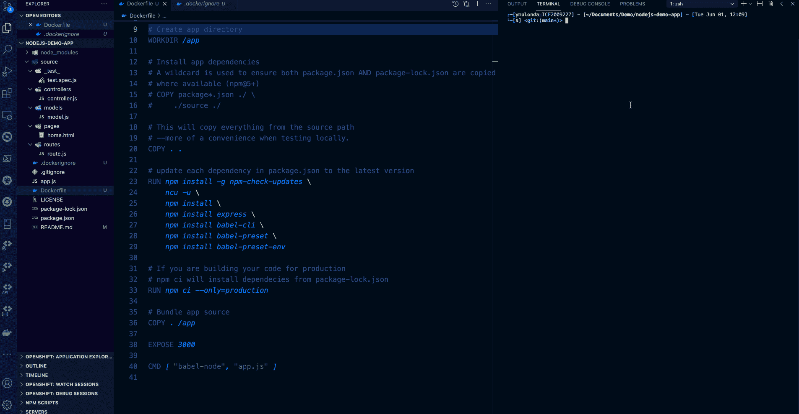

演示从 docker 容器运行 NodeJS docker 映像

# 3.GitHub 操作 CI/CD &将图像推送到 Docker Hub

我们已经构建了我们的演示应用 docker 映像，并通过在本地容器中运行它进行了测试。我们现在将 CI/CD 设置为我们的项目，并将映像推送到 Docker Hub。

> **设置 Github 动作 CI/CD**

*   首先提交您在 EDI 上本地进行的所有更改，并将它们推送到 GitHub 上的远程 git repo
*   接下来，转到 GitHub repo 并添加 CI/CD 操作，如下所示:

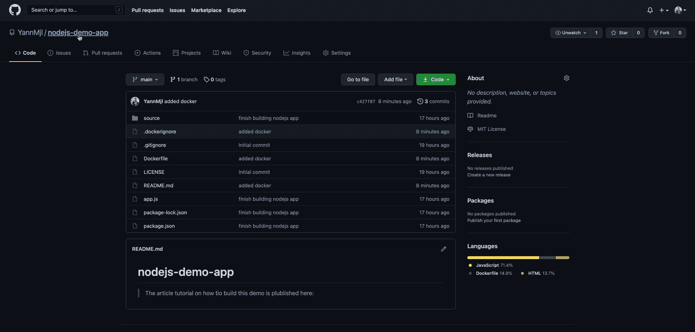

添加 GitHub 操作任务—屏幕截图

*   现在，在本地工作目录中提取新的更改，并使用以下内容修改 GitHub 操作作业:

> **导入注意——在将新定义的 Github 工作流推送到您的远程 git repo 之前，请确保您已经完成了以下工作:**

*   将你的 Docker 用户名和令牌作为秘密添加到你的 GitHub repo 中
*   在 Docker Hub 上创建您的项目，您将在这里推送图像。

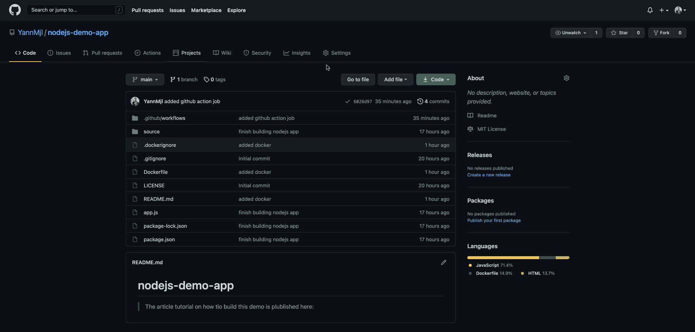

这些步骤很重要，也是必需的，否则您的 CI/CD 管道将会失败。

现在我们都准备好了！让我们继续提交更改，并将我们的代码推送到 GitHub repo 和 watch 以及 CI/CD pipeline 中进行操作:

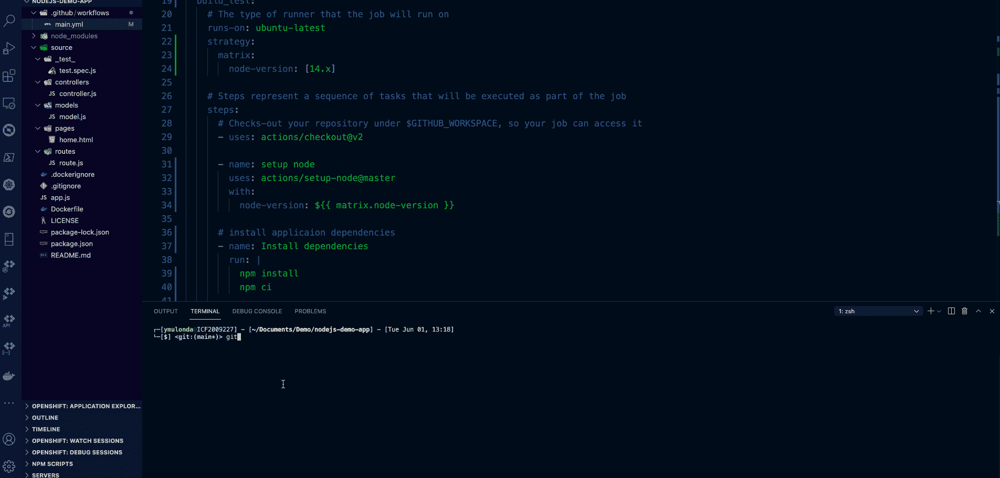

演示 Github Action CI/CD 的运行——截图

全部完成！！现在，您已经为 NodeJS 应用程序项目建立了一个完整的 CI/CD 管道，它将在每个代码提交和推送到 repo 时执行以下操作:

*   构建并测试 nodejs 应用程序
*   构建应用 docker 映像，通过在容器中运行它来测试它，并将该映像推送到您的 Docker Hub repo，以供将来使用、应用共享和部署到其他平台。

> 余灿在我的 [github repo](https://github.com/YannMjl/nodejs-demo-app) 上审查所有代码。如果你喜欢这个，你可能也会喜欢这个 tuto 的下一个:[如何部署到 kubernetes-heroku-using-docker](/how-to-deploy-to-kubernetes-heroku-using-docker-c2556a9584df)