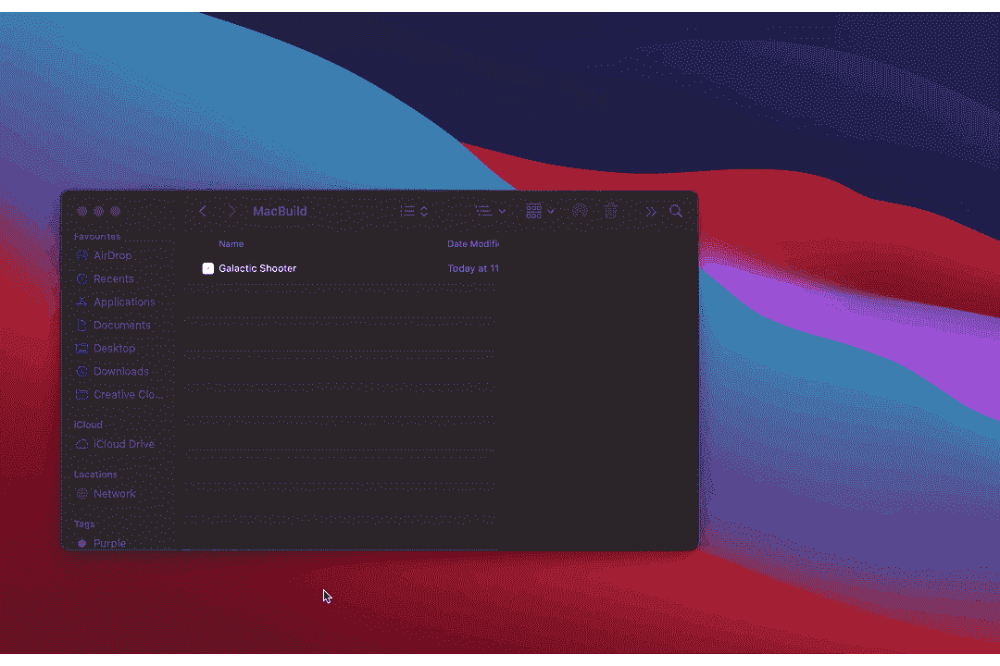
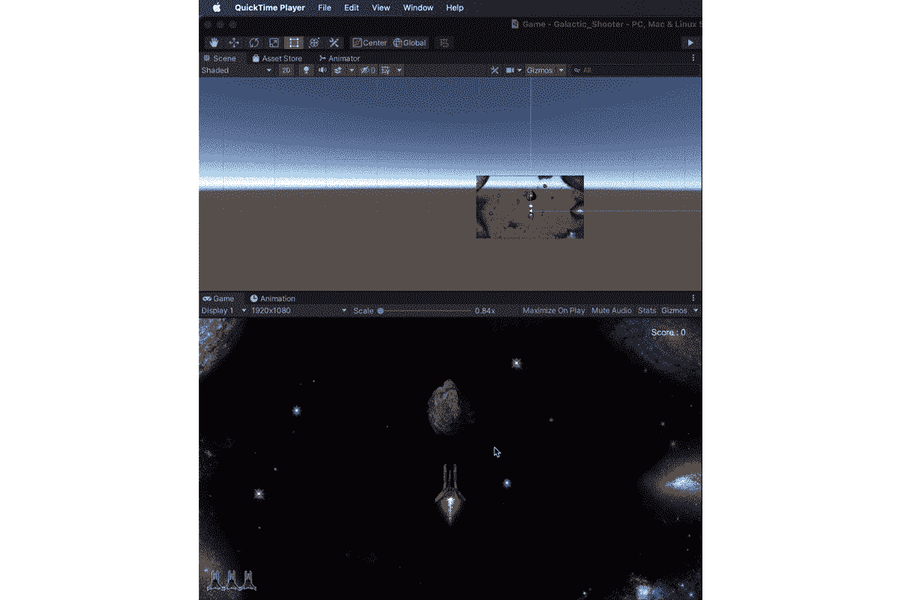
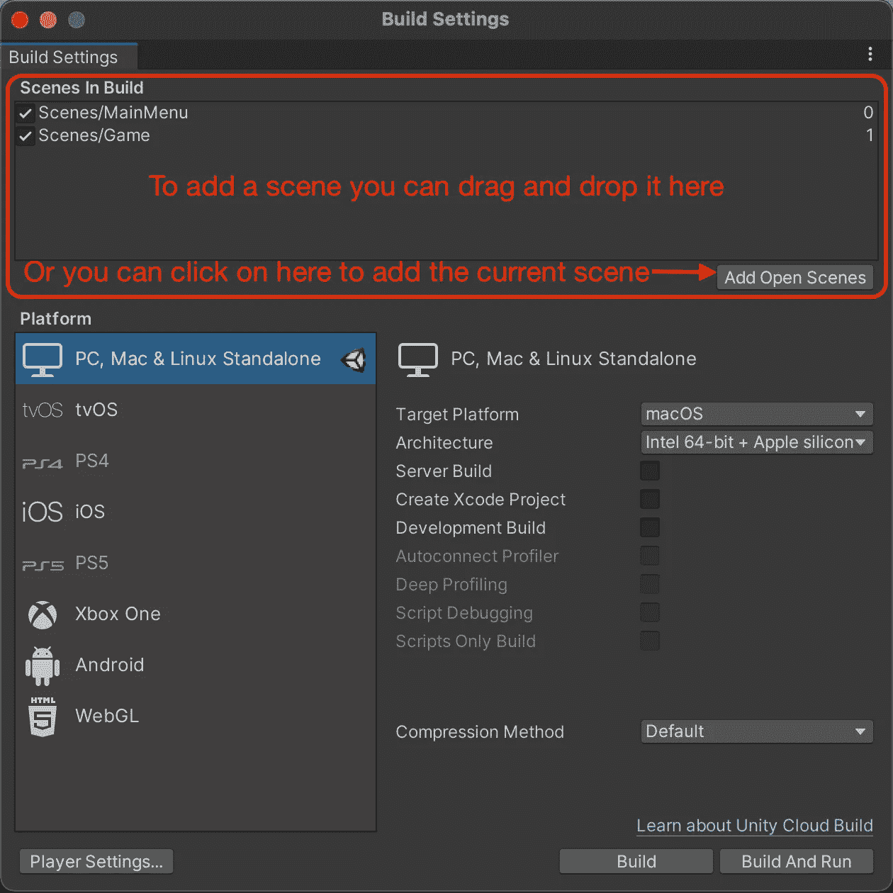
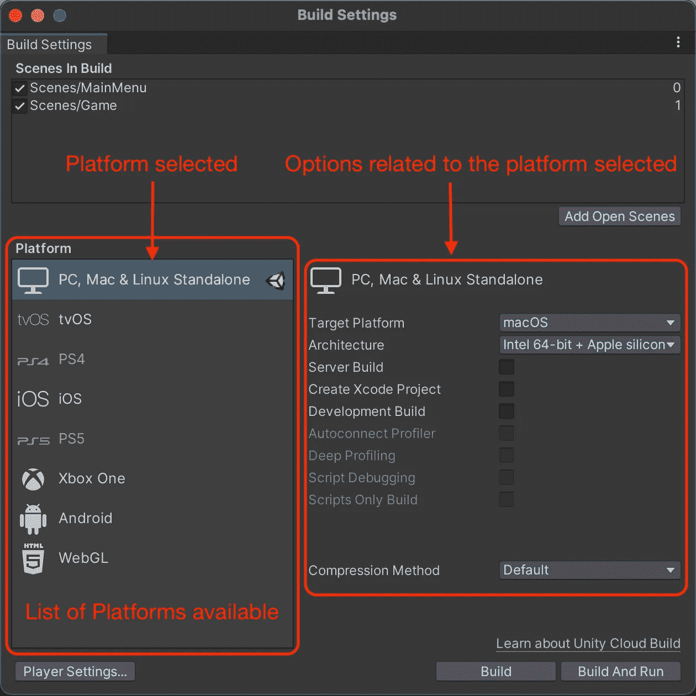
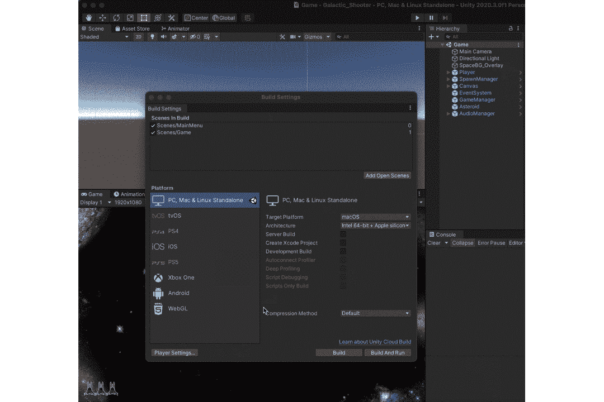
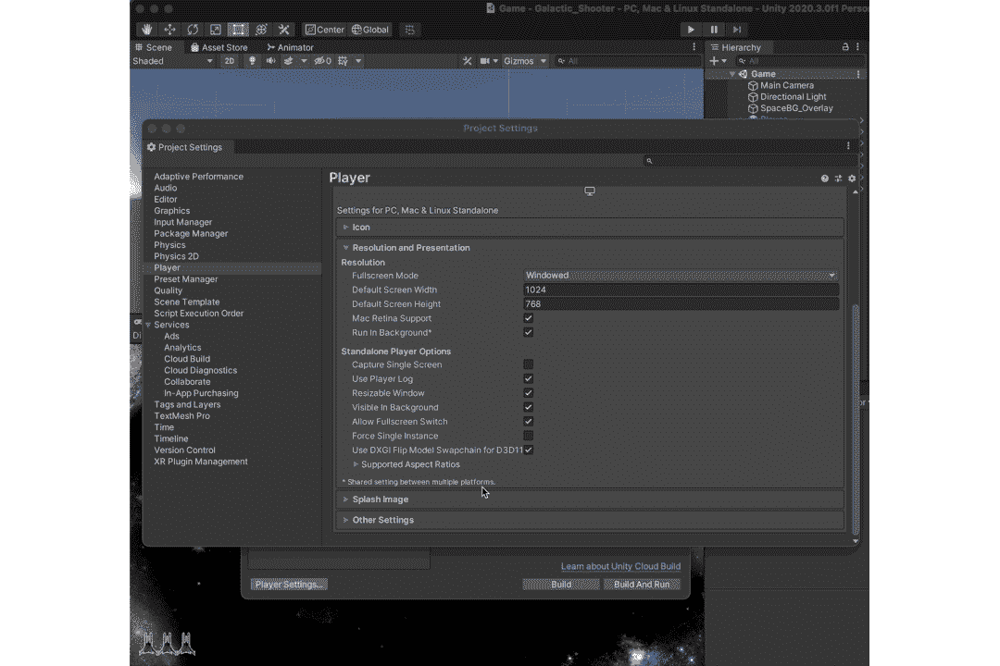

# 如何构建和测试你的 Unity 游戏

> 原文：<https://blog.devgenius.io/how-to-build-and-test-your-unity-game-3f0501b46e0e?source=collection_archive---------9----------------------->

通过上一篇文章，我们已经添加了制作游戏所需的所有基本元素。但我们还没有看到游戏如何作为一个独立的应用程序运行。

目标:有一个我们银河射击游戏的工作版本。

Unity 让构建游戏应用程序的过程变得非常简单。这可以通过简单地执行以下操作来实现，

***文件→构建设置→选择你想要构建游戏的平台→点击构建并运行***

在**构建设置**中，我们在构建面板中有一个**场景，它包含了所有我们想要的场景。确保在构建你的游戏之前检查这一点，以确保在构建中没有**场景**丢失。**

还有一个**平台**面板，其中包含了众多构建和运行我们游戏的平台。

我将为 MacOs 构建，但你可以点击目标平台将其切换到 Windows 或任何其他平台。

之后，我们所要做的就是点击**构建并运行。**但在继续之前，让我们更改一些设置，让用户的生活变得更好。

您可以在这里设置产品名称、公司名称等。但是我们来这里的原因是要从**分辨率**选项卡中改变**全屏模式**。我们将其更改为**窗口，**原因是我们还没有做出一个退出游戏的行为，在选择后关闭游戏应用程序。此外，选择**窗口**选项可以让你设置游戏的默认分辨率。我还将打开**可调整大小的窗口**，以防用户希望在运行时改变分辨率。有了这个，游戏应该可以开始构建了。

这就是让您的游戏运行以进行游戏或测试所需的全部内容。

感谢您的阅读。更多即将推出！！！