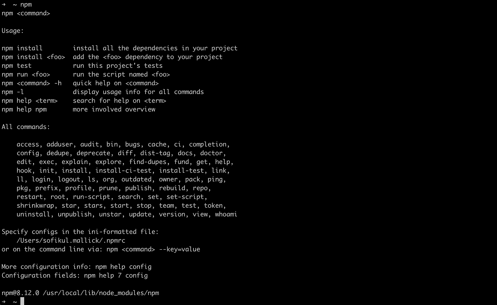
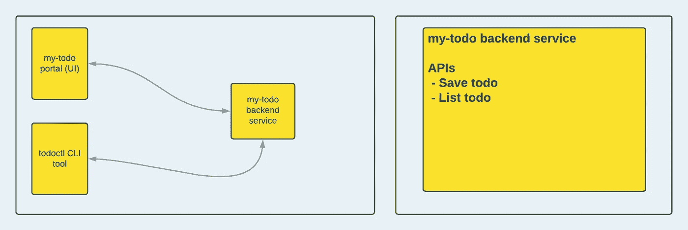
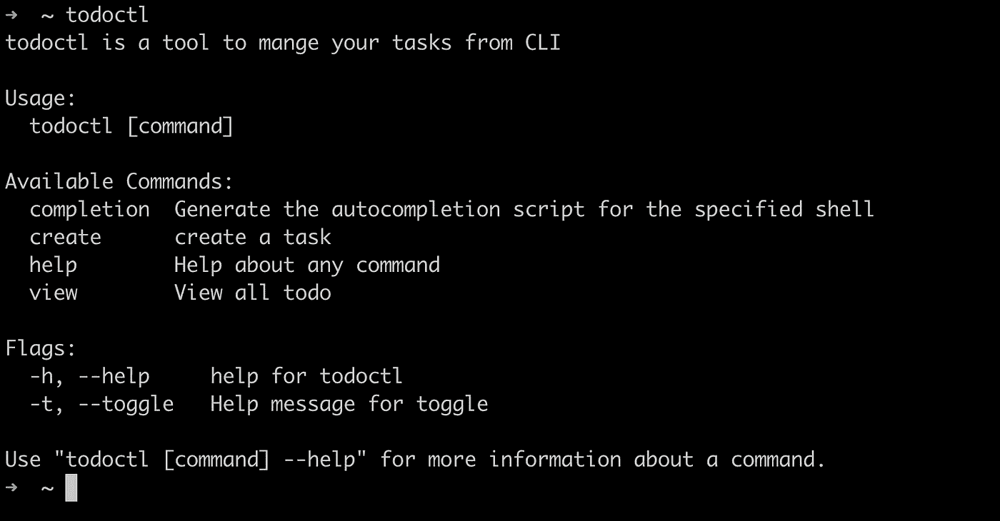
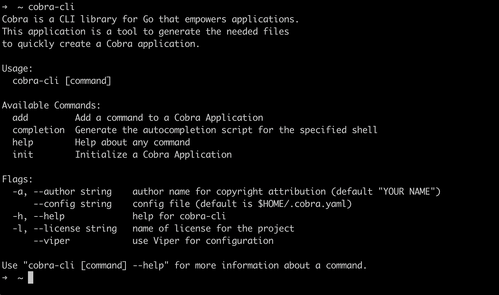
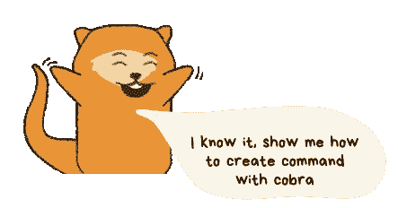
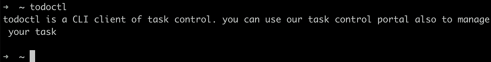
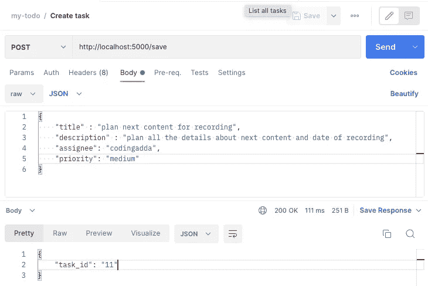
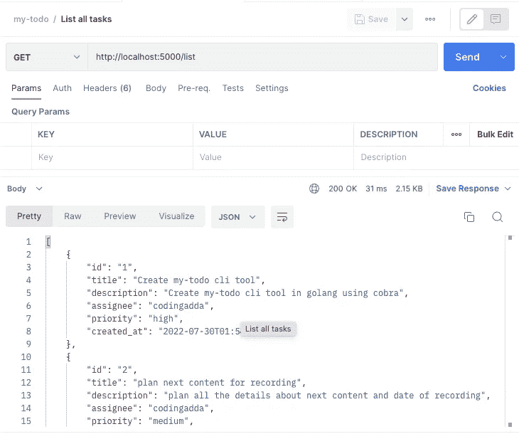

# 如何用 Go 和 Cobra 构建 CLI 工具

> 原文：<https://blog.devgenius.io/how-to-build-cli-tool-with-go-and-cobra-31d5761937ed?source=collection_archive---------1----------------------->


照片由 [Pankaj Patel](https://unsplash.com/@pankajpatel?utm_source=medium&utm_medium=referral) 在 [Unsplash](https://unsplash.com?utm_source=medium&utm_medium=referral) 上拍摄

这篇博客的目的是为了帮助那些对围棋有初步了解但之前没有使用过 CLI 应用程序的人。因此，不再拖延，让我们建立我们的第一个 CLI 工具。

在我们深入项目之前，让我们快速地看一下命令行。

## 什么是命令行界面

命令行界面(CLI)是执行程序的基于文本的界面。CLI 接受界面中的文本输入(即命令),并以同样的方式做出响应。今天，大多数软件除了图形用户界面(GUI)之外，还提供了 CLI。CLIs 的典型用户是开发人员、项目支持成员和系统管理员。在 Mac 或 Linux 中，它被称为终端。



在上面的 npm(节点程序包管理器)CLI 示例中，它提供了安装、测试和运行功能(即子命令)。

# 我们在建造什么？



在这个项目中，我们有三个组成部分-

*   my-todo 后端:已经在 nodeJs 中开发。
*   我的待办事项门户(UI):已经用 Angular 编写了。
*   ***todoctl CLI:我们将在这个项目中使用 Go Cobra 包来开发它。***

我们的目标是开发一个应用程序来管理来自 CLI 的任务，而不需要进入面向技术用户(如开发人员)的门户。todoctl 将能够做以下事情

*   创建待办事项:开发自定义命令“待办事项创建”
*   查看所有待办事项:开发一个自定义命令“待办事项视图”

## 构建我们的应用程序所需的包

我们将使用“cobra-cli”包来构建我们的应用程序

[](https://github.com/spf13/cobra-cli) [## GitHub - spf13/cobra-cli:用于生成应用程序和命令的 Cobra CLI 工具

### Cobra 提供了自己的程序，可以创建您的应用程序并添加您想要的任何命令。这是最简单的方法…

github.com](https://github.com/spf13/cobra-cli) 

# 让我们建立我们的工具


如前所述，todoctl 将提供创建、查看。



首先，用下面的命令安装 cobra 生成器

`$ go install github.com/spf13/cobra-cli@latest`

Go 会自动将它安装到您的`$GOPATH/bin`目录中，这个目录应该在您的 PATH 中。一旦安装完毕，你应该可以使用`cobra-cli`命令。通过在命令行键入`cobra-cli`进行确认。



## 初始化模块



*   创建新目录
*   `cd`进入目录
*   运行`go mod init <MOD_NAME>`

例如

```
$ cd $HOME/code 
$ mkdir todoctl
$ cd todoctl
$ go mod init github.com/<user_name>/todoctl
```

## 初始化 Cobra CLI 应用程序

在 go 模块中运行`cobra-cli init`。这将创建一个新的准系统项目供您编辑。

您应该能够立即运行您的新应用程序。用`go run main.go`试试。

例如

```
$ cd $HOME/code/todoctl
$ cobra-cli init
$ go run main.go
```

Cobra 生成如下所示的文件夹结构

```
$ todoctl/
   cmd/
     root.go
   main.go
   go.mod
   go.sum
```

main.go 是入口点。在 main.go 内部，它调用 cmd/root.go 的 execute 函数。

cmd/root.go 是 cobra CLI 工具的基本命令。CLI 中的所有其他命令都将是 rootCmd 的子命令。您可以根据需要修改 cmd/root.go 文件。

## 命令结构必须知道属性

有几个与 cobra 命令结构相关的属性是我们必须知道的

```
Use: Command name, we will use this name to execute the commandShort: Short description of our commandLong: Long description of our commandRun: This function executes when we run any command. We can omit this if we don't have any action to perform. In our case, when we run todoctl root command we don't have any action to perform.
```

此外，我们在每个命令文件(例如 root.go)中都有 init 函数来定义我们所有的标志和配置设置。

## 修改根命令

我们将在 root.go 文件中修改上述属性，以更改短描述和长描述。

## 构建并运行命令

转到项目目录，通过运行命令来构建它

```
$ go install
```

该命令将在
$GOPATH/bin 文件夹中生成项目的可执行文件。现在我们可以在终端中运行“todoctl”。



*在对源代码进行任何修改后，您需要重新构建您的项目。*

> 因为它保存在 bin 文件夹中，所以您不必为此设置环境变量。如果出现任何类似“找不到命令”的错误，那么您的执行路径就没有设置。您可以通过执行以下操作来解决这个问题
> 
> 打开终端 rc 文件(对于 zsh 终端 its。zshrc)并在下面添加行
> 
> *导出 GOBIN=$GOPATH/bin
> 导出路径=$PATH:$GOBIN*

## 后端 API 的快速信息

我们的`my-todos`后端节点服务有以下 API，这些 API 将从创建和查看命令中调用。



## 开发创建子命令

现在，我们将开发创建任务命令。我们可以通过下面的命令在 cobra 中添加一个子命令

```
$ cobra-cli add <sub_command_name>
e.g 
$ cobra-cli add create
```

这将在 cmd 文件夹中创建一个 create.go 文件。

要创建一个任务，我们需要从用户那里获取一些输入，如任务标题、描述、任务负责人、截止日期等。所有这些输入都可以通过 cobra 中的标志来获取。

更多信息，有两种类型的标志

*   **持久标志:**标志可以是持久的，这意味着该标志将可用于它所分配到的命令以及该命令下的每个命令。对于全局标志，指定一个标志作为根上的永久标志。
*   **本地标志:**一个标志也可以被本地分配，它只适用于那个特定的命令。

我们将在这里使用当地的旗帜。init()函数中添加了所有必要的标志。在 Run()函数中，我们通过 API 执行了与后端(my-todos)服务对话的操作，以将任务保存在 DB 中。

修改 create.go 文件后，请在执行 create 命令前构建应用程序。

```
$ cd $HOME/code/todoctl
$ go install
```

在执行下面的创建命令时，应该会显示输出

```
$ todoctl create --help
This command will create a taskUsage:
  todoctl create [flags]Flags:
  -d, --description string   specify task description
  -h, --help                 help for create
  -t, --title string         specify task title / heading
```

现在让我们创建一个任务

```
$ todoctl create — title “completed todoctl tool” — description “we have finished developing our todoctl cli tool” Output :Creating task {Title:completed todoctl tool Description:we have finished developing our todoctl cli tool}
Task created with ID: 12
```

*万岁！你执行了你的第一个命令。恭喜你！！*

## 开发视图命令

是时候开发 view 命令来显示终端中的所有任务了。

```
$ cobra-cli add viewThis will create a file view.go in cmd folder.
```

我们将调用后端“列表”api 从数据库获取所有的任务。

让我们重建我们的应用程序

```
$ cd $HOME/code/todoctl
go install
```

在执行 view 命令时，它将列出所有任务

```
$ todoctl view
{Title:Create my-todo cli tool Description:Create my-todo cli tool in go using cobra}
{Title:plan next content for recording Description:plan all the details about next content and date of recording}
{Title:completed todoctl tool Description:we have finished developing our todoctl cli tool}
```

## 使用毒蛇和眼镜蛇

Viper 广泛用于以非常灵活的方式管理应用程序的配置。我们可以使用 viper 来配置 cobra flag 的值。让我们考虑下面的场景。

我们在根命令中有一个标志“server_url”。它的值将按以下顺序设置

*   如果用户在命令中提供值，那么我们将首先考虑它。
*   如果用户没有在命令中提供，那么我们将从配置文件中读取。
*   如果两者(在命令和配置文件中)都缺失，那么我们将考虑 flag 的默认值。

我们修改了 init()来添加标志和初始化 viper。我们还添加了 Run()来根据我们的优先级设置标志值。

让我们重新构建我们的应用程序并运行 todoctl 命令

```
$ cd $HOME/code/todoctl
go install$ todoctl -u [http://localhost:4000](http://localhost:4000)
server url is: [http://localhost:4000](http://localhost:4000)
[Explanation : Flag value is provided in command using -u]$ todoctl
server url is: [http://localhost:3000](http://localhost:3000) 
[Explanation : server_url from app.env file is getting printed as its not provided in command]$ todoctl
server url is: [http://localhost:5000](http://localhost:3000)
[Explanation : Flag's default value will be printed if we don't provide in command and server_url in app.env file]
```


## 后续步骤

🎉祝贺您，我们已经构建了第一个 CLI 工具。我希望这能让您了解如何在 Go 中创建一个简单的命令行应用程序。

🔥你可以得到源代码👇并添加更多功能。

## 源代码

*   我的待办事项后端服务:[https://github.com/Sofiukl/my-todos/tree/master](https://github.com/Sofiukl/my-todos/tree/master)
*   todoctl go CLI 工具:【https://github.com/Sofiukl/todoctl/tree/master 

## youtube 上的完整对话

试着阅读，你可以在 youtube 上看完整的讲座

## 参考

*   眼镜蛇—【https://github.com/spf13/cobra-cli 
*   毒蛇—[https://github.com/spf13/viper](https://github.com/spf13/viper)
*   去—[https://go.dev/](https://go.dev/)
*   其他 CLI 软件包—[https://github.com/thatisuday/commando](https://github.com/thatisuday/commando)