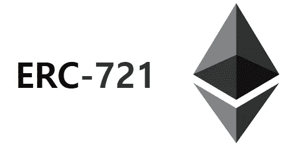
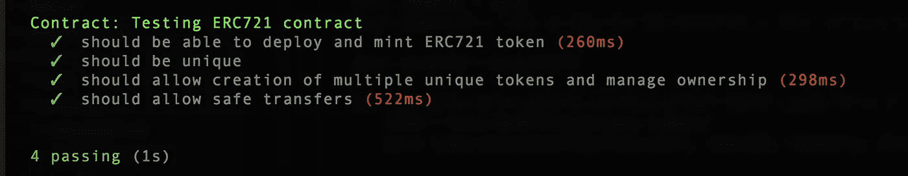

# 如何从零开始构建 ERC-721 令牌

> 原文：<https://blog.devgenius.io/how-to-build-erc-721-token-from-scratch-93dd805e3269?source=collection_archive---------4----------------------->

***简称为不可替代令牌(NFTs)。我们会为自己开发一个。***

自创建以来，不可替代令牌的许多应用吸引了众多用户、开发人员和投资者的注意。因此，它成为一个生态系统，在那里它有许多应用。现在，我们将概述如何在以太坊上开发自己的 ERC-721 令牌。

## 什么是 NFT？

> NFT 是不可分割的唯一令牌。它们被用来代表证券和资产的所有权。自从它被引入以来，艺术、音乐和许多其他领域都受益于证券的令牌化。

## NFTs 为什么会流行？

NFTs 流行的主要原因是它允许网络上的一切都被安全化。这导致证券为所有实体所知。尤其是当所有权受到威胁时，区块链上的记录可以与这些令牌一起使用来定义所有者。

## 我们如何建造一个？

创建这些令牌的第一步是创建一个完整的以太坊环境和一个可用于在以太坊上构建应用程序的编码编辑器。

第二步包括思考如何生成软件，以及经济学如何运作。这些问题包括如何创建生态系统，如何维护生态系统，以及如何产生价值。更重要的是，个人的所有权和权力在整个系统中是如何定义的。回答了这些问题后，设计自己的令牌就变得容易多了。

最后一步将包括学习如何在各种平台上创建自己的教学视频和 GitHub 创建的开源代码，以理解逻辑和算法。在从头开始学习构建时，坚持使用开源代码和各种教学视频会有助于你学得更快。

在您了解了如何生成这些令牌后，您可以创建自己的网络、寻找新的开发工作，或者两者兼而有之。依靠个人技能在这个领域创造一些东西，人们会有某种好处。然而，这些代币有着广阔的前景，越来越多的机构正试图让他们的证券代币化。

*你曾经建造过你自己的 ERC-721 令牌吗？如果你有，请在下面的评论区分享你的经历。*