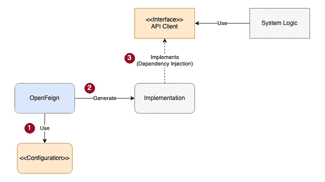

# 如何使用 Reactive Feign 构建高性能 API 客户端

> 原文：<https://blog.devgenius.io/how-to-build-high-performance-api-client-using-reactive-feign-bae4b5053d12?source=collection_archive---------1----------------------->

## 反应式伪装的权威指南——客户端选项、日志、拦截器、响应状态、重试策略和单元测试


[罗汉](https://unsplash.com/@rohankrishnann?utm_source=medium&utm_medium=referral)在 [Unsplash](https://unsplash.com?utm_source=medium&utm_medium=referral) 上拍照

Spring Webflux 是一个面向未来的技术堆栈，因为它有效地利用了计算资源并实现了非阻塞 I/O。我在上一篇文章中的[测试结果证明，在繁重的工作负载下，Spring Webflux 大大优于 Spring Servlet(阻塞技术)。如果你想知道如何构建 Spring Webflux 应用程序，你会发现这篇文章很有用。](/is-spring-webflux-a-myth-4526c2f92413)

然而，仅仅因为使用 Spring Webflux 并不意味着如果 I/O 进程(如访问数据库和与系统中的外部 API 集成)仍然基于阻塞技术，性能增益就有保证。例如，系统图说明了与第三方 API 服务的典型 API 集成。API 客户机向端点发送一个请求，并保持线程直到收到响应。结果，整个过程被阻塞，直到收到响应。


毫无疑问，在端到端流程中应用无阻塞至关重要，这样才能享受到反应式技术的好处。

## 创建 API 客户端的快速方法

OpenFeign 是一个流行的 API 客户端开发框架。您需要的是定义 API 客户端的接口，然后框架会神奇地为您处理剩下的事情。

例如，这是用于外币汇率检索和预订的 API 客户端。只有接口定义。

在幕后，框架基于配置生成实现，并将它们注入到您的业务逻辑中。OpenFeign 的使用极大地提高了生产率，实现了快速开发。



## 假装被动的客户

尽管 OpenFeign 的使用很普遍，但在撰写本文时，OpenFeign 项目和 Spring Cloud OpenFeign 都不支持响应式客户端。同时，Spring 框架团队推荐了一个开源项目[Fei-reactive](https://github.com/Playtika/feign-reactive)，直到 Fei-reactive 客户端作为 Spring 核心项目的一部分得到支持。在本文中，我将向您展示如何使用 feign reactive 框架创建 API 客户端。

# 属国

将这个 starter 添加到 maven 依赖项中，它提供了一种方便的方法来包含 feign reactive 所需的所有依赖项。

```
***<*dependency*>
  <*groupId*>***com.playtika.reactivefeign***</*groupId*>
  <*artifactId*>***feign-reactor-spring-cloud-starter***</*artifactId*>
  <*version*>***3.1.5***</*version*>
  <*type*>***pom***</*type*>
</*dependency*>***
```

# API 客户端定义

feign reactive 的接口定义和注释的使用类似于 OpenFeign。熟悉 OpenFeign 的开发者可以很快学会 feign reactive。

外汇 API 客户端的反应式版本与基于 OpenFeign 的版本完全相同，除了第一个注释是`@ReactiveFeignClient`而不是`@FeignClient`。

API 客户端的系统行为可以通过在配置类中定义相关的 beans 来定制，我们将在下面的小节中详细介绍配置。

# Spring WebClient 选项

Reactive Feign 附带了基于 Spring Reactive WebClient 的默认实现。该框架允许我们调整 WebClient 的超时配置。下面的示例配置指定了 2 秒超时

事实上，Reactive Feign 支持使用 application.yml 进行配置。application.yml 下面的 YAML 也有同样的作用。但是，为了便于维护，强烈建议在 application.yml 和配置类之间收集拆分配置，将所有设置集中在一个配置类中。

# 记录

要记录 API 请求和响应，请使用 configuration 类中的默认 reactive logger 为 Reactive Logger 侦听器定义一个 bean。

将 API 客户端的日志记录级别设置为 TRACE

然后，将为每个请求记录请求和响应，包括头和主体

# 使用拦截器添加 API 密钥头

Feign Reactive 允许对 API 请求进行某些定制，比如插入公共请求字段。典型的例子是为 API 键添加一个头。虽然给每个方法添加头很繁琐，但是我们可以使用拦截器使它对 API 调用透明。

这个 API 客户端在每个方法中都有一个 API 键头

不是在每个客户机方法中添加头，而是在配置类中定义拦截器 bean，它自动为所有请求插入 X-API-KEY 头。

# 自定义特定响应状态的行为

每当遇到否定响应时，无论是客户端拒绝、服务器错误还是 404，feign 客户端都会抛出一个 feign 异常。

您可以改变特定响应状态的行为。这个例子配置了`ReactiveStatusHandler`,如果遇到服务器错误 500，客户端抛出`RetryableException`,客户端将重试操作。

# 重试策略

在出现超时等错误的情况下，我们可以指示假装的客户端自动重试请求。下面的示例代码将最大重试次数设置为 3，每次重试间隔为 2 秒。

# 虚拟客户端的单元测试

可以使用 WireMock 作为存根 API 服务器来测试 Feign client。下面的示例代码将 WireMock 服务器作为静态类对象启动，然后将 WireMock 服务器的 url 注入到系统属性中。随着系统属性的更新，feign 客户机连接到存根 API 服务器。

单元测试很简单，它定义存根 API，调用 feign 客户端，然后进行结果验证。

[如果你想了解更多关于 WireMock 的信息，这篇文章](/how-to-test-spring-boot-microservice-independently-using-wiremock-d269d20fa626)是一个很好的参考

# 验证请求重试次数

要模拟故障并验证 feign 客户端的重试能力有点棘手。幸运的是，WireMock 支持带有预定义延迟的响应，用于模拟超时和有状态行为。

为第一次尝试和第二次尝试创建一个固定延迟为 30 秒的慢速 API 存根。然后，设置存根以快速响应第三次尝试。假设虚拟客户端遇到超时，第二次重试应该正在进行。

下面的示例代码展示了如何创建具有有状态行为的 WireMock 存根

# 结论

如果 I/O 进程仍然基于阻塞技术，Spring Webflux 对性能提升没有贡献。Reactive Feign 是实现非阻塞 API 客户端的最佳选择。它是 OpenFeign 的一个反应式版本，支持创建 API 客户端，而无需编写实现代码。只需定义接口和配置，就可以毫不费力地开发 API 客户端。

参考这个 [GitHub 项目](https://github.com/gavinklfong/spring-investment-platform)获取样例 Forex API 客户端的源代码