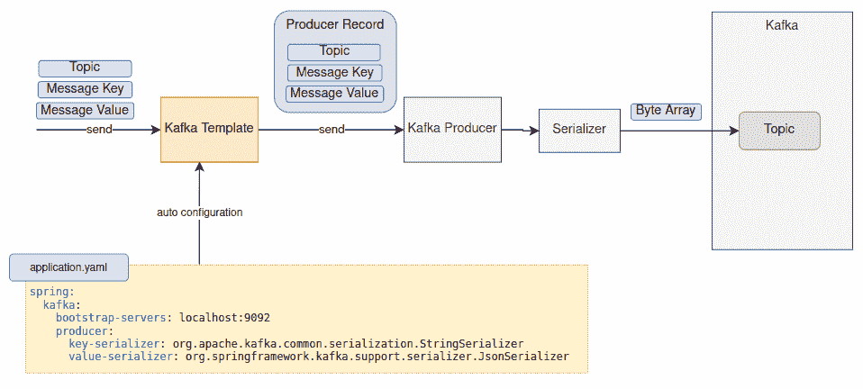

# 如何构建卡夫卡 Spring Boot 消息驱动服务

> 原文：<https://blog.devgenius.io/how-to-build-kafka-spring-boot-message-driven-service-e85921249685?source=collection_archive---------1----------------------->

## 让我们准备好这一广受欢迎的编程技能


[鹦哥](https://unsplash.com/es/@yingzge?utm_source=unsplash&utm_medium=referral&utm_content=creditCopyText)在 [Unsplash](https://unsplash.com/photos/D6AYkHWLR9o?utm_source=unsplash&utm_medium=referral&utm_content=creditCopyText) 上拍照

消息代理的使用非常广泛，已经成为大多数企业系统的关键基础设施组件之一。特别是，它为金融系统处理大量货币交易提供了动力。

近年来，由于 Kafka 的高吞吐量和对数据流的支持，许多企业都在采用它。有趣的是，卡夫卡的知识和经验一直是一项抢手的技能，也是软件工程师招聘广告中最热门的关键词之一。

为了帮助任何有兴趣学习 Kafka 知识的人，我将分享 Kafka 的基本知识，以及如何构建一个与其集成的 Java Spring Boot 服务。

## 什么是消息代理？

Message broker 通常像邮局一样连接各种系统，并将消息从源系统路由到目标系统。这种架构不仅使系统解耦，还保证了消息的传递。

下图说明了 RabbitMQ(一个流行的开源消息代理)的消息流，消息生产者将消息发送到 RabbitMQ 上的一个交换，交换根据路由规则将消息传输到指定的队列，然后消费者从队列中提取消息。

显然，这样的设计允许以异步方式处理消息。即使消费者不在，生产者仍然可以发送消息。


RabbitMQ 概述

## 《果壳中的卡夫卡》

传统的消息代理将消息保存在队列中，一旦消息被消费和确认就删除消息，而 Kafka 将消息流保存在主题中，并且消息在消费时不会被删除。相反，维护一个偏移量来跟踪要使用的最新消息。

这张图向你展示了卡夫卡的高层信息流。生产者向主题发送消息。消费者定期就该话题进行投票，并收到新消息。处理消息时，使用者提交偏移量增量，以便使用下一个偏移量的消息。

多个消费者群体可以用不同的偏移值对同一主题进行投票。


卡夫卡

为了并行处理的好处，分区是 Kafka 的一个很棒的特性。在卡夫卡内部，主题是分区的。消息根据消息键被分发到分区。分区可以在不同的节点中维护，并由多个使用者处理。下图显示了一个主题，该主题有 3 个分区，由一个消费者组中的一个消费者使用。


卡夫卡——隔墙

# 为发展而启动卡夫卡

首先，让我们在本地机器上创建一个 Kafka。启动 Kafka 实例最简单的方法是运行 docker 映像。是一个一体化的 docker 映像，它不仅包括 Kafka 实例，还包括模式注册表、连接器和 web UI。您将找到 Kafka 应用程序开发所需的一切。

运行以下命令启动并运行 docker 容器:

```
docker run -e ADV_HOST=127.0.0.1 -e SAMPLEDATA=0 -e RUNTESTS=0 \
-p 3030:3030 -p 9092:9092 --rm landoop/fast-data-dev:latest
```

转到 [http://localhost:3030](http://localhost:3030) ，您将看到一个 web UI，它链接到 schema registry UI、topic UI 以及 Kafka connect UI，提供了一种在开发期间检查消息的便捷方式。


Kafka 开发环境— Web 用户界面

# 快速演示

为了快速演示 Kafka 消息的提交和使用，这里有一个简单的保险索赔处理器的示例应用程序。新的保险索赔请求被提交到 Kafka 主题“claim-submitted ”,供处理器进行评估，然后将结果发送到另一个主题“claim-updated”进行进一步处理。


示例应用程序—保险索赔处理程序

从 GitHub[https://github.com/gavinklfong/spring-kafka-demo](https://github.com/gavinklfong/spring-kafka-demo)获得示例应用程序

Kafka docker 容器启动并运行后，运行以下命令来编译并启动应用程序:

```
mvn spring-boot:run
```

请看 **ClaimsRequestController** 的源代码，它向您展示了如何分别使用 Kafka 客户端库和 Spring **KafkaTemplate** 生成 Kafka 消息:

运行以下命令，使用 kafka 客户端库生成新的保险索赔请求:

```
curl --request POST 'http://localhost:8080/claim-1'
```

这个命令使用 Spring **KafkaTemplate** 生成一个新的实例声明请求:

```
curl --request POST 'http://localhost:8080/claim-2'
```

现在，您应该有两个提交给 Kafka 主题“claim-submitted”的索赔请求。查看 web UI([http://localhost:3030/Kafka-topics-UI/#/](http://localhost:3030/kafka-topics-ui/#/))，您将能够看到主题“claim-submitted”上生成的请求以及主题“claim-updated”上的审核结果

主题为“已提交索赔”的已提交请求


Kafka 主题中的消息“已提交索赔”

主题“索赔-已更新”的索赔审查结果


卡夫卡主题“索赔-更新”中的消息

此命令用于检索“索赔-更新”主题的最新索赔审查结果:

```
curl --request GET 'http://localhost:8080/claim-results'
```

# 库依赖性

Java 编程与 Kafka 无缝集成。使用 [Spring Boot 初始化生成 Maven pom.xml。在依赖项部分选择“Apache Kafka 的 Spring ”:](https://start.spring.io)


来源:https://start.spring.io

将 spring boot 作为父项，将生成以下依赖关系:

```
 <dependency>
     <groupId>org.springframework.boot</groupId>
     <artifactId>spring-boot-starter</artifactId>
   </dependency>
   <dependency>
     <groupId>org.springframework.kafka</groupId>
     <artifactId>spring-kafka</artifactId>
   </dependency>

   <dependency>
     <groupId>org.springframework.boot</groupId>
     <artifactId>spring-boot-starter-test</artifactId>
     <scope>test</scope>
   </dependency>
   <dependency>
     <groupId>org.springframework.kafka</groupId>
     <artifactId>spring-kafka-test</artifactId>
     <scope>test</scope>
   </dependency>
```

虽然 Spring Kafka 组件为与 Kafka 的集成提供了丰富的功能，但它依赖 Kafka 客户端库来与 Kafka 进行任何交互。下面的 Maven 依赖树显示了 Spring Kafka 的传递依赖:

```
org.springframework.kafka:spring-kafka:jar:3.0.1:compile
  +- ...
  +- ...
  +- org.apache.kafka:kafka-clients:jar:3.3.1:compile
  |  ...
  |  ...
```

# 发送卡夫卡信息

## 使用 Kafka 客户端库生成消息

让我们看看如何在不使用 Spring 框架的情况下，直接使用 Kafka 客户端库生成消息。

下图概述了消息生成器的工作方式:


卡夫卡制片人

为了发送消息， **KafkaProducer** 首先用一组属性实例化。 **KafkaProducer** 是线程安全的，因此可以创建一个实例并在线程间共享。Kafka 上的消息由字节数组格式的键和值组成。至少需要以下属性:

*   **引导服务器** — Kafka 消息代理地址。docker 容器的 Kafka 消息代理是 **localhost:9092**
*   **密钥串行化器** —将消息密钥转换成字节数组的串行化器
*   **值串行化器** —将消息值转换为字节数组的串行化器

全套生产者配置可在[这里](https://kafka.apache.org/documentation/#producerconfigs)找到。

下面的示例代码构建了一个医疗索赔请求，并发送到 Kafka 主题“claim-submitted ”,以客户 id 作为消息键。消息值是 JSON 字符串中的 POJO。因为消息键和值是字符串格式的，所以我们在属性中配置字符串序列化程序，以便 Kafka Producer 能够将消息键和值转换为字节数组以供提交。

为了支持高性能， **KafkaProducer** 的 **send()** 方法调用是异步的。这意味着方法调用会立即返回，而不会等待提交完成。出于演示的目的，示例代码通过调用 **get()** 方法等待提交完成。

运行上面的示例代码两次，并在 web UI 上查看这个主题( [http://localhost:3030](http://localhost:3030) )。两条记录将出现在主题“已提交索赔”上，偏移量从零开始。


“已提交索赔”主题中的消息

## Spring Boot 的消息制作者

Spring Boot 让它对开发者更加友好。Kafka Producer 属性在 **application.properties** 中配置，带有构造 **KafkaTemplate** 和 **KafkaProducer** 的自动配置。KafkaTemplate 为消息提交提供了更高层次的方法调用。

此外，该框架为 JSON 字符串转换提供了 JSON 序列化程序。很高兴不再需要 JSON 字符串转换的样板代码。



卡夫卡模板

application.yaml 中 **KafkaProducer** 的属性。要启用 Kafka 自动配置，请确保您在其中一个配置类中有 **@EnableKafka** 。

通过自动配置构建的 **KafkaTemplate** ，代码行数减少，程序代码看起来更加整洁。

# 消费卡夫卡的信息

## 使用 Kafka 客户端库消费消息

下图向你展示了卡夫卡信息消费的高级序列。


卡夫卡消费者

首先，设置一个至少具有以下属性的 Kafka 消费者:

*   **引导服务器** — Kafka 消息代理地址。docker 容器的 Kafka 消息代理是 **localhost:9092**
*   **密钥反串行化器** —将消息密钥的字节数组转换为目标数据类型
*   **值反序列化器** —将消息值的字节数组转换为目标数据类型
*   **组 Id** — Kafka 跟踪每个消费者组的偏移量。如果提供的组 id 已经存在，消费者将加入该组。否则就会产生新的消费群体。
*   **自动偏移复位** —它决定如果没有找到偏移会发生什么。可能是因为新的消费者群体设置。默认值为“latest ”,即获取最新的偏移量。“最早”意味着从一开始就获得所有消息。

一整套消费者配置可在[这里](https://kafka.apache.org/documentation/#consumerconfigs)找到。

一旦消费者准备好了，订阅主题(可能不止一个主题)并对消息进行投票。收到的消息是字节数组，然后根据配置的反序列化器转换成目标数据类型。每个消费者记录由主题、分区、偏移量、消息键和消息值组成。

最后，将 offset 提交给 Kafka。基本上，它更新了 Kafka 上的偏移量，以便消费者群体消费下一个偏移量的消息。或者，可以为使用者配置自动提交时间间隔，以便定期自动提交所使用的消息。

该示例代码订阅主题“提交索赔”，并使用 Kafka 提交的医疗索赔。使用 **StringDeserializer** 将接收到的字节数组转换成字符串。

## Spring Boot 的消息消费者

Spring Boot 在 Kafka 客户端库的基础上添加了一个层。与生产者类似，Kafka 消费者的属性可以在 application.yaml 中配置。

更重要的是，Spring Boot 上的反序列化利用了 Spring 的消息传递框架，而不是 Kafka 反序列化器。我们喜欢 Spring 的消息传递组件所提供的特性和灵活性。因此，Kafka 消费者上的反序列化器总是字节数组反序列化器，它什么也不做，只是让字节数组通过。**Spring 消息层的 ByteArrayJsonMessageConverter**负责从字节数组转换成 POJO。

然后，使用 **@KafkaListener** 的方法为目标主题触发新的传入消息。


下面的 application.yaml 具有所有消费者属性:

在 KafkaConfig.java 定义**ByteArrayJsonMessageConverter**，这样 Spring 框架将使用它将字节数组中的 JSON 值转换为 POJO。

接下来，注释 **@KafkaListener** 将参数 **id** 作为消费群 id，订阅参数 **topics** 中定义的主题。处理程序被触发来处理新的医疗索赔。

# 最后的想法

随着越来越多的公司采用 Kafka，对具有 Kafka 集成编码技能的软件工程师提出了更高的要求。与传统消息代理中的消息队列概念不同，Kafka 中的消息像一个记录流，用户通过偏移量读取消息，并且可以访问历史记录。Apache Kafka 为应用程序提供了有用的客户端库，以便与 Kafka 无缝交互。Spring 框架改善了开发人员的体验，因为自动配置完成了大部分设置，并大大减少了样板代码。

不要忘了查看 GitHub repos([https://github.com/gavinklfong/spring-kafka-demo](https://github.com/gavinklfong/spring-kafka-demo))获取示例消息生产者和消费者的完整源代码。

由于高吞吐量，Kafka 在应用程序实现 ETL(提取-转换-加载)流的高性能数据流中起着关键作用。如果您有兴趣了解更多，请不要错过我的下一篇文章，关于如何提高 Kafka 消息驱动服务的性能。